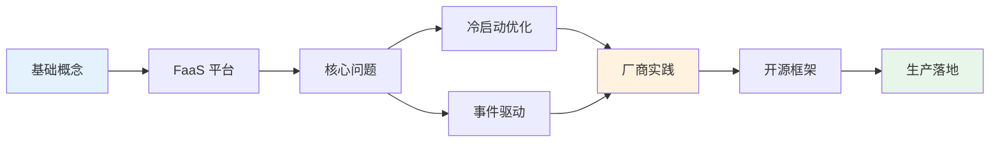

# Serverless 无服务器架构

Serverless（无服务器架构）代表了云计算范式的一次重要转变。它并非真的「没有服务器」，而是将服务器的基础设施管理职责从开发者转移到了云平台，让开发者能够更专注于业务逻辑本身。

本模块将系统讲解 Serverless 的核心概念、FaaS（函数即服务）平台、冷启动优化、事件驱动架构，以及主流 Serverless 框架的深度对比，帮助你构建完整的 Serverless 知识体系。

## 模块目录

| 文章 | 简介 |
| --- | --- |
| [Serverless 概述](/cloud-native/serverless/overview) | Serverless 的定义、演进与价值 |
| [Serverless vs 传统架构](/cloud-native/serverless/vs-traditional) | 两种架构模式的深度对比 |
| [FaaS 详解](/cloud-native/serverless/faas) | 函数即服务的核心原理 |
| [Serverless 核心概念](/cloud-native/serverless/concepts) | 触发器、绑定、执行环境等核心概念 |
| [冷启动问题](/cloud-native/serverless/cold-start) | 冷启动的成因与影响 |
| [冷启动优化策略](/cloud-native/serverless/cold-start-optimization) | 减少冷启动延迟的实用策略 |
| [热启动与实例复用](/cloud-native/serverless/warm-start) | 保持函数实例活跃的技术 |
| [事件驱动架构](/cloud-native/serverless/event-driven) | EDA 与 Serverless 的天然契合 |
| [AWS Lambda 深度解析](/cloud-native/serverless/aws-lambda) | Lambda 架构、执行模型与限制 |
| [AWS Lambda 最佳实践](/cloud-native/serverless/lambda-best-practices) | 生产环境 Lambda 开发指南 |
| [Azure Functions](/cloud-native/serverless/azure-functions) | Azure Functions 编程模型 |
| [Google Cloud Functions](/cloud-native/serverless/gcp-functions) | GCP Cloud Functions 特性 |
| [Knative 架构深度解析](/cloud-native/serverless/knative) | Kubernetes 上的 Serverless 平台 |
| [Knative Serving 详解](/cloud-native/serverless/knative-serving) | Knative Serving 路由与扩缩容 |
| [Knative Eventing 详解](/cloud-native/serverless/knative-eventing) | Knative Eventing 事件处理 |
| [OpenFaaS 架构与使用](/cloud-native/serverless/openfaas) | 开源 Serverless 框架 |
| [Kubeless 架构与使用](/cloud-native/serverless/kubeless) | 基于 Kubernetes 的函数框架 |
| [Serverless 框架对比](/cloud-native/serverless/comparison) | 主流框架选型指南 |
| [Serverless 可观测性](/cloud-native/serverless/observability) | 日志、指标与链路追踪 |
| [Serverless 成本分析](/cloud-native/serverless/cost-analysis) | 按需付费的成本模型 |
| [Serverless 冷启动案例](/cloud-native/serverless/cold-start-cases) | 真实企业的冷启动优化实践 |
| [Serverless 企业落地挑战](/cloud-native/serverless/challenges) | 企业在采用 Serverless 时面临的挑战 |
| [Serverless + Kubernetes 混合架构](/cloud-native/serverless/hybrid) | 混合部署策略与实践 |

## 学习路径

## 你将从本模块学到什么

- **Serverless 的本质**：理解「无服务器」的真实含义与适用场景
- **FaaS 编程模型**：掌握函数编写、触发器配置、绑定机制
- **性能优化**：冷启动、热启动、实例复用的深度理解与实践
- **主流平台**：AWS Lambda、Azure Functions、GCP Cloud Functions 的特性对比
- **Kubernetes 集成**：Knative、OpenFaaS、Kubeless 等开源方案
- **生产实践**：可观测性、成本控制、企业落地的挑战与解决方案
