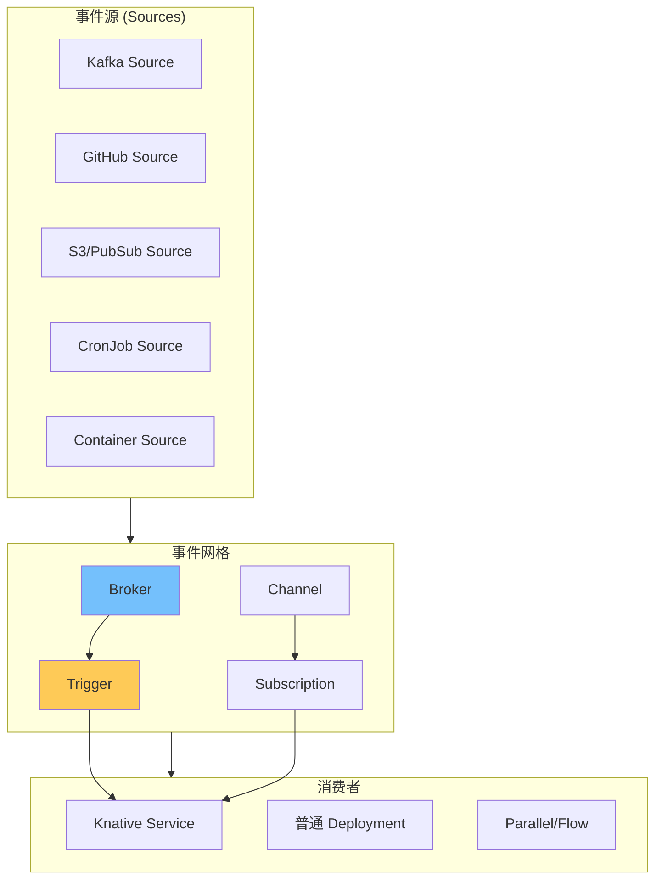

你的微服务架构已经用 Knative Serving 管理了 HTTP 流量。但现在需要处理异步事件：订单完成后发送邮件、更新库存、触发分析任务。

**「Knative Eventing 就是 Kubernetes 上的事件总线。」** 它提供了一整套事件接入、分发、过滤的抽象，让事件驱动架构在 Kubernetes 环境中自然落地。

## 核心概念

Knative Eventing 的架构围绕事件的生产、分发、消费展开：



### 核心资源

| 资源 | 作用 |
| --- | --- |
| **Broker** | 事件入口点，接收和存储事件 |
| **Trigger** | 订阅特定类型的事件 |
| **Channel** | 点对点事件传输通道 |
| **Subscription** | 连接 Channel 和消费者 |
| **Source** | 事件生产者 |

## Broker 和 Trigger

### 创建 Broker

```yaml title="broker-default.yaml"
apiVersion: eventing.knative.dev/v1
kind: Broker
metadata:
  name: default
  namespace: default
  annotations:
    # 使用不同类型的 backing
    eventing.knative.dev/experimental-brokerservices: "MTChannelBasedBroker"
spec:
  config:
    apiVersion: v1
    kind: ConfigMap
    name: config-br-defaults
```

### Broker 配置

```yaml title="broker-config.yaml"
apiVersion: v1
kind: ConfigMap
metadata:
  name: config-br-defaults
  namespace: knative-eventing
data:
  # 死信配置
  default.branch.experimental: '{"deadLetterTopic": "default-kne-trigger", "delivery": {"retry": 3, "backoffPolicy": "exponential", "backoffDelay": "PT1S"}}'
  # 事件类型过滤
  default.type: "dev.knative.sources.slack/message"
```

### Trigger 定义

```yaml title="trigger-example.yaml"
apiVersion: eventing.knative.dev/v1
kind: Trigger
metadata:
  name: email-trigger
  namespace: default
spec:
  broker: default
  filter:
    # 属性过滤
    attributes:
      type: com.ecommerce.order.completed
      source: orders-service
  subscriber:
    # 目标服务
    ref:
      apiVersion: serving.knative.dev/v1
      kind: Service
      name: email-service
    # 或者使用 URI
    # uri: /process
```

### 多过滤器

```yaml title="trigger-multi-filter.yaml"
apiVersion: eventing.knative.dev/v1
kind: Trigger
metadata:
  name: analytics-trigger
spec:
  broker: default
  filter:
    attributes:
      # OR 过滤：在 extension 中定义
      type: "com.ecommerce.order.*"
  subscribers:
    - ref:
        apiVersion: serving.knative.dev/v1
        kind: Service
        name: analytics-service
      delivery:
        backoffDelay: PT1S
        backoffPolicy: exponential
        retry: 3
```

## 事件源（Sources）

### Kafka Source

```yaml title="kafka-source.yaml"
apiVersion: sources.knative.dev/v1beta1
kind: KafkaSource
metadata:
  name: kafka-source
  namespace: default
spec:
  kafkaBroker: my-cluster-kafka-bootstrap:9092
  topics:
    - orders
    - inventory
  consumerGroup: knative-demo-consumer
  sink:
    ref:
      apiVersion: serving.knative.dev/v1
      kind: Service
      name: event-handler
  # SASL 配置
  sasl:
    enable: true
    user:
      secretKeyRef:
        name: kafka-auth
        key: username
    password:
      secretKeyRef:
        name: kafka-auth
        key: password
```

### GitHub Source

```yaml title="github-source.yaml"
apiVersion: sources.knative.dev/v1beta1
kind: GitHubSource
metadata:
  name: github-source
spec:
  ownerAndRepository: myorg/myrepo
  eventTypes:
    - pull_request
    - push
  accessToken:
    secretKeyRef:
      name: github-secret
      key: accessToken
  secretToken:
    secretKeyRef:
      name: github-secret
      key: secretToken
  sink:
    ref:
      apiVersion: serving.knative.dev/v1
      kind: Service
      name: github-webhook-handler
```

### CronJob Source

```yaml title="cron-source.yaml"
apiVersion: sources.knative.dev/v1
kind: PingSource
metadata:
  name: ping-source
spec:
  # 每 5 分钟触发一次
  schedule: "*/5 * * * *"
  jsonData: '{"message": "Scheduled event"}'
  sink:
    ref:
      apiVersion: serving.knative.dev/v1
      kind: Service
      name: scheduled-task-handler
```

### Container Source

```yaml title="container-source.yaml")
apiVersion: sources.knative.dev/v1alpha1
kind: ContainerSource
metadata:
  name: custom-source
spec:
  template:
    spec:
      containers:
        - image: my-registry/event-emitter:v1
          env:
            - name: K_SINK
              value: $(K_SINK)
            - name: K_EVENT_TYPE
              value: "custom.event"
  sink:
    ref:
      apiVersion: serving.knative.dev/v1
      kind: Service
      name: event-handler
```

## Channel 和 Subscription

### Channel 类型

```yaml title="channel-inmemory.yaml"
# 内存通道（测试用）
apiVersion: eventing.knative.dev/v1
kind: Channel
metadata:
  name: my-channel
  namespace: default
spec:
  channelTemplate:
    apiVersion: messaging.knative.dev/v1
    kind: InMemoryChannel
```

```yaml title="channel-kafka.yaml")
# Kafka 通道（生产用）
apiVersion: eventing.knative.dev/v1
kind: Channel
metadata:
  name: my-channel
  namespace: default
spec:
  channelTemplate:
    apiVersion: messaging.knative.dev/v1
    kind: KafkaChannel
    spec:
      numPartitions: 3
      replicationFactor: 1
```

### Subscription

```yaml title="subscription-example.yaml"
apiVersion: eventing.knative.dev/v1
kind: Subscription
metadata:
  name: my-subscription
  namespace: default
spec:
  channel:
    apiVersion: eventing.knative.dev/v1
    kind: Channel
    name: my-channel
  subscriber:
    ref:
      apiVersion: serving.knative.dev/v1
      kind: Service
      name: subscriber-service
  reply:
    ref:
      apiVersion: eventing.knative.dev/v1
      kind: Channel
      name: reply-channel
  delivery:
    backoffDelay: PT1S
    backoffPolicy: exponential
    retry: 5
```

## 事件过滤

### CloudEvents 属性过滤

```yaml title="trigger-filter-attr.yaml"
apiVersion: eventing.knative.dev/v1
kind: Trigger
metadata:
  name: filtered-trigger
spec:
  broker: default
  filter:
    attributes:
      type: com.ecommerce.order.created
      source: /apis/v1/namespaces/default/services/order-service
  subscriber:
    ref:
      apiVersion: serving.knative.dev/v1
      kind: Service
      name: order-processor
```

### CloudEvents 扩展过滤

```yaml title="trigger-filter-ext.yaml"
apiVersion: eventing.knative.dev/v1
kind: Trigger
metadata:
  name: custom-filter-trigger
spec:
  broker: default
  filter:
    # 使用 CloudEvents 扩展属性
    attributes:
      myapp/version: "v2"
      myapp/region: "us-east"
  subscriber:
    ref:
      apiVersion: serving.knative.dev/v1
      kind: Service
      name: v2-handler
```

## 事件处理函数

### CloudEvents SDK

```go title="event-handler.go"
package handler

import (
    "context"
    "fmt"
    "log"

    cloudevents "github.com/cloudevents/sdk-go/v2"
)

func ReceiveEvent(ctx context.Context, event cloudevents.Event) error {
    log.Printf("Received event:")
    log.Printf("  Type: %s", event.Type())
    log.Printf("  Source: %s", event.Source())
    log.Printf("  ID: %s", event.ID())

    // 访问数据
    var data map[string]interface{}
    if err := event.DataAs(&data); err != nil {
        return fmt.Errorf("failed to parse data: %w", err)
    }

    log.Printf("  Data: %+v", data)

    // 业务逻辑
    switch event.Type() {
    case "com.ecommerce.order.created":
        return handleOrderCreated(data)
    case "com.ecommerce.order.completed":
        return handleOrderCompleted(data)
    default:
        log.Printf("Unknown event type: %s", event.Type())
    }

    return nil
}

func handleOrderCreated(data map[string]interface{}) error {
    orderID, ok := data["orderId"].(string)
    if !ok {
        return fmt.Errorf("invalid orderId")
    }

    log.Printf("Processing new order: %s", orderID)
    // 实现订单创建逻辑
    return nil
}
```

### Java Spring Boot

```java title="EventController.java"
package com.example;

import org.springframework.http.ResponseEntity;
import org.springframework.web.bind.annotation.PostMapping;
import org.springframework.web.bind.annotation.RequestBody;
import org.springframework.web.bind.annotation.RequestHeader;
import org.springframework.web.bind.annotation.RestController;
import io.cloudevents.spring.http.CloudEventsHeaders;

@RestController
public class EventController {

    @PostMapping("/")
    public ResponseEntity<Void> handleCloudEvent(
            @RequestBody String body,
            @CloudEventsHeaders CloudEventsHeaders headers) {

        String type = headers.getType();
        String source = headers.getSource();
        String id = headers.getId();

        System.out.println("Received event:");
        System.out.println("  Type: " + type);
        System.out.println("  Source: " + source);
        System.out.println("  ID: " + id);
        System.out.println("  Body: " + body);

        // 业务逻辑
        processEvent(type, body);

        return ResponseEntity.ok().build();
    }
}
```

## 死信处理

### 死信配置

```yaml title="dlq-config.yaml"
apiVersion: eventing.knative.dev/v1
kind: Trigger
metadata:
  name: order-trigger
spec:
  broker: default
  filter:
    attributes:
      type: com.ecommerce.order.*
  subscriber:
    ref:
      apiVersion: serving.knative.dev/v1
      kind: Service
      name: order-processor
  deadLetterSink:
    ref:
      apiVersion: serving.knative.dev/v1
      kind: Service
      name: dead-letter-handler
```

### 死信消费者

```go title="dead-letter-handler.go"
package handler

import (
    "context"
    "fmt"
    "log"

    cloudevents "github.com/cloudevents/sdk-go/v2"
)

func DeadLetterHandler(ctx context.Context, event cloudevents.Event) error {
    log.Printf("Processing dead letter event:")
    log.Printf("  Original Type: %s", event.Type())
    log.Printf("  Original Source: %s", event.Source())
    log.Printf("  ID: %s", event.ID())

    // 获取重试信息
    extensions := event.Extensions()
    if ceError, ok := extensions["knativeerrordestination"]; ok {
        log.Printf("  Error: %s", ceError)
    }

    // 记录到监控系统
    recordDeadLetter(event)

    return nil  // 返回 nil 表示已处理，不需要继续重试
}
```

## Sequence 和 Parallel

### Sequence（顺序处理）

```yaml title="sequence-example.yaml"
apiVersion: flows.knative.dev/v1
kind: Sequence
metadata:
  name: order-processing-sequence
spec:
  steps:
    - ref:
        apiVersion: serving.knative.dev/v1
        kind: Service
        name: validate-order
    - ref:
        apiVersion: serving.knative.dev/v1
        kind: Service
        name: process-payment
    - ref:
        apiVersion: serving.knative.dev/v1
        kind: Service
        name: send-confirmation
    - ref:
        apiVersion: serving.knative.dev/v1
        kind: Service
        name: update-inventory
  channelTemplate:
    apiVersion: messaging.knative.dev/v1
    kind: InMemoryChannel
```

### Parallel（并行处理）

```yaml title="parallel-example.yaml"
apiVersion: flows.knative.dev/v1
kind: Parallel
metadata:
  name: notification-parallel
spec:
  branches:
    - filter:
        ref:
          apiVersion: serving.knative.dev/v1
          kind: Service
          name: email-notification
    - filter:
        ref:
          apiVersion: serving.knative.dev/v1
          kind: Service
          name: sms-notification
    - filter:
        ref:
          apiVersion: serving.knative.dev/v1
          kind: Service
          name: push-notification
  channelTemplate:
    apiVersion: messaging.knative.dev/v1
    kind: InMemoryChannel
```

## 监控

### 指标

```bash
# 查看 Broker 指标
kubectl get broker metrics

# Prometheus 查询
# 事件处理延迟
histogram_quantile(0.99,
  sum(rate(event_received_latency_bucket[5m])) by (le)
)

# 触发器过滤失败数
sum(rate(event_dispatch_events_total{result="filtered"}[5m])) by (trigger)

# 事件投递失败数
sum(rate(event_dispatch_events_total{result="failed"}[5m])) by (trigger)
```

### 日志

```bash
# 查看 Trigger 日志
kubectl logs -n knative-eventing -l eventing.knative.dev/trigger=<trigger-name>

# 搜索错误事件
kubectl logs -n knative-eventing | grep "error\|failed"
```

## 最佳实践

### 1. 事件契约

```yaml title="event-contract.yaml"
# 定义 CloudEvents 扩展属性规范
# 在文档或 Schema Registry 中记录
extensions:
  - name: myapp/version
    type: string
    required: true
  - name: myapp/tenant
    type: string
    required: true
  - name: myapp/correlationId
    type: string
    required: false
```

### 2. 幂等处理

```go
func handleEvent(event cloudevents.Event) error {
    // 使用 CloudEvents ID 作为幂等键
    idempotencyKey := event.ID()

    // 检查是否已处理
    processed, err := cache.Exists(ctx, "processed:" + idempotencyKey)
    if err == nil && processed {
        log.Printf("Event %s already processed", idempotencyKey)
        return nil
    }

    // 处理事件
    if err := processEvent(event); err != nil {
        return err
    }

    // 标记为已处理
    cache.Setex(ctx, "processed:" + idempotencyKey, "1", 24*time.Hour)

    return nil
}
```

### 3. 监控关键指标

```yaml
# 关键告警配置
apiVersion: monitoring.coreos.com/v1
kind: PrometheusRule
metadata:
  name: eventing-alerts
spec:
  groups:
    - name: knative-eventing
      rules:
        - alert: EventingHighFailureRate
          expr: |
            sum(rate(event_dispatch_events_total{result="failed"}[5m]))
            /
            sum(rate(event_dispatch_events_total[5m])) > 0.05
          for: 5m
          labels:
            severity: warning
          annotations:
            summary: "High event dispatch failure rate"
```

## 延伸思考

Knative Eventing 是 Kubernetes 生态中最完整的事件驱动框架。它的优势：

1. **统一事件模型**：基于 CloudEvents 标准
2. **丰富的 Source**：Kafka、GitHub、AWS 等开箱即用
3. **灵活的路由**：Trigger 过滤、Sequence、Parallel
4. **可插拔的 Channel**：内存、Kafka、RabbitMQ 等

但也有挑战：

1. **运维复杂度**：需要管理 Broker、Channel、Trigger
2. **事件顺序**：Kafka 通道可以保证顺序，内存通道不行
3. **调试困难**：分布式追踪在事件系统中更难实现

选择 Knative Eventing 时，需要考虑：
- 是否已有 Kafka/RabbitMQ 等消息系统
- 团队对分布式系统的经验
- 是否需要跨集群事件分发