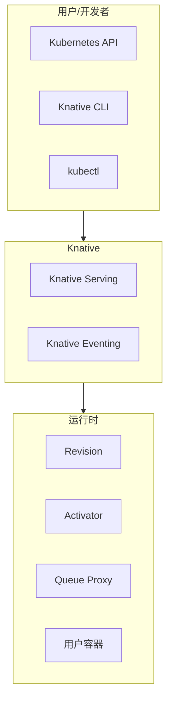
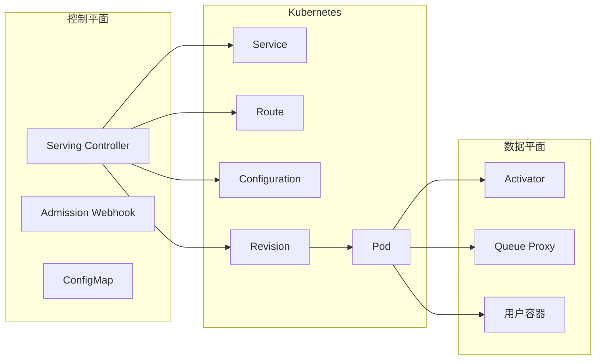
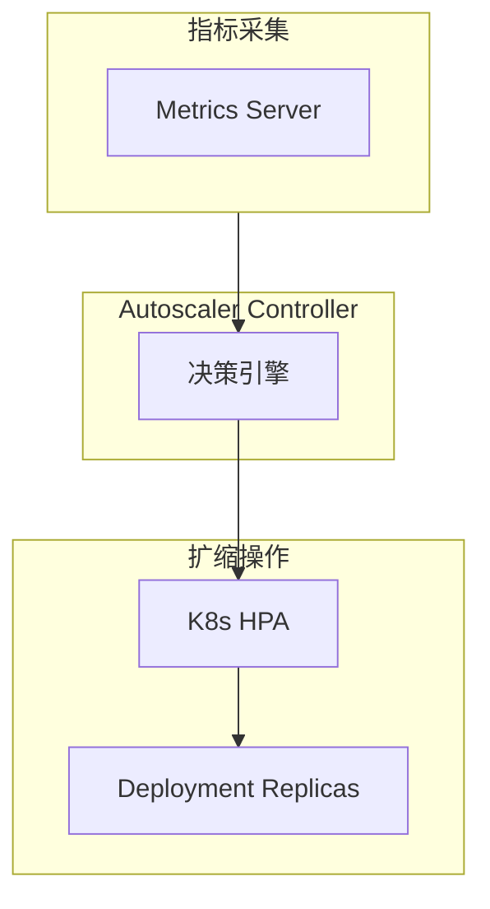
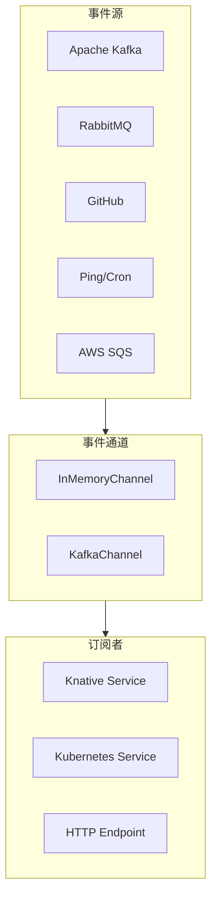

当你在 Kubernetes 上运行 Serverless 函数时，云厂商的专有方案（如 Lambda、Azure Functions）会让你陷入供应商锁定的困境。Knative 应运而生：**在 Kubernetes 上提供与云厂商 FaaS 类似的体验，同时保持云原生的一致性**。

Knative 是 Google 主导的开源项目，现已毕业成为 CNCF 正式项目。它的设计理念是：**让 Serverless 工作负载与 Kubernetes 原生工作负载共存，而不是取代 Kubernetes**。

## Knative 概述

Knative 是一组用于构建 Serverless 工作负载的 Kubernetes 组件，提供：

- **Serving**：Serverless 工作负载的部署和自动扩缩容
- **Eventing**：事件驱动的架构支持
- **Functions**：简化的函数即服务体验



## 架构组件

### Serving 组件



### 核心 CRD

Knative Serving 定义了四个核心 CRD：

| CRD | 作用 |
| --- | --- |
| **Service** | 声明式管理应用生命周期的顶级资源 |
| **Route** | 管理流量路由规则 |
| **Configuration** | 管理应用配置，定义每次更新创建的 Revision |
| **Revision** | 应用代码和配置的不可变快照 |

```yaml title="Knative Service 示例"
apiVersion: serving.knative.dev/v1
kind: Service
metadata:
  name: order-service
  namespace: default
spec:
  template:
    metadata:
      annotations:
        autoscaling.knative.dev/minScale: "1"
        autoscaling.knative.dev/maxScale: "100"
    spec:
      containers:
        - image: gcr.io/my-project/order-service:v1
          ports:
            - containerPort: 8080
          resources:
            requests:
              cpu: "100m"
              memory: "128Mi"
          env:
            - name: LOG_LEVEL
              value: "INFO"
  traffic:
    - latestRevision: true
      percent: 100
```

## 自动扩缩容机制

### KPA（Knative Pod Autoscaler）

Knative 使用 KPA 实现基于请求的自动扩缩容：



### 并发模型

Knative 的并发模型与 Lambda 不同：

| 配置 | 说明 |
| --- | --- |
| **Container Concurrency** | 每个容器同时处理的请求数 |
| **Target** | 目标并发数（默认 100） |
| **Initial Scale** | 初始实例数（默认 0，可配置） |

```yaml title="并发配置"
apiVersion: serving.knative.dev/v1
kind: Service
metadata:
  name: high-concurrency-service
spec:
  template:
    spec:
      containerConcurrency: 50  # 每个容器最多 50 并发
      timeoutSeconds: 300
```

### 缩容到零

Knative 的独特能力：缩容到零实例。这是与 Kubernetes HPA 的关键区别：

```yaml title="缩容到零配置"
apiVersion: serving.knative.dev/v1
kind: Service
metadata:
  name: scale-to-zero-service
spec:
  template:
    metadata:
      annotations:
        autoscaling.knative.dev/minScale: "0"  # 允许缩容到零
        autoscaling.knative.dev/maxScale: "10"
```

### 扩缩容指标

```yaml title="基于并发数的扩缩容"
apiVersion: serving.knative.dev/v1
kind: Service
metadata:
  name: rps-based-service
spec:
  template:
    metadata:
      annotations:
        autoscaling.knative.dev/metric: "concurrency"
        autoscaling.knative.dev/target: "100"
        autoscaling.knative.dev/targetBurstCapacity: "200"
```

## 网络层

### Kourier（默认网络层）

Kourier 是 Knative 的轻量级网络层：

```bash title="安装 Kourier"
kubectl apply -f https://github.com/knative/net-kourier/releases/download/knative-v1.11.0/kourier.yaml

# 配置 Knative 使用 Kourier
kubectl patch configmap/config-network \
  --namespace knative-serving \
  --type merge \
  --patch '{"data":{"ingress-class":"kourier.ingress.networking.knative.dev"}}'
```

### Istio 集成

如果需要更高级的流量管理，可以集成 Istio：

```bash title="安装 Istio 网络层"
kubectl apply -f https://github.com/knative/net-istio/releases/download/knative-v1.11.0/istio.yaml

# 配置 Knative 使用 Istio
kubectl patch configmap/config-network \
  --namespace knative-serving \
  --type merge \
  --patch '{"data":{"ingress-class":"istio.ingress.networking.knative.dev"}}'
```

### 域名配置

```yaml title="自定义域名"
apiVersion: serving.knative.dev/v1
kind: Service
metadata:
  name: order-service
spec:
  template:
    spec:
      containers:
        - image: gcr.io/my-project/order-service:v1
  traffic:
    - latestRevision: true
      percent: 100

---
apiVersion: networking.knative.dev/v1alpha1
kind: Domain
metadata:
  name: custom-domain
spec:
  domain: example.com
  configuration:
    ingress: ingress.knative.networking.knative.dev
  routeSpec:
    "*":
      match:
        - uri:
            prefix: "/order"
      route:
        destination:
          service: order-service
```

## 版本控制与流量管理

### 金丝雀部署

```yaml title="金丝雀发布"
apiVersion: serving.knative.dev/v1
kind: Service
metadata:
  name: order-service
spec:
  template:
    metadata:
      name: order-service-v2
    spec:
      containers:
        - image: gcr.io/my-project/order-service:v2
  traffic:
    - revisionName: order-service-v1
      percent: 90
    - latestRevision: true
      percent: 10
```

### 蓝绿部署

```yaml title="蓝绿部署"
apiVersion: serving.knative.dev/v1
kind: Service
metadata:
  name: order-service
spec:
  template:
    metadata:
      name: order-service-v2
    spec:
      containers:
        - image: gcr.io/my-project/order-service:v2
  traffic:
    - latestRevision: false
      revisionName: order-service-v1
      percent: 0  # 暂时不分配流量
    - latestRevision: true
      percent: 100
```

## Eventing 架构

### 事件源



### Broker 和 Trigger

```yaml title="Broker 和 Trigger 示例"
# 创建 Broker
apiVersion: eventing.knative.dev/v1
kind: Broker
metadata:
  name: default
  annotations:
    eventing.knative.dev/broker.class: RabbitMQBroker

---
# 创建 Trigger
apiVersion: eventing.knative.dev/v1
kind: Trigger
metadata:
  name: order-service-trigger
spec:
  broker: default
  filter:
    attributes:
      type: order.created
      source: orders-api
  subscriber:
    ref:
      apiVersion: serving.knative.dev/v1
      kind: Service
      name: order-processor
```

### CloudEvents

Knative Eventing 基于 CloudEvents 规范：

```yaml title="CloudEvents 源配置"
apiVersion: sources.knative.dev/v1
kind: ApiServerSource
metadata:
  name: k8s-events
spec:
  serviceAccountName: k8s-events-sa
  eventMode: Resource
  resources:
    - apiVersion: v1
      kind: Event
  sink:
    ref:
      apiVersion: eventing.knative.dev/v1
      kind: Broker
      name: default
```

## 安装与配置

### 快速安装

```bash title="安装 Knative Serving"
# 安装 Serving 组件
kubectl apply -f https://github.com/knative/serving/releases/download/knative-v1.11.0/serving-crds.yaml
kubectl apply -f https://github.com/knative/serving/releases/download/knative-v1.11.0/serving-core.yaml

# 安装网络层（Kourier）
kubectl apply -f https://github.com/knative/net-kourier/releases/download/knative-v1.11.0/kourier.yaml

# 配置 Serving 使用 Kourier
kubectl patch configmap/config-network \
  --namespace knative-serving \
  --type merge \
  --patch '{"data":{"ingress-class":"kourier.ingress.networking.knative.dev"}}'

# 安装 Eventing
kubectl apply -f https://github.com/knative/eventing/releases/download/knative-v1.11.0/eventing-crds.yaml
kubectl apply -f https://github.com/knative/eventing/releases/download/knative-v1.11.0/eventing-core.yaml
```

### YAML 配置

```yaml title="完整配置示例"
apiVersion: v1
kind: ConfigMap
metadata:
  name: config-deployment
  namespace: knative-serving
data:
  # 容器并发配置
  container-concurrency-container-default: "50"
  # 允许缩容到零
  enable-scale-to-zero: "true"
  # 缩容到零后的保持时间
  scale-to-zero-grace-period: "30s"
  # 缩容到零前实例保持时间
  scale-to-zero-pod-retention-period: "10s"
```

## 与 Lambda 的对比

| 维度 | Knative | AWS Lambda |
| --- | --- | --- |
| **部署环境** | 自托管/K8s | 云厂商托管 |
| **厂商锁定** | 无（标准 Kubernetes） | 高 |
| **冷启动** | 依赖容器启动速度 | 平台优化 |
| **扩缩容** | 基于并发/请求数，可缩容到零 | 基于并发调用数 |
| **执行时间** | 无限制 | 最大 15 分钟 |
| **编程模型** | 容器镜像 | 函数代码 |
| **生态** | Kubernetes 生态 | AWS 生态 |

## 适用场景

| 场景 | 推荐方案 | 原因 |
| --- | --- | --- |
| 多云/混合云部署 | Knative | 不绑定特定云厂商 |
| 已有 Kubernetes | Knative | 复用现有基础设施 |
| 纯 Serverless 体验 | Lambda/云函数 | 更简单，无需运维 |
| 需要长时运行 | Knative | 无执行时间限制 |
| 突发流量 | 两者都行 | 都能自动扩缩容 |

## 最佳实践

### 实践一：配置就绪探针

```yaml title="就绪探针配置"
apiVersion: serving.knative.dev/v1
kind: Service
metadata:
  name: order-service
spec:
  template:
    spec:
      containers:
        - image: gcr.io/my-project/order-service:v1
          readinessProbe:
            httpGet:
              path: /healthz
              port: 8080
            initialDelaySeconds: 5
            periodSeconds: 5
            failureThreshold: 3
```

### 实践二：配置资源限制

```yaml title="资源限制"
apiVersion: serving.knative.dev/v1
kind: Service
metadata:
  name: resource-limited-service
spec:
  template:
    spec:
      containers:
        - image: gcr.io/my-project/service:v1
          resources:
            requests:
              cpu: "100m"
              memory: "128Mi"
            limits:
              cpu: "500m"
              memory: "512Mi"
```

### 实践三：配置垂直扩缩容

```yaml title="VPA 集成"
apiVersion: autoscaling.knative.dev/v1alpha1
kind: PodAutoscaler
metadata:
  name: order-service-pa
spec:
  scaleTargetRef:
    apiVersion: serving.knative.dev/v1
    kind: Service
    name: order-service
  minReplicas: 1
  maxReplicas: 100
```

## 延伸思考

Knative 的价值在于提供了一种**标准化的 Serverless 抽象层**，让应用可以在不同的 Kubernetes 环境中移植。

但 Knative 不是银弹。它的运维复杂度不低：需要维护 Knative 本身、网络层、事件组件。如果你的团队规模不大，可能运维成本会抵消 Serverless 带来的好处。

另一个值得思考的方向是：**Knative 可以作为从云厂商 FaaS 到自托管的过渡方案**。先用 Knative 在云上跑，积累经验，未来如果需要迁移到其他云或私有化，就有了迁移路径。

理解 Knative 的定位和边界，比盲目采用更重要。
