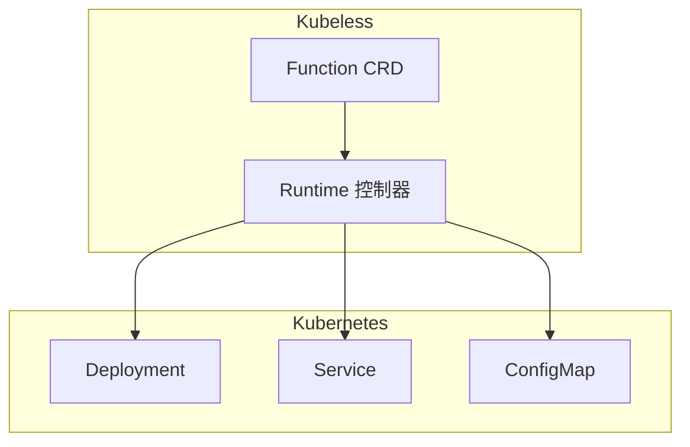
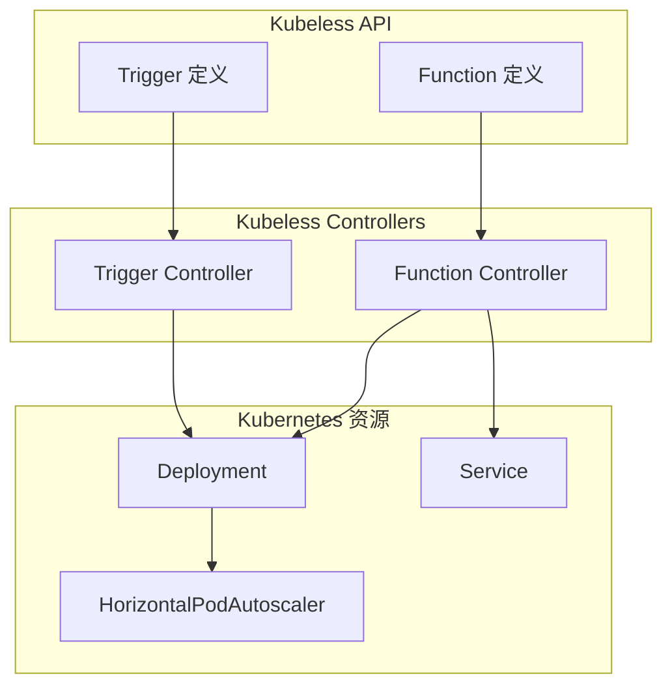

Kubeless 是最早的开源 Serverless 框架之一，它的核心思想是：**用 Kubernetes 的 Custom Resources 定义函数**。

2016 年发布时，Kubeless 的设计非常前卫——它比 Knative 早了两年提出的类似概念。但随着 Knative 的崛起，Kubeless 的影响力逐渐下降。今天它更多是作为 Serverless 架构演进的历史见证，而非生产环境推荐。

## 设计理念

Kubeless 的核心设计理念是**将函数视为 Kubernetes 的一等公民**：



### Function CRD

```yaml title="function_crd.yaml"
apiVersion: kubeless.io/v1
kind: Function
metadata:
  name: my-function
spec:
  handler: handler.my_handler  # handler 文件名.函数名
  runtime: python3.8
  function: |
    def my_handler(event, context):
        print("Hello from kubeless")
        return event['data']
  deps: |
    requests==2.28.0
  timeout: 10
  runtime: python3.8
```

## 架构组件

### 核心控制器



### 运行时支持

| 语言 | 运行时镜像 | 特点 |
| --- | --- | --- |
| Python | `kubeless/python:1.0` | 支持 2.7、3.4、3.6、3.8 |
| Node.js | `kubeless/nodejs:1.0` | 支持 6、8、10、12 |
| Ruby | `kubeless/ruby:1.0` | 支持 2.4 |
| Go | `kubeless/go:1.0` | 编译型，性能最佳 |
| PHP | `kubeless/php:1.0` | 支持 7.2 |
| .NET | `kubeless/dotnet:1.0` | 支持 2.0 |

## 函数开发

### Python 函数

```python title="python_handler.py"
import requests

def hello(event, context):
    """
    Kubeless Python 函数签名
    - event: 事件数据
    - context: 运行时上下文
    """
    # 获取事件数据
    data = event['data']

    # 获取头部信息
    headers = event.get('headers', {})

    # 从上下文获取请求 ID
    request_id = context.RequestID()

    # 日志输出
    print(f"Processing request: {request_id}")

    return {
        'message': f"Hello, {data.get('name', 'World')}!",
        'request_id': request_id,
        'timestamp': context.Timestamp()
    }
```

### Node.js 函数

```javascript title="node_handler.js"
module.exports = {
  // Kubeless Node.js 函数签名
  handler: function(event, context) {
    const data = event.data;

    console.log('Received event:', data);

    // 获取函数名称
    const functionName = context.functionName;

    // 获取超时时间
    const timeout = context.getTimeout();

    return {
      message: `Hello, ${data.name || 'World'}!`,
      function: functionName,
      timestamp: new Date().toISOString()
    };
  }
};
```

### Go 函数

```go title="go_handler.go"
package main

import (
    "fmt"
    "github.com/kubeless/kubeless/pkg/events"
    "github.com/kubeless/kubeless/pkg/functions"
)

// Kubeless Go 函数签名
func Handler(event events.Event, context functions.Context) (interface{}, error) {
    data := event.Data

    // 类型转换
    name, ok := data.(map[string]interface{})["name"].(string)
    if !ok {
        name = "World"
    }

    fmt.Printf("Processing event: %v\n", event)

    return map[string]interface{}{
        "message": fmt.Sprintf("Hello, %s!", name),
        "function": context.FnName,
        "runtime": context.Runtime,
    }, nil
}

func main() {
    events.Start(Handler)
}
```

## 触发器

### HTTP 触发器

```yaml title="http_trigger.yaml"
apiVersion: kubeless.io/v1
kind: HTTPTrigger
metadata:
  name: my-http-trigger
spec:
  functionName: my-function
  gateway: nginx
  # 路由规则
  path: /api/my-function
  methods:
    - GET
    - POST
  # 认证
  authName: basic-auth
  # TLS
  tls: secret-tls
```

### CronJob 触发器

```yaml title="cron_trigger.yaml"
apiVersion: kubeless.io/v1
kind: CronJobTrigger
metadata:
  name: my-cron-trigger
spec:
  functionName: my-function
  schedule: "*/5 * * * *"  # 每 5 分钟
  # 并发策略
  concurrencyPolicy: Forbid  # Forbid / Allow / Replace
```

### Kafka 触发器

```yaml title="kafka_trigger.yaml"
apiVersion: kubeless.io/v1
kind: KafkaTrigger
metadata:
  name: my-kafka-trigger
spec:
  functionName: my-function
  topic: my-topic
  # Kafka 配置
  kafkaBroker:
    - kafka-svc:9092
  # 消费者配置
  consumerGroup: kubeless-consumer
```

### Pub/Sub 触发器

```yaml title="pubsub_trigger.yaml"
apiVersion: kubeless.io/v1
kind: PubSubTrigger
metadata:
  name: my-pubsub-trigger
spec:
  functionName: my-function
  topic: my-topic
  subscription: my-subscription
```

## 部署与管理

### 使用 Kubeless CLI 部署

```bash title="kubeless_cli.sh"
# 部署 Python 函数
kubeless function deploy my-function \
  --handler handler.my_handler \
  --runtime python3.8 \
  --from-file python_handler.py \
  --dependencies requirements.txt

# 部署 Node.js 函数
kubeless function deploy my-node-function \
  --handler node_handler.handler \
  --runtime nodejs12 \
  --from-file node_handler.js

# 更新函数
kubeless function deploy my-function \
  --from-file updated_handler.py

# 查看函数列表
kubeless function list

# 删除函数
kubeless function delete my-function
```

### 使用 kubectl 部署

```yaml title="kubectl_deploy.yaml"
apiVersion: kubeless.io/v1
kind: Function
metadata:
  name: my-function
spec:
  handler: handler.my_handler
  runtime: python3.8
  function: |
    def my_handler(event, context):
        return {"message": "Hello"}
  deps: |
    requests==2.28.0
  resources:
    requests:
      memory: "128Mi"
      cpu: "100m"
    limits:
      memory: "256Mi"
      cpu: "500m"
  secrets:
    - my-secrets
```

### 函数调用

```bash title="invoke.sh"
# 调用函数
kubeless function call my-function \
  --data '{"name": "World"}'

# 查看日志
kubeless function logs my-function

# 暴露为外部服务
kubeless function expose my-function \
  --port 8080 \
  --target-port 8080
```

## 与 Knative 对比

| 维度 | Kubeless | Knative |
| --- | --- | --- |
| **发布时间** | 2016 年 | 2018 年 |
| **CRD 设计** | Function + Trigger 分立 | Service 统一抽象 |
| **扩缩容** | 基础 HPA | KPA（支持零缩容） |
| **事件处理** | 有限事件源 | 完整的 Eventing |
| **网络层** | 无内置 | Istio 集成 |
| **维护状态** | 有限维护 | 活跃维护（CNCF 毕业） |
| **学习曲线** | 平缓 | 陡峭但完整 |

## 迁移到 Knative

如果已经在使用 Kubeless，迁移到 Knative 的基本步骤：

```yaml title="migration.yaml"
# Kubeless Function
apiVersion: kubeless.io/v1
kind: Function
metadata:
  name: my-function
spec:
  handler: handler.my_handler
  runtime: python3.8
  function: |
    def my_handler(event, context):
        return {"message": "Hello"}
```

```yaml title="knative_service.yaml"
# Knative Service（等效实现）
apiVersion: serving.knative.dev/v1
kind: Service
metadata:
  name: my-function
spec:
  template:
    spec:
      containers:
        - image: python:3.8-slim
          command:
            - python
            - -c
            - |
              from flask import Flask, request, json
              app = Flask(__name__)

              def handler(event, context):
                  return {"message": "Hello"}

              @app.route("/", methods=["POST"])
              def main():
                  return handler(
                      {"data": request.get_json()},
                      type("Context", (), {"function_name": "my-function"})()
                  )

              if __name__ == "__main__":
                  app.run(host="0.0.0.0", port=8080)
```

## 术语表

| 术语 | 英文 | 解释 |
| --- | --- | --- |
| Function | Function CRD | Kubeless 的函数定义资源 |
| Trigger | Trigger | 事件触发器 |
| Runtime | Runtime | 函数运行时的容器镜像 |
| Handler | Handler | 函数的入口方法 |
| CronJob Trigger | CronJob Trigger | 定时触发的触发器类型 |

## 延伸思考

Kubeless 的历史价值大于实用价值。它的设计理念——**将函数作为 Kubernetes 资源**——直接影响了 Knative 的设计。

对于新项目，不推荐使用 Kubeless；对于已有项目，建议考虑迁移到 Knative 或其他更活跃维护的框架。

但理解 Kubeless 的设计有助于理解 Serverless 在 Kubernetes 上的演进历程：为什么 Knative 采用了不同的设计，以及 Knative 的设计改进了哪些方面。

接下来我们将对比主流 Serverless 框架，帮助你在实际项目中做出选择。
