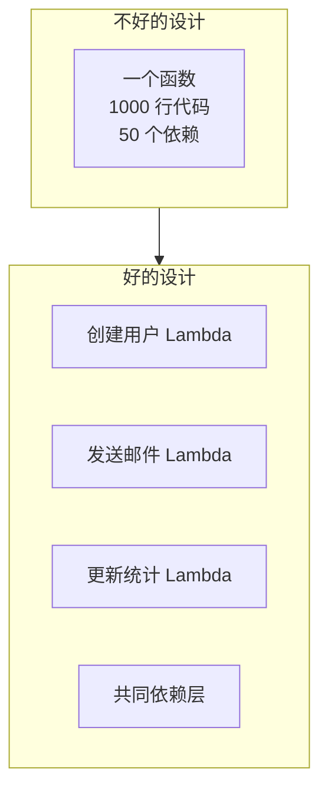

你的 Lambda 函数在线上跑了半年，从最初的简单 API 扩展到复杂的微服务架构。代码从 500 行变成了 5000 行，依赖从 3 个变成了 50 个，冷启动时间从 100ms 变成了 2 秒。

你开始怀疑：是不是 Lambda 不适合复杂业务？

**「Lambda 本身没有复杂度上限，但你的架构设计有。」** 理解 Lambda 的边界，设计合适的架构，才能发挥 Serverless 的真正价值。

## 代码组织原则

### 单一职责

每个 Lambda 函数应该只做一件事。不要把「创建用户」「发送欢迎邮件」「更新统计」都塞进一个函数。



```typescript title="good-design/auth/create-user.ts"
// 只负责用户创建
export const handler = async (event: CreateUserEvent) => {
  const { email, name } = event;

  // 验证输入
  validateEmail(email);
  validateName(name);

  // 创建用户
  const user = await userService.create({ email, name });

  // 发布事件
  await eventBridge.put({
    Source: 'auth.service',
    DetailType: 'user.created',
    Detail: JSON.stringify({ userId: user.id }),
  });

  return { userId: user.id };
};
```

### 分层架构

```typescript title="layers/architecture.ts"
// lib/ 是可复用的业务逻辑层
// Lambda handler 是薄薄的接入层

// layers/shared-lib/src/handlers/base-handler.ts
export const createHandler = <T>(
  handler: (event: T, context: Context) => Promise<Result>,
  options: HandlerOptions = {}
) => {
  return async (event: T, context: Context) => {
    // 统一错误处理
    try {
      // 统一日志
      const logger = createLogger({
        requestId: context.awsRequestId,
        functionName: context.functionName,
      });

      logger.info('Request started', { event });

      const result = await handler(event, context);

      logger.info('Request completed', { result });

      return result;
    } catch (error) {
      logger.error('Request failed', { error });

      return {
        statusCode: options.errorStatusCode || 500,
        body: JSON.stringify({ error: error.message }),
      };
    }
  };
};

// handlers/user-handler.ts
import { createHandler } from '/opt/lib/handlers/base-handler';
import { UserService } from '/opt/lib/services/user-service';

const userService = new UserService();

const handleCreateUser = async (event: APIGatewayProxyEvent) => {
  const input = JSON.parse(event.body!);
  const user = await userService.create(input);

  return {
    statusCode: 201,
    body: JSON.stringify({ user }),
  };
};

export const handler = createHandler(handleCreateUser);
```

## 依赖管理

### 精简依赖

```typescript title="esbuild.config.js"
// 使用 esbuild 打包，只包含需要的代码
module.exports = {
  entryPoints: ['src/handler.ts'],
  bundle: true,
  minify: true,
  sourcemap: true,
  target: 'nodejs18.x',
  platform: 'node',
  external: [
    // AWS SDK 是 Lambda 环境自带的，不需要打包
    '@aws-sdk/client-dynamodb',
    '@aws-sdk/client-s3',
    '@aws-sdk/lib-dynamodb',
    // Node.js 内置模块
    'crypto',
  ],
  define: {
    'process.env.NODE_ENV': '"production"',
  },
};
```

### 使用 Lambda Layers

```typescript title="layers/nodejs/shared/index.ts"
// 共享代码放在 Layer 中
export const formatResponse = (data: any) => ({
  statusCode: 200,
  headers: {
    'Content-Type': 'application/json',
    'Access-Control-Allow-Origin': '*',
  },
  body: JSON.stringify(data),
});

export const createErrorResponse = (error: Error, statusCode = 500) => ({
  statusCode,
  body: JSON.stringify({ error: error.message }),
});
```

```yaml title="template.yaml"
Resources:
  SharedLayer:
    Type: AWS::Lambda::LayerVersion
    Properties:
      ContentUri: s3://my-bucket/layers/shared.zip
      CompatibleRuntimes:
        - nodejs18.x

  MyFunction:
    Type: AWS::Serverless::Function
    Properties:
      Handler: index.handler
      Layers:
        - !Ref SharedLayer
```

## 连接管理

### 数据库连接池

```typescript title="lib/dynamodb.ts"
import {
  DynamoDBClient,
  DynamoDBDocumentClient,
} from '@aws-sdk/client-dynamodb';
import { DynamoDBDocumentClient } from '@aws-sdk/lib-dynamodb';
import { QueryCommand, PutCommand } from '@aws-sdk/lib-dynamodb';

// 全局客户端实例，容器复用
const client = new DynamoDBClient({
  region: process.env.AWS_REGION,
  maxAttempts: 3,
});

export const docClient = DynamoDBDocumentClient.from(client, {
  marshallOptions: {
    removeUndefinedValues: true,
  },
});

export const query = async (params: QueryCommand['input']) => {
  const command = new QueryCommand(params);
  const response = await docClient.send(command);
  return response;
};
```

### Redis 连接

```typescript title="lib/redis.ts"
import { Redis } from 'ioredis';

// 模块级连接，容器复用
let redis: Redis | null = null;

export const getRedis = () => {
  if (!redis) {
    redis = new Redis(process.env.REDIS_URL!, {
      lazyConnect: true,
      retryStrategy: (times) => Math.min(times * 100, 3000),
      maxRetriesPerRequest: 3,
    });

    // 连接失败处理
    redis.on('error', (err) => {
      console.error('Redis error:', err);
    });
  }
  return redis;
};

// 健康检查
export const redisHealthCheck = async () => {
  const client = getRedis();
  try {
    await client.ping();
    return true;
  } catch {
    return false;
  }
};
```

## 错误处理

### 重试配置

```yaml title="template.yaml"
Resources:
  MyFunction:
    Type: AWS::Serverless::Function
    Properties:
      Handler: index.handler
      # 异步调用时的重试配置
      ProvisionedConcurrency: 0
      ReservedConcurrency: 10

# SQS 触发器的重试配置
  MyQueue:
    Type: AWS::SQS::Queue
    Properties:
      RedrivePolicy:
        maxReceiveCount: 3
        deadLetterTargetArn: !GetAtt DeadLetterQueue.Arn
```

### 统一的错误处理

```typescript title="lib/errors.ts"
export class AppError extends Error {
  constructor(
    message: string,
    public statusCode: number = 500,
    public code?: string
  ) {
    super(message);
    this.name = 'AppError';
  }
}

export class ValidationError extends AppError {
  constructor(message: string) {
    super(message, 400, 'VALIDATION_ERROR');
    this.name = 'ValidationError';
  }
}

export class NotFoundError extends AppError {
  constructor(resource: string) {
    super(`${resource} not found`, 404, 'NOT_FOUND');
    this.name = 'NotFoundError';
  }
}

// 错误处理中间件
export const handleError = (error: Error) => {
  if (error instanceof AppError) {
    return {
      statusCode: error.statusCode,
      body: JSON.stringify({
        error: error.message,
        code: error.code,
      }),
    };
  }

  // 未知错误，不泄露详情
  console.error('Unexpected error:', error);
  return {
    statusCode: 500,
    body: JSON.stringify({
      error: 'Internal server error',
    }),
  };
};
```

## 安全性

### IAM 权限最小化

```typescript title="policies/user-service-policy.json"
{
  "Version": "2012-10-17",
  "Statement": [
    {
      "Effect": "Allow",
      "Action": [
        "dynamodb:Query",
        "dynamodb:PutItem",
        "dynamodb:GetItem"
      ],
      "Resource": "arn:aws:dynamodb:us-east-1:123456789:table/users"
    },
    {
      "Effect": "Allow",
      "Action": [
        "events:PutEvents"
      ],
      "Resource": "arn:aws:events:us-east-1:123456789:event-bus/default"
    }
  ]
}
```

### 环境变量加密

```yaml title="template.yaml"
Resources:
  MyFunction:
    Type: AWS::Serverless::Function
    Properties:
      Environment:
        Variables:
          DB_PASSWORD:
            Fn::Sub: '{{resolve:secretsmanager:${MySecret}::password}}'
          API_KEY:
            Fn::Sub: '{{resolve:ssm:/myapp/api-key}}'
```

### VPC 配置

```yaml title="vpc-function.yaml"
Resources:
  MyFunction:
    Type: AWS::Serverless::Function
    Properties:
      Handler: index.handler
      VpcConfig:
        SecurityGroupIds:
          - !Ref LambdaSecurityGroup
        SubnetIds:
          - !Ref PrivateSubnet1
          - !Ref PrivateSubnet2
      # VPC 内的 Lambda 冷启动更慢
      # 建议使用 Provisioned Concurrency
      ProvisionedConcurrency: 2
```

:::warning
**VPC Lambda 的冷启动问题**：Lambda 访问 VPC 内的资源（如 RDS、ElastiCache）需要 ENI（Elastic Network Interface）。ENI 的创建需要时间，这会增加冷启动。建议：
1. 不需要访问 VPC 资源时，不要配置 VPC
2. 需要 VPC 时，使用 Provisioned Concurrency
3. 考虑使用 RDS Proxy 减少连接开销
:::

## 日志与监控

### 结构化日志

```typescript title="lib/logger.ts"
import { createLogger, format, transports } from 'winston';

const logger = createLogger({
  level: process.env.LOG_LEVEL || 'info',
  format: format.combine(
    format.timestamp(),
    format.errors({ stack: true }),
    format.json()
  ),
  transports: [
    new transports.Console({
      format: format.combine(
        format.colorize(),
        format.simple()
      ),
    }),
  ],
});

export const createRequestLogger = (context: Context) => {
  return logger.child({
    requestId: context.awsRequestId,
    functionName: context.functionName,
    functionVersion: context.functionVersion,
    memoryLimit: context.memoryLimitInMB,
  });
};
```

```typescript
export const handler = async (event: any, context: Context) => {
  const log = createRequestLogger(context);

  log.info('Processing request', {
    path: event.path,
    method: event.httpMethod,
  });

  try {
    const result = await processEvent(event);
    log.info('Request completed', { result });
    return result;
  } catch (error) {
    log.error('Request failed', { error });
    throw error;
  }
};
```

### CloudWatch 告警

```yaml title="alarms.yaml"
Resources:
  ErrorRateAlarm:
    Type: AWS::CloudWatch::Alarm
    Properties:
      AlarmName: !Sub '${AWS::StackName}-error-rate'
      MetricName: Errors
      Namespace: AWS/Lambda
      Statistic: Sum
      Period: 300
      EvaluationPeriods: 2
      Threshold: 10
      ComparisonOperator: GreaterThanThreshold
      Dimensions:
        - Name: FunctionName
          Value: !Ref MyFunction
      AlarmActions:
        - !Ref AlarmTopic

  HighDurationAlarm:
    Type: AWS::CloudWatch::Alarm
    Properties:
      AlarmName: !Sub '${AWS::StackName}-high-duration'
      MetricName: Duration
      Namespace: AWS/Lambda
      Statistic: Maximum
      Period: 300
      EvaluationPeriods: 3
      Threshold: 5000
      ComparisonOperator: GreaterThanThreshold
      Dimensions:
        - Name: FunctionName
          Value: !Ref MyFunction
```

## 性能优化

### 内存与 CPU

```yaml
Resources:
  ComputeHeavyFunction:
    Type: AWS::Serverless::Function
    Properties:
      MemorySize: 3008  # CPU 与内存成正比
      Timeout: 30       # 计算密集型需要更长超时

  IOHeavyFunction:
    Type: AWS::Serverless::Function
    Properties:
      MemorySize: 512   # IO 密集型不需要高 CPU
      Timeout: 60
```

### 并发控制

```yaml
Resources:
  CriticalFunction:
    Type: AWS::Serverless::Function
    Properties:
      ReservedConcurrency: 10  # 限制最大并发
      ProvisionedConcurrency: 5  # 保持 5 个热实例
```

## 测试

### 单元测试

```typescript title="__tests__/user-service.test.ts"
import { handler } from '../handlers/create-user';
import { UserService } from '../lib/services/user-service';

// Mock 依赖
jest.mock('../lib/services/user-service');
const MockUserService = UserService as jest.MockedClass<typeof UserService>;

describe('Create User Handler', () => {
  beforeEach(() => {
    jest.clearAllMocks();
  });

  test('creates user successfully', async () => {
    const mockUser = { id: '123', email: 'test@example.com' };
    MockUserService.prototype.create.mockResolvedValue(mockUser);

    const event = {
      body: JSON.stringify({ email: 'test@example.com', name: 'Test' }),
    } as APIGatewayProxyEvent;

    const result = await handler(event, createMockContext());

    expect(result.statusCode).toBe(201);
    expect(JSON.parse(result.body!)).toEqual({ userId: '123' });
  });

  test('returns 400 for invalid email', async () => {
    MockUserService.prototype.create.mockRejectedValue(
      new ValidationError('Invalid email format')
    );

    const event = {
      body: JSON.stringify({ email: 'invalid', name: 'Test' }),
    } as APIGatewayProxyEvent;

    const result = await handler(event, createMockContext());

    expect(result.statusCode).toBe(400);
  });
});
```

### 集成测试

```typescript title="__tests__/integration/user-handler.test.ts"
import { handler } from '../../handlers/create-user';
import { LocalStackClient } from '../support/localstack';

describe('User Handler Integration', () => {
  beforeAll(async () => {
    await LocalStackClient.setup();
    await LocalStackClient.createTable('users');
  });

  afterAll(async () => {
    await LocalStackClient.cleanup();
  });

  test('full flow with real DynamoDB', async () => {
    const event = {
      body: JSON.stringify({ email: 'test@example.com', name: 'Test' }),
    };

    const result = await handler(event, createMockContext());

    expect(result.statusCode).toBe(201);

    // 验证数据真正写入 DynamoDB
    const user = await DynamoDBClient.get('123');
    expect(user.email).toBe('test@example.com');
  });
});
```

## 部署

### 无服务器部署配置

```yaml title="serverless.yml"
service: my-service

provider:
  name: aws
  runtime: nodejs18.x
  stage: ${opt:stage, self:provider.stage}
  region: us-east-1
  memorySize: 512
  timeout: 30
  environment:
    STAGE: ${self:provider.stage}
  iam:
    role:
      statements:
        - Effect: Allow
          Action: dynamodb:*
          Resource: !GetAtt UsersTable.Arn
        - Effect: Allow
          Action: s3:*
          Resource: !GetAtt AssetsBucket.Arn

functions:
  createUser:
    handler: handlers/create-user.handler
    events:
      - http:
          path: /users
          method: post
          cors: true
  getUser:
    handler: handlers/get-user.handler
    events:
      - http:
          path: /users/{id}
          method: get

resources:
  Resources:
    UsersTable:
      Type: AWS::DynamoDB::Table
      Properties:
        TableName: ${self:provider.stage}-users
        BillingMode: PAY_PER_REQUEST
        AttributeDefinitions:
          - AttributeName: id
            AttributeType: S
        KeySchema:
          - AttributeName: id
            KeyType: HASH
```

## 延伸思考

Lambda 最佳实践的核心思想是：**让每个函数简单、可测试、可独立部署**。当函数做到这一点时，Serverless 的优势才能真正发挥。

但实践中最大的挑战不是技术，而是**组织协作**。当有 50 个 Lambda 函数时，如何保证命名一致、代码复用、日志统一？答案是：

1. **共享库和 Layers**：把公共代码抽到 Layers 中
2. **基础设施即代码**：所有函数配置用 Terraform/SAM 管理
3. **自动化测试**：每次 PR 都运行完整的测试套件
4. **监控和告警**：不要等到用户投诉才发现问题

Serverless 不是终点，而是起点。它让你专注于业务逻辑，但随之而来的是分布式系统的所有复杂性。准备好迎接这个挑战了吗？