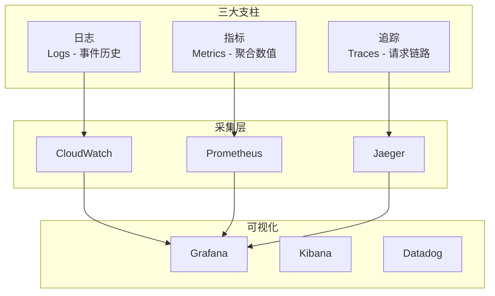

你的 Serverless 应用上线了，一周后用户开始抱怨「接口变慢」。你打开 CloudWatch，找了半天，只看到一堆 Lambda 日志，不知道请求是怎么在各个函数之间流转的。

**「Serverless 的分布式特性，让可观测性比传统架构更重要。」** 函数之间的调用关系被隐藏在平台内部，没有好的可观测性，排查问题就像在黑暗中找针。

## 可观测性三大支柱



### 三者的区别

| 类型 | 问题 | 例子 |
| --- | --- | --- |
| **日志** | 发生了什么？ | `Error: timeout after 30s` |
| **指标** | 发生了多少次？有多严重？ | `5% 请求失败率，P99=2.3s` |
| **追踪** | 为什么会这样？哪个环节慢？ | `调用链：Auth → DB → Cache` |

## 日志最佳实践

### 结构化日志

```typescript title="structured-logger.ts"
import { Context } from 'aws-lambda';

interface LogEntry {
  timestamp: string;
  level: 'DEBUG' | 'INFO' | 'WARN' | 'ERROR';
  requestId: string;
  functionName: string;
  message: string;
  [key: string]: any;
}

const createLogger = (context: Context) => {
  const log = (level: LogEntry['level'], message: string, data?: object) => {
    const entry: LogEntry = {
      timestamp: new Date().toISOString(),
      level,
      requestId: context.awsRequestId,
      functionName: context.functionName,
      message,
      ...data,
    };

    console.log(JSON.stringify(entry));
  };

  return {
    debug: (msg: string, data?: object) => log('DEBUG', msg, data),
    info: (msg: string, data?: object) => log('INFO', msg, data),
    warn: (msg: string, data?: object) => log('WARN', msg, data),
    error: (msg: string, data?: object) => log('ERROR', msg, data),
  };
};

export const handler = async (event: any, context: Context) => {
  const logger = createLogger(context);

  logger.info('Processing request', {
    path: event.path,
    method: event.httpMethod,
    bodySize: event.body?.length,
  });

  try {
    const result = await processEvent(event);
    logger.info('Request completed', { resultSize: JSON.stringify(result).length });
    return result;
  } catch (error) {
    logger.error('Request failed', {
      error: error.message,
      stack: error.stack,
    });
    throw error;
  }
};
```

### Lambda 日志格式

```json title="cloudwatch-logs.json"
{
  "timestamp": "2024-01-15T10:30:00.000Z",
  "level": "ERROR",
  "requestId": "a1b2c3d4-e5f6-7890-abcd-ef1234567890",
  "functionName": "order-service-prod",
  "message": "Database connection timeout",
  "error": "ETIMEDOUT",
  "duration": 30000,
  "userId": "user-12345",
  "orderId": "order-67890"
}
```

### 日志采集配置

```yaml title="firelens-config.yaml"
apiVersion: v1
kind: ConfigMap
metadata:
  name: fluent-bit-config
  namespace: production
data:
  flb_config: |
    [SERVICE]
        Flush         5
        Log_Level     info
        Daemon        off
        Parsers_File  parsers.conf
        HTTP_Server   On
        HTTP_Listen   0.0.0.0
        HTTP_Port     2020
        Health_Check  On

    [INPUT]
        Name              tail
        Path              /var/log/containers/*.log
        Parser            docker
        Tag               kube.*
        Refresh_Interval  5

    [OUTPUT]
        Name   cloudwatch
        Match  *
        region us-east-1
        log_group_name /aws/eks/production
        log_stream_prefix fargate-
        auto_create_group true
```

## 指标最佳实践

### 自定义业务指标

```typescript title="custom-metrics.ts"
import { CloudWatchClient, PutMetricDataCommand } from '@aws-sdk/client-cloudwatch';

const cloudwatch = new CloudWatchClient({});

interface MetricData {
  namespace: string;
  name: string;
  value: number;
  unit?: 'Count' | 'Milliseconds' | 'Bytes' | 'Seconds';
  dimensions?: Record<string, string>;
}

export const recordMetric = async (metric: MetricData) => {
  await cloudwatch.send(new PutMetricDataCommand({
    Namespace: metric.namespace,
    MetricData: [{
      MetricName: metric.name,
      Dimensions: Object.entries(metric.dimensions || {}).map(([Name, Value]) => ({
        Name,
        Value,
      })),
      Value: metric.value,
      Unit: metric.unit || 'Count',
      Timestamp: new Date(),
    }],
  }));
};

// 使用示例
export const recordOrderProcessed = async (orderId: string, duration: number) => {
  await recordMetric({
    namespace: 'ECommerce/Orders',
    name: 'OrderProcessed',
    value: 1,
    dimensions: { region: process.env.AWS_REGION! },
  });

  await recordMetric({
    namespace: 'ECommerce/Orders',
    name: 'ProcessingDuration',
    value: duration,
    unit: 'Milliseconds',
    dimensions: { region: process.env.AWS_REGION! },
  });
};
```

### Promethus 指标（Knative）

```typescript title="prometheus-metrics.ts")
import { register, Counter, Histogram, Gauge } from 'prom-client';

// 请求计数器
const httpRequestsTotal = new Counter({
  name: 'http_requests_total',
  help: 'Total number of HTTP requests',
  labelNames: ['method', 'path', 'status'],
});

// 请求延迟直方图
const httpRequestDuration = new Histogram({
  name: 'http_request_duration_seconds',
  help: 'Duration of HTTP requests in seconds',
  labelNames: ['method', 'path'],
  buckets: [0.01, 0.05, 0.1, 0.5, 1, 5],
});

// 当前处理中的请求数
const httpRequestsInProgress = new Gauge({
  name: 'http_requests_in_progress',
  help: 'Number of HTTP requests currently being processed',
  labelNames: ['method'],
});

export const metricsHandler = async (req: Request): Promise<Response> => {
  // 记录请求开始
  const startTime = Date.now();
  httpRequestsInProgress.inc({ method: req.method });

  try {
    const response = await handleRequest(req);

    // 记录请求完成
    httpRequestsTotal.inc({
      method: req.method,
      path: new URL(req.url).pathname,
      status: response.status.toString(),
    });

    httpRequestDuration.observe(
      { method: req.method, path: new URL(req.url).pathname },
      (Date.now() - startTime) / 1000
    );

    return response;
  } finally {
    httpRequestsInProgress.dec({ method: req.method });
  }
};

// /metrics 端点
export const metricsEndpoint = async (): Promise<Response> => {
  return new Response(await register.metrics(), {
    headers: { 'Content-Type': register.contentType },
  });
};
```

### 关键告警

```yaml title="cloudwatch-alarms.yaml"
Resources:
  ErrorRateAlarm:
    Type: AWS::CloudWatch::Alarm
    Properties:
      AlarmName: !Sub '${AWS::StackName}-error-rate'
      AlarmDescription: "5xx 错误率超过 1%"
      MetricName: Errors
      Namespace: AWS/Lambda
      Statistic: Sum
      Period: 300
      EvaluationPeriods: 2
      Threshold: 1
      ComparisonOperator: GreaterThanThreshold
      TreatMissingData: notBreaching
      Dimensions:
        - Name: FunctionName
          Value: !Ref MyFunction
      AlarmActions:
        - !Ref AlarmSNSTopic
      OKActions:
        - !Ref AlarmSNSTopic

  HighLatencyAlarm:
    Type: AWS::CloudWatch::Alarm
    Properties:
      AlarmName: !Sub '${AWS::StackName}-high-latency'
      AlarmDescription: "P99 延迟超过 3 秒"
      MetricName: Duration
      Namespace: AWS/Lambda
      Statistic: Maximum
      Period: 300
      EvaluationPeriods: 3
      Threshold: 3000
      ComparisonOperator: GreaterThanThreshold
      Dimensions:
        - Name: FunctionName
          Value: !Ref MyFunction
```

## 分布式追踪

### X-Ray SDK 集成

```typescript title="xray-tracing.ts")
import { Segment, Subsegment, captureAWSv3Client } from 'aws-xray-sdk';
import { DynamoDBClient } from '@aws-sdk/client-dynamodb';
import { DynamoDBDocumentClient, GetCommand } from '@aws-sdk/lib-dynamodb';

// 为 AWS SDK 启用 X-Ray
const dynamoDB = captureAWSv3Client(new DynamoDBClient({}));

export const handler = async (event: any, context: any) => {
  // X-Ray 自动捕获 Lambda 调用

  const userId = event.pathParameters?.userId;

  // 创建子段标记自定义逻辑
  const subsegment = context.awsXray?.createSubsegment('fetchUserData');

  try {
    const startTime = Date.now();

    // DynamoDB 调用被自动追踪
    const response = await dynamoDB.send(new DynamoDBDocumentClient({
      command: new GetCommand({
        TableName: 'users',
        Key: { id: userId },
      }),
    }));

    const duration = Date.now() - startTime;
    subsegment?.addMetadata('table', 'users');
    subsegment?.addMetadata('duration_ms', duration);

    return {
      statusCode: 200,
      body: JSON.stringify(response.Item),
    };
  } catch (error) {
    subsegment?.addAnnotation('error', true);
    throw error;
  } finally {
    subsegment?.close();
  }
};
```

### OpenTelemetry 追踪

```typescript title="otel-tracing.ts")
import { NodeSDK } from '@opentelemetry/sdk-node';
import { OTLPTraceExporter } from '@opentelemetry/exporter-trace-otlp-http';
import { AwsLambda instrumentation } from '@opentelemetry/instrumentation-aws-lambda';
import { getNodeAutoInstrumentations } from '@opentelemetry/auto-instrumentations-node';

const sdk = new NodeSDK({
  traceExporter: new OTLPTraceExporter({
    url: 'https://otel-collector:4318/v1/traces',
  }),
  instrumentations: [
    new AwsLambdaInstrumentation(),
    getNodeAutoInstrumentations({
      '@opentelemetry/instrumentation-http': { enabled: true },
      '@opentelemetry/instrumentation-express': { enabled: true },
    }),
  ],
});

sdk.start();

// 你的 Lambda 函数
export const handler = async (event: any) => {
  return processEvent(event);
};
```

### 追踪上下文传播

```typescript title="context-propagation.ts")
import { Context } from 'aws-lambda';
import { propagation, context } from '@opentelemetry/api';

// 提取追踪上下文
export const handler = async (event: any, lambdaContext: Context) => {
  // 从 HTTP 头或 SQS 消息提取上下文
  const extractedContext = propagation.extract(context.active(), event.headers || event.MessageAttributes);

  // 在上下文中执行
  return context.with(extractedContext, async () => {
    const tracer = trace.getTracer('my-service');

    return tracer.startActiveSpan('processOrder', (span) => {
      try {
        span.setAttributes({
          'order.id': event.orderId,
          'user.id': event.userId,
        });

        const result = processOrder(event);

        span.setStatus({ code: SpanStatusCode.OK });
        return result;
      } catch (error) {
        span.recordException(error);
        span.setStatus({ code: SpanStatusCode.ERROR });
        throw error;
      } finally {
        span.end();
      }
    });
  });
};

// 调用其他服务时注入上下文
const callDownstreamService = async (data: any) => {
  const headers: Record<string, string> = {};

  // 将追踪上下文注入到 HTTP 头
  propagation.inject(context.active(), headers);

  return fetch('https://api.example.com', {
    headers: {
      ...headers,
      'Content-Type': 'application/json',
    },
    method: 'POST',
    body: JSON.stringify(data),
  });
};
```

## 可视化仪表板

### Lambda 概览仪表板

```json title="lambda-dashboard.json"
{
  "widgets": [
    {
      "type": "metric",
      "properties": {
        "title": "调用量和错误率",
        "stat": "Sum",
        "period": 300,
        "widgets": [
          {
            "metric": {
              "namespace": "AWS/Lambda",
              "metricName": "Invocations",
              "dimensions": [{ "name": "FunctionName", "value": "${functionName}" }]
            }
          },
          {
            "metric": {
              "namespace": "AWS/Lambda",
              "metricName": "Errors",
              "dimensions": [{ "name": "FunctionName", "value": "${functionName}" }]
            }
          }
        ]
      }
    },
    {
      "type": "metric",
      "properties": {
        "title": "延迟 P50/P95/P99",
        "widgets": [
          {
            "metric": {
              "namespace": "AWS/Lambda",
              "metricName": "Duration",
              "stat": "p50",
              "dimensions": [{ "name": "FunctionName", "value": "${functionName}" }]
            }
          },
          {
            "metric": {
              "namespace": "AWS/Lambda",
              "metricName": "Duration",
              "stat": "p95",
              "dimensions": [{ "name": "FunctionName", "value": "${functionName}" }]
            }
          },
          {
            "metric": {
              "namespace": "AWS/Lambda",
              "metricName": "Duration",
              "stat": "p99",
              "dimensions": [{ "name": "FunctionName", "value": "${functionName}" }]
            }
          }
        ]
      }
    }
  ]
}
```

### Grafana Dashboard（Knative）

```json title="knative-dashboard.json"
{
  "dashboard": {
    "title": "Knative Serving Metrics",
    "panels": [
      {
        "title": "Requests per Second",
        "type": "graph",
        "targets": [
          {
            "expr": "sum(rate(http_requests_total[5m])) by (service)",
            "legendFormat": "{{service}}"
          }
        ]
      },
      {
        "title": "P99 Latency",
        "type": "graph",
        "targets": [
          {
            "expr": "histogram_quantile(0.99, sum(rate(http_request_duration_seconds_bucket[5m])) by (le, service))",
            "legendFormat": "{{service}} P99"
          }
        ]
      },
      {
        "title": "Active Revisions",
        "type": "stat",
        "targets": [
          {
            "expr": "sum(knative_revision_autoscaler_actual_pods) by (service)",
            "legendFormat": "{{service}}"
          }
        ]
      }
    ]
  }
}
```

## 故障排查指南

### 冷启动问题

```bash
# 查询冷启动导致的慢请求
fields @timestamp, @message, @duration
| filter @duration > 2000
| filter @message like /INIT_START/
| sort @timestamp desc
| limit 50

# 统计冷启动比例
stats count(*) as total,
     count(if(@message like /INIT_START/)) as coldStarts
| eval coldStartRate = coldStarts / total * 100
```

### 超时问题

```bash
# 找出超时请求
fields @timestamp, @requestId, @duration, @message
| filter @duration >= 29000
| filter @message like /Task timed out/
| sort @timestamp desc

# 追踪超时请求
fields @requestId
| filter @requestId = "specific-request-id"
| limit 100
```

### 错误关联

```bash
# 关联同一个请求的日志和追踪
fields @timestamp, @requestId, @message
| filter @requestId = "trace-id"
| sort @timestamp asc
```

## 最佳实践清单

| 类型 | 实践 |
| --- | --- |
| **日志** | 结构化格式（JSON） |
| **日志** | 包含 requestId、userId 等关联字段 |
| **日志** | 分离 DEBUG/INFO/WARN/ERROR 级别 |
| **指标** | 业务指标（如订单量、转化率） |
| **指标** | 基础设施指标（如调用量、延迟） |
| **指标** | 设置合理的告警阈值 |
| **追踪** | 为所有跨服务调用创建 Span |
| **追踪** | 传播追踪上下文 |
| **追踪** | 在 Span 中添加关键元数据 |

## 延伸思考

Serverless 可观测性的核心挑战是**分布式链路追踪**。在传统架构中，一个请求在单个进程中处理；在 Serverless 中，请求可能在多个函数间流转。

关键的思考是：

1. **采样策略**：高流量时不可能记录所有追踪，需要采样
2. **上下文传播**：HTTP 头容易传递，SQS/EventBridge 需要特殊处理
3. **成本控制**：日志和指标的存储成本可能超过计算成本

一个好的可观测性策略，应该回答三个问题：
- **RED 原则**：Rate（请求率）、Errors（错误率）、Duration（延迟）
- **USE 原则**：Utilization（利用率）、Saturation（饱和度）、Errors（错误）

当你能从仪表板上回答「系统是否健康」这个问题时，你的可观测性建设才算真正完成。