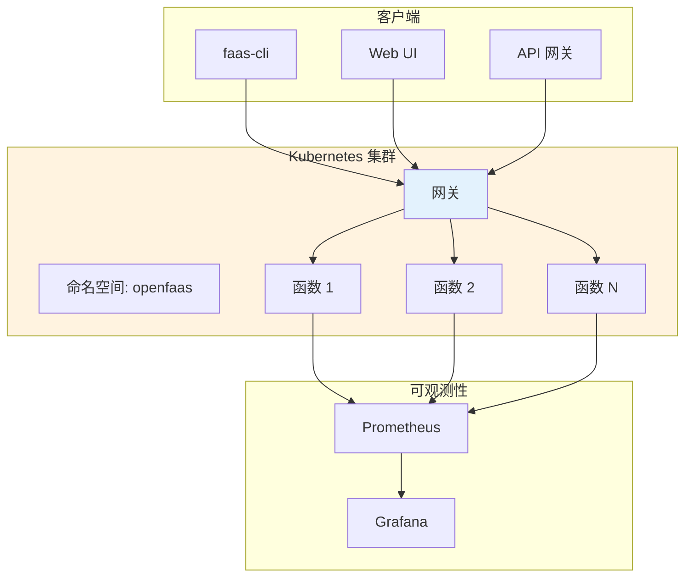
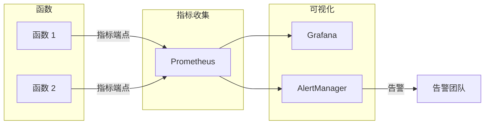

凌晨两点，你被手机告警叫醒。线上 Kubernetes 集群的 CPU 使用率突然飙高，排查后发现是某个定时任务占用了过多资源。更让人头疼的是，这个定时任务大多数时候只需要处理 10 条数据，但大促期间可能有 10 万条——为「10 万条」预留资源太浪费，「10 条」的负载又扛不住。

如果当初用 OpenFaaS，这个问题可能根本不存在——函数会在需要时自动扩缩容，不需要时自动缩容到零，不占用任何资源。

这就是 OpenFaaS 解决的问题：**让函数在 Kubernetes 上跑起来，像使用云服务一样简单。**

## OpenFaaS 简介

OpenFaaS（Open Function as a Service）是一个开源的 Serverless 框架，由 Alex Ellis 于 2016 年创建。它的设计目标是：**让函数部署变得像发布 Docker 镜像一样简单**。

OpenFaaS 有几个显著特点：

1. **Kubernetes 原生**：直接运行在 Kubernetes 上，利用 Kubernetes 的调度和扩缩容能力
2. **容器化优先**：每个函数本质上是一个 Docker 容器，不需要特殊的运行时
3. **命令行友好**：提供 `faas-cli` 工具，一条命令部署函数
4. **模板系统**：提供多种语言模板，无需从零编写 Dockerfile



## 核心架构

OpenFaaS 由几个核心组件构成：

| 组件 | 说明 |
| --- | --- |
| **Gateway** | API 网关，负责路由、认证、指标收集 |
| **Provider** | 函数提供者，负责函数的部署和扩缩容 |
| **NATS** | 异步调用的事件总线 |
| **Prometheus** | 指标采集和监控 |
| **faas-cli** | 命令行工具 |

### 网关（Gateway）

网关是 OpenFaaS 的入口，接收所有请求并路由到对应的函数。它还负责：

- 管理函数的生命周期（部署、更新、删除）
- 收集函数调用的指标数据
- 提供 Web UI 和 REST API

### 提供者（Provider）

OpenFaaS 支持多种提供者，最常用的是 **faas-netes**（Kubernetes 提供者）：

- 接收来自网关的请求
- 调度函数容器到 Kubernetes 节点
- 管理函数的扩缩容策略

## 函数模板

OpenFaaS 提供了丰富的函数模板，覆盖主流编程语言：

```bash
# 查看可用模板
faas-cli template store list

# 输出示例
NAME            SOURCE                     DESCRIPTION
csharp                      official            C# template
go                          official            Go template
java8                       official            Java 8 template
java11                      official            Java 11 template
node                        official            Node.js 8 template
python3                     official            Python 3 template
python3-debian              official            Python 3 Debian template
ruby                       official            official Ruby template
```

### 创建新函数

```bash title="创建函数"
# 初始化新函数
faas-cli new --lang python3 my-function --prefix myorg

# 目录结构
my-function/
├── handler.py          # 函数入口
├── requirements.txt    # Python 依赖
└── template.yml       # 模板配置
```

```python title="handler.py"
def handle(req):
    """
    函数入口，接收请求并返回响应
    """
    # 解析输入
    name = req.get("name", "World")

    # 业务逻辑
    result = f"Hello, {name}!"

    return {
        "statusCode": 200,
        "body": result
    }
```

### 部署函数

```bash title="部署函数"
# 构建并推送镜像
faas-cli build -f my-function.yml
faas-cli push -f my-function.yml
faas-cli deploy -f my-function.yml

# 或者一行命令搞定
faas-cli up -f my-function.yml
```

## 监控集成

OpenFaaS 原生集成 Prometheus 和 Grafana，开箱即用。

### 内置指标

OpenFaaS 提供以下核心指标：

| 指标名称 | 说明 |
| --- | --- |
| `gateway_functions_total` | 函数总数 |
| `gateway_function_invocation_total` | 函数调用总次数 |
| `gateway_function_duration_seconds` | 函数执行时间 |
| `gateway_function_invocation_errors_total` | 函数调用错误数 |
| `gateway_service_count` | 运行的函数实例数 |

### Prometheus 配置

```yaml title="prometheus.yml"
global:
  scrape_interval: 15s

scrape_configs:
  - job_name: 'openfaas'
    static_configs:
      - targets: ['gateway.openfaas:8082']
```

### Grafana 面板

OpenFaaS 官方提供了预置的 Grafana 面板，可以直接导入：

```json title="grafana-dashboard.json"
{
  "dashboard": {
    "title": "OpenFaaS Functions",
    "panels": [
      {
        "title": "Function Call Rate",
        "targets": [
          {
            "expr": "rate(gateway_function_invocation_total[5m])"
          }
        ]
      },
      {
        "title": "Average Duration",
        "targets": [
          {
            "expr": "rate(gateway_function_duration_seconds_sum[5m]) / rate(gateway_function_duration_seconds_count[5m])"
          }
        ]
      }
    ]
  }
}
```



## 自动扩缩容

OpenFaaS 支持基于 Prometheus 指标的自动扩缩容，这是它的核心能力之一。

### AlertManager 扩缩容原理

OpenFaaS 使用 AlertManager 的告警机制触发扩缩容：

1. Prometheus 监控函数指标
2. 当指标超过阈值（如 CPU `>` 70%），触发 AlertManager 告警
3. AlertManager 调用 `faas-cli` 增加函数副本数
4. 扩缩容完成后，告警自动消除

### 扩缩容配置

```yaml title="docker-compose.yml"
services:
  alertmanager:
    image: prom/alertmanager
    volumes:
      - ./alertmanager.yml:/etc/alertmanager/alertmanager.yml
    command:
      - '--config.file=/etc/alertmanager/alertmanager.yml'
      - '--storage.path=/alertmanager'
```

```yaml title="alertmanager.yml"
route:
  group_by: ['function_name']
  group_wait: 10s
  receiver: 'scale-up'

receivers:
  - name: 'scale-up'
    webhook:
      url: 'http://gateway:8081/system/scale-function'
      send_resolved: true
```

### 自动缩容到零

OpenFaaS 支持将函数缩容到零实例，这是节省成本的关键功能：

```bash title="缩容到零"
# 将函数缩容到零
faas-cli deploy -f my-function.yml --scale-min=0

# 查看当前副本数
faas-cli list

# 输出示例
Function                      Replicas
my-function                   0
```

:::tip
**什么时候缩容到零？**

对于非关键路径的函数（如夜间报表生成、调试接口），缩容到零可以完全消除资源消耗。但对于延迟敏感的关键路径，应设置 `scale-min=1` 保持至少一个实例。
:::

## 模板开发

如果官方模板不满足需求，可以创建自定义模板。

### 模板结构

```
my-template/
├── template.yml        # 模板元数据
├── Dockerfile         # Dockerfile 模板
└── function/
    └── handler.py     # 函数入口
```

### template.yml

```yaml title="template.yml"
name: my-python-template
version: 1.0
description: Custom Python template with pre-installed libraries
language: Python
```

### Dockerfile 模板

```dockerfile title="Dockerfile"
FROM python:3.11-slim

# 安装预装依赖
RUN pip install --no-cache-dir requests boto3 pandas

WORKDIR /root/

COPY function/function.py fprocess
# copy the python function(s)
COPY . .

ENV fprocess="/root/fprocess"

CMD ["fprocess"]
```

### 发布模板

```bash title="发布模板"
# 推送到模板商店
faas-cli template store push \
    --repo https://github.com/myorg/my-template \
    --name my-python-template
```

## 部署实践

### 单机部署（Docker Compose）

OpenFaaS 提供 Docker Compose 一键部署：

```bash title="部署到 Docker Compose"
# 下载 docker-compose.yml
curl -sL https://raw.githubusercontent.com/openfaas/faas/master/docker-compose.yml -o docker-compose.yml

# 启动所有组件
docker-compose up -d

# 访问 Web UI
open http://localhost:8080

# 默认密码
cat ~/.openfaas/{PASSWORD_FILE}
```

### Kubernetes 部署

```bash title="部署到 Kubernetes"
# 使用 helm 安装
helm repo add openfaas https://openfaas.github.io/faas-netes/
helm repo update

helm install openfaas openfaas/openfaas \
    --namespace openfaas \
    --set basicAuth=true \
    --set gateway.replicas=2
```

### 生产级配置

```yaml title="values.yml"
# 生产环境配置
basicAuth: true
rbac: true

gateway:
  replicas: 3
  resources:
    limits:
      cpu: "500m"
      memory: "256Mi"

queueWorker:
  replicas: 2
  concurrency: 10

basicAuthPlugin:
  resources:
    limits:
      memory: "64Mi"
```

## 权衡矩阵

|| 场景 | 推荐配置 | 原因 |
| --- | --- | --- | --- |
| 开发测试 | 单节点 Docker Compose | 快速启动，无需 Kubernetes | 资源占用小 |
| 小规模生产 | 3 节点 Kubernetes | 高可用，自动扩缩容 | 成本与可靠性平衡 |
| 大规模生产 | 多可用区 Kubernetes | 跨 AZ 高可用 | 最高可靠性保障 |
| 低延迟敏感 | 保持至少 1 实例 | 禁用缩容到零 | 避免冷启动 |
| 低成本优先 | 缩容到零 + 按需扩容 | 大多数场景允许冷启动 | 最小资源消耗 |

## 常见问题与反模式

### 误区 1：函数粒度太细

把一个本来应该整体处理的操作拆成多个微函数，导致调用链路复杂、网络开销增加。

**正确做法**：根据业务边界划分函数，一个函数完成一个完整的业务操作。

### 误区 2：忽略超时配置

默认超时时间可能太短，长时间运行的任务会被强制中断。

**正确做法**：根据函数预期执行时间设置合理的超时值：

```yaml title="function.yml"
functions:
  my-long-task:
    handler: ./my-long-task
    image: myorg/my-long-task:latest
    timeout: 300s  # 5 分钟超时
```

### 误区 3：函数依赖外部状态

在函数内缓存大量数据或依赖进程内状态，冷启动后状态丢失。

**正确做法**：状态存储到 Redis、数据库等外部服务：

```python title="handler.py"
import redis

def handle(req):
    r = redis.Redis(host='redis', port=6379)
    cached = r.get("my-key")

    if not cached:
        # 从数据库加载
        data = load_from_db(req)
        r.setex("my-key", 3600, json.dumps(data))
        return data

    return json.loads(cached)
```

### 误区 4：没有配置资源限制

函数可能无限制地消耗 CPU 和内存，影响集群稳定性。

**正确做法**：为每个函数配置资源限制：

```yaml title="function.yml"
functions:
  my-function:
    limits:
      cpu: "500m"
      memory: "128Mi"
    requests:
      cpu: "100m"
      memory: "64Mi"
```

## 延伸思考

OpenFaaS 的设计哲学是「简单优先」。但在生产环境中，简单往往意味着需要补充更多的外围能力：

1. **安全隔离**：如何实现函数级别的资源隔离和安全策略？
2. **多租户**：如何在共享集群中实现多租户隔离？
3. **密钥管理**：如何安全地管理函数的敏感配置和凭证？

OpenFaaS 社区正在逐步完善这些能力，但目前，生产级多租户场景仍建议考虑 Knative——它在这些方面有更成熟的设计。
