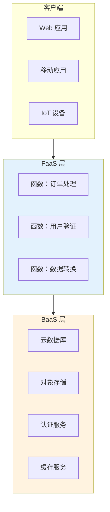
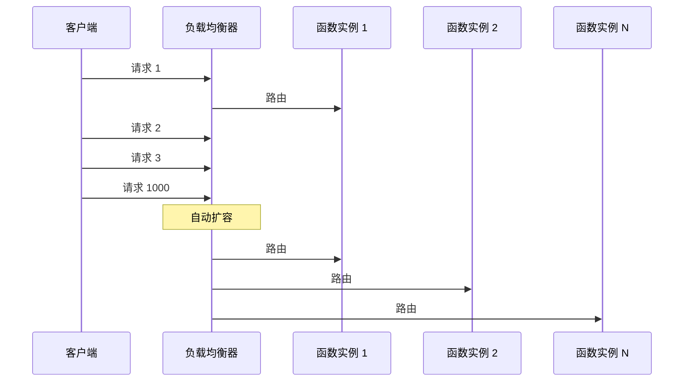
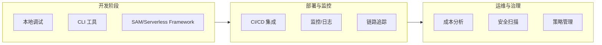

凌晨 2 点，团队刚完成一次大促扩容。运维工程师盯着监控大屏，看着服务器数量从 20 台飙升到 200 台，心跳都快了几分。这些服务器大多数时间都在空跑，只有大促那几天派上用场。更扎心的是，每台服务器每月要烧掉几百块大洋，而利用率可能连 10% 都不到。

这就是传统架构的尴尬：**为峰值购买冗余，为空闲支付账单**。

Serverless 的出现，正是为了解决这个痛点。在 Serverless 的世界里，服务器这个概念对开发者消失了——你不需要关心有多少台机器在跑，不需要半夜爬起来扩容，也不需要为闲置资源买单。你的代码跑在云厂商的「黑箱」里，云负责扩缩容、负责资源分配、负责底层运维。你只管写业务逻辑，按实际执行时间付费。

## Serverless 的定义

Serverless 并非真的「没有服务器」，而是一种**让开发者不再感知服务器存在**的架构范式。它由两大核心组成：

- **FaaS（Function as a Service，函数即服务）**：将业务逻辑拆分为独立的函数，每个函数响应一个事件，执行完成后即释放资源。AWS Lambda、阿里云函数计算、华为云 FunctionGraph 都属于此类。
- **BaaS（Backend as a Service，后端即服务）**：直接使用云厂商提供的后端服务，如数据库（ DynamoDB、CosmosDB）、认证（Auth0、Cognito）、存储（S3、GCS）等，无需自己搭建和维护。

FaaS 和 BaaS 通常配合使用：FaaS 处理业务逻辑和事件驱动的工作流，BaaS 提供数据持久化和基础服务。

## Serverless 的价值主张

### 成本优化：按执行计费

传统模式下，无论服务器是否在处理请求，你都得为它付钱。Serverless 采用**按执行时长计费**，粒度通常低至 100ms。

假设一个 API 平均每天被调用 1 万次，每次执行 50ms：

| 模式 | 日成本（估算） | 月成本（估算） |
| --- | --- | --- |
| 传统 ECS（4 核 8G） | `24 小时 × $0.1` | `~$72/月` |
| Serverless（1GB 内存 × 50ms） | `1 万次 × 0.05 秒 × $0.00001667` | `~$25/月` |

实际成本取决于厂商定价，但 Serverless 在低流量场景下的成本优势是显著的。

### 弹性扩展：零到百万的瞬间跨越

传统架构的扩容需要：评估容量 → 申请机器 → 等待采购/开通 → 部署服务 → 接入负载均衡。这套流程快则几小时，慢则几天。

Serverless 函数可以在**毫秒级**完成从 0 到数千并发的扩展。云厂商的调度系统会根据请求量自动启动新的函数实例，无需人工干预。

### 开发效率：从运维中解放

Serverless 极大简化了 DevOps 工作：

- **无需容量规划**：云负责资源分配
- **无需服务器维护**：安全补丁、操作系统更新由云负责
- **无需部署流水线复杂化**：函数代码即部署单元
- **更快的迭代周期**：函数独立部署，回滚粒度更细

开发团队可以更专注于业务逻辑的实现，而不是基础设施的运维。

## 演进历程

Serverless 的发展经历了几个重要阶段：

| 时间 | 阶段 | 代表事件 |
| --- | --- | --- |
| 2014 | **FaaS 萌芽** | AWS Lambda 发布，Serverless 概念正式落地 |
| 2016-2017 | **生态扩张** | Azure Functions、Google Cloud Functions 相继推出 |
| 2018-2019 | **框架繁荣** | Serverless Framework、AWS SAM、Terraform 支持 Serverless |
| 2020-2021 | **容器融合** | Knative、OpenFaaS 等开源方案兴起 |
| 2022 至今 | **深度集成** | Serverless 与 Kubernetes、AI/ML 深度整合 |

Serverless 最初主要用于 Web 后端和事件处理，如今已扩展到数据工程（ETL、流处理）、机器学习（模型推理）、IoT 等多个领域。

## 生态全景图

### 主流云厂商 FaaS 平台

| 厂商 | 产品 | 特点 |
| --- | --- | --- |
| AWS | Lambda | 生态最完善，触发器最丰富 |
| 阿里云 | 函数计算 FC | 国内市场份额领先，本地化好 |
| 华为云 | FunctionGraph | 函数工作流编排能力强 |
| Azure | Azure Functions | 与 Office 365、Azure AD 集成紧密 |
| Google Cloud | Cloud Functions v2 | 基于 Knative，Knative 兼容性好 |

### 开源 Serverless 框架

| 框架 | 特点 |
| --- | --- |
| **Knative** | Kubernetes 原生，CNCF 毕业项目，Google 主推 |
| **OpenFaaS** | 简单易用，Docker 友好，社区活跃 |
| **Kubeless** | 基于 Kubernetes Custom Resources，早期方案 |
| **Fission** | 专注于冷启动优化，Fastly 收购后持续发展 |

### Serverless 配套工具链

## 与容器相比

Serverless 和容器是两种互补的部署范式，而非简单的替代关系：

| 维度 | 容器（Kubernetes） | Serverless（FaaS） |
| --- | --- | --- |
| **抽象层级** | 容器（进程组） | 函数（单个函数） |
| **扩缩容** | 分钟级，需要 HPA 配置 | 毫秒级，自动 |
| **计费模型** | 包月/包年，按 Pod 规格 | 按执行时长，粒度 100ms |
| **冷启动** | 秒级（Pod 启动） | 百毫秒到秒级（语言相关） |
| **执行时长限制** | 无硬性限制 | 通常 15 分钟以内 |
| **状态管理** | 支持有状态负载 | 函数无状态，需外部存储 |
| **适用场景** | 长时服务、微服务、数据库 | 事件驱动、短时任务、突发流量 |
| **厂商锁定** | 较低（标准 K8s API） | 较高（厂商特有 API） |

:::tip
**选型建议**：容器适合长期运行、有状态、需要精细控制的服务；Serverless 适合事件驱动、突发流量、低成本试错的场景。两者完全可以共存——用容器跑核心业务，用 Serverless 处理边缘任务。
:::

## 权衡矩阵

| 场景 | 推荐方案 | 原因 |
| --- | --- | --- |
| 电商大促、秒杀 | Serverless | 流量突增自动响应，无需预置容量 |
| 实时音视频处理 | 容器 | 执行时长不固定，需要长连接 |
| IoT 数据采集 | Serverless | 事件驱动，调用量波动大 |
| AI 模型推理 | 视情况选择 | 小模型用 Serverless，大模型用容器/GPU 实例 |
| 微服务 API | 容器 | 需要长时运行，有状态通信 |
| 定时批处理 | 视任务复杂度 | 简单 ETL 用 Serverless，复杂任务用容器 |

## 延伸思考

Serverless 带来了前所未有的敏捷性，但也引入了新的复杂性：供应商锁定、调试困难、执行时长限制、长连接场景不友好。

当你决定采用 Serverless 时，需要回答几个问题：

- 业务场景是否适合函数粒度的拆分？
- 如何处理函数间的状态共享和事务一致性？
- 如果云厂商涨价或服务不可用，迁移成本有多高？

Serverless 不是银弹，但它确实在特定场景下带来了巨大价值。理解它的边界，比盲目追逐它更重要。
