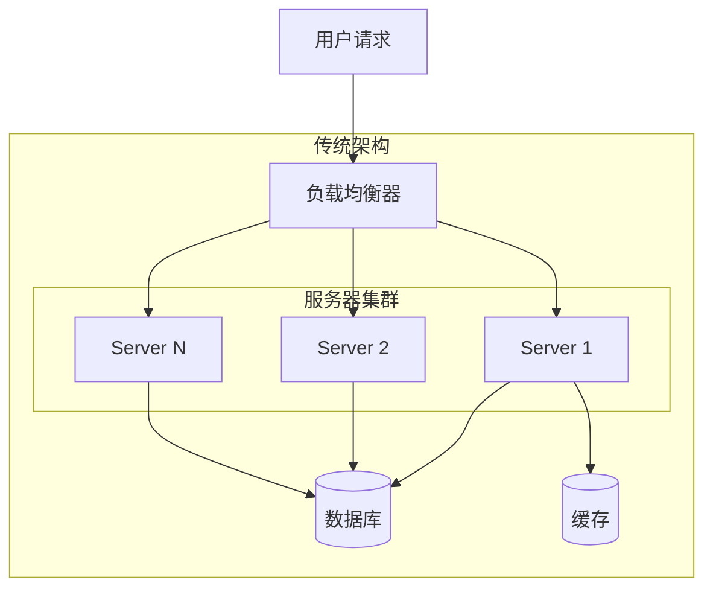
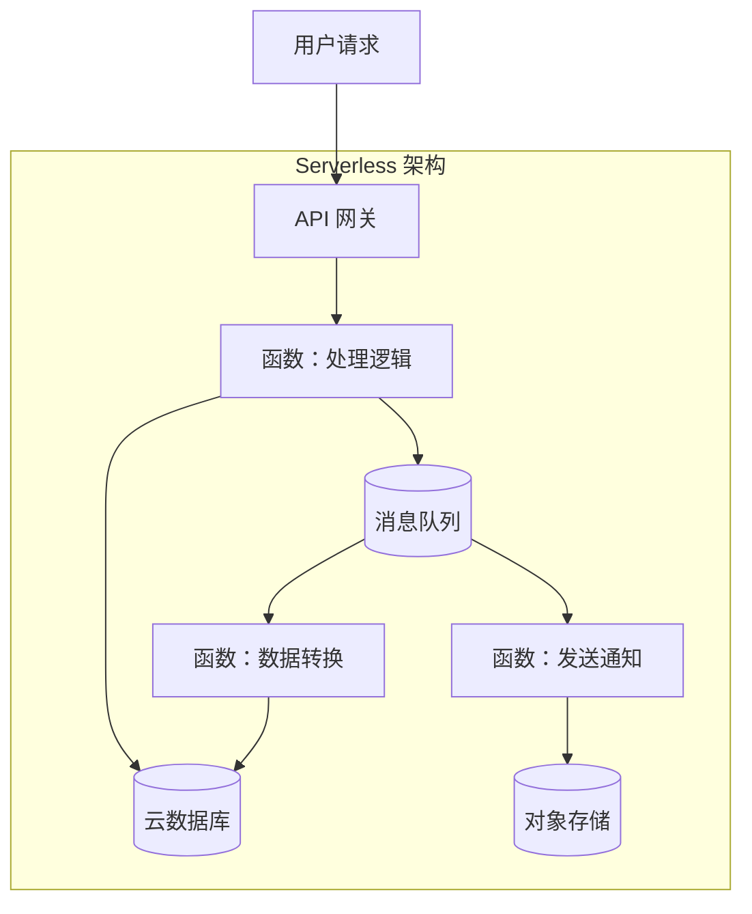
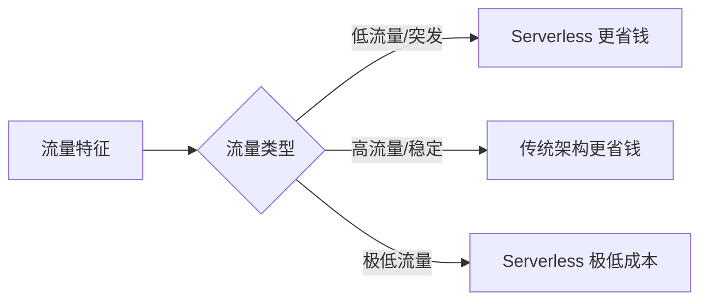
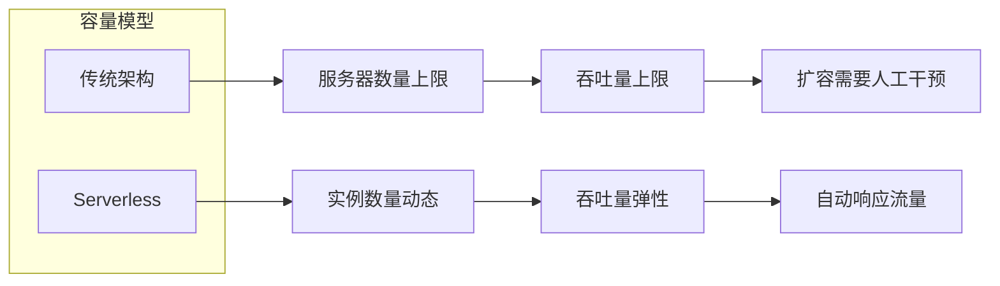
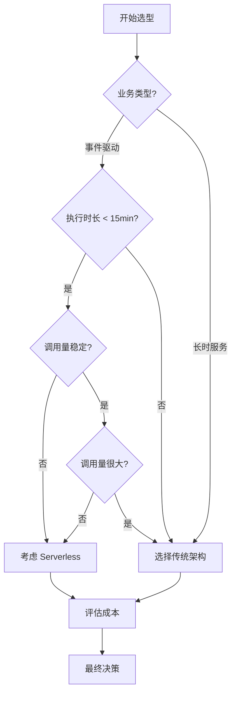

2018 年，某创业公司 CTO 兴奋地在技术博客上宣布：「我们全面转向 Serverless，大幅降低成本！」一年后，他们默默把 80% 的服务迁回了 ECS。CTO 在复盘文章中写道：「Serverless 不是银弹，我们的场景不适合。」

这个故事告诉我们：**任何架构都有它的适用边界**。Serverless 和传统架构各有优劣，关键在于理解它们的本质差异，找到真正适合自己的场景。

## 架构对比

### 传统架构模型

传统架构基于**常驻进程**的思维：服务部署在服务器上，进程持续运行，响应请求。扩容通过增加服务器实例实现，缩容则相反。



特点：**始终在线，按资源预留付费**。

### Serverless 架构模型

Serverless 基于**事件驱动**的思维：函数平时不存在（不消耗资源），事件触发时函数启动，处理完成后函数销毁。



特点：**按需启动，按执行付费**。

### 核心思维差异

| 思维维度 | 传统架构 | Serverless |
| --- | --- | --- |
| **资源观** | 服务器是基础设施，需要长期拥有 | 服务器是云资源，按需申请和释放 |
| **可用性** | 通过进程常驻保证 | 通过函数快速启动保证 |
| **扩缩容** | 人工或 HPA 触发，分钟级 | 平台自动触发，毫秒级 |
| **成本模型** | 固定成本 + 边际递减 | 变动成本 + 边际递增（高流量时） |

## 成本模型对比

### 传统架构成本构成

传统架构的成本相对固定：

```
月成本 = 服务器租赁费 + 带宽费 + 运维人力 + 预留容量浪费
```

以阿里云 ECS 为例，2 核 4G 实例约 200 元/月，即使 CPU 利用率只有 10%，这部分成本也无法回收。

### Serverless 成本构成

Serverless 采用**执行计费**：

```
月成本 = 执行次数 × 单次执行费用 + 调用外部服务费用
```

以阿里云函数计算为例：

```yaml title="函数计算定价（参考）"
资源配置:
  内存: 512 MB
  费用: ¥0.00011158 / GB-秒

调用费用:
  费用: ¥0.2 / 100 万次调用
```

### 成本临界点分析

Serverless 的成本优势取决于**流量特征**：



| 月调用量 | Serverless 估算成本 | 传统 ECS 成本 | 结论 |
| --- | --- | --- | --- |
| 10 万次 | `¥2` | `¥200` | Serverless 省 99% |
| 100 万次 | `¥20` | `¥200` | Serverless 省 90% |
| 1000 万次 | `¥200` | `¥200` | 持平 |
| 1 亿次 | `¥2000` | `¥200` | 传统省 90% |

:::info
**成本拐点**：当调用量超过某个阈值（通常是千万级），Serverless 的成本会超过传统架构。这个阈值与函数执行时长、内存配置密切相关。
:::

### 隐藏成本

Serverless 的成本不只是「执行费用」：

- **跨区域调用**：函数访问 VPC 资源可能产生流量费
- **日志存储**：CloudWatch/日志服务按量计费
- **API 网关**：通常按请求数计费
- **状态外部化**：需要额外的数据库/缓存服务

## 性能对比

### 响应延迟

传统架构因为进程常驻，首次请求无需启动开销。Serverless 则需要经历**冷启动**，首次调用可能慢数百毫秒。

| 场景 | 传统架构 P99 | Serverless P99（热） | Serverless P99（冷） |
| --- | --- | --- | --- |
| 简单查询 | `5-20ms` | `5-20ms` | `100-500ms` |
| 中等复杂度 | `20-100ms` | `20-100ms` | `200-800ms` |
| 复杂计算 | `100-500ms` | `100-500ms` | `500-2000ms` |

### 吞吐量

传统架构的吞吐量受限于服务器数量和进程处理能力。Serverless 的吞吐量理论上**无限**，只要平台能启动足够多的函数实例。



但实际吞吐量受限于**并发配额**和**执行时长**：

- 云厂商对单账号、单函数的并发数有上限（通常 100-1000）
- 执行时长限制（通常 15 分钟以内）不适合长时任务

## 运维复杂度对比

### 传统架构运维

传统架构的运维工作清晰但繁重：

| 运维任务 | 复杂度 | 耗时 |
| --- | --- | --- |
| 容量规划 | 高 | 数小时到数天 |
| 服务器采购/开通 | 中 | 数分钟到数小时 |
| 应用部署 | 中 | 数分钟 |
| 扩缩容 | 高 | 数分钟到数小时 |
| 安全补丁 | 高 | 持续性工作 |
| 监控告警 | 中 | 一次性配置 |

### Serverless 运维

Serverless 将大量运维工作转移给云厂商：

| 运维任务 | 复杂度 | 说明 |
| --- | --- | --- |
| 容量规划 | 无 | 平台自动管理 |
| 服务器采购 | 无 | 不需要 |
| 应用部署 | 低 | 函数即部署单元 |
| 扩缩容 | 无 | 完全自动 |
| 安全补丁 | 无 | 云负责 |
| 监控告警 | 中 | 需要配置函数级监控 |

Serverless 减少了「基础设施运维」，但增加了**函数运维**的新工作：

- 函数日志聚合和查询
- 函数性能分析和优化
- 依赖版本管理和安全扫描
- 跨函数调用链追踪

## 适用场景对比

### 传统架构更适合的场景

- **长时运行服务**：Web 应用、API 服务、微服务
- **需要长连接**：WebSocket、实时通信、在线游戏
- **有状态服务**：需要本地缓存、进程内状态
- **高性能计算**：GPU 实例、科学计算
- **严格的资源控制**：需要固定 CPU/内存、需要访问物理设备

### Serverless 更适合的场景

- **事件驱动型任务**：文件处理、消息消费、数据转换
- **突发流量场景**：大促、秒杀、投票活动
- **间歇性工作负载**：定时任务、批处理、报表生成
- **Webhook 和回调**：对接第三方 API、接收外部事件
- **低成本试错**：新功能验证、MVP 快速上线

## 选型建议

### 决策框架



### 混合架构策略

实际上，很多成熟的系统采用**混合架构**：

| 业务场景 | 推荐架构 | 原因 |
| --- | --- | --- |
| 核心电商 API | 容器/K8s | 高可用、要求稳定延迟 |
| 订单处理管道 | Serverless | 事件驱动、弹性伸缩 |
| 用户上传文件处理 | Serverless | 突发流量、无状态处理 |
| 实时推荐引擎 | 容器 | 长连接、低延迟要求 |
| 定时对账任务 | Serverless | 短时、按需执行 |
| 数据分析管道 | 容器 + Serverless | 复杂逻辑用容器，ETL 用 Serverless |

## 常见误区

### 误区 1：Serverless 一定更便宜

实际情况：当流量稳定且持续时，Serverless 的成本可能比预留实例高 3-5 倍。

**正确做法**：先用历史流量数据建模，计算成本临界点，再决定哪些服务迁移到 Serverless。

### 误区 2：Serverless 不需要运维

实际情况：Serverless 只是把运维工作转移了，从「运维服务器」变成「运维函数」。

**正确做法**：建立函数级监控和告警体系，配置成本上限，避免意外账单。

### 误区 3：Serverless 不安全

实际情况：云厂商负责底层安全（物理安全、网络安全、操作系统安全），开发者只需关注应用层安全。

**正确做法**：遵循最小权限原则，正确配置函数权限，避免函数代码漏洞。

## 延伸思考

选择 Serverless 还是传统架构，本质上是回答一个问题：**你的业务瓶颈在哪里？**

如果瓶颈在基础设施运维（扩容慢、成本高、维护重），Serverless 可能带来巨大价值。

如果瓶颈在业务逻辑本身（复杂的领域模型、长连接需求、严格的性能要求），强行 Serverless 只会增加复杂性。

架构的选择，从来都是「trade-off」的权衡。理解每种方案的代价，比盲目追逐潮流更重要。
