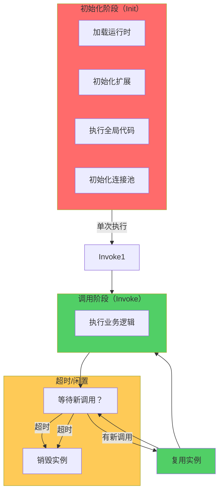
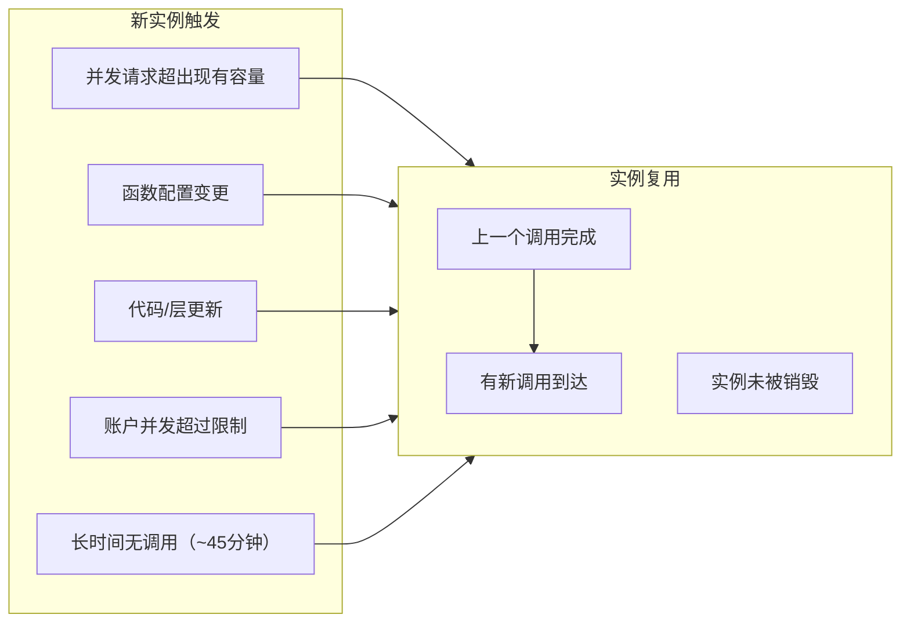

你优化了函数代码，冷启动时间从 800ms 降到了 200ms。监控显示大部分请求都在 50ms 内完成。但当你查看 P99 延迟时，发现有 5% 的请求仍然超过 500ms。

这是怎么回事？

**「Lambda 不是每次调用都创建新实例，但也不是一直保持热状态。」** 理解实例的创建、复用和销毁，是解决长尾延迟问题的关键。

## Lambda 实例生命周期

Lambda 函数运行在**执行环境**中。一个执行环境包含：

```
执行环境
├── 操作系统
├── 语言运行时（Node.js/Python/JVM）
├── 函数代码
├── 账户级别的 Lambda 沙箱
└── 扩展（Extensions）
```



### 三种调用状态

| 状态 | 说明 | 耗时 |
| --- | --- | --- |
| **Cold Start** | 创建新执行环境 | `100ms-5s` |
| **Warm Start** | 复用已有环境 | `<10ms` |
| **Timeout/Recycle** | 实例被销毁后重建 | 等同冷启动 |

## 实例复用机制

Lambda 会**尽可能复用**执行环境，但复用的触发条件由平台控制。

### 什么情况会创建新实例？



### 什么情况会销毁实例？

- 函数超时后一定时间无调用
- 账户级并发使用量下降
- Lambda 服务维护事件
- 账户跨区域迁移

### 代码层面的优化

```typescript title="lib/db.ts"
// 全局变量在实例复用时保留
let dbClient: DatabaseClient | null = null;
let cacheConnection: Redis | null = null;

const getDBClient = async () => {
  if (!dbClient) {
    // 只在第一次初始化
    dbClient = new DatabaseClient({
      host: process.env.DB_HOST!,
      connectionLimit: 10,
    });
    await dbClient.connect();
  }
  return dbClient;
};

const getCache = () => {
  if (!cacheConnection) {
    cacheConnection = new Redis(process.env.REDIS_URL!);
  }
  return cacheConnection;
};

export const handler = async (event: any) => {
  const db = await getDBClient();
  const cache = getCache();

  // 业务逻辑
  return processEvent(event, db, cache);
};
```

## 预热机制

### 手动预热

```typescript title="scripts/warmup.ts"
import { LambdaClient, InvokeCommand } from '@aws-sdk/client-lambda';

const client = new LambdaClient({});

interface WarmupConfig {
  functions: Array<{
    name: string;
    regions?: string[];
  }>;
  concurrency?: number;
}

export const runWarmup = async (config: WarmupConfig) => {
  const { functions, concurrency = 1 } = config;

  const promises: Promise<any>[] = [];

  for (const fn of functions) {
    const regions = fn.regions || [process.env.AWS_REGION!];

    for (const region of regions) {
      const regionClient = new LambdaClient({ region });

      for (let i = 0; i < concurrency; i++) {
        promises.push(
          regionClient.send(new InvokeCommand({
            FunctionName: fn.name,
            InvocationType: 'Event',  // 异步，不等待响应
            Payload: JSON.stringify({ warmup: true }),
          })).catch(err => {
            console.error(`Warmup failed for ${fn.name}:`, err);
          })
        );
      }
    }
  }

  await Promise.all(promises);
  console.log(`Warmed up ${functions.length} functions`);
};
```

### CloudWatch Events + EventBridge Scheduler

```yaml title="warmup-scheduler.yaml"
Resources:
  WarmupRule:
    Type: AWS::Events::Rule
    Properties:
      Description: "Keep Lambda functions warm"
      ScheduleExpression: "rate(5 minutes)"
      State: ENABLED
      Targets:
        - Arn: !GetAtt WarmupFunction.Arn
          Id: "WarmupLambda"
          Input: !Sub |
            {
              "functions": [
                {"name": "user-api-${AWS::Region}", "concurrency": 2},
                {"name": "order-api-${AWS::Region}", "concurrency": 3},
                {"name": "payment-api-${AWS::Region}", "concurrency": 1}
              ]
            }

  WarmupPermission:
    Type: AWS::Lambda::Permission
    Properties:
      FunctionName: !Ref WarmupFunction
      Action: lambda:InvokeFunction
      Principal: events.amazonaws.com
      SourceArn: !GetAtt WarmupRule.Arn
```

### 预热的陷阱

:::warning
**预热的盲目性**：预热调用可能导致不必要的成本。如果函数平时请求量很低，预热可能造成浪费。

**更好的做法**：
1. 监控函数并发数，找到合适的预热时机
2. 使用 Provisioned Concurrency 替代预热
3. 接受偶尔的冷启动，特别是非核心路径
:::

## Provisioned Concurrency

### 与预热的区别

| 特性 | 手动预热 | Provisioned Concurrency |
| --- | --- | --- |
| **控制方式** | 应用层 | 平台层 |
| **启动保证** | 尽力而为 | 明确保证 |
| **成本** | 按调用计费 | 按实例时间计费 |
| **扩缩容** | 手动 | 可配置保留数 |
| **冷启动** | 大部分消除 | 完全消除 |

### 配置方式

```typescript title="set-concurrency.ts"
import { LambdaClient, PutFunctionConcurrencyCommand } from '@aws-sdk/client-lambda';

const client = new LambdaClient({});

export const setProvisionedConcurrency = async (
  functionName: string,
  count: number
) => {
  const response = await client.send(new PutFunctionConcurrencyCommand({
    FunctionName: functionName,
    ProvisionedConcurrencyConfig: {
      ProvisionedConcurrentExecutions: count,
    },
  }));

  console.log(`Set ${count} provisioned concurrency for ${functionName}`);
  return response;
};

// 查看当前配置
export const getProvisionedConcurrency = async (functionName: string) => {
  const response = await client.send(new GetFunctionConcurrencyCommand({
    FunctionName: functionName,
  }));

  return response.ProvisionedConcurrencyConfig;
};
```

### 自动扩缩容

```typescript title="auto-concurrency-scaler.ts"
import { CloudWatchClient, GetMetricDataCommand } from '@aws-sdk/client-cloudwatch';
import { LambdaClient, PutFunctionConcurrencyCommand } from '@aws-sdk/client-lambda';

const cloudwatch = new CloudWatchClient({});
const lambda = new LambdaClient({});

interface ScalingConfig {
  functionName: string;
  min: number;
  max: number;
  targetUtilization: number;  // 0.7 = 70%
}

export const scaleProvisionedConcurrency = async (config: ScalingConfig) => {
  const { functionName, min, max, targetUtilization } = config;

  // 获取并发执行数
  const metrics = await cloudwatch.send(new GetMetricDataCommand({
    MetricDataQueries: [{
      Id: 'concurrent',
      MetricStat: {
        Metric: {
          Namespace: 'AWS/Lambda',
          MetricName: 'ConcurrentExecutions',
          Dimensions: [{ Name: 'FunctionName', Value: functionName }]
        },
        Period: 300,
        Stat: 'Maximum',
      },
    }, {
      Id: 'invocations',
      MetricStat: {
        Metric: {
          Namespace: 'AWS/Lambda',
          MetricName: 'Invocations',
          Dimensions: [{ Name: 'FunctionName', Value: functionName }]
        },
        Period: 300,
        Stat: 'Sum',
      },
    }],
    StartTime: new Date(Date.now() - 3600000),
    EndTime: new Date(),
  }));

  const maxConcurrent = metrics.MetricDataResults?.[0]?.Values?.[0] || 0;
  const invocations = metrics.MetricDataResults?.[1]?.Values?.[0] || 0;

  // 计算目标并发数
  // 估算：最大并发 / 目标利用率，向上取整
  const estimatedPeak = maxConcurrent / targetUtilization;
  let target = Math.ceil(estimatedPeak);

  // 限制在 min-max 范围内
  target = Math.max(min, Math.min(max, target));

  await lambda.send(new PutFunctionConcurrencyCommand({
    FunctionName: functionName,
    ProvisionedConcurrencyConfig: {
      ProvisionedConcurrentExecutions: target,
    },
  }));

  console.log(`Scaled ${functionName} to ${target} provisioned concurrency`);
};
```

## 实例监控

### 关键指标

| 指标 | 含义 | 告警阈值 |
| --- | --- | --- |
| **ConcurrentExecutions** | 当前并发实例数 | 接近账户限制 |
| **ProvisionedConcurrencyExecutions** | PC 实例执行数 | 应接近总执行 |
| **ProvisionedConcurrencySpilloverInvocations** | PC 溢出到按需 | >10% |
| **Duration** | 执行时长 | P99 > 1s |
| **Errors** | 错误数 | >0 |

### CloudWatch Widget

```json
{
  "type": "metric",
  "properties": {
    "title": "Function Performance",
    "metrics": [
      ["AWS/Lambda", "ConcurrentExecutions", "FunctionName", "user-api"],
      [".", "ProvisionedConcurrencyExecutions", ".", "."],
      [".", "ProvisionedConcurrencySpilloverInvocations", ".", "."]
    ],
    "period": 60,
    "stat": "Maximum",
    "region": "us-east-1"
  }
}
```

### 自定义冷启动检测

```typescript title="lib/metrics.ts"
import { CloudWatchClient, PutMetricDataCommand } from '@aws-sdk/client-cloudwatch';

const client = new CloudWatchClient({});

// Lambda 内部可以访问初始化时间
const initStartTime = Date.now();

export const recordMetrics = async () => {
  const functionName = process.env.AWS_LAMBDA_FUNCTION_NAME!;
  const memoryLimit = parseInt(process.env.AWS_LAMBDA_FUNCTION_MEMORY_SIZE!);
  const initDuration = Date.now() - initStartTime;

  // 判断是否是冷启动
  const isColdStart = process.env.AWS_LAMBDA_INITIALIZATION_TYPE === 'on-demand';

  await client.send(new PutMetricDataCommand({
    Namespace: 'Serverless/Metrics',
    MetricData: [{
      MetricName: 'ColdStart',
      Value: isColdStart ? 1 : 0,
      Unit: 'Count',
      Dimensions: [{ Name: 'FunctionName', Value: functionName }],
    }, {
      MetricName: 'InitDuration',
      Value: initDuration,
      Unit: 'Milliseconds',
      Dimensions: [{ Name: 'FunctionName', Value: functionName }],
    }],
  }));
};
```

## 最佳实践

### 1. 合理设置超时

```yaml
Resources:
  MyFunction:
    Type: AWS::Serverless::Function
    Properties:
      Timeout: 30  # 不要设置太长，否则实例会长时间占用资源
      MemorySize: 512  # 根据实际需求选择，不要盲目增加
```

### 2. 分离初始化成本

```typescript title="lib/expensive-init.ts"
// 昂贵但只需要执行一次的初始化
const initializeExpensiveResource = async () => {
  // ML 模型加载 (~50MB)
  // 预计算数据
  // 第三方 SDK 初始化
};

// 在模块加载时执行
if (require.main === module) {
  initializeExpensiveResource().catch(console.error);
}
```

### 3. 优雅处理连接失败

```typescript
export const handler = async (event: any) => {
  let db;

  try {
    db = await getDBClient();
  } catch (error) {
    // 连接失败时重置，强制重建
    dbClient = null;
    throw error;  // 让调用失败而不是返回错误数据
  }

  return processEvent(event, db);
};
```

## 常见问题

**Q: 为什么设置了预热，还是有冷启动？**

A: Lambda 不保证预热调用一定成功。建议监控 `ProvisionedConcurrencySpilloverInvocations` 指标，如果溢出比例超过 10%，说明需要增加预热实例数。

**Q: 函数很久没调用会怎样？**

A: Lambda 会回收空闲实例。大约 45 分钟无调用后，实例会被销毁，下次调用时重新冷启动。

**Q: Provisioned Concurrency 可以设置为 0 吗？**

A: 不可以。最小值为 1。设置为 0 等同于删除配置。

## 延伸思考

实例复用是 Lambda 实现高性能低成本的关键。但它也带来了一些隐藏的问题：

1. **状态泄漏**：全局变量在调用间共享，可能导致状态污染
2. **资源泄露**：未正确关闭的连接、资源会累积
3. **内存泄漏**：长期运行的实例可能积累无用对象

如果你需要保持「无状态」，考虑在每次调用开始时检查并重置可能泄漏的状态。

另一个方向是：**什么时候不应该追求完全热状态？** 对于处理敏感数据或需要清理状态的场景，适当的冷启动反而是一种「安全重启」。