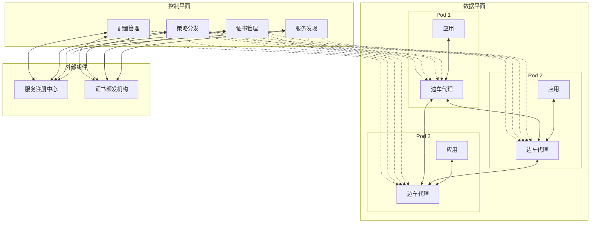
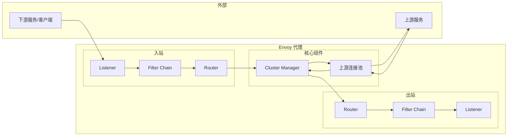
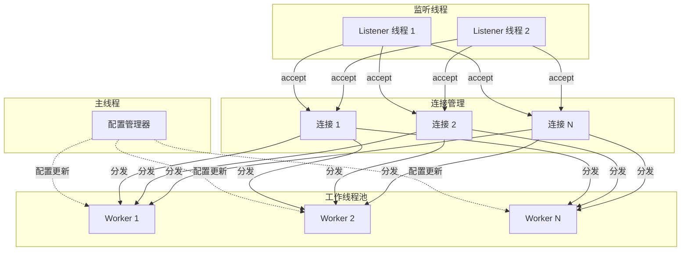
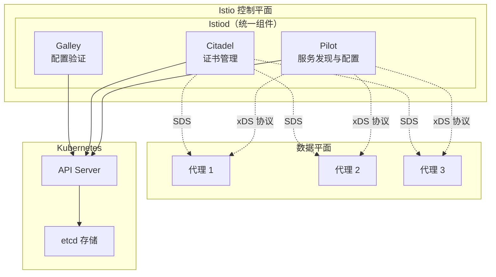
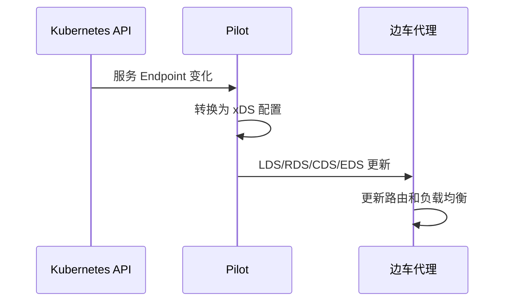
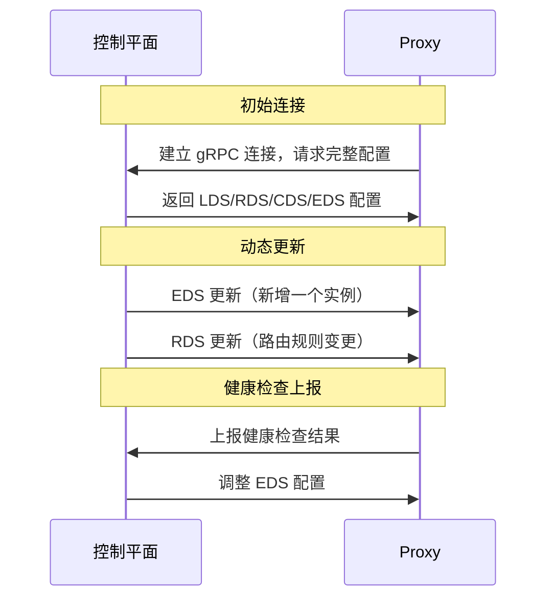
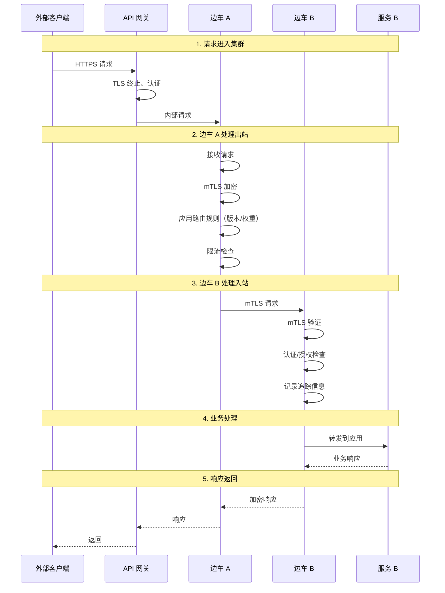

想象一座现代化工厂的物流系统。每个车间（服务）门口都有一个智能物流机器人（边车代理），负责接收物料、搬运产品、处理异常。工厂还有一个中央控制室（控制平面），实时监控所有机器人的状态，下发运输指令，调度物流资源。

这个「每个车间配机器人 + 中央控制室」的模式，就是服务网格的架构本质。

## 服务网格的宏观架构

服务网格由两大部分组成：

- **数据平面（Data Plane）**：负责实际的数据包转发，由每个服务旁的边车代理组成
- **控制平面（Control Plane）**：负责管理和配置数据平面，提供统一的策略下发



## 数据平面：边车代理

数据平面由**边车代理（Sidecar Proxy）**组成，每个服务实例旁运行一个代理实例。

### Envoy 代理核心能力

Envoy 是目前最流行的边车代理，被 Istio、Ambassador、HashiCorp Consul 等主流服务网格采用。



| 组件 | 作用 |
| --- | --- |
| **Listener** | 监听端口，接收入站连接 |
| **Filter Chain** | 过滤器链，处理协议解析、认证、追踪等 |
| **Router** | 根据路由规则决定请求目标 |
| **Cluster Manager** | 管理上游服务集群的连接池 |
| **健康检查** | 主动探测上游服务健康状态 |

### Envoy 的线程模型

Envoy 使用**单进程多线程**模型：



- **主线程**：管理配置更新、统计、健康检查
- **工作线程**：处理请求，每个线程独立处理连接
- **监听线程**：接受新连接，分发给工作线程

## 控制平面：Istio 架构

以 Istio 为例，控制平面由多个组件组成：



### Pilot：服务发现与流量管理

Pilot 负责从服务注册中心（通常是 Kubernetes）获取服务信息，并将其转换为 Envoy 可以理解的配置：



### Citadel：证书与身份管理

Citadel 负责签发证书、管理服务身份：

```yaml title="mTLS 证书配置"
apiVersion: security.istio.io/v1beta1
kind: PeerAuthentication
metadata:
  name: default
  namespace: istio-system
spec:
  mtls:
    mode: STRICT  # 强制 mTLS，不允许明文流量
```

### Galley：配置验证与分发

Galley 负责验证用户提交的 Istio 配置，防止错误配置进入集群：

```bash title="配置验证"
istioctl validate -f virtual-service.yaml
# 验证通过: VirtualService "reviews" is valid
```

## xDS 协议

xDS 是服务网格的「通用语言」，定义了控制平面与数据平面之间的配置接口。

「x」代表可扩展的多种协议：

| 协议 | 全称 | 作用 |
| --- | --- | --- |
| **LDS** | Listener Discovery Service | 下发监听器配置 |
| **RDS** | Route Discovery Service | 下发路由规则 |
| **CDS** | Cluster Discovery Service | 下发集群/服务定义 |
| **EDS** | Endpoint Discovery Service | 下发服务端点（IP+端口） |
| **SDS** | Secret Discovery Service | 下发证书和密钥 |
| **ADS** | Aggregated Discovery Service | 聚合以上所有 |

### xDS 配置流



### xDS 配置示例

```json title="CDS 配置示例（集群定义）"
{
  "version_info": "2024-01-01T00:00:00Z",
  "resources": [{
    "@type": "type.googleapis.com/envoy.config.cluster.v3.Cluster",
    "name": "reviews.default.svc.cluster.local",
    "type": "EDS",
    "lb_policy": "ROUND_ROBIN",
    "circuit_breakers": {
      "thresholds": [{
        "max_connections": 100,
        "max_pending_requests": 100,
        "max_requests": 100
      }]
    },
    "health_checks": [{
      "timeout": "5s",
      "interval": "10s",
      "unhealthy_threshold": 3,
      "healthy_threshold": 2,
      "http_health_check": {
        "path": "/health"
      }
    }]
  }]
}
```

```json title="EDS 配置示例（实例列表）"
{
  "version_info": "2024-01-01T00:01:00Z",
  "resources": [{
    "@type": "type.googleapis.com/envoy.config.endpoint.v3.ClusterLoadAssignment",
    "cluster_name": "reviews.default.svc.cluster.local",
    "endpoints": [{
      "lb_endpoints": [{
        "endpoint": {
          "address": {
            "socket_address": {
              "address": "10.0.0.1",
              "port_value": 8080
            }
          }
        },
        "health_status": "HEALTHY"
      }, {
        "endpoint": {
          "address": {
            "socket_address": {
              "address": "10.0.0.2",
              "port_value": 8080
            }
          }
        },
        "health_status": "HEALTHY"
      }]
    }]
  }]
}
```

## 流量拦截完整流程

从客户端请求到服务端响应的完整流程：



### 各阶段处理内容

| 阶段 | 边车 A（出站） | 边车 B（入站） |
| --- | --- | --- |
| **连接处理** | mTLS 握手 | mTLS 验证 |
| **协议解析** | HTTP/gRPC 解析 | HTTP/gRPC 解析 |
| **路由匹配** | 根据 header/权重路由 | 根据目标服务路由 |
| **策略检查** | 限流、熔断、重试 | 认证、授权 |
| **可观测性** | 记录出站指标、追踪 | 记录入站指标、追踪 |
| **日志记录** | 访问日志 | 访问日志 |

## 服务网格的典型配置模型

### 虚拟服务（Virtual Service）

定义路由规则，控制流量分配：

```yaml title="VirtualService 配置"
apiVersion: networking.istio.io/v1beta1
kind: VirtualService
metadata:
  name: reviews
spec:
  hosts:
  - reviews
  http:
  - match:
    - headers:
        end-user:
          exact: premium
    route:
    - destination:
        host: reviews
        subset: v3
      weight: 100
  - route:
    - destination:
        host: reviews
        subset: v1
      weight: 70
    - destination:
        host: reviews
        subset: v2
      weight: 30
```

### 目标规则（Destination Rule）

定义服务子集和负载均衡策略：

```yaml title="DestinationRule 配置"
apiVersion: networking.istio.io/v1beta1
kind: DestinationRule
metadata:
  name: reviews
spec:
  host: reviews
  trafficPolicy:
    connectionPool:
      tcp:
        maxConnections: 100
      http:
        h2UpgradePolicy: UPGRADE
    outlierDetection:
      consecutive5xxErrors: 5
      interval: 30s
      baseEjectionTime: 30s
  subsets:
  - name: v1
    labels:
      version: v1
  - name: v2
    labels:
      version: v2
  - name: v3
    labels:
      version: v3
```

## 服务网格架构的权衡

| 维度 | 优势 | 劣势 |
| --- | --- | --- |
| **可扩展性** | 边车独立扩展 | 边车数量增加管理复杂度 |
| **性能** | 代理专用，优化空间大 | 额外一跳，约 1~3ms 延迟 |
| **灵活性** | 配置动态生效 | 配置生效有延迟（通常 < 1s） |
| **可靠性** | 边车故障不影响主服务 | 边车故障需要监控和处理 |
| **运维** | 统一治理策略 | 需要运维控制平面 |

:::info
**控制平面的高可用**：控制平面是整个服务网格的大脑，通常需要多副本部署保证高可用。Istio 的 istiod 组件是无状态的，可以水平扩展；Consul Connect 的 control plane 依赖 Consul 集群本身的高可用。
:::

## 术语表

| 术语 | 英文 | 解释 |
| --- | --- | --- |
| xDS 协议 | xDS Protocol | 一组服务发现和配置协议的总称 |
| Listener | Listener | Envoy 监听端口的抽象 |
| Cluster | Cluster | 上游服务的逻辑分组 |
| Endpoint | Endpoint | 服务实例的具体地址（IP:Port） |
| Route | Route | 定义请求如何路由到目标 |
| Pilot | Pilot | Istio 控制平面的流量管理组件 |
| Citadel | Citadel | Istio 控制平面的安全组件 |
| Galley | Galley | Istio 控制平面的配置验证组件 |

## 延伸思考

服务网格的架构设计，本质上是把「控制」和「转发」分开：

- **控制平面**做决策：哪些流量可以走、走哪条路、服务是否健康
- **数据平面**做执行：按照控制平面的决策转发数据包

这种分离带来了灵活性：**可以独立升级控制平面或数据平面，而不影响业务**。控制平面发了新的路由规则，数据平面的边车代理自动获取并应用，无需重启服务。

但这种灵活性也带来了复杂性：**配置生效的时机不再由你完全控制**。控制平面说「配置已下发」，但边车代理可能还没拉取到最新配置。这在生产环境中需要特别注意，建议在发布配置前留足观察时间。

另外一个趋势是**控制平面的轻量化**。Istio 从 1.5 版本开始把 Pilot、Citadel、Galley 合并成单一的 istiod 组件，大大简化了部署和运维。未来可能会进一步简化，让服务网格更加「隐形」。
