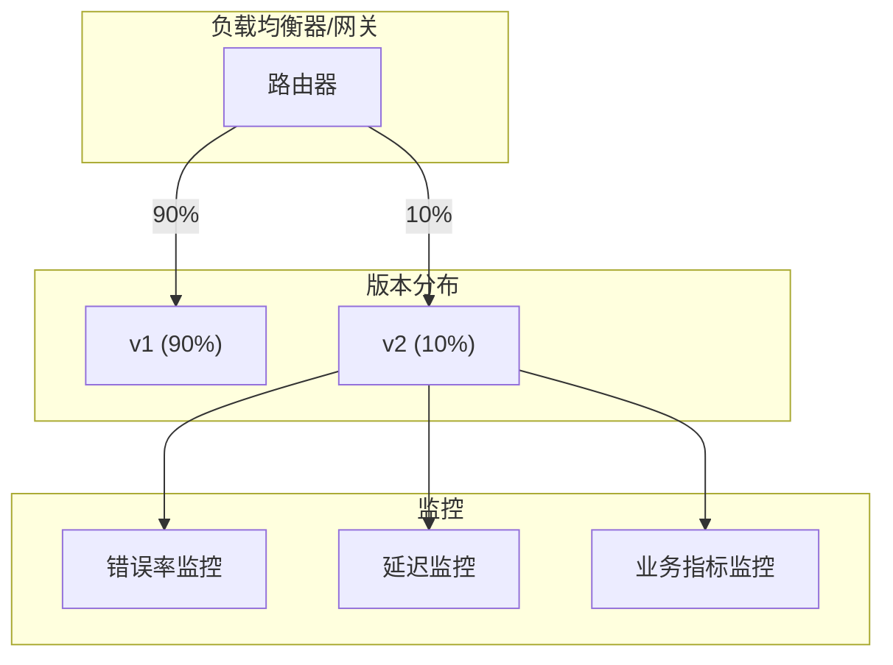
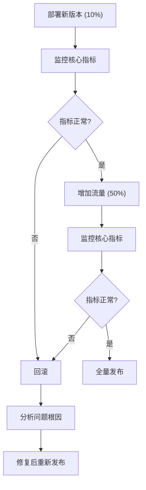

想象一个场景：你刚刚开发完成了一个重大功能升级，涉及 50 万用户的核心业务流程。你的团队测试了 3 周，单元测试覆盖率 90%，集成测试全部通过。

但你能保证它在线上不会出问题吗？

答案是：**不能**。测试环境永远无法完全模拟生产环境——用户行为、并发压力、数据分布、网络状况都有差异。

灰度发布就是来解决这个问题的：**不让所有用户同时使用新版本，而是让新版本先在小范围内运行，观察验证后再逐步扩大范围**。

## 核心概念

### 什么是灰度发布

灰度发布（Canary Release）是一种**渐进式部署策略**，将新版本逐步暴露给一小部分用户，同时保持旧版本服务大部分用户。名字来源于煤矿工人的「金丝雀」——矿工们带着金丝雀下井，如果金丝雀死亡，说明空气中有毒气体，矿工就知道该撤离了。

新版本就像那只「金丝雀」，如果它出问题，只影响小范围用户；如果它表现良好，再逐步扩大。

### 相关概念对比

| 策略 | 说明 | 风险 | 适用场景 |
| --- | --- | --- | --- |
| **蓝绿部署** | 两套环境，通过路由器切换 | 资源浪费 | 需要快速回滚 |
| **滚动发布** | 逐步替换旧版本实例 | 旧版新版共存 | 资源受限 |
| **灰度发布** | 流量逐步切换 | 复杂度高 | 验证新功能 |
| **A/B 测试** | 不同版本服务不同用户 | 数据收集难 | 效果对比 |

## 灰度发布的工作原理

### 流量分割



### 决策流程



## Istio 实现灰度发布

### 基础灰度配置

```yaml title="canary-basic.yaml"
# 定义 DestinationRule
apiVersion: networking.istio.io/v1beta1
kind: DestinationRule
metadata:
  name: recommendation-service
spec:
  host: recommendation-service
  subsets:
    - name: v1
      labels:
        version: v1
    - name: v2
      labels:
        version: v2
---
# 定义 VirtualService（初始 10% 流量到 v2）
apiVersion: networking.istio.io/v1beta1
kind: VirtualService
metadata:
  name: recommendation-service
spec:
  hosts:
    - recommendation-service
  http:
    - route:
        - destination:
            host: recommendation-service
            subset: v1
          weight: 90
        - destination:
            host: recommendation-service
            subset: v2
          weight: 10
```

### 基于 Header 的灰度

```yaml title="canary-header.yaml"
apiVersion: networking.istio.io/v1beta1
kind: VirtualService
metadata:
  name: recommendation-service
spec:
  hosts:
    - recommendation-service
  http:
    # 内部用户（带特定 Header）走 v2
    - match:
        - headers:
            x-user-type:
              exact: internal
      route:
        - destination:
            host: recommendation-service
            subset: v2
    # 其他用户走 v1
    - route:
        - destination:
            host: recommendation-service
            subset: v1
```

### 基于 Cookie 的灰度

```yaml title="canary-cookie.yaml"
apiVersion: networking.istio.io/v1beta1
kind: VirtualService
metadata:
  name: recommendation-service
spec:
  hosts:
    - recommendation-service
  http:
    # Cookie 中带 canary=true 的用户走 v2
    - match:
        - headers:
            cookie:
              regex: "^(.*?;)?(canary=true)(;.*)?$"
      route:
        - destination:
            host: recommendation-service
            subset: v2
    - route:
        - destination:
            host: recommendation-service
            subset: v1
```

### 基于用户 ID 的灰度

```yaml title="canary-userid.yaml"
apiVersion: networking.istio.io/v1beta1
kind: VirtualService
metadata:
  name: recommendation-service
spec:
  hosts:
    - recommendation-service
  http:
    # 用户 ID 哈希后模 100，小于 20（约 20%）的用户走 v2
    - match:
        - headers:
            x-user-id:
              regex: "^[0-9]+$"
      route:
        - destination:
            host: recommendation-service
            subset: v2
          weight: 20
        - destination:
            host: recommendation-service
            subset: v1
          weight: 80
```

## 金丝雀发布进阶

### 渐进式流量增长

```bash
# 阶段 1：10%
kubectl apply -f canary-10.yaml

# 观察 30 分钟，确认无异常
# ...

# 阶段 2：30%
kubectl apply -f canary-30.yaml

# 观察 1 小时
# ...

# 阶段 3：50%
kubectl apply -f canary-50.yaml

# 观察 2 小时
# ...

# 阶段 4：100%
kubectl apply -f canary-100.yaml
```

### 自动灰度（Flagger）

Flagger 是 Istio 官方推荐的渐进式交付工具，可以自动分析指标并决定是否扩大流量：

```yaml title="flagger-hpa.yaml"
apiVersion: flagger.app/v1beta1
kind: MetricTemplate
metadata:
  name: latency
spec:
  provider:
    type: prometheus
    address: http://prometheus:9090
  query: |
    histogram_quantile(0.99,
      sum(rate(istio_request_duration_milliseconds_bucket{
        destination="{{ $target.Name }}",
        namespace="{{ $target.Namespace }}"
      }[5m])) by (le)
    )
---
apiVersion: flagger.app/v1beta1
kind: Canary
metadata:
  name: recommendation-service
spec:
  targetRef:
    apiVersion: apps/v1
    kind: Deployment
    name: recommendation-service
  progressDeadlineSeconds: 300
  strategy:
    type: progressive-delivery
    progressive-delivery:
      analysis:
        interval: 1m
        threshold: 5
        maxWeight: 50
        stepWeight: 10
        metrics:
          - name: latency
            templateRef:
              name: latency
            thresholdRange:
              max: 500
          - name: error-rate
            thresholdRange:
              max: 1
```

:::info
**Flagger 的自动化能力**：
- 自动分析 Prometheus 指标
- 根据错误率和延迟决定是否推进或回滚
- 支持与 Alertmanager 集成
- 支持与 Slack/Teams 集成发送通知
:::

## 监控与验证

### 灰度期间的监控指标

| 指标类型 | 监控内容 | 告警阈值 |
| --- | --- | --- |
| **错误率** | 5xx、4xx 比例 | `>` 1% |
| **延迟** | P99 延迟 | `>` 500ms |
| **可用性** | 成功率 | `<` 99% |
| **业务指标** | 订单转化率等 | 波动 `>` 5% |

### 对比分析查询

```text title="Prometheus 查询"
# v1 版本延迟
histogram_quantile(0.99,
  sum(rate(istio_request_duration_milliseconds_bucket{
    destination="recommendation-service",
    destination_workload_subset="v1"
  }[5m])) by (le)
)

# v2 版本延迟
histogram_quantile(0.99,
  sum(rate(istio_request_duration_milliseconds_bucket{
    destination="recommendation-service",
    destination_workload_subset="v2"
  }[5m])) by (le)
)

# 错误率对比
sum(rate(istio_requests_total{
  destination="recommendation-service",
  destination_workload_subset="v2",
  response_code=~"5.."
}[5m])) /
sum(rate(istio_requests_total{
  destination="recommendation-service",
  destination_workload_subset="v2"
}[5m]))
```

## 灰度发布策略矩阵

| 策略 | 风险 | 速度 | 资源成本 | 适用场景 |
| --- | --- | --- | --- | --- |
| **固定 10%** | 低 | 慢 | 低 | 高风险功能 |
| **时间窗口** | 中 | 中 | 中 | 定时灰度 |
| **用户标签** | 中 | 快 | 低 | 精准灰度 |
| **A/B 测试** | 中 | 中 | 中 | 效果对比 |
| **自动灰度** | 可控 | 自适应 | 中 | 生产级发布 |

## 回滚策略

### 手动回滚

```bash
# 快速回滚到 100% v1
kubectl apply -f - <<EOF
apiVersion: networking.istio.io/v1beta1
kind: VirtualService
metadata:
  name: recommendation-service
spec:
  hosts:
    - recommendation-service
  http:
    - route:
        - destination:
            host: recommendation-service
            subset: v1
          weight: 100
EOF
```

### 自动回滚触发条件

```yaml title="auto-rollback.yaml"
apiVersion: flagger.app/v1beta1
kind: Canary
metadata:
  name: recommendation-service
spec:
  analysis:
    # 连续失败 5 次，触发自动回滚
    threshold: 5
    # 指标检查间隔
    interval: 1m
    # 最大权重（50% 时停止，自动回滚）
    maxWeight: 50
    # 每次增加的权重
    stepWeight: 10
    metrics:
      - name: error-rate
        thresholdRange:
          max: 1
        # 连续 3 次检查失败
        interval: 1m
        count: 3
```

## 常见问题

### 问题一：灰度过程中服务响应不一致

如果用户短时间内访问两次，分别命中 v1 和 v2，可能看到不同的结果。

**解决方案**：
- 使用 Cookie 或 Header 做 sticky session
- 后端数据层保证版本兼容性

### 问题二：灰度期间监控数据不准确

流量分割后，样本量减少，监控数据的统计意义降低。

**解决方案**：
- 适当延长观察时间
- 增加 Prometheus 采样率
- 使用更敏感的健康检查

### 问题三：如何定义「灰度成功」

不同业务对「成功」的定义不同。

**解决方案**：

| 业务类型 | 核心指标 | 通过标准 |
| --- | --- | --- |
| 电商 | 订单转化率 | 转化率 `>=` 基线 95% |
| 支付 | 成功率 | 成功率 `>=` 99.9% |
| 推荐 | 点击率 | 点击率 `>=` 基线 98% |

## 总结

灰度发布是现代软件交付的核心能力，它的核心价值在于：

- **降低风险**：新版本问题只影响小部分用户
- **渐进验证**：用真实流量验证新版本的稳定性
- **快速回滚**：发现问题可以快速恢复
- **数据驱动**：基于监控数据做出发布决策

Istio 提供了强大的流量管理能力，结合 Prometheus 监控和 Flagger 自动化工具，可以构建完整的灰度发布体系。

**延伸思考**：灰度发布解决了「如何逐步上线」的问题，但没有解决「如何确保数据兼容」的问题。如果 v1 和 v2 的数据库 schema 不同怎么办？这涉及到数据库迁移策略，需要在发布前仔细规划。

## 附：完整灰度发布 CheckList

- [ ] 编写完整的回滚方案
- [ ] 配置监控告警
- [ ] 定义灰度成功的标准
- [ ] 确定灰度节奏（10% → 30% → 50% → 100%）
- [ ] 通知相关团队
- [ ] 准备 on-call 值班
