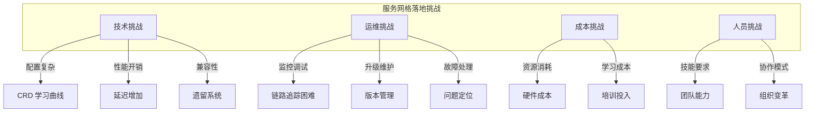
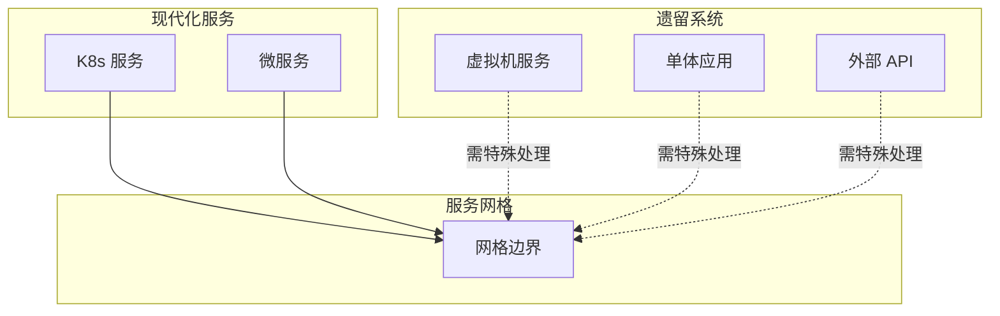
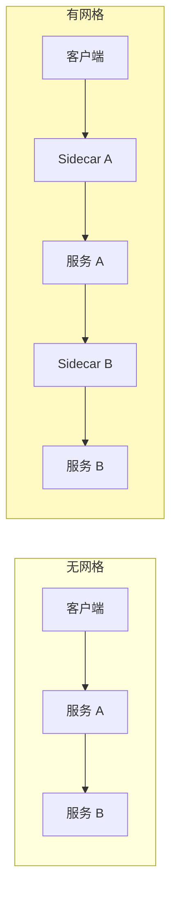
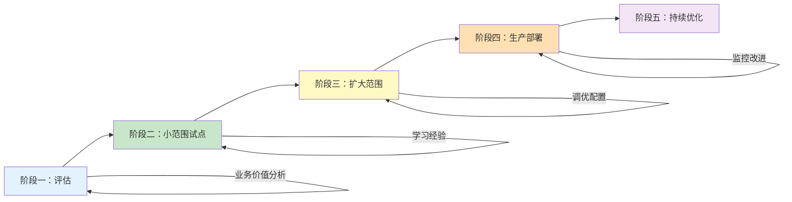

服务网格是强大的技术，但落地过程往往充满挑战。从技术选型到团队能力，从运维流程到成本控制，每个环节都可能成为「坑」。

本文总结服务网格落地的常见挑战，并提供实用的应对策略。

## 挑战总览



## 技术挑战

### 挑战一：CRD 学习曲线陡峭

服务网格引入了大量自定义资源类型（CRD），每个都有复杂的配置选项：

| 网格 | CRD 数量 | 主要类型 |
| --- | --- | --- |
| **Istio** | 30+ | VirtualService, DestinationRule, Gateway |
| **Linkerd** | 10+ | ServiceProfile, TrafficSplit |
| **Consul** | 15+ | ServiceIntentions, ServiceResolver |

**应对策略**：

1. **渐进式学习**：从最简单的配置开始，逐步深入
2. **使用模板**：建立团队的常用配置模板库
3. **文档建设**：记录每种配置的业务含义
4. **借助工具**：使用 Kiali 等可视化工具辅助配置

```yaml title="渐进式配置模板"
# 阶段一：最简配置
apiVersion: networking.istio.io/v1beta1
kind: VirtualService
metadata:
  name: simple-route
spec:
  hosts:
    - service-a
  http:
    - route:
        - destination:
            host: service-b
---
# 阶段二：增加超时重试
# 阶段三：增加流量分割
# 阶段四：增加安全策略
```

### 挑战二：性能开销

Sidecar 代理带来的延迟和资源消耗是必须面对的问题：

| 影响 | 典型值 | 业务影响 |
| --- | --- | --- |
| **延迟增加** | 1-2ms P99 | 对延迟敏感业务不可接受 |
| **内存消耗** | 50-100MB/Pod | 集群资源规划需考虑 |
| **CPU 消耗** | 50-100m/Pod | 高并发场景影响吞吐 |

**应对策略**：

1. **性能测试**：落地前进行充分性能测试
2. **选择合适方案**：对延迟敏感选 Linkerd
3. **优化配置**：调整采样率、连接池参数
4. **预留资源**：集群规划时预留 20% 资源

### 挑战三：遗留系统集成

将遗留服务（可能是非 K8s 部署、不支持 Sidecar）纳入网格是一大挑战：



**应对策略**：

| 遗留系统类型 | 解决方案 |
| --- | --- |
| **VM 服务** | Proxyless gRPC / Consul Connect |
| **单体应用** | 暂时排除 / 迁移中排除 |
| **外部 API** | ServiceEntry / Egress Gateway |
| **非 HTTP 服务** | TCP 透传 / 协议限制 |

```yaml title="遗留系统集成示例"
# 将外部 API 纳入网格管理
apiVersion: networking.istio.io/v1beta1
kind: ServiceEntry
metadata:
  name: external-api
spec:
  hosts:
    - api.external.com
  ports:
    - number: 443
      name: https
      protocol: HTTPS
  location: MESH_EXTERNAL
  resolution: DNS
```

## 运维挑战

### 挑战四：调试复杂性增加

服务网格引入了额外的网络跳点，调试变得更加困难：



**应对策略**：

1. **全链路追踪**：配置 Zipkin/Jaeger 进行分布式追踪
2. **Kiali 可视化**：使用 Kiali 查看服务拓扑
3. **日志关联**：通过 Trace ID 串联日志
4. **调试工具**：熟悉 istioctl / linkerd CLI

```bash
# Istio 调试命令
istioctl proxy-config cluster <pod>
istioctl proxy-config route <pod>
istioctl analyze

# 查看 Sidecar 日志
kubectl logs -n <ns> <pod> -c istio-proxy

# 追踪请求
istioctl x trace <pod>
```

### 挑战五：版本升级困难

服务网格的升级涉及控制平面和数据平面，升级不当可能导致服务中断：

| 升级风险 | 影响 |
| --- | --- |
| **控制平面升级** | 可能影响 xDS 配置下发 |
| **数据平面升级** | Sidecar 版本不一致 |
| **配置格式变更** | CRD 语法可能不兼容 |

**应对策略**：

1. **制定升级流程**：小版本测试 → 大版本灰度
2. **保持向后兼容**：避免使用废弃 API
3. **回滚方案**：准备快速回滚的方案
4. **维护兼容性矩阵**：记录版本兼容性

```bash
# Istio 升级流程
# 1. 查看当前版本
istioctl version

# 2. 升级控制平面
istioctl upgrade -f new-istio-config.yaml

# 3. 滚动升级 Sidecar
kubectl rollout restart deployment -n <ns>

# 4. 验证
istioctl verify-install
istioctl analyze
```

### 挑战六：配置漂移

手动配置的网格资源可能与实际运行状态不一致：

**应对策略**：

1. **GitOps 管理**：所有配置通过 Git 管理
2. **IaC 工具**：使用 Terraform / ArgoCD
3. **配置验证**：使用 analyze 命令检查配置
4. **定期审计**：定期检查配置与资源一致性

```bash
# Istio 配置验证
istioctl analyze --all-namespaces

# Linkerd 配置验证
linkerd check
```

## 成本挑战

### 挑战七：资源成本增加

Sidecar 需要消耗额外的 CPU 和内存：

| 资源 | Linkerd | Istio |
| --- | --- | --- |
| **每 Pod 内存** | ~20MB | ~80MB |
| **每 Pod CPU** | ~20m | ~50m |
| **控制平面** | ~1GB | ~4GB |

**应对策略**：

1. **容量规划**：预留足够的资源
2. **选择方案**：Linkerd 资源消耗更低
3. **优化配置**：调整 Sidecar 资源配置
4. **弹性扩缩**：利用 HPA 自动扩缩控制平面

### 挑战八：运维成本

服务网格增加了运维的复杂性：

| 运维任务 | 复杂度 |
| --- | --- |
| **日常监控** | 监控指标增加 |
| **故障排查** | 链路更长 |
| **版本升级** | 需谨慎规划 |
| **容量规划** | 需考虑 Sidecar |

**应对策略**：

1. **建立 SOP**：制定标准操作流程
2. **自动化工具**：开发自动化运维脚本
3. **监控告警**：建立完善的告警体系
4. **培训团队**：提升团队能力

## 人员挑战

### 挑战九：技能要求

服务网格需要团队具备多方面的技能：

| 技能领域 | 需求程度 |
| --- | --- |
| **Kubernetes** | 必须 |
| **网络知识** | 必须 |
| **服务网格概念** | 必须 |
| **具体产品** | 深入 |
| **混沌工程** | 推荐 |

**应对策略**：

1. **培训计划**：制定分阶段培训计划
2. **外部资源**：利用官方文档、社区资源
3. **POC 项目**：通过小项目积累经验
4. **专家支持**：考虑引入外部专家

### 挑战十：组织协作

服务网格通常需要多个团队协作：

| 团队 | 职责 |
| --- | --- |
| **平台/DevOps** | 负责网格部署和升级 |
| **安全团队** | 负责安全策略配置 |
| **业务开发** | 负责应用级配置 |
| **SRE/运维** | 负责监控和故障处理 |

**应对策略**：

1. **明确职责**：清晰定义各团队职责边界
2. **建立规范**：制定网格使用规范
3. **协作流程**：建立跨团队协作流程
4. **共享知识**：通过 Wiki/文档共享知识

## 落地建议

### 落地检查清单

```markdown
## 服务网格落地检查清单

### 技术评估
- [ ] 评估延迟影响是否可接受
- [ ] 评估资源消耗是否可承担
- [ ] 评估遗留系统集成方案
- [ ] 评估监控和可观测性需求

### 团队准备
- [ ] 完成 Kubernetes 基础培训
- [ ] 完成服务网格概念培训
- [ ] 指定网格负责人
- [ ] 建立故障处理流程

### 运维准备
- [ ] 制定安装升级流程
- [ ] 配置监控告警
- [ ] 建立配置管理规范
- [ ] 准备回滚方案

### 业务准备
- [ ] 评估业务场景是否适合
- [ ] 确定灰度策略
- [ ] 制定回滚策略
- [ ] 通知相关团队
```

### 推荐落地路径



| 阶段 | 目标 | 建议时间 | 建议范围 |
| --- | --- | --- | --- |
| **评估** | 确认技术可行性 | 2-4 周 | 非生产 |
| **试点** | 积累经验 | 4-8 周 | 1-2 个非核心服务 |
| **扩展** | 扩大覆盖 | 8-12 周 | 核心服务 |
| **生产** | 全量部署 | 持续 | 所有服务 |
| **优化** | 持续改进 | 持续 | - |

## 总结

服务网格落地确实充满挑战，但通过合理的规划和执行，这些挑战都是可以克服的：

| 挑战类别 | 主要问题 | 应对策略 |
| --- | --- | --- |
| **技术** | 配置复杂、性能开销 | 渐进学习、选择合适方案 |
| **运维** | 调试困难、升级风险 | 工具支撑、流程规范 |
| **成本** | 资源消耗、运维成本 | 容量规划、自动化 |
| **人员** | 技能要求、协作模式 | 培训提升、职责明确 |

**关键成功因素**：

1. **自上而下的支持**：获得管理层支持
2. **渐进式推进**：不要急于一步到位
3. **充分的测试**：上线前充分验证
4. **快速回滚**：准备好回滚方案
5. **持续学习**：保持对技术的持续学习

**延伸思考**：服务网格的挑战很多都是「幸福的烦恼」——它带来的能力提升远超这些挑战。在决定是否落地时，关键是评估业务价值是否大于投入成本。
