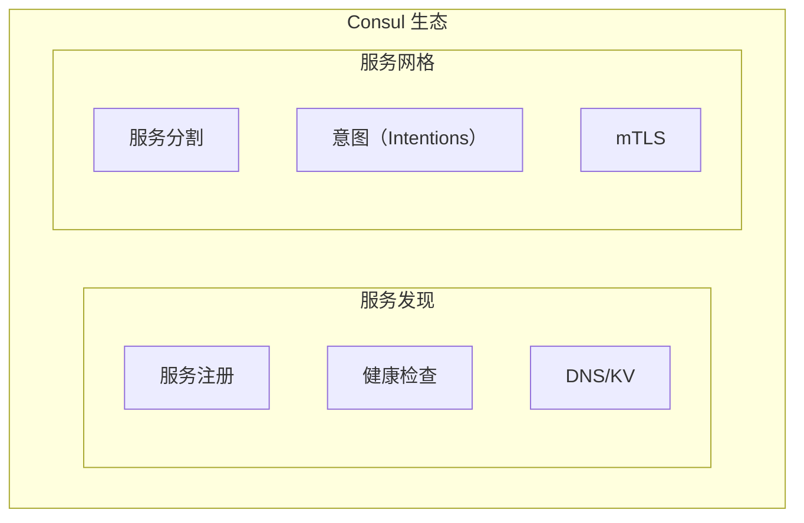
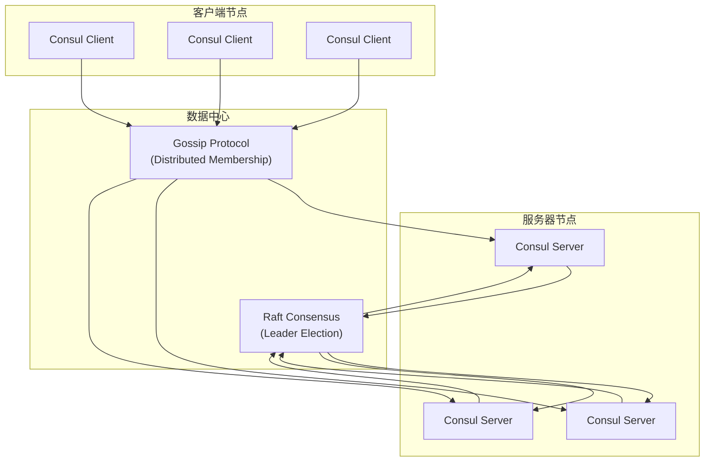
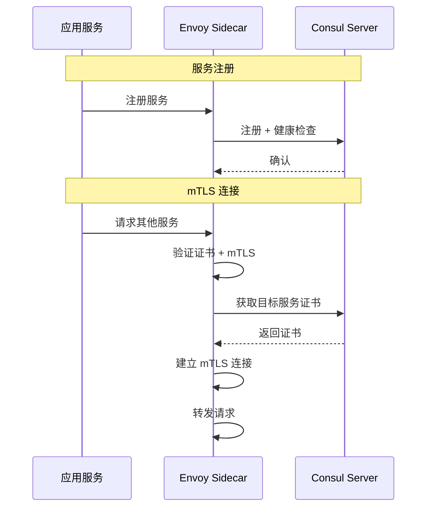
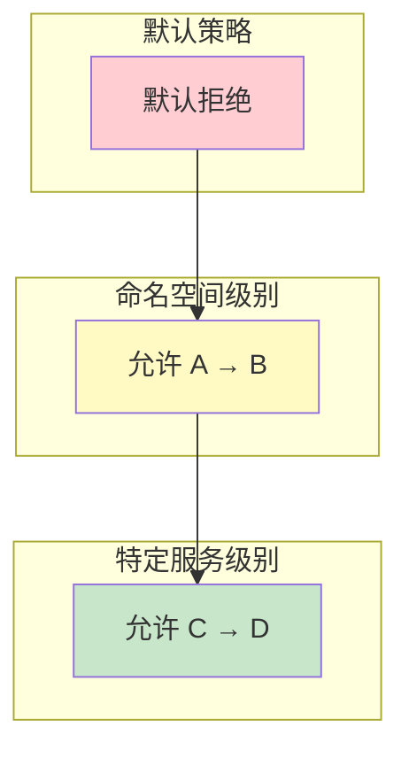

HashiCorp Consul 是服务发现和配置管理的标杆产品。Consul Connect 是 Consul 的服务网格扩展，提供服务间安全通信能力。不同于 Istio 和 Linkerd，Consul Connect 将服务发现与服务网格深度融合，提供了一体化的解决方案。

## Consul 核心概念

### 服务网格 vs 服务发现



### Consul 架构



Consul 使用两种协议：
- **Gossip Protocol**：用于服务发现和成员关系
- **Raft Consensus**：用于配置一致性

## Consul Connect 架构

### 组件概览

| 组件 | 职责 |
| --- | --- |
| **Consul Server** | 存储配置、Raft 共识 |
| **Consul Client** | 服务注册、健康检查 |
| **Sidecar Proxy** | Envoy，数据平面 |
| **Connect CA** | 证书颁发 |

### 数据流



## 核心功能

### 服务注册与发现

```yaml title="service-registration.yaml"
# 服务定义
apiVersion: v1
kind: Service
metadata:
  name: product-service
spec:
  selector:
    app: product-service
  ports:
    - port: 8080
      targetPort: 8080
---
apiVersion: consul.hashicorp.com/v1alpha1
kind: ConsulDefaults
metadata:
  name: global
spec:
  enableAutoMTVLS: true
```

### 服务分割（Service Segmentation）

Consul Connect 通过 **Intentions（意图）** 控制服务间的访问权限：

```yaml title="intention-allow.yaml"
apiVersion: consul.hashicorp.com/v1alpha1
kind: ServiceIntentions
metadata:
  name: product-service
spec:
  destination:
    name: product-service
  sources:
    - name: api-gateway
      action: allow
```

```yaml title="intention-deny.yaml"
apiVersion: consul.hashicorp.com/v1alpha1
kind: ServiceIntentions
metadata:
  name: payment-service
spec:
  destination:
    name: payment-service
  sources:
    - name: "*"
      action: deny
```

### 意图层级



## Envoy 配置

### 自动配置

Consul Connect 自动生成 Envoy 配置：

```bash
# 获取 Envoy 配置
consul connect envoy -sidecar-for=product-service
```

生成的配置包括：

- **监听器**：15006（入站）、15001（出站）
- **集群**：上游服务集群
- **路由**：基于服务的路由规则
- **端点**：健康的上游实例

### 上游/下游配置

```yaml title="upstream-config.yaml"
# 服务配置示例
apiVersion: v1
kind: Service
metadata:
  annotations:
    # 定义上游服务
    consul.hashicorp.com/compose: |
      upstreams:
        - destination_name: database
          local_bind_port: 5432
        - destination_name: cache
          local_bind_port: 6379
spec:
  selector:
    app: app-service
```

### 健康检查

```yaml title="health-check.yaml"
apiVersion: consul.hashicorp.com/v1alpha1
kind: ServiceHealthCheck
metadata:
  name: product-health
spec:
  check:
    name: "HTTP Health Check"
    http: "http://localhost:8080/health"
    interval: 10s
    timeout: 5s
    deregister_critical_service_after: 30s
```

## 流量管理

### 负载均衡

Consul Connect 支持多种负载均衡策略：

| 策略 | 说明 |
| --- | --- |
| **Random** | 随机选择 |
| **Round Robin** | 轮询 |
| **Least Request** | 最少连接 |
| **一致性哈希** | 会话保持 |

```yaml title="lb-config.yaml"
apiVersion: consul.hashicorp.com/v1alpha1
kind: ServiceResolver
metadata:
  name: product-service
spec:
  loadBalancer:
    policy: least_request
    ringHash:
      minRingSeconds: 60
      maxRingSeconds: 600
```

### 流量分割

```yaml title="traffic-split.yaml"
apiVersion: consul.hashicorp.com/v1alpha1
kind: ServiceSplitter
metadata:
  name: product-service
spec:
  splits:
    - weight: 90
      service: product-service-v1
    - weight: 10
      service: product-service-v2
```

### 重试配置

```yaml title="retry-config.yaml"
apiVersion: consul.hashicorp.com/v1alpha1
kind: ServiceResolver
metadata:
  name: product-service
spec:
  connect:
    timeout: 5s
  retry:
    attempts: 3
    interval: 1s
    on:
      - 5xx
      - reset
      - cancelled
```

## 安全配置

### mTLS 自动配置

Consul Connect 默认启用 mTLS：

```bash
# 查看证书
consul connect ca roots

# 查看服务证书
consul connect proxy peek -service product-service
```

### 意图配置

```yaml title="l7-intention.yaml"
apiVersion: consul.hashicorp.com/v1alpha1
kind: ServiceIntentions
metadata:
  name: api-to-backend
spec:
  destination:
    name: backend-service
  sources:
    - name: api-gateway
      permissions:
        - action: allow
          http:
            pathExact: /api/health
        - action: allow
          http:
            pathPrefix: /api/v1/
            methods:
              - GET
              - POST
```

### TLS 配置

```yaml title="tls-config.yaml"
apiVersion: consul.hashicorp.com/v1alpha1
kind: ProxyDefaults
metadata:
  name: global
spec:
  config:
    envoy_public_listener_json: |
      {
        "listener_type": "static",
        "transport_socket": {
          "type": "tls",
          "config": {
            "alpn_protocols": ["h2", "http/1.1"]
          }
        }
      }
```

## 安装与配置

### 安装 Consul

```bash
# 安装 Consul
brew install consul

# 启动开发模式
consul agent -dev

# 或使用 Docker
docker run -d --name=consul consul:1.15
```

### 启用 Connect

```bash
# 启动带 Connect 的 Consul
consul agent -dev -enable-script-checks -bind 0.0.0.0

# 注册服务并启用 Connect
cat <<EOF | consul services register -
{
  "Name": "product-service",
  "Port": 8080,
  "Connect": {
    "SidecarService": {}
  }
}
EOF
```

### 启动 Sidecar Proxy

```bash
# 启动 Envoy Sidecar
consul connect envoy -sidecar-for=product-service &

# 或使用 Kubernetes
kubectl apply -f product-sidecar.yaml
```

## Kubernetes 集成

### Consul on Kubernetes

```yaml title="consul-k8s.yaml"
apiVersion: consul.hashicorp.com/v1alpha1
kind: ConsulConfig
metadata:
  name: global
spec:
  enableAutoMTVLS: true
  enableCentralConfig: true
  server: false  # 连接到外部 Consul
```

### 安装 consul-k8s

```bash
# 添加 Helm 仓库
helm repo add hashicorp https://helm.releases.hashicorp.com
helm repo update

# 安装 consul-k8s
helm install consul hashicorp/consul \
  --set global.name=consul \
  --set global.datacenter=dc1 \
  --set server.replicas=3 \
  --set connectInject.enabled=true \
  --set connectInject.default=true
```

### 自动 Sidecar 注入

```yaml title="auto-inject.yaml"
# 命名空间级别启用
apiVersion: v1
kind: Namespace
metadata:
  name: production
  annotations:
    consul.hashicorp.com/connect-inject: "true"
```

## 优缺点分析

### 优势

| 优势 | 说明 |
| --- | --- |
| **一体化** | 服务发现 + 服务网格 |
| **多数据中心** | 原生支持跨数据中心 |
| **服务KV** | 配置管理一体化 |
| **轻量** | 资源消耗适中 |
| **灵活性** | 可以在非 K8s 环境使用 |

### 劣势

| 劣势 | 说明 |
| --- | --- |
| **功能相对较少** | 不如 Istio 功能丰富 |
| **配置复杂** | 需要熟悉 Consul 配置 |
| **社区较小** | 生态不如 Istio |
| **Envoy 配置** | 自动生成但可控性低 |

## 适用场景

| 场景 | 推荐度 | 说明 |
| --- | --- | --- |
| **已有 Consul 生态** | ⭐⭐⭐⭐⭐ | 自然扩展 |
| **多数据中心** | ⭐⭐⭐⭐⭐ | 跨数据中心支持好 |
| **非 K8s 环境** | ⭐⭐⭐⭐ | 不依赖 K8s |
| **简单服务网格需求** | ⭐⭐⭐⭐ | 配置相对简单 |
| **企业级复杂需求** | ⭐⭐ | 功能不如 Istio |

## 总结

Consul Connect 提供了一个将服务发现与服务网格融合的方案：

| 特性 | Consul Connect |
| --- | --- |
| **服务发现** | ✓ 原生支持 |
| **服务网格** | ✓ Envoy Sidecar |
| **mTLS** | ✓ 自动 |
| **意图控制** | ✓ L4/L7 |
| **多数据中心** | ✓ 原生支持 |
| **K8s 支持** | ✓ consul-k8s |

**适用场景**：如果你的基础设施已经使用 Consul，Consul Connect 是一个无缝扩展的选择；如果需要构建多数据中心服务网格，Consul Connect 也是值得考虑的方案。

**延伸思考**：Consul Connect 将服务发现和服务网格结合的思路，代表了服务网格发展的一个方向。未来可能出现更多「服务网格 + 服务发现」一体化的产品。
