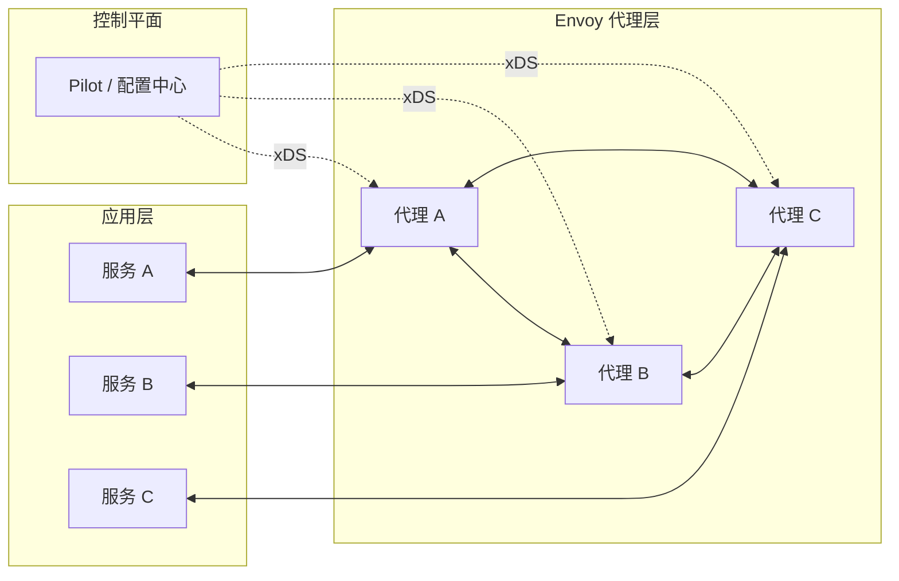
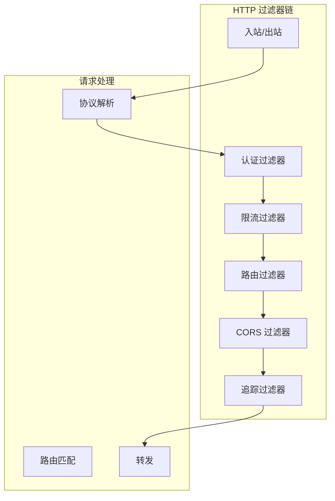
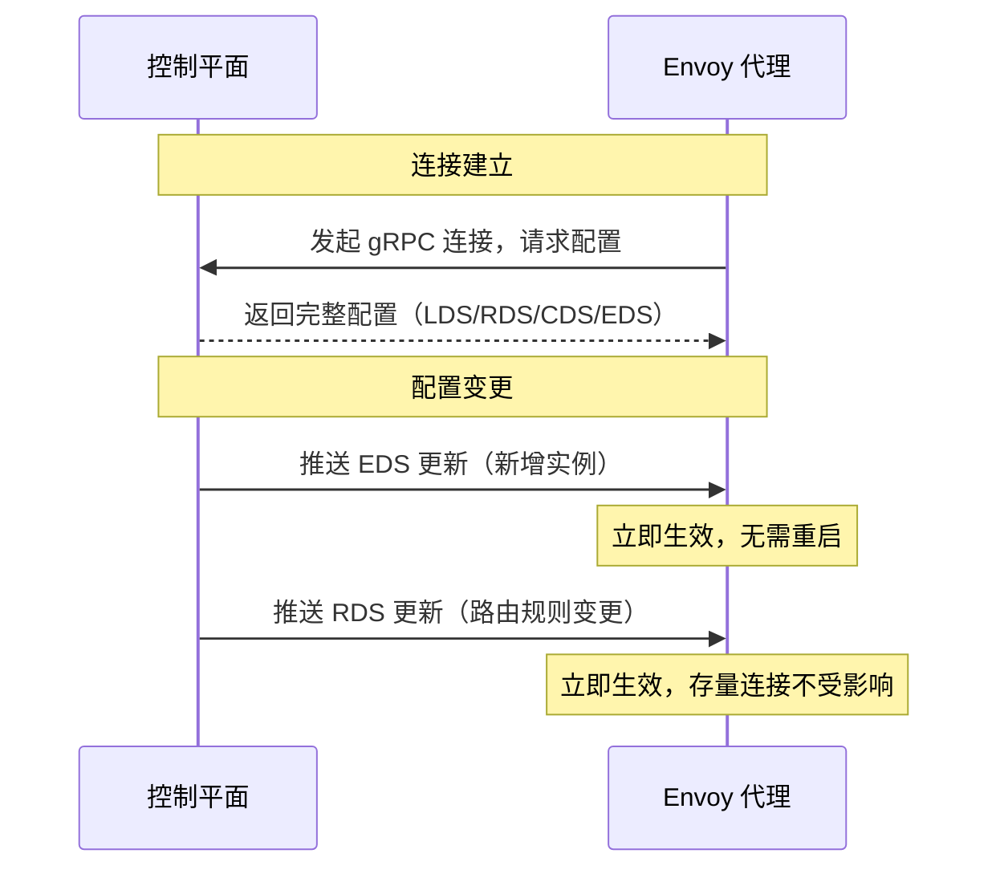

当 Airbnb 的工程师在 2016 年决定从 Nginx + Hystrix 的组合迁移到服务网格时，他们面临一个选择：自己实现边车代理，还是选择一个现成的高性能代理？

他们选择了后者，这个选择后来成为了 Envoy。Airbnb 把 Envoy 捐赠给了 Lyft，后来 Lyft 的工程师们把它发展成了今天云原生时代最重要的代理之一。

Envoy 之所以被广泛采用，是因为它在**高性能**和**可配置性**之间找到了绝佳的平衡点。

## Envoy 的设计哲学

Envoy 的设计围绕三个核心目标：

1. **应用透明**：不需要修改应用代码，所有流量治理功能都在代理层实现
2. **动态配置**：配置可以从控制平面实时推送，无需重启代理
3. **可观察性**：内置丰富的指标、日志、追踪接口



## Envoy 核心概念

Envoy 的配置由几个核心概念组成：**Listener**（监听器）、**Route**（路由）、**Cluster**（集群）、**Endpoint**（端点）。

### Listener：监听入口

Listener 定义了 Envoy 监听的端口和如何处理入站流量：

```yaml title="Listener 配置示例"
static_resources:
  listeners:
  - name: http_listener
    address:
      socket_address:
        address: 0.0.0.0
        port_value: 8080
    filter_chains:
    - filters:
      - name: envoy.filters.network.http_connection_manager
        typed_config:
          "@type": type.googleapis.com/envoy.extensions.filters.network.http_connection_manager.v3.HttpConnectionManager
          stat_prefix: ingress_http
          route_config:
            name: local_route
            virtual_hosts:
            - name: backend
              domains:
              - "*"
              routes:
              - match:
                  prefix: "/api/"
                route:
                  cluster: backend_cluster
```

### Cluster：上游服务定义

Cluster 定义了一组提供相同功能的上游服务实例：

```yaml title="Cluster 配置示例"
static_resources:
  clusters:
  - name: backend_cluster
    type: STRICT_DNS
    lb_policy: LEAST_REQUEST
    circuit_breakers:
      thresholds:
      - max_connections: 100
        max_pending_requests: 100
        max_requests: 100
        max_retries: 3
    health_checks:
    - timeout: 5s
      interval: 10s
      unhealthy_threshold: 3
      healthy_threshold: 2
      http_health_check:
        path: "/health"
    load_assignment:
      cluster_name: backend_cluster
      endpoints:
      - lb_endpoints:
        - endpoint:
            address:
              socket_address:
                address: backend-svc.default.svc.cluster.local
                port_value: 8080
```

### Route：路由规则

Route 定义了如何把请求路由到目标集群：

```yaml title="Route 配置示例"
route_config:
  name: service_route
  virtual_hosts:
  - name: service_vhost
    domains:
    - "service.example.com"
    routes:
    # 基于前缀匹配
    - match:
        prefix: "/users"
      route:
        cluster: user_service
        timeout: 5s
        retry_policy:
          retry_on: "5xx,reset,connect-failure"
          num_retries: 3
    # 基于 header 匹配（灰度发布）
    - match:
        prefix: "/api"
        headers:
        - name: "X-Canary"
          exact_match: "true"
      route:
        cluster: user_service_canary
        weight: 30
    # 重定向
    - match:
        prefix: "/old-path"
      redirect:
        path_redirect: "/new-path"
        response_code: MOVED_PERMANENTLY
```

## L7 过滤器链

Envoy 的核心能力之一是**L7 过滤器链（Filter Chain）**。过滤器链允许在请求处理的不同阶段插入自定义逻辑。



### 常用过滤器

| 过滤器 | 作用 | 配置场景 |
| --- | --- | --- |
| `http_connection_manager` | HTTP/1.1、HTTP/2、gRPC 解析 | 几乎所有场景 |
| `envoy.filters.http.router` | 路由转发 | 路由功能核心 |
| `envoy.filters.http.grpc_stats` | gRPC 统计 | gRPC 服务监控 |
| `envoy.filters.http.oauth2` | OAuth 2.0 认证 | API 安全 |
| `envoy.filters.http.ext_authz` | 外部授权 | 集成 Auth 服务 |
| `envoy.filters.http.local_rate_limit` | 本地限流 | 单节点限流 |
| `envoy.filters.http.global_rate_limit` | 全局限流 | 分布式限流 |

### 过滤器配置示例

```yaml title="外部授权过滤器"
- name: envoy.filters.http.ext_authz
  typed_config:
    "@type": type.googleapis.com/envoy.extensions.filters.http.ext_authz.v3.ExtAuthz
    transport:
      api_version: V3
      grpc_service:
        google_grpc:
          target_uri: auth-service:50051
          stat_prefix: ext_authz
    with_request_body:
      max_request_bytes: 8192
      allow_partial_message: true
    failure_mode_allow: false
```

```yaml title="本地限流过滤器"
- name: envoy.filters.http.local_rate_limit
  typed_config:
    "@type": type.googleapis.com/envoy.extensions.filters.http.local_ratelimit.v3.LocalRateLimit
    stat_prefix: http_local_rate_limiter
    token_bucket:
      max_tokens: 1000
      tokens_per_fill:
        replenishes_on_second: 100
      fill_interval: 1s
    filter_enabled:
      runtime_key: local_rate_limit_enabled
      default_value:
        numerator: 100
        denominator: HUNDRED
```

## 熔断器与限流

Envoy 内置了熔断器（Circuit Breaker）和限流（Rate Limiting）功能，无需依赖外部库。

### 熔断器配置

```yaml title="熔断器配置"
circuit_breakers:
  thresholds:
  # 普通熔断配置
  - max_connections: 100           # 最大连接数
    max_pending_requests: 100       # 最大等待请求数
    max_requests: 100               # 最大并发请求数
    max_retries: 3                  # 最大重试次数
    track_remaining: true
  # 高优先级熔断配置（可选）
  - priority: HIGH
    max_connections: 200
    max_pending_requests: 200
```

熔断器的工作原理：

1. **连接熔断**：当上游连接数达到 `max_connections`，新请求返回 503
2. **等待熔断**：当等待队列达到 `max_pending_requests`，新请求返回 503
3. **请求熔断**：当并发请求达到 `max_requests`，新请求返回 503
4. **异常值剔除（Outlier Detection）**：连续失败的实例自动移出负载均衡池

```yaml title="异常值剔除配置"
cluster:
  name: backend_cluster
  outlier_detection:
    consecutive5xx: 5              # 连续 5 个 5xx，移出集群
    interval: 30s                  # 检测间隔
    base_ejection_time: 30s         # 移出最少时间
    max_ejection_percent: 50       # 最多移出 50% 实例
    enforce_host_health_check: true # 被健康检查通过的实例不会被移出
```

### 限流配置

```yaml title="全局限流（Redis 驱动）"
- name: envoy.filters.http.global_rate_limit
  typed_config:
    "@type": type.googleapis.com/envoy.extensions.filters.http.ratelimit.v3.RateLimitService
    failure_mode_deny: true
    rate_limit_service:
      grpc_service:
        envoy_grpc:
          cluster_name: ratelimit_cluster
      transport_api_version: V3
```

```yaml title="请求映射配置"
- name: envoy.filters.http.local_rate_limit
  typed_config:
    "@type": type.googleapis.com/envoy.extensions.filters.http.local_ratelimit.v3.LocalRateLimit
    stat_prefix: http_local_rate_limiter
    token_bucket:
      max_tokens: 100
      tokens_per_fill:
        replenishes_on_second: 10
      fill_interval: 1s
    descriptors:
    - entries:
      - key: remote_address
        value: "{downstream_remote_address}"
      - key: header_match
        value: "{request_header:x-api-key}"
```

## 热配置更新

Envoy 最强大的特性之一是**热配置更新（Hot Reload）**：可以在不中断连接的情况下更新配置。

### xDS 动态配置

通过 xDS 协议，Envoy 可以实时接收配置更新：



### 热更新的优势

| 场景 | 冷更新（重启） | 热更新（xDS） |
| --- | --- | --- |
| 路由规则变更 | 需要重启，流量中断 | 实时生效，连接保持 |
| 新增实例 | 需要重启 | 自动加入负载均衡 |
| 移除故障实例 | 需要重启 | 自动移出 |
| 配置回滚 | 需要重启 | 支持版本回滚 |

### 热更新配置示例

```json title="EDS 增量更新"
{
  "version_info": "2024-01-01T00:01:00Z",
  "type_url": "type.googleapis.com/envoy.config.endpoint.v3.ClusterLoadAssignment",
  "resources": [{
    "@type": "type.googleapis.com/envoy.config.endpoint.v3.ClusterLoadAssignment",
    "cluster_name": "backend_cluster",
    "endpoints": [{
      "lb_endpoints": [
        {
          "endpoint": {
            "address": {
              "socket_address": {
                "address": "10.0.0.3",
                "port_value": 8080
              }
            }
          }
        }
      ]
    }]
  }]
}
```

:::warning
**热更新不是万能的**：某些配置变更仍然需要重启才能生效，比如 `worker_processes`、`listener` 的端口变更等。xDS 热更新主要针对路由、集群、端点等动态资源。
:::

## 性能特性

Envoy 在设计时就把性能放在首位：

### 低延迟

- **单进程多线程模型**：避免进程间通信开销
- **连接池复用**：减少 TCP 连接建立开销
- **无锁队列**：减少线程竞争

### 低资源消耗

| 指标 | Envoy | Nginx | HAProxy |
| --- | --- | --- | --- |
| 内存（10K 连接） | ~50MB | ~100MB | ~80MB |
| CPU（满负载） | 较低 | 中等 | 较低 |
| 吞吐量 | 极高 | 高 | 极高 |

### 零拷贝（Zero Copy）

Envoy 支持 `sendfile`，减少数据在内核态和用户态之间的拷贝：

```yaml title="启用零拷贝"
static_resources:
  listeners:
  - name: http_listener
    address:
      socket_address:
        address: 0.0.0.0
        port_value: 8080
    # 启用内核级零拷贝
    freebind: true
    transparent: true
```

## Envoy 的权衡矩阵

| 维度 | Envoy | Linkerd（原生） | Nginx Sidecar |
| --- | --- | --- | --- |
| **性能** | 极高 | 高 | 高 |
| **内存占用** | 中等（50~100MB） | 较低 | 较低 |
| **配置复杂度** | 高（YAML/JSON） | 低（声明式） | 中等 |
| **xDS 支持** | 原生 | 原生 | 不支持 |
| **社区生态** | 活跃（大量用户） | 活跃 | 活跃 |
| **学习曲线** | 陡峭 | 平缓 | 中等 |

## 常见问题与反模式

### 反模式一：配置过于复杂

Envoy 的配置非常灵活，但也很容易写出过于复杂的配置。

**错误示例**：一个 Listener 里有 50+ 过滤器，配置层级嵌套 10 层以上。

**正确做法**：拆分配置，使用 `<runtime>` 和 `<layered_runtime>` 简化配置结构。

### 反模式二：忽略健康检查配置

不配置健康检查，熔断器无法正确工作。

**正确做法**：为每个 Cluster 配置合理的健康检查策略：

```yaml
health_checks:
- timeout: 5s
  interval: 10s
  unhealthy_threshold: 3
  healthy_threshold: 2
  http_health_check:
    path: "/health"
    expected_status: 200
```

### 反模式三：限流阈值设置不当

限流阈值太高，起不到保护作用；太低，影响正常请求。

**正确做法**：根据压测数据和业务峰值设置阈值，并留有一定的缓冲空间（如 1.2x 峰值）。

## Envoy 配置最佳实践

### 使用统一定义

```yaml title="共享定义示例"
- name: common_lib
  type: STATIC
  connect_timeout: 5s
  circuit_breakers:
    thresholds:
    - max_connections: 100
      max_pending_requests: 100

clusters:
- name: user_service
  inherit_load_balancer: common_lib
  type: STRICT_DNS
  load_assignment:
    cluster_name: user_service
    endpoints:
    - lb_endpoints:
      - endpoint:
          address:
            socket_address:
              address: user-service
              port_value: 8080
```

### 合理的超时配置

```yaml title="超时配置"
route:
  timeout: 5s
  retry_policy:
    retry_on: "5xx,reset,connect-failure"
    per_try_timeout: 2s
    num_retries: 3
  idle_timeout: 30s
```

### 完善的监控配置

```yaml title="监控配置"
admin:
  address:
    socket_address:
      address: 0.0.0.0
      port_value: 9901

  # 启用监控端点
  stats_config:
    use_all_default_tags: true

  # 监控路径
  route_config:
    virtual_hosts:
    - name: admin
      domains:
      - "*"
      routes:
      - match:
          prefix: "/stats"
        route:
          cluster: admin_cluster
```

## 术语表

| 术语 | 英文 | 解释 |
| --- | --- | --- |
| Listener | Listener | Envoy 监听的端口抽象 |
| Cluster | Cluster | 上游服务实例的逻辑分组 |
| Endpoint | Endpoint | 具体的服务实例地址 |
| Route | Route | 请求路由规则 |
| Filter Chain | Filter Chain | 过滤器处理链 |
| Circuit Breaker | Circuit Breaker | 熔断器，防止故障传播 |
| Outlier Detection | Outlier Detection | 异常值剔除，自动隔离故障实例 |
| Hot Reload | Hot Reload | 热更新，无需重启生效 |
| xDS | xDS | 服务发现和配置协议族 |

## 延伸思考

Envoy 的设计理念对整个服务网格生态产生了深远影响。它的核心贡献不只是「做了一个好代理」，而是**定义了边车代理应该如何工作**：

- **控制平面和数据平面分离**：通过 xDS 协议实现
- **运行时动态配置**：无需重启代理
- **丰富的可观测性**：内置指标、追踪、日志接口
- **L7 过滤器架构**��灵活扩展处理逻辑

今天当你使用 Istio、Linkerd 或其他服务网格时，它们的数据平面大概率都是 Envoy（或基于 Envoy）。理解 Envoy 的工作原理，可以帮助你在遇到问题时快速定位、在选择服务网格时做出更明智的决策。

下一步可以思考：**如果 Envoy 是边车代理，那控制平面如何管理成百上千个 Envoy 实例？** 这涉及到配置分发、版本管理、故障处理等更复杂的问题。
