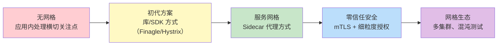

# 服务网格

想象一个场景：你的微服务架构有 50 个服务，每个服务都需要处理限流、熔断、重试、超时、mTLS 证书轮换、流量监控、链路追踪……这些横切关注点（Cross-Cutting Concerns）如果都塞进业务代码，会发生什么？

答案是：**业务代码和基础设施代码深度耦合，每个服务的团队都要成为「全能型」工程师，每个改动都要同步到 50 个仓库**。

服务网格（Service Mesh）就是为了解决这个问题而生的。它将这些横切关注点**下沉到基础设施层**，业务服务只需要专注于业务逻辑，流量治理、安全、可观测性全部交给网格处理。

## 模块结构

本模块按主题分为 5 个子模块：

| 子模块 | 核心问题 | 典型场景 |
| --- | --- | --- |
| **基础概念** | 什么是服务网格、它解决什么问题、与 API 网关的区别 | 技术选型评估 |
| **核心模式** | Sidecar 边车模式、数据平面/控制平面架构 | 架构设计 |
| **技术组件** | Envoy 代理、MASM/xDS 协议 | 深度理解原理 |
| **主流实现** | Istio、Linkerd、Consul Connect | 生产落地 |
| **工程实践** | 安装配置、流量管理、安全、可观测性、迁移 | 落地实施 |

### 工程实践子模块

工程实践子模块是服务网格落地的核心指南，包含以下关键内容：

| 文档 | 核心内容 |
| --- | --- |
| [性能开销分析](/cloud-native/service-mesh/performance-overhead) | Sidecar 延迟、CPU/内存消耗、mTLS 优化策略 |
| [落地挑战](/cloud-native/service-mesh/challenges) | 学习曲线、命名空间隔离、调试困难、升级风险 |
| [多集群部署](/cloud-native/service-mesh/multi-cluster) | 集群联邦、跨集群通信、全局流量管理 |
| [K8s 集成](/cloud-native/service-mesh/k8s-integration) | Ingress/Gateway API、CRD 扩展、原生功能配合 |
| [迁移实战](/cloud-native/service-mesh/migration) | 渐进式迁移、流量切分、监控与回滚 |

## 演进路径

**服务网格不是银弹**：它解决了横切关注点的问题，但引入了新的复杂性——额外的资源消耗、运维负担、学习曲线。在决定是否引入服务网格之前，先问自己：业务真的需要这些能力吗？

## 核心技术选型

| 维度 | Istio | Linkerd | Consul Connect |
| --- | --- | --- | --- |
| **设计理念** | 功能全面、可定制 | 简单、安全、高性能 | 轻量、多面手 |
| **控制平面** | Go + Envoy | Rust + Linkerd2-proxy | Go + Envoy |
| **数据平面** | Envoy | 自研 Rust 代理 | Envoy |
| **学习曲线** | 陡峭 | 平缓 | 中等 |
| **生产成熟度** | 高（Google/IBM 主推） | 高（Buoyant 主推） | 中（HashiCorp 主推） |
| **适合场景** | 大型企业、复杂治理需求 | 追求简单和安全 | 已有 Consul 生态 |

## 学习建议

1. **从问题出发**：服务网格解决了什么问题？这个问题在你的项目中存在吗？
2. **理解核心模式**：Sidecar 边车模式是理解服务网格的基础，先搞懂它
3. **对比选型**：Istio vs Linkerd vs Consul，没有最好的，只有最适合的
4. **动手实践**：光看文档不够，建议搭建本地集群实际部署一个服务网格
5. **评估代价**：服务网格有性能开销和运维成本，落地前做好容量评估

## 与其他模块的关系

服务网格不是孤立的技术，它位于云原生技术栈的核心位置：

- **Kubernetes**：服务网格通常以 Kubernetes 为宿主，利用 K8s 的 Service、Endpoints、Pod 等资源
- **可观测性**：网格提供开箱即用的 Metrics、Logging、Tracing，与 Prometheus/Jaeger 集成
- **零信任安全**：mTLS 双向认证、细粒度授权策略，是零信任架构的关键组件
- **CI/CD**：配合金丝雀发布、流量镜像等能力，实现安全的持续部署

> 服务网格的本质，是把「流量治理」这个职责从应用层剥离出来，交给专门的基础设施层处理。这个思路本身，比任何具体的实现都重要。

准备好开始了吗？让我们从服务网格的定义开始，理解它为什么在云原生时代变得如此重要。
