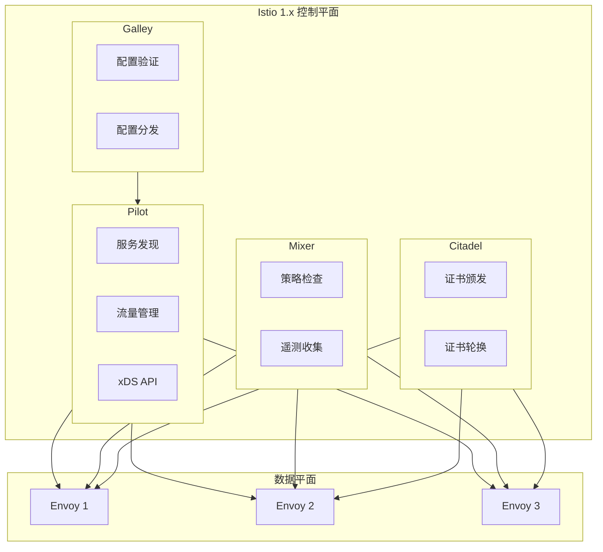
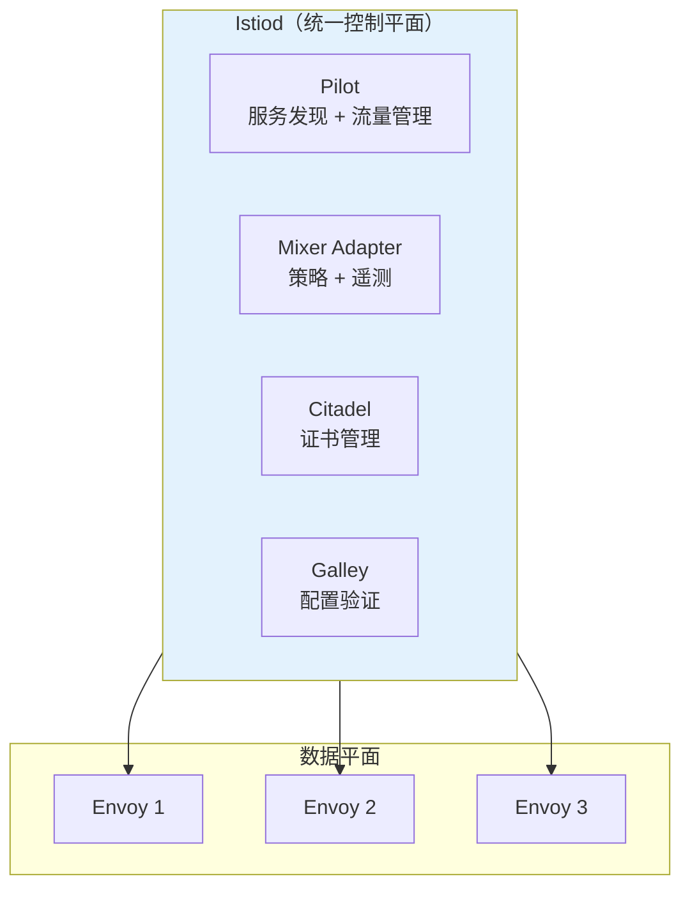
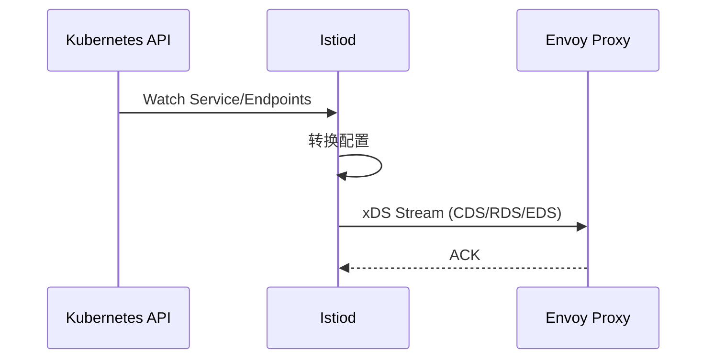
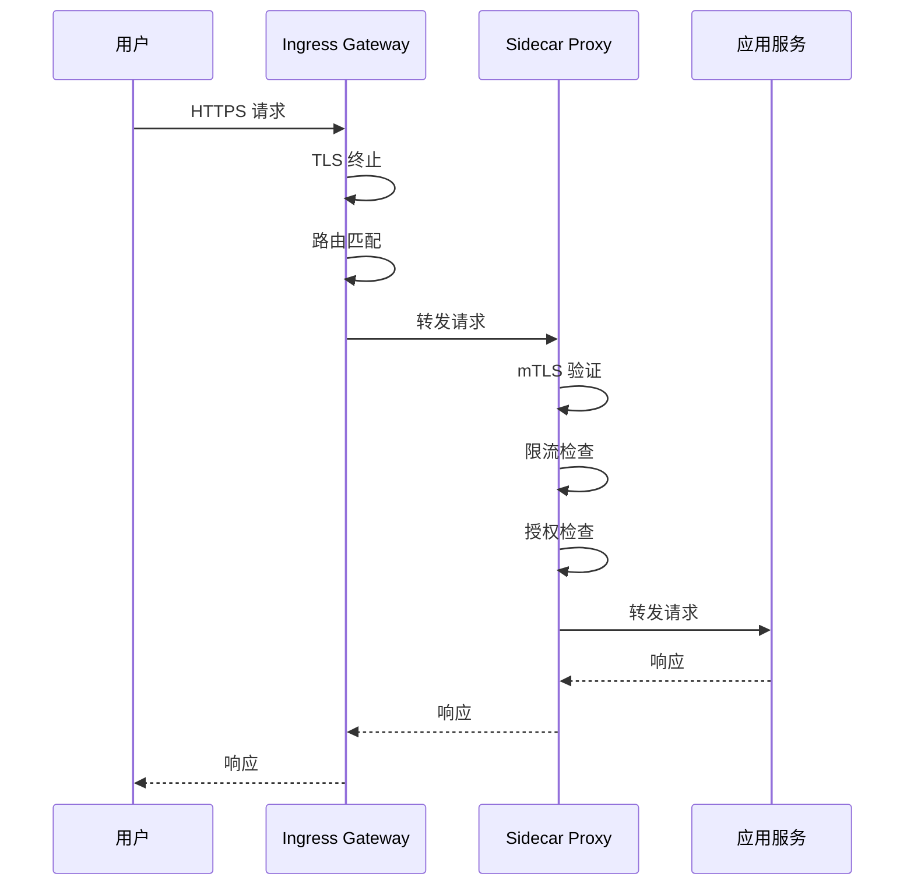
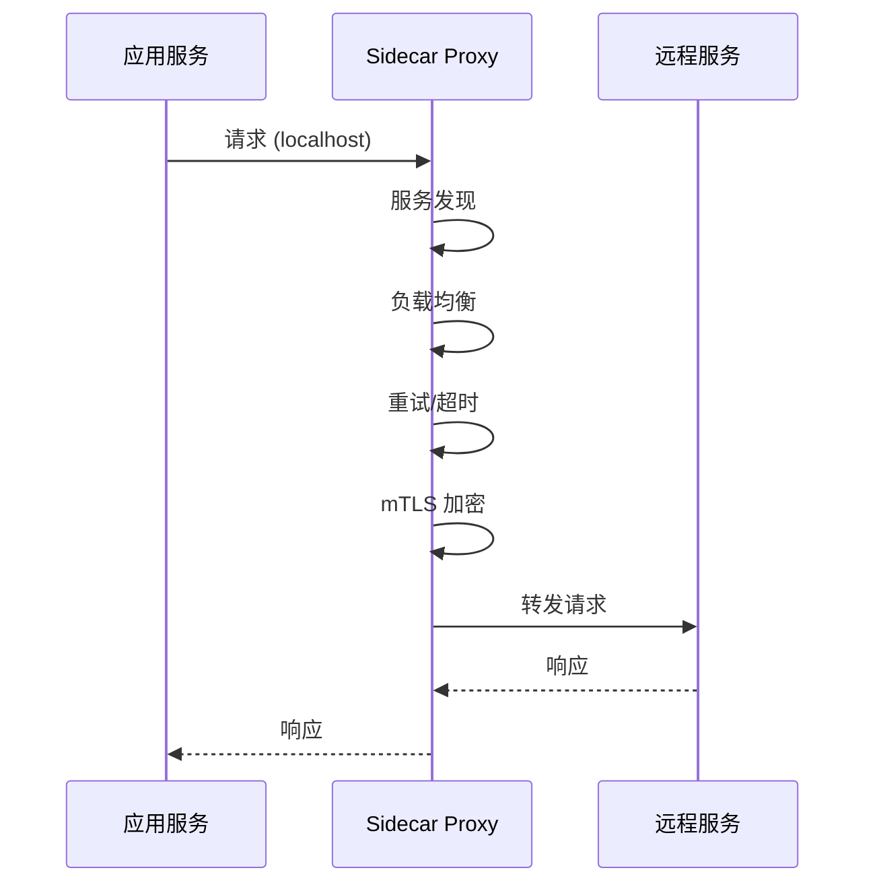
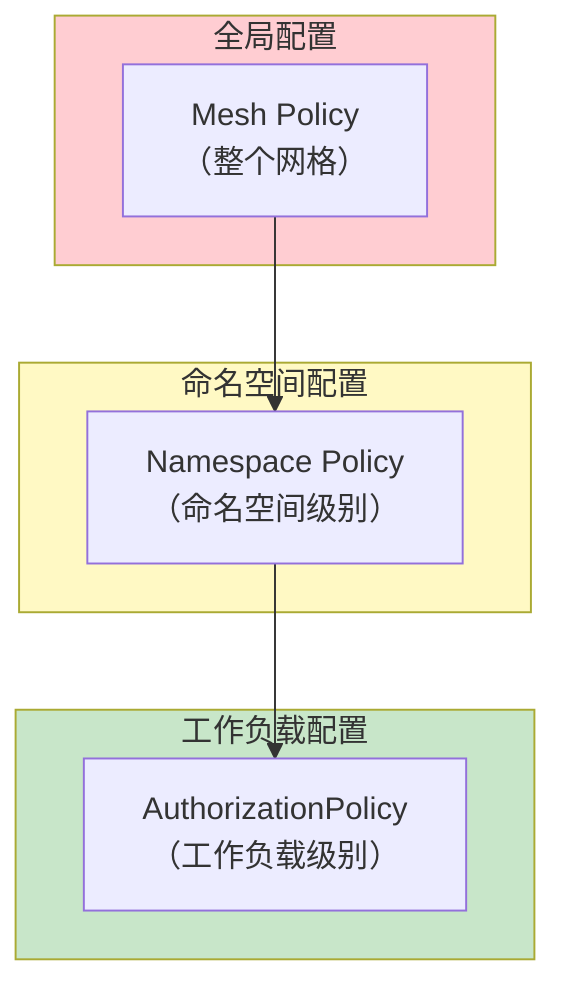

2017 年，Google、IBM 和 Lyft 联合发布了 Istio，目标是成为云原生服务网格的事实标准。七年后，Istio 已成为生产环境中最广泛使用的服务网格之一。

但 Istio 的架构相当复杂——控制平面有多个组件，数据平面与控制平面通过 xDS 协议通信，各种 CRD 让人眼花缭乱。本文将带你深入理解 Istio 的架构设计。

## 架构演进

### Istio 1.0 时代（2018）

最初的 Istio 控制平面包含多个独立组件：



### Istio 1.5+ 时代：重构控制平面

Istio 1.5 进行了重大架构重构，将多个组件合并为 **Istiod**：



:::info
**架构重构的意义**：将多个独立组件合并为 Istiod，大幅简化了部署和运维复杂度。同时，通过减少控制平面组件数量，降低了资源消耗和故障点数量。
:::

## 核心组件

### Istiod

Istiod 是 Istio 的统一控制平面，集成了以下功能：

```yaml title="istiod-components.yaml"
# Istiod 内部架构
Components:
  - name: Discovery
    # xDS API 服务
    # - Listener (LDS)
    # - Route (RDS)
    # - Cluster (CDS)
    # - Endpoint (EDS)

  - name: Certificate
    # 证书服务
    # - SDS (Secret Discovery Service)
    # - CA Server

  - name: Config
    # 配置管理
    # - CRD 验证
    # - 配置转换
```

#### 服务发现



#### 配置验证

```go title="istiod 配置验证逻辑"
// 伪代码示例
func ValidateConfig(config *networking.VirtualService) error {
    // 检查必要字段
    if config.Hosts == nil || len(config.Hosts) == 0 {
        return errors.New("hosts is required")
    }

    // 检查 hosts 格式
    for _, host := range config.Hosts {
        if !isValidWildcardExpression(host) {
            return errors.Errorf("invalid host: %s", host)
        }
    }

    // 检查路由冲突
    if hasRouteConflicts(config.Http) {
        return errors.New("route conflicts detected")
    }

    return nil
}
```

### 数据平面（Envoy）

Istio 使用 Envoy 作为默认的数据平面代理：

```yaml title="istio-sidecar-injection.yaml"
# Pod 自动注入 Sidecar
apiVersion: v1
kind: Pod
metadata:
  name: order-service
  labels:
    app: order-service
    version: v1
spec:
  containers:
    - name: order-service
      image: myapp/order-service:v1
      ports:
        - containerPort: 8080

    # 自动注入的 Sidecar
    - name: istio-proxy
      image: docker.io/istio/proxyv2:1.20.0
      ports:
        - containerPort: 15090
          name: http-envoy-prom
        - containerPort: 15021
          name: health
        - containerPort: 15006
          name: virtualInbound
        - containerPort: 15001
          name: virtualOutbound
```

### Init 容器

Istio 使用 Init 容器配置 iptables 规则，拦截流量：

```yaml title="init-container.yaml"
# Init 容器配置
initContainers:
  - name: istio-init
    image: docker.io/istio/proxy_init:1.20.0
    args:
      - -p
      - "15001"
      - -z
      - "15006"
      - -u
      - "1337"
      - -m
      - REDIRECT
      - -i
      - "*"
      - -b
      - "8080,9090"
      - -d
      - "15090,15021"
    securityContext:
      capabilities:
        add:
          - NET_ADMIN
      runAsNonRoot: false
      runAsUser: 0
```

```bash title="iptables 规则示例"
# 入站流量重定向
-A PREROUTING -p tcp -j REDIRECT --to-port 15006

# 出站流量重定向
-A OUTPUT -p tcp -j REDIRECT --to-port 15001

# 排除特定端口
-A OUTPUT -p tcp -d 10.96.0.1 -j RETURN  # Kubernetes API
-A OUTPUT -p tcp -d 127.0.0.1 -j RETURN  # localhost
```

## 核心 CRD

Istio 通过 Kubernetes CRD 定义网格配置：

### VirtualService

定义路由规则：

```yaml title="virtual-service.yaml"
apiVersion: networking.istio.io/v1beta1
kind: VirtualService
metadata:
  name: order-service
spec:
  hosts:
    - order-service
    - "*.example.com"
  http:
    - name: default-route
      match:
        - headers:
            version:
              exact: v2
      route:
        - destination:
            host: order-service
            subset: v2
          weight: 100
    - name: grpc-route
      match:
        - port: 8080
      route:
        - destination:
            host: order-service
            subset: v1
    - name: fallback-route
      route:
        - destination:
            host: order-service
            subset: v1
          weight: 90
        - destination:
            host: order-service
            subset: v2
          weight: 10
```

### DestinationRule

定义服务端点策略：

```yaml title="destination-rule.yaml"
apiVersion: networking.istio.io/v1beta1
kind: DestinationRule
metadata:
  name: order-service
spec:
  host: order-service
  trafficPolicy:
    connectionPool:
      tcp:
        maxConnections: 100
      http:
        h2UpgradePolicy: UPGRADE
        http1MaxPendingRequests: 100
        http2MaxRequests: 1000
        maxRequestsPerConnection: 10
    loadBalancer:
      simple: LEAST_REQUEST
      localityLbSetting:
        enabled: true
    tls:
      mode: ISTIO_MUTUAL
  subsets:
    - name: v1
      labels:
        version: v1
    - name: v2
      labels:
        version: v2
```

### Gateway

定义入站/出站网关：

```yaml title="gateway.yaml"
apiVersion: networking.istio.io/v1beta1
kind: Gateway
metadata:
  name: istio-ingressgateway
  namespace: istio-system
spec:
  selector:
    istio: ingressgateway
  servers:
    - port:
        number: 80
        name: http
        protocol: HTTP
      hosts:
        - "*.example.com"
      tls:
        httpsRedirect: true
    - port:
        number: 443
        name: https
        protocol: HTTPS
      hosts:
        - "*.example.com"
      tls:
        mode: SIMPLE
        credentialName: example-cert
```

### AuthorizationPolicy

定义授权策略：

```yaml title="authorization-policy.yaml"
apiVersion: security.istio.io/v1beta1
kind: AuthorizationPolicy
metadata:
  name: order-authz
spec:
  selector:
    matchLabels:
      app: order-service
  action: ALLOW
  rules:
    - from:
        - source:
            principals:
              - "cluster.local/ns/default/sa/payment-service"
      to:
        - operation:
            methods: ["POST"]
            paths: ["/api/v1/orders/*"]
    - from:
        - source:
            principals:
              - "cluster.local/ns/default/sa/frontend"
      to:
        - operation:
            methods: ["GET"]
            paths: ["/api/v1/orders/*"]
```

## 通信流程

### 入站请求流程



### 出站请求流程



## 配置层级

Istio 的配置遵循层级覆盖原则：



### 配置合并规则

1. **更具体的配置优先**：工作负载配置覆盖命名空间配置
2. **DENY 优先**：DENY 策略优先于 ALLOW 策略
3. **最精确匹配**：对于同一资源，更精确的规则优先

## 架构优势

### 设计优势

| 特性 | 说明 |
| --- | --- |
| **声明式配置** | 所有配置通过 CRD 声明，版本可控 |
| **统一控制平面** | Istiod 简化部署和运维 |
| **多协议支持** | HTTP/gRPC/HTTP2/TCP/WebSocket |
| **渐进式部署** | 支持 Sidecar 和 Ambient 模式 |

### 技术优势

| 特性 | 说明 |
| --- | --- |
| **零信任安全** | mTLS 默认开启，细粒度授权 |
| **全链路可观测** | 指标、日志、追踪开箱即用 |
| **流量治理** | 金丝雀、A/B 测试、流量镜像 |
| **弹性能力** | 超时、重试、熔断、限流 |

## 架构权衡

### 优势

- **功能全面**：覆盖流量管理、安全、可观测性的全部需求
- **社区活跃**：Google/IBM 主推，持续迭代
- **生态完善**：与 Prometheus、Kiali、Jaeger 深度集成

### 挑战

| 挑战 | 说明 | 应对策略 |
| --- | --- | --- |
| **复杂度高** | 组件多，概念多 | 分阶段引入，渐进式掌握 |
| **资源消耗** | 控制平面和数据平面都需要资源 | 根据规模调整资源配置 |
| **调试困难** | 多层代理，链路长 | 使用 Kiali 图形化调试 |
| **学习曲线** | CRD 繁多，配置复杂 | 参考官方示例，从简单开始 |

## 总结

Istio 的架构设计体现了以下核心理念：

- **控制平面与数据平面分离**：通过 xDS 协议实现松耦合
- **声明式配置**：所有配置通过 Kubernetes CRD 管理
- **统一控制平面**：Istiod 简化了部署和运维
- **多租户支持**：通过命名空间和标签实现隔离

理解 Istio 的架构，是正确使用和运维服务网格的基础。接下来的文章中，我们将讨论 Istio 的安装配置、流量管理等具体实践。

**延伸思考**：Istio 的功能虽然强大，但复杂度也很高。对于一些简单场景，是否有更轻量的替代方案？Linkerd 以「简单、安全、高性能」为卖点，可能是另一个值得考虑的选择。
