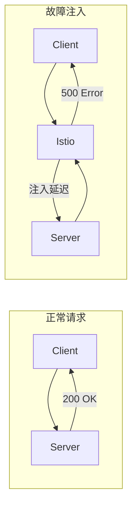
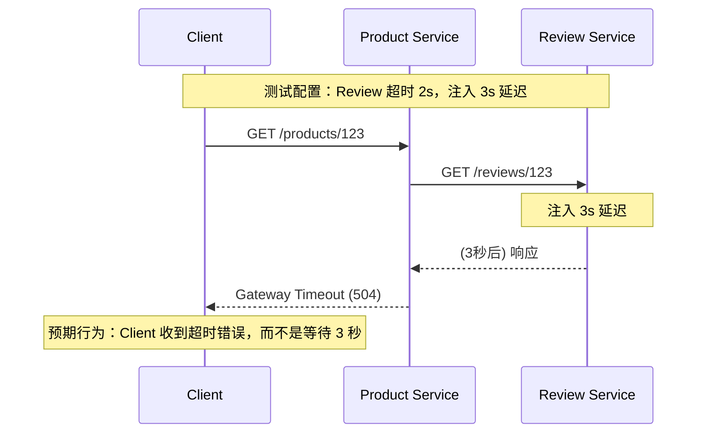
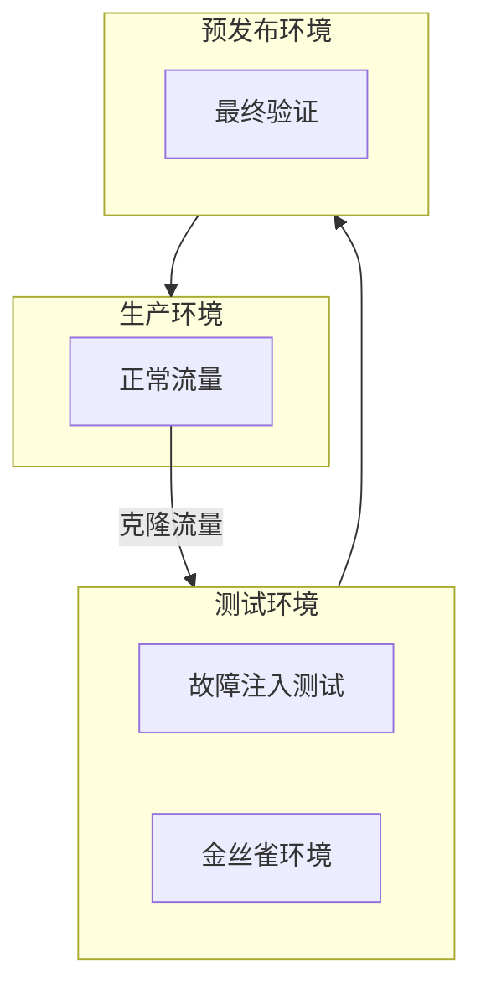

2011 年，Netflix 推出了 Chaos Monkey——一个随机关闭生产服务器的工具，震动了整个行业。「为什么我们要故意搞垮自己的系统？」这是当时很多人的疑问。

答案是：**只有主动制造故障，才能验证系统在真实故障面前的韧性。**

Istio 提供了原生的故障注入能力，可以模拟网络延迟、HTTP 错误、服务不可用等故障，用于测试微服务的容错能力。

## 故障注入基础

### 什么是故障注入

故障注入（Fault Injection）是一种**主动在系统中引入错误**的技术，目的是验证系统对错误的处理能力：

- 网络延迟：测试超时配置是否正确
- HTTP 错误：测试降级逻辑是否有效
- 连接超时：测试熔断器是否触发
- 服务不可用：测试降级方案是否可用



### Istio 故障注入 vs 传统混沌测试

| 维度 | Istio 故障注入 | 传统混沌测试 |
| --- | --- | --- |
| **注入点** | Sidecar 代理层 | 任意层（网络/进程/系统） |
| **粒度** | HTTP/gRPC 请求级别 | 基础设施级别 |
| **配置方式** | VirtualService CRD | 外部工具 |
| **目标** | 测试服务容错能力 | 测试系统韧性 |

## 延迟故障注入

### 固定延迟

```yaml title="fixed-delay.yaml"
apiVersion: networking.istio.io/v1beta1
kind: VirtualService
metadata:
  name: product-service
spec:
  hosts:
    - product-service
  http:
    - route:
        - destination:
            host: review-service
      # 注入 5 秒固定延迟
      fault:
        delay:
          percentage:
            value: 100              # 100% 请求延迟
          fixedDelay: 5s
```

### 百分比延迟

```yaml title="percent-delay.yaml"
apiVersion: networking.istio.io/v1beta1
kind: VirtualService
metadata:
  name: product-service
spec:
  hosts:
    - product-service
  http:
    - route:
        - destination:
            host: review-service
      fault:
        delay:
          percentage:
            value: 10               # 10% 请求延迟
          fixedDelay: 3s
```

### 按 Header 选择性延迟

```yaml title="header-delay.yaml"
apiVersion: networking.istio.io/v1beta1
kind: VirtualService
metadata:
  name: product-service
spec:
  hosts:
    - product-service
  http:
    # 带 debug header 的请求延迟
    - match:
        - headers:
            x-debug:
              exact: "true"
      route:
        - destination:
            host: review-service
      fault:
        delay:
          percentage:
            value: 100
          fixedDelay: 10s
    # 其他请求正常
    - route:
        - destination:
            host: review-service
```

## 错误故障注入

### HTTP 状态码错误

```yaml title="http-error.yaml"
apiVersion: networking.istio.io/v1beta1
kind: VirtualService
metadata:
  name: order-service
spec:
  hosts:
    - order-service
  http:
    - route:
        - destination:
            host: payment-service
      fault:
        abort:
          percentage:
            value: 100
          httpStatus: 503            # 100% 返回 503 错误
```

### 百分比错误注入

```yaml title="percent-error.yaml"
apiVersion: networking.istio.io/v1beta1
kind: VirtualService
metadata:
  name: order-service
spec:
  hosts:
    - order-service
  http:
    - route:
        - destination:
            host: payment-service
      fault:
        abort:
          percentage:
            value: 5                # 5% 请求返回错误
          httpStatus: 500
```

### 按接口注入错误

```yaml title="path-error.yaml"
apiVersion: networking.istio.io/v1beta1
kind: VirtualService
metadata:
  name: api-gateway
spec:
  hosts:
    - "api.example.com"
  http:
    # 订单接口 10% 返回错误
    - match:
        - uri:
            prefix: "/api/v1/orders"
      route:
        - destination:
            host: order-service
      fault:
        abort:
          percentage:
            value: 10
          httpStatus: 500
    # 其他接口正常
    - route:
        - destination:
            host: product-service
```

## 连接层故障注入

### TCP 连接超时

Istio 的故障注入主要用于 HTTP/gRPC 协议。对于 TCP 层故障，可以使用目标规则配合异常检测：

```yaml title="tcp-outlier.yaml"
apiVersion: networking.istio.io/v1beta1
kind: DestinationRule
metadata:
  name: database-service
spec:
  host: database-service
  trafficPolicy:
    outlierDetection:
      consecutiveGatewayErrors: 5
      interval: 10s
      baseEjectionTime: 30s
```

## 混沌测试场景

### 场景一：超时测试

**目标**：验证服务超时配置是否合理



**测试步骤**：

1. 配置目标服务超时为 2 秒
2. 注入 3 秒延迟
3. 观察 Client 响应
4. 如果 Client 等待 3 秒，说明超时配置未生效

### 场景二：熔断测试

**目标**：验证熔断器是否正确触发

```mermaid
flowchart TB
    subgraph Client["调用方"]
        C["Product Service"]
    end

    subgraph Target["被调用方"]
        E1["Review v1"]
        E2["Review v2"]
        E3["Review v3"]
    end

    subgraph Circuit["熔断器"]
        CB["熔断检查"]
    end

    C --> CB
    CB --> E1 & E2 & E3

    Note over CB: 连续 5 个 5xx → 熔断打开
```

**测试步骤**：

1. 注入 100% 500 错误
2. 观察熔断器是否触发
3. 恢复服务后，观察熔断器是否恢复

### 场景三：降级测试

**目标**：验证降级逻辑是否有效

```yaml title="degradation-test.yaml"
apiVersion: networking.istio.io/v1beta1
kind: VirtualService
metadata:
  name: product-service
spec:
  hosts:
    - product-service
  http:
    # Review 服务故障时，返回默认评分
    - route:
        - destination:
            host: review-service
            subset: v1
      timeout: 1s
      retries:
        attempts: 1
        perTryTimeout: 500ms
```

**测试步骤**：

1. 注入 Review 服务长时间延迟
2. 观察 Product Service 是否返回降级数据
3. 验证降级逻辑是否正确实现

## 混沌测试最佳实践

### 测试环境隔离



### 渐进式测试

| 阶段 | 故障比例 | 观察重点 |
| --- | --- | --- |
| 1 | 1% | 单个请求行为 |
| 2 | 10% | 服务级别影响 |
| 3 | 50% | 告警触发情况 |
| 4 | 100% | 熔断器/降级行为 |

### 监控与告警

```yaml title="chaos-alerting.yaml"
groups:
  - name: chaos-testing
    rules:
      # 故障注入告警
      - alert: ChaosInjectionActive
        expr: istio_fault_injection_active == 1
        for: 1m
        labels:
          severity: warning
        annotations:
          summary: "故障注入正在运行"
          description: "目标：{{ $labels.destination }}，故障类型：{{ $labels.fault_type }}"

      # 故障期间错误率异常
      - alert: ErrorRateDuringChaos
        expr: |
          sum(rate(istio_requests_total{
            response_code=~"5.."
          }[5m])) by (destination)
          / sum(rate(istio_requests_total[5m])) by (destination)
          > 0.5
        for: 2m
        labels:
          severity: critical
```

### 测试清单

```markdown
## 混沌测试前检查清单

### 环境准备
- [ ] 测试环境与生产环境隔离
- [ ] 监控系统就绪
- [ ] 告警配置正确
- [ ] 回滚方案就绪

### 测试对象
- [ ] 确定测试的服务
- [ ] 确定测试的故障类型
- [ ] 确定故障比例
- [ ] 确定测试持续时间

### 预期结果
- [ ] 定义成功标准
- [ ] 定义失败标准
- [ ] 准备测试记录表

### 人员安排
- [ ] 指定测试负责人
- [ ] 指定 on-call 人员
- [ ] 通知相关团队
```

## 常用测试命令

### 注入延迟

```bash
# 注入 5 秒延迟到 review-service
kubectl apply -f - <<EOF
apiVersion: networking.istio.io/v1beta1
kind: VirtualService
metadata:
  name: review-service-fault
spec:
  hosts:
    - review-service
  http:
    - route:
        - destination:
            host: review-service
      fault:
        delay:
          percentage:
            value: 100
          fixedDelay: 5s
EOF

# 清理故障注入
kubectl delete virtualservice review-service-fault
```

### 注入错误

```bash
# 注入 503 错误
kubectl apply -f - <<EOF
apiVersion: networking.istio.io/v1beta1
kind: VirtualService
metadata:
  name: payment-service-fault
spec:
  hosts:
    - payment-service
  http:
    - route:
        - destination:
            host: payment-service
      fault:
        abort:
          percentage:
            value: 100
          httpStatus: 503
EOF

# 清理
kubectl delete virtualservice payment-service-fault
```

## 与专业的混沌工具对比

| 维度 | Istio 故障注入 | Chaos Mesh | Gremlin |
| --- | --- | --- | --- |
| **注入层** | L7 (HTTP) | 多层 | 多层 |
| **配置方式** | CRD | YAML | Web UI |
| **Kubernetes 原生** | ✓ | ✓ | ✓ |
| **与 CI/CD 集成** | ✓ | ✓ | ✓ |
| **成本** | 免费（Istio 内置） | 免费 | 商业 |

## 总结

Istio 的故障注入能力是验证微服务韧性的利器：

| 故障类型 | 配置方式 | 适用场景 |
| --- | --- | --- |
| **固定延迟** | `fixedDelay` | 测试超时配置 |
| **百分比延迟** | `percentage.value` | 渐进式测试 |
| **HTTP 错误** | `abort.httpStatus` | 测试错误处理 |
| **百分比错误** | `percentage.value` | 模拟真实故障 |

**混沌测试的核心原则**：

1. **小步快跑**：从低比例、低风险故障开始
2. **隔离环境**：测试环境与生产环境分离
3. **持续监控**：实时观察系统响应
4. **快速回滚**：发现问题立即停止
5. **记录复盘**：每次测试后总结改进

**延伸思考**：故障注入只是混沌工程的一部分。真正的混沌工程还包括网络分区、节点宕机、资源耗尽等更多场景。Istio 的故障注入适合测试服务层的容错能力，对于基础设施层的故障测试，需要配合专业的混沌工具。
