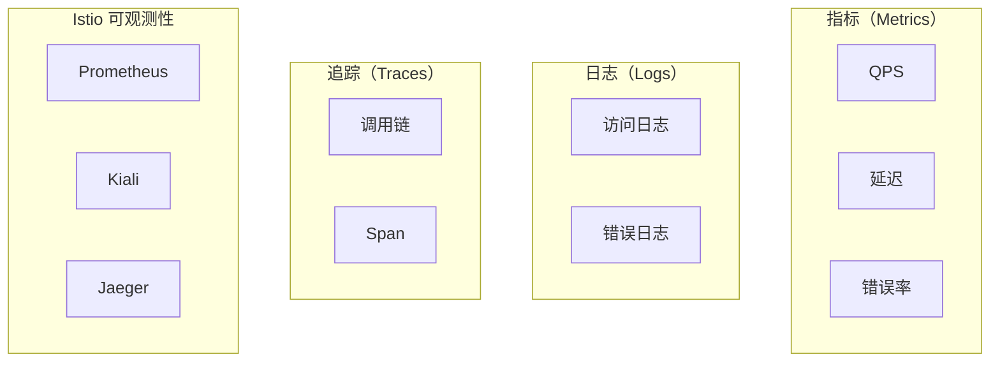
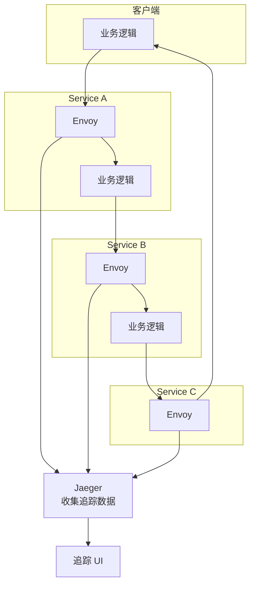
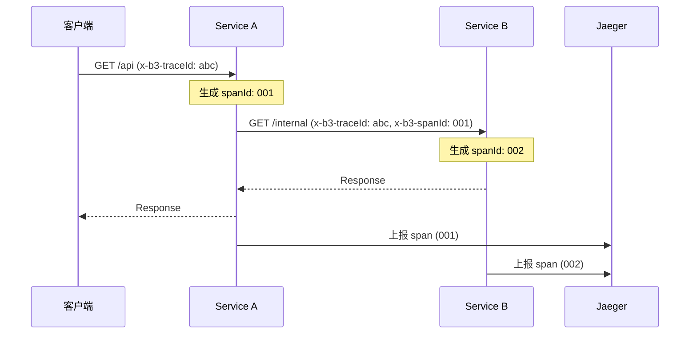

微服务架构中，一个请求可能经过十几个服务。如果某个请求失败，如何快速定位是哪个服务出了问题？

传统的做法是登录各个服务的服务器，查看日志，然后人工关联。但这种方法在服务数量多、调用链路长的情况下几乎不可行。

Istio 的可观测性组件提供了**指标、日志、追踪**三大能力，让你可以清晰地看到服务间的通信情况和性能表现。

## 可观测性三大支柱



## 指标（Metrics）

### Envoy 生成的指标

Istio 的 Envoy 代理自动收集丰富的指标：

| 指标类型 | 指标名示例 | 说明 |
| --- | --- | --- |
| **请求计数** | `istio_requests_total` | 总请求数 |
| **请求延迟** | `istio_request_duration_milliseconds` | 请求延迟分布 |
| **请求大小** | `istio_request_bytes` | 请求体大小 |
| **响应大小** | `istio_response_bytes` | 响应体大小 |
| **连接状态** | `istio_tcp_connections` | TCP 连接数 |

### Prometheus 查询示例

```text title="常用 Prometheus 查询"
# 服务 QPS
sum(rate(istio_requests_total{
  destination_service="product-service.production.svc.cluster.local"
}[5m]))

# P99 延迟
histogram_quantile(0.99,
  sum(rate(istio_request_duration_milliseconds_bucket{
    destination_service="product-service.production.svc.cluster.local"
  }[5m])) by (le)
)

# 错误率
sum(rate(istio_requests_total{
  destination_service="product-service.production.svc.cluster.local",
  response_code=~"5.."
}[5m])) /
sum(rate(istio_requests_total{
  destination_service="product-service.production.svc.cluster.local"
}[5m])) * 100
```

### Grafana Dashboard

Istio 提供了开箱即用的 Grafana Dashboard：

```yaml title="grafana-dashboard.yaml"
apiVersion: v1
kind: ConfigMap
metadata:
  name: istio-grafana-dashboards
  namespace: istio-system
data:
  istio-mesh-dashboard.json: |
    {
      "dashboard": {
        "title": "Istio Mesh Dashboard",
        "panels": [
          {
            "title": "Global Request Volume",
            "targets": [
              {
                "expr": "sum(rate(istio_requests_total[5m])) by (destination)"
              }
            ]
          }
        ]
      }
    }
```

### 常用 Dashboard

| Dashboard | 用途 | 核心指标 |
| --- | --- | --- |
| **Istio Mesh Dashboard** | 全局服务健康 | QPS、延迟、错误率 |
| **Istio Service Dashboard** | 单个服务详情 | 按版本、源服务的细分 |
| **Istio Workload Dashboard** | 工作负载健康 | Pod 级别指标 |
| **Istio Performance Dashboard** | 控制平面性能 | Istiod 资源使用 |

## 链路追踪（Tracing）

### 追踪架构



### 追踪 Span 结构

```json title="Span 示例"
{
  "traceId": "abc123def456",
  "spanId": "span001",
  "operationName": "GET /api/v1/products",
  "startTime": 1640000000,
  "duration": 45,
  "tags": {
    "http.method": "GET",
    "http.url": "/api/v1/products",
    "http.status_code": 200,
    "service.name": "product-service",
    "service.version": "v1"
  },
  "references": [
    {
      "refType": "CHILD_OF",
      "traceId": "abc123def456",
      "spanId": "parent001"
    }
  ]
}
```

### Jaeger 查询

```yaml title="jaeger-query.yaml"
apiVersion: jaegertracing.io/v1
kind: Jaeger
metadata:
  name: jaeger
spec:
  strategy: production
  collector:
    maxReplicas: 3
    resources:
      requests:
        cpu: 100m
        memory: 512Mi
  query:
    replicas: 2
  storage:
    type: elasticsearch
    elasticsearch:
      nodeCount: 3
```

### 常用追踪查询

```bash
# 查询特定服务的所有追踪
# GET /api/traces?service=product-service

# 查询特定 Trace ID 的详情
# GET /api/traces/{trace-id}

# 查询慢请求
# GET /api/traces?minDuration=5s
```

### 分布式上下文传播

Istio 自动在请求中注入和传播追踪上下文：



## Kiali 可视化

Kiali 是 Istio 官方提供的服务网格可视化工具：

### 核心功能

| 功能 | 说明 |
| --- | --- |
| **拓扑图** | 可视化服务间调用关系 |
| **流量监控** | 实时流量监控和告警 |
| **健康检查** | 服务健康状态一目了然 |
| **配置验证** | 验证 VirtualService 等配置 |
| **Istio 配置** | 可视化管理 Istio CRD |

### Kiali Dashboard

```yaml title="kiali-config.yaml"
apiVersion: v1
kind: ConfigMap
metadata:
  name: kiali
  namespace: istio-system
data:
  config.yaml: |
    server:
      port: 20001
    external_services:
      prometheus:
        url: http://prometheus:9090
      grafana:
        url: http://grafana:3000
      tracing:
        url: http://jaeger-query:16686
```

### 命名空间健康视图

```bash
# 查看命名空间健康状态
kubectl get namespace -l istio-injection=enabled

# 通过 Kiali API 获取健康数据
curl -s http://kiali:20001/kiali/api/namespaces/health | jq .
```

## 日志收集

### Envoy 访问日志

```yaml title="envoy-access-log.yaml"
apiVersion: v1
kind: ConfigMap
metadata:
  name: istio
  namespace: istio-system
data:
  mesh: |
    accessLogFile: /dev/stdout

    defaultConfig:
      tracing:
        sampling: 10.0
        zipkin:
          address: jaeger-collector.observability:9411
```

### 结构化日志格式

```json title="Envoy 结构化日志"
{
  "timestamp": "2024-01-15T10:30:00.000Z",
  "level": "info",
  "message": "HTTP request",
  "local_cluster": "outbound|8080||product-service.production.svc.cluster.local",
  "upstream_cluster": "inbound|8080||",
  "method": "GET",
  "path": "/api/v1/products",
  "protocol": "HTTP/1.1",
  "response_code": 200,
  "response_flags": "-",
  "connection_termination_details": "-",
  "duration": 45,
  "bytes_received": 0,
  "bytes_sent": 1024,
  "requested_server_name": "-",
  "downstream_remote_address": "10.0.0.1:54321",
  "upstream_local_address": "10.0.2.2:8080",
  "x-forwarded-for": "10.0.0.1"
}
```

### 与 ELK 集成

```yaml title="fluentd-config.yaml"
apiVersion: v1
kind: ConfigMap
metadata:
  name: fluentd-es-config
  namespace: istio-system
data:
  fluent.conf: |
    <source>
      @type tail
      path /var/log/containers/*istio-proxy*.log
      pos_file /var/log/fluentd-containers.log.pos
      time_key time
      time_format %Y-%m-%dT%H:%M:%S.%L
      tag istio-proxy
      format json
    </source>

    <match istio-proxy>
      @type elasticsearch
      host elasticsearch.logging
      port 9200
      logstash_format true
      logstash_prefix istio
    </match>
```

## 综合配置示例

```yaml title="observability-stack.yaml"
# Prometheus 配置
apiVersion: monitoring.coreos.com/v1
kind: Prometheus
metadata:
  name: istio-prometheus
  namespace: istio-system
spec:
  retention: 30d
  storage:
    volumeClaimTemplate:
      spec:
        resources:
          requests:
            storage: 50Gi
  serviceMonitorSelector:
    matchLabels:
      app: istio
---
# Grafana 配置
apiVersion: v1
kind: ConfigMap
metadata:
  name: grafana-dashboards
  namespace: istio-system
data:
  istio-mesh.json: |
    {"dashboard": {...}}
  istio-service.json: |
    {"dashboard": {...}}
  istio-workload.json: |
    {"dashboard": {...}}
---
# Jaeger 配置
apiVersion: jaegertracing.io/v1
kind: Jaeger
metadata:
  name: jaeger
  namespace: istio-system
spec:
  strategy: production
  collector:
    resources:
      requests:
        cpu: 100m
        memory: 512Mi
  query:
    replicas: 1
```

## 故障排查流程

### 1. 识别问题

```text title="告警规则"
# 服务不可用告警
- alert: ServiceHighErrorRate
  expr: |
    sum(rate(istio_requests_total{
      response_code=~"5.."
    }[5m])) by (destination_service)
    / sum(rate(istio_requests_total[5m])) by (destination_service)
    > 0.05
  for: 5m
  labels:
    severity: critical
```

### 2. 定位服务

```bash
# 通过 Kiali 查看拓扑
open http://kiali.istio-system:20001/kiali/console/graph?namespace=production

# 通过 Prometheus 定位慢服务
topk(10,
  histogram_quantile(0.99,
    sum(rate(istio_request_duration_milliseconds_bucket[5m])) by (destination_service, le)
  )
)
```

### 3. 分析调用链

```bash
# 查询特定 Trace
curl -s "http://jaeger-query:16686/api/traces?service=product-service&limit=10" | jq '.[].spans[] | {operationName, duration, tags}'

# 查找慢请求
curl -s "http://jaeger-query:16686/api/traces?service=product-service&minDuration=1s" | jq '.[].spans | length'
```

### 4. 检查日志

```bash
# 查看 Sidecar 日志
kubectl logs -n production -l app=product-service -c istio-proxy --tail=100

# 查看带追踪 ID 的日志
kubectl logs -n production -l app=product-service -c istio-proxy | grep "traceId=abc123"
```

## 最佳实践

### 采样策略

```yaml title="tracing-config.yaml"
# 默认采样率 10%，高流量服务可降低
meshConfig:
  defaultConfig:
    tracing:
      sampling: 10.0
      # 可选：自定义采样器
      # sampler:
      #   spec:
      #     samplingRate: 10
```

:::tip
**采样策略建议**：
- 高流量服务：1-5% 采样
- 低流量服务：100% 采样
- 生产问题排查：临时提升采样率
:::

### 指标优化

| 优化项 | 建议 |
| --- | --- |
| **Cardinality** | 避免高基数的 Label（如 User ID） |
| **Retention** | 30 天详细，1 年汇总 |
| **Aggregation** | 服务级别聚合，减少 Label |

### 日志优化

| 优化项 | 建议 |
| --- | --- |
| **格式** | JSON 格式，便于解析 |
| **敏感信息** | 脱敏处理 |
| **Volume** | 控制日志量，避免存储成本 |

## 总结

Istio 的可观测性体系提供了完整的监控能力：

| 组件 | 职责 | 核心价值 |
| --- | --- | --- |
| **Prometheus** | 指标收集与存储 | 性能监控、告警 |
| **Grafana** | 指标可视化 | 仪表盘、趋势分析 |
| **Jaeger** | 链路追踪 | 调用链分析、问题定位 |
| **Kiali** | 服务网格可视化 | 拓扑图、流量监控 |

三大支柱相互配合：**Prometheus 告诉你「哪个指标出了问题」，Jaeger 告诉你「具体是哪个调用链」，Kiali 帮你可视化整个服务网格的状态**。

**延伸思考**：可观测性不仅是发现问题，更是预防问题。通过历史数据的分析，你可以发现系统的性能瓶颈，提前进行优化。这需要建立完善的数据分析和告警体系。
