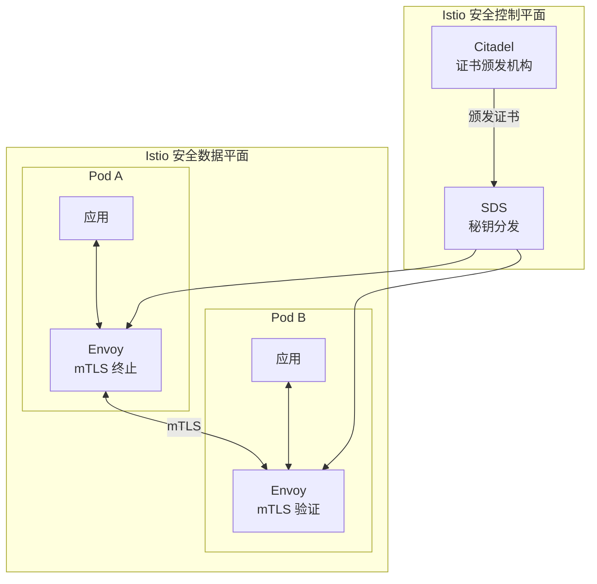
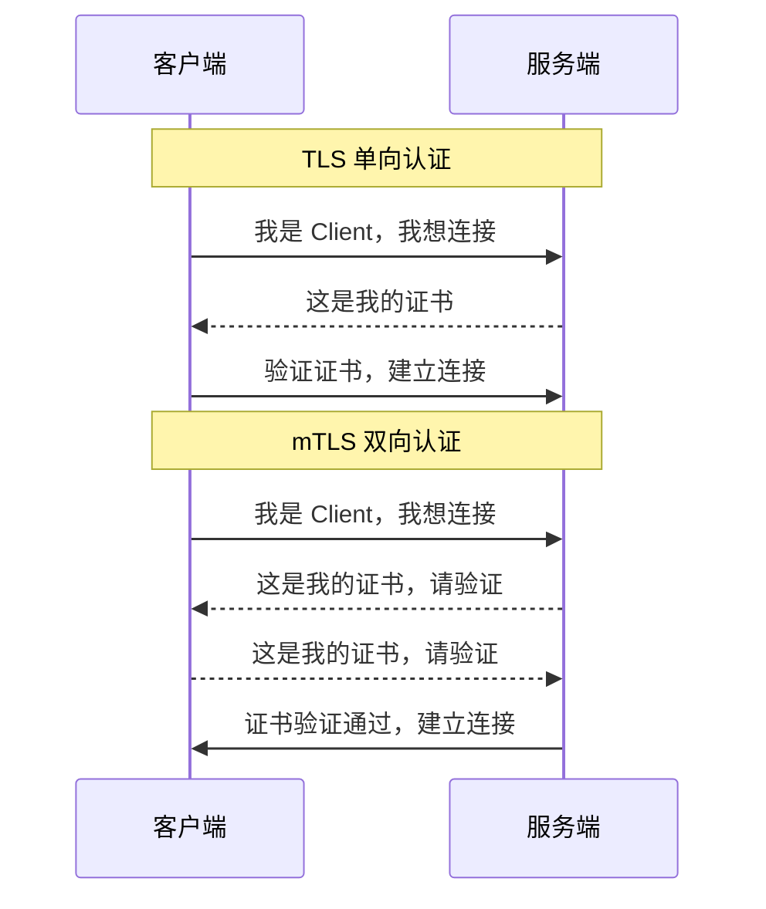
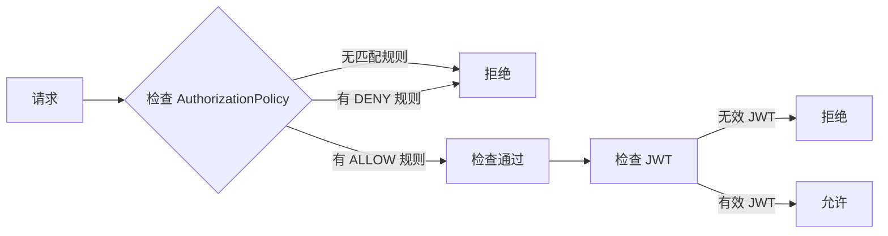

传统网络安全模型依赖「边界防御」——在网络边界部署防火墙，只有通过边界认证的流量才能进入内部网络。但在大规模微服务架构中，这种模型面临严峻挑战：

- 服务间通信频繁穿越多个网络边界
- 内部服务被默认信任，缺乏身份验证
- 一旦边界被突破，攻击者可以横向移动

**零信任（Zero Trust）** 的核心理念是：**永不信任，始终验证**。无论流量来自内部还是外部，都需要进行身份验证和授权。

Istio 通过 mTLS（双向 TLS）和 AuthorizationPolicy（授权策略）实现了零信任安全模型。

## 安全架构概览



## mTLS 双向认证

### 什么是 mTLS

**TLS（Transport Layer Security）** 是端到端的加密协议。传统的 TLS 是单向认证——客户端验证服务器的身份。

**mTLS（Mutual TLS）** 则是双向认证——客户端验证服务器，服务器也验证客户端的身份。



### Istio 如何实现 mTLS

```yaml title="mtls-strict.yaml"
apiVersion: security.istio.io/v1beta1
kind: PeerAuthentication
metadata:
  name: default
  namespace: istio-system
spec:
  mtls:
    mode: STRICT  # STRICT = 必须使用 mTLS, PERMISSIVE = 允许明文
```

#### PeerAuthentication 模式

| 模式 | 说明 | 适用场景 |
| --- | --- | --- |
| **STRICT** | 所有流量必须使用 mTLS | 生产环境 |
| **PERMISSIVE** | 允许 mTLS 和明文 | 迁移期 |
| **DISABLE** | 禁用 mTLS | 测试环境 |
| **UNSET** | 继承父级配置 | 默认 |

#### 命名空间级别的 mTLS

```yaml title="mtls-namespace.yaml"
apiVersion: security.istio.io/v1beta1
kind: PeerAuthentication
metadata:
  name: default
  namespace: production
spec:
  mtls:
    mode: STRICT
```

#### 工作负载级别的 mTLS

```yaml title="mtls-workload.yaml"
apiVersion: security.istio.io/v1beta1
kind: PeerAuthentication
metadata:
  name: payment-mtls
spec:
  selector:
    matchLabels:
      app: payment-service
  mtls:
    mode: STRICT
```

### 证书管理

Istio 使用 **SPIFFE（Secure Production Identity Framework for Everyone）** 标准为每个服务分配身份：

```yaml title="spiffe-identity.yaml"
# Pod 的 ServiceAccount 会生成 SPIFFE 格式的身份
# 格式：spiffe://cluster.local/ns/namespace/sa/service-account-name

# 例如：
# spiffe://cluster.local/ns/production/sa/order-service
# spiffe://cluster.local/ns/production/sa/payment-service
```

#### 证书自动轮换

```yaml title="citadel-config.yaml"
spec:
  components:
    citadel:
      k8s:
        spec:
          template:
            metadata:
              annotations:
                # 证书有效期
                certmanager.k8s.io/renew-before: 24h
          strategy:
            type: RollingUpdate
            rollingUpdate:
              maxSurge: 1
              maxUnavailable: 0
```

:::info
**证书轮换机制**：
- Istiod 作为 CA，定期颁发短期证书（默认 24 小时）
- Envoy 通过 SDS（Secret Discovery Service）动态获取证书
- 证书到期前自动轮换，无需重启服务
:::

## 认证（Authentication）

### 认证策略

Istio 支持两种认证方式：

| 方式 | 说明 | 适用场景 |
| --- | --- | --- |
| **PeerAuthentication** | 服务间认证（mTLS） | 内部服务通信 |
| **RequestAuthentication** | 请求级认证（JWT） | 外部用户请求 |

### JWT 认证

```yaml title="jwt-auth.yaml"
apiVersion: security.istio.io/v1beta1
kind: RequestAuthentication
metadata:
  name: jwt-auth
  namespace: istio-system
spec:
  selector:
    matchLabels:
      app: api-gateway
  jwtRules:
    - issuer: "https://auth.example.com"
      audiences:
        - "api.example.com"
      forwardOriginalToken: true
      # 从 Authorization header 提取 JWT
      fromHeaders:
        - name: Authorization
          prefix: "Bearer "
      # JWT 公共密钥来源
      jwksUri: "https://auth.example.com/.well-known/jwks.json"
```

### JWT 验证配置

```yaml title="jwt-with-claims.yaml"
apiVersion: security.istio.io/v1beta1
kind: RequestAuthentication
metadata:
  name: jwt-auth-detailed
  namespace: istio-system
spec:
  selector:
    matchLabels:
      app: api-gateway
  jwtRules:
    - issuer: "https://auth.example.com"
      jwksUri: "https://auth.example.com/.well-known/jwks.json"
      # 定义 JWT 中的声明
      claimsToHeaders:
        - claim: sub
          header: X-User-Id
        - claim: groups
          header: X-User-Groups
```

## 授权（Authorization）

### 授权策略结构

Istio 的 AuthorizationPolicy 支持 **ALLOW** 和 **DENY** 两种策略：

```yaml title="authz-structure.yaml"
apiVersion: security.istio.io/v1beta1
kind: AuthorizationPolicy
metadata:
  name: policy-name
  namespace: namespace
spec:
  selector:
    matchLabels:
      app: target-service
  action: ALLOW  # ALLOW 或 DENY
  rules:         # 授权规则
    - from:
        - source:
            principals: [...]
      to:
        - operation:
            methods: [...]
            paths: [...]
```

### 基础授权策略

```yaml title="basic-authz.yaml"
apiVersion: security.istio.io/v1beta1
kind: AuthorizationPolicy
metadata:
  name: order-authz
  namespace: production
spec:
  selector:
    matchLabels:
      app: order-service
  action: ALLOW
  rules:
    # 允许前端服务访问
    - from:
        - source:
            principals:
              - "cluster.local/ns/production/sa/frontend"
      to:
        - operation:
            methods: ["GET"]
            paths: ["/api/v1/orders/*"]
    # 允许支付服务访问
    - from:
        - source:
            principals:
              - "cluster.local/ns/production/sa/payment"
      to:
        - operation:
            methods: ["POST"]
            paths: ["/api/v1/orders/*"]
```

### 基于命名空间的授权

```yaml title="namespace-authz.yaml"
apiVersion: security.istio.io/v1beta1
kind: AuthorizationPolicy
metadata:
  name: cross-namespace-authz
  namespace: production
spec:
  selector:
    matchLabels:
      app: order-service
  action: ALLOW
  rules:
    # 允许 monitoring 命名空间的服务读取 metrics
    - from:
        - source:
            namespaces:
              - "monitoring"
      to:
        - operation:
            methods: ["GET"]
            paths: ["/metrics"]
```

### 基于 Header 的授权

```yaml title="header-authz.yaml"
apiVersion: security.istio.io/v1beta1
kind: AuthorizationPolicy
metadata:
  name: header-authz
  namespace: production
spec:
  selector:
    matchLabels:
      app: api-gateway
  action: ALLOW
  rules:
    # 允许带特定 Header 的请求
    - from:
        - source:
            principals: ["*"]
      to:
        - operation:
            methods: ["GET"]
      when:
        - key: request.headers[x-api-key]
          values: ["valid-api-key-1", "valid-api-key-2"]
```

### 拒绝特定操作（DENY 策略）

DENY 策略优先级高于 ALLOW 策略：

```yaml title="deny-authz.yaml"
apiVersion: security.istio.io/v1beta1
kind: AuthorizationPolicy
metadata:
  name: deny-admin
  namespace: production
spec:
  selector:
    matchLabels:
      app: admin-service
  action: DENY
  rules:
    # 拒绝来自非 admin 命名空间的访问
    - from:
        - source:
            not_namespaces: ["admin"]
      to:
        - operation:
            methods: ["*"]
            paths: ["/admin/*"]
```

### 不带选择器的授权策略

```yaml title="ns-level-authz.yaml"
# 命名空间级别的默认拒绝策略
apiVersion: security.istio.io/v1beta1
kind: AuthorizationPolicy
metadata:
  name: deny-all
  namespace: production
spec:
  # 不指定 selector，表示应用于命名空间内的所有工作负载
  action: DENY
  rules:
    - {}
```

## 零信任安全实践

### 默认拒绝原则



### 完整的零信任配置示例

```yaml title="zero-trust-config.yaml"
# 1. 启用 STRICT mTLS
apiVersion: security.istio.io/v1beta1
kind: PeerAuthentication
metadata:
  name: default
  namespace: production
spec:
  mtls:
    mode: STRICT
---
# 2. JWT 认证
apiVersion: security.istio.io/v1beta1
kind: RequestAuthentication
metadata:
  name: require-jwt
  namespace: production
spec:
  selector:
    matchLabels:
      app: api-service
  jwtRules:
    - issuer: "https://auth.example.com"
      jwksUri: "https://auth.example.com/.well-known/jwks.json"
---
# 3. 细粒度授权
apiVersion: security.istio.io/v1beta1
kind: AuthorizationPolicy
metadata:
  name: api-authz
  namespace: production
spec:
  selector:
    matchLabels:
      app: api-service
  action: ALLOW
  rules:
    - from:
        - source:
            requestPrincipals: ["*"]
      to:
        - operation:
            methods: ["GET"]
            paths: ["/api/v1/*"]
      when:
        - key: request.auth.claims[sub]
          not_values: ["anonymous"]
```

## 安全配置最佳实践

### 清单

| 配置项 | 推荐值 | 说明 |
| --- | --- | --- |
| **mTLS 模式** | STRICT | 生产环境必须启用 |
| **JWT 验证** | 所有外部入口 | API Gateway 等 |
| **授权策略** | 最小权限 | 只授权必要权限 |
| **证书轮换** | 24 小时 | 平衡安全与性能 |
| **证书根密钥** | 独立管理 | 不使用 Istiod 内置根密钥 |

### 常见安全配置错误

:::danger
**错误一：使用 PERMISSIVE 模式在生产环境**

PERMISSIVE 允许明文流量，会削弱 mTLS 的安全效果。

**正确做法**：迁移完成后，切换到 STRICT 模式。
:::

:::danger
**错误二：使用通配符 principal**

```yaml
# 错误：允许所有服务访问
rules:
  - from:
      - source:
          principals: ["*"]
```

**正确做法**：明确指定允许的服务。

```yaml
rules:
  - from:
      - source:
          principals:
            - "cluster.local/ns/production/sa/frontend"
```
:::

:::danger
**错误三：忘记更新 AuthorizationPolicy**

添加新服务后，可能忘记更新授权策略，导致新服务无法访问。

**正确做法**：使用命名空间级别的默认 ALLOW 策略，只拒绝明确需要拒绝的流量。
:::

## 调试与排查

### 检查 mTLS 状态

```bash
# 查看服务的 mTLS 配置
istioctl authz check <pod-name>

# 检查双向 TLS 配置状态
istioctl x authz check <pod-name>

# 查看命名空间级别的 mTLS 配置
kubectl get peerauthentication --all-namespaces
```

### 常见问题排查

```bash
# 问题：服务间通信失败
# 排查：检查 mTLS 配置
kubectl get peerauthentication --all-namespaces -o wide

# 问题：JWT 认证失败
# 排查：检查 JWT 配置
istioctl experimental authz check <pod-name>

# 问题：授权策略不生效
# 排查：检查 AuthorizationPolicy
kubectl get authorizationpolicy -n production
```

## 总结

Istio 的安全体系包含三个层次：

| 层次 | 机制 | 说明 |
| --- | --- | --- |
| **身份认证** | SPIFFE + mTLS | 验证服务身份 |
| **请求认证** | JWT | 验证用户身份 |
| **访问授权** | AuthorizationPolicy | 细粒度权限控制 |

零信任安全的核心原则：

1. **默认拒绝**：未明确允许的流量都被拒绝
2. **最小权限**：只授权必要的权限
3. **身份优先**：先验证身份，再允许访问
4. **持续验证**：每次请求都需要验证

**延伸思考**：Istio 的安全能力虽然强大，但它只能保护网格内的流量。对于网格外的服务（如遗留系统）如何纳入统一的安全体系？这涉及到 ServiceEntry 与外部认证系统的集成。
