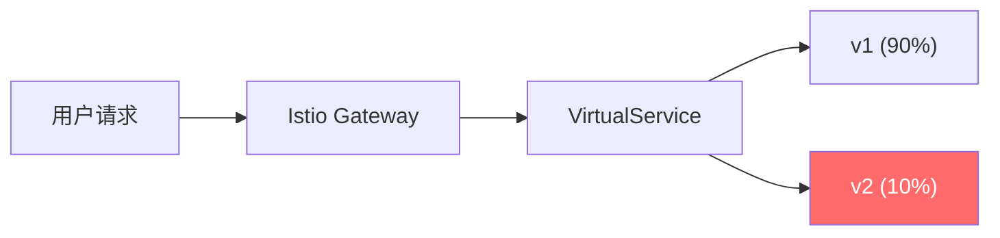

流量管理是 Istio 最核心的功能。通过声明式的 CRD 配置，你可以实现负载均衡、超时重试、熔断限流、金丝雀发布、A/B 测试等复杂的流量控制，而无需修改任何应用代码。

## 核心 CRD 概览

| CRD | 职责 | 作用域 |
| --- | --- | --- |
| **VirtualService** | 定义路由规则 | 请求如何被路由到服务 |
| **DestinationRule** | 定义服务端点策略 | 路由后的流量策略 |
| **ServiceEntry** | 将外部服务加入网格 | 网格外的服务 |
| **Gateway** | 定义入站/出站网关 | 端口和 TLS 配置 |
| **Sidecar** | 限制 Sidecar 行为 | 特定工作负载的代理配置 |

## VirtualService

VirtualService 是 Istio 流量管理的核心，它定义了**请求如何被路由到目标服务**。

### 基础路由

```yaml title="basic-route.yaml"
apiVersion: networking.istio.io/v1beta1
kind: VirtualService
metadata:
  name: product-service
spec:
  hosts:
    - product-service  # 匹配 Kubernetes Service
  http:
    - route:
        - destination:
            host: product-service
            subset: v1
          weight: 100
```

### 基于 Header 的路由

```yaml title="header-route.yaml"
apiVersion: networking.istio.io/v1beta1
kind: VirtualService
metadata:
  name: product-service
spec:
  hosts:
    - product-service
  http:
    # header 匹配：将带 debug header 的请求路由到 v2
    - match:
        - headers:
            x-debug:
              exact: "true"
      route:
        - destination:
            host: product-service
            subset: v2
    # 默认路由
    - route:
        - destination:
            host: product-service
            subset: v1
```

### 基于权重的路由（灰度发布）

```yaml title="weight-route.yaml"
apiVersion: networking.istio.io/v1beta1
kind: VirtualService
metadata:
  name: product-service
spec:
  hosts:
    - product-service
  http:
    - route:
        - destination:
            host: product-service
            subset: v1
          weight: 80
        - destination:
            host: product-service
            subset: v2
          weight: 20
```

### 基于 URI 前缀的路由

```yaml title="uri-route.yaml"
apiVersion: networking.istio.io/v1beta1
kind: VirtualService
metadata:
  name: api-gateway
spec:
  hosts:
    - api.example.com
  http:
    # API v1
    - match:
        - uri:
            prefix: "/api/v1/products"
      route:
        - destination:
            host: product-service
            subset: stable
    # API v2
    - match:
        - uri:
            prefix: "/api/v2/products"
      route:
        - destination:
            host: product-service
            subset: canary
    # 静态资源
    - match:
        - uri:
            prefix: "/static"
      route:
        - destination:
            host: static-service
```

### 重试策略

```yaml title="retry-config.yaml"
apiVersion: networking.istio.io/v1beta1
kind: VirtualService
metadata:
  name: order-service
spec:
  hosts:
    - order-service
  http:
    - route:
        - destination:
            host: payment-service
      retries:
        attempts: 3                    # 最多重试 3 次
        perTryTimeout: 2s              # 每次重试超时 2 秒
        retryOn: connect-failure,refused-stream,unavailable,cancelled,retriable-status-codes
        retryRemoteLocalities: true     # 允许重试到其他区域
```

:::info
**常见重试场景**：
- `connect-failure`：连接失败
- `refused-stream`：流被拒绝
- `unavailable`：服务不可用
- `retriable-status-codes`：可重试的状态码（如 502、503）
:::

### 超时配置

```yaml title="timeout-config.yaml"
apiVersion: networking.istio.io/v1beta1
kind: VirtualService
metadata:
  name: checkout-service
spec:
  hosts:
    - checkout-service
  http:
    - match:
        - headers:
            x-priority:
              exact: "high"
      route:
        - destination:
            host: inventory-service
      timeout: 5s                      # 高优先级请求 5 秒超时
    - route:
        - destination:
            host: inventory-service
      timeout: 30s                      # 普通请求 30 秒超时
```

### 故障注入

```yaml title="fault-injection.yaml"
apiVersion: networking.istio.io/v1beta1
kind: VirtualService
metadata:
  name: product-service
spec:
  hosts:
    - product-service
  http:
    - route:
        - destination:
            host: review-service
      # 延迟注入
      fault:
        delay:
          percentage:
            value: 10                    # 10% 的请求
          fixedDelay: 5s                # 延迟 5 秒
    - route:
        - destination:
            host: rating-service
      # 故障注入（返回错误）
      fault:
        abort:
          percentage:
            value: 5                     # 5% 的请求
          httpStatus: 500               # 返回 500 错误
```

## DestinationRule

DestinationRule 定义**路由后的流量策略**，包括负载均衡、连接池设置、熔断配置等。

### 负载均衡策略

```yaml title="loadbalancer-config.yaml"
apiVersion: networking.istio.io/v1beta1
kind: DestinationRule
metadata:
  name: product-service
spec:
  host: product-service
  trafficPolicy:
    loadBalancer:
      simple: LEAST_REQUEST              # 最少连接负载均衡
      # 可选值：ROUND_ROBIN, LEAST_REQUEST, RANDOM, PASSTHROUGH
```

### 一致性哈希负载均衡

```yaml title="consistent-hash.yaml"
apiVersion: networking.istio.io/v1beta1
kind: DestinationRule
metadata:
  name: product-service
spec:
  host: product-service
  trafficPolicy:
    loadBalancer:
      simple: PASSTHROUGH
  subsets:
    - name: v1
      labels:
        version: v1
    - name: v2
      labels:
        version: v2
```

### 连接池配置

```yaml title="connection-pool.yaml"
apiVersion: networking.istio.io/v1beta1
kind: DestinationRule
metadata:
  name: backend-service
spec:
  host: backend-service
  trafficPolicy:
    connectionPool:
      tcp:
        maxConnections: 100              # 最大连接数
        connectTimeout: 10s              # 连接超时
      http:
        h2UpgradePolicy: UPGRADE         # HTTP/1.1 升级到 HTTP/2
        http1MaxPendingRequests: 100    # 等待中的最大请求数
        http2MaxRequests: 1000           # 最大并发请求数
        maxRequestsPerConnection: 100   # 每连接最大请求数
        maxRetries: 3                    # 最大重试次数
```

### 熔断配置

```yaml title="outlier-detection.yaml"
apiVersion: networking.istio.io/v1beta1
kind: DestinationRule
metadata:
  name: backend-service
spec:
  host: backend-service
  trafficPolicy:
    outlierDetection:
      consecutive5xxErrors: 5            # 连续 5xx 错误数
      interval: 10s                      # 检测间隔
      baseEjectionTime: 30s              # 基础驱逐时间
      maxEjectionPercent: 50             # 最大驱逐百分比
      minHealthPercent: 50              # 最小健康百分比
```

:::tip
**熔断工作原理**：
1. Envoy 持续监控上游端点的错误率
2. 当连续 5 个 5xx 错误时，触发熔断
3. 该端点被「驱逐」一段时间
4. 恢复后逐步恢复流量
:::

### 局部亲和性

```yaml title="locality-lb.yaml"
apiVersion: networking.istio.io/v1beta1
kind: DestinationRule
metadata:
  name: product-service
spec:
  host: product-service
  trafficPolicy:
    loadBalancer:
      localityLbSetting:
        enabled: true
        distribute:
          - from: us-west-2/*
            to:
              "us-west-2/*": 80          # 80% 流量留在本区域
              "us-east-1/*": 20          # 20% 流量到 us-east-1
```

## ServiceEntry

将外部服务或网格外的服务加入 Istio 管理：

### 添加外部 HTTP 服务

```yaml title="external-http.yaml"
apiVersion: networking.istio.io/v1beta1
kind: ServiceEntry
metadata:
  name: external-weather-api
spec:
  hosts:
    - weather-api.example.com
  ports:
    - number: 80
      name: http
      protocol: HTTP
  location: MESH_EXTERNAL               # 外部服务
  resolution: DNS                       # DNS 解析
```

### 添加外部 HTTPS 服务

```yaml title="external-https.yaml"
apiVersion: networking.istio.io/v1beta1
kind: ServiceEntry
metadata:
  name: external-payment-api
spec:
  hosts:
    - api.stripe.com
  ports:
    - number: 443
      name: https
      protocol: HTTPS
  location: MESH_EXTERNAL
  resolution: DNS
  tls:
    mode: PASSTHROUGH                    # TLS 直通
```

### 添加外部 gRPC 服务

```yaml title="external-grpc.yaml"
apiVersion: networking.istio.io/v1beta1
kind: ServiceEntry
metadata:
  name: external-grpc-service
spec:
  hosts:
    - grpc.external.com
  ports:
    - number: 8080
      name: grpc
      protocol: GRPC
  location: MESH_EXTERNAL
  resolution: DNS
```

## Gateway

Gateway 定义入站和出站网关配置：

### 入站网关配置

```yaml title="ingress-gateway.yaml"
apiVersion: networking.istio.io/v1beta1
kind: Gateway
metadata:
  name: public-gateway
  namespace: istio-system
spec:
  selector:
    istio: ingressgateway
  servers:
    - port:
        number: 80
        name: http
        protocol: HTTP
      hosts:
        - "*.example.com"
      tls:
        httpsRedirect: true             # HTTP 重定向到 HTTPS
    - port:
        number: 443
        name: https
        protocol: HTTPS
      hosts:
        - "*.example.com"
      tls:
        mode: SIMPLE
        credentialName: example-tls      # 引用 Kubernetes Secret
```

### 绑定 VirtualService

```yaml title="gateway-vs-binding.yaml"
apiVersion: networking.istio.io/v1beta1
kind: VirtualService
metadata:
  name: api-virtualservice
spec:
  hosts:
    - "api.example.com"
  gateways:
    - public-gateway                     # 绑定到 Gateway
  http:
    - match:
        - uri:
            prefix: "/products"
      route:
        - destination:
            host: product-service
            port:
              number: 8080
```

## 流量镜像

流量镜像（Traffic Mirroring）将请求同时发送到两个版本，用于测试新版本：

```yaml title="traffic-mirroring.yaml"
apiVersion: networking.istio.io/v1beta1
kind: VirtualService
metadata:
  name: order-service
spec:
  hosts:
    - order-service
  http:
    - route:
        - destination:
            host: order-service
            subset: v1
          weight: 100
        - destination:
            host: order-service
            subset: v2
          weight: 0                       # 生产版本，接收真实流量
      mirror:
        host: order-service
        subset: v2-canary                # 镜像版本，接收相同流量副本
      mirrorPercent: 100                  # 100% 镜像
```

:::info
**流量镜像用途**：
- **金丝雀测试**：将生产流量镜像到新版本，观察错误率和延迟
- **A/B 测试**：对比两个版本的表现
- **压测**：用真实流量测试新版本
:::

## 完整示例：灰度发布流程



### 第一阶段：部署 v2，10% 流量

```yaml title="canary-10.yaml"
apiVersion: networking.istio.io/v1beta1
kind: VirtualService
metadata:
  name: recommendation-service
spec:
  hosts:
    - recommendation-service
  http:
    - route:
        - destination:
            host: recommendation-service
            subset: v1
          weight: 90
        - destination:
            host: recommendation-service
            subset: v2
          weight: 10
```

### 第二阶段：观察稳定后，增加到 50%

```yaml title="canary-50.yaml"
apiVersion: networking.istio.io/v1beta1
kind: VirtualService
metadata:
  name: recommendation-service
spec:
  hosts:
    - recommendation-service
  http:
    - route:
        - destination:
            host: recommendation-service
            subset: v1
          weight: 50
        - destination:
            host: recommendation-service
            subset: v2
          weight: 50
```

### 第三阶段：全量切换到 v2

```yaml title="canary-100.yaml"
apiVersion: networking.istio.io/v1beta1
kind: VirtualService
metadata:
  name: recommendation-service
spec:
  hosts:
    - recommendation-service
  http:
    - route:
        - destination:
            host: recommendation-service
            subset: v2
          weight: 100
```

## 总结

Istio 的流量管理能力非常强大：

| 功能 | CRD | 说明 |
| --- | --- | --- |
| **路由规则** | VirtualService | 基于权重、Header、URI 的路由 |
| **负载均衡** | DestinationRule | 多种 LB 算法、局部亲和性 |
| **超时重试** | VirtualService | 请求超时、重试策略 |
| **熔断限流** | DestinationRule | 连接池、熔断配置 |
| **流量镜像** | VirtualService | 镜像流量到测试版本 |
| **外部服务** | ServiceEntry | 将外部服务纳入网格 |

通过组合使用这些 CRD，你可以实现复杂的流量治理策略，而无需修改任何应用代码。

**延伸思考**：Istio 提供了声明式的流量管理，但如果配置出错，可能导致服务不可访问。如何验证配置的正确性？如何回滚有问题的配置？配置变更的可观测性同样重要。
