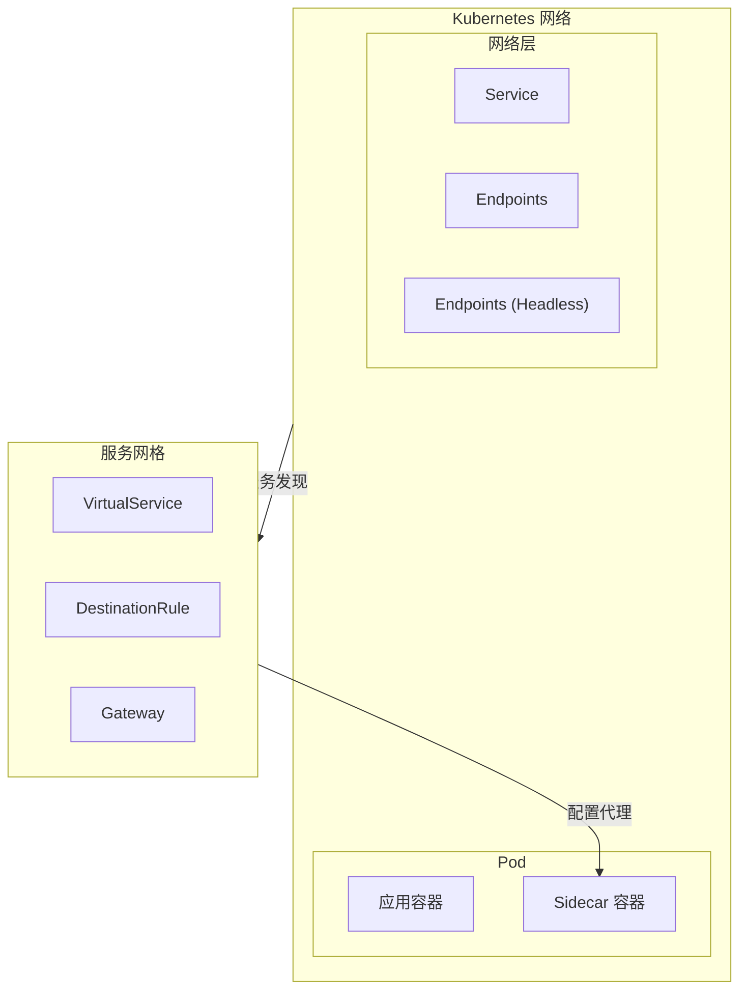
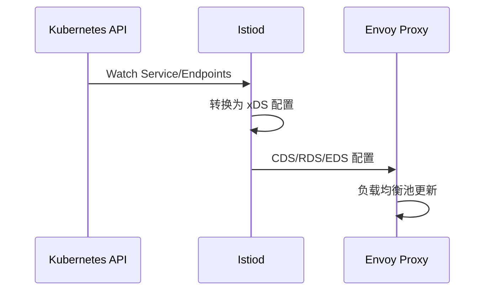
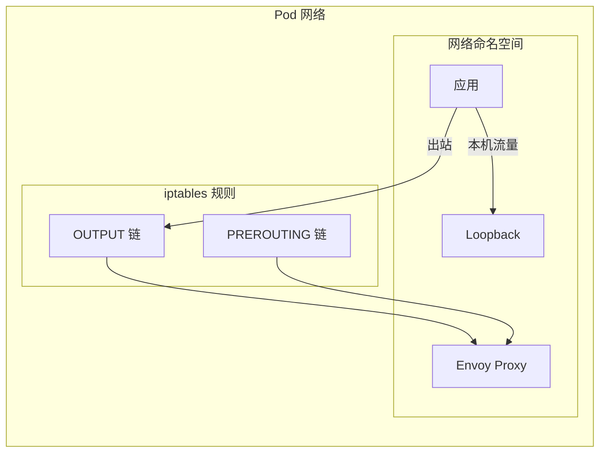

Kubernetes 已经成为容器编排的事实标准，而服务网格（Istio、Linkerd 等）也越来越多地运行在 Kubernetes 之上。理解两者如何协同工作，是成功落地服务网格的关键。

## 架构整合

### Kubernetes 网络与服务网格



### 核心概念映射

| Kubernetes 概念 | 服务网格概念 | 说明 |
| --- | --- | --- |
| **Service** | - | 服务发现基础 |
| **Endpoints** | EDS (Endpoint) | 服务实例 |
| **Pod** | - | 代理部署单元 |
| **Namespace** | - | 隔离边界 |
| **ServiceAccount** | Service Identity | 身份认证 |

## 服务发现机制

### Kubernetes Service → Istio



### 自动服务发现

Istio 自动将 Kubernetes Service 转换为网格内的服务：

```bash
# Kubernetes Service
kubectl get svc -n production

# 输出
NAME              TYPE        CLUSTER-IP     PORT(S)
order-service     ClusterIP   10.96.1.100    8080/TCP
product-service   ClusterIP   10.96.1.101    8080/TCP

# Istio 自动生成服务
# Envoy 配置中自动包含这些服务
```

### Headless Service

对于 StatefulSet 或需要直接 Pod 访问的场景：

```yaml title="headless-service.yaml"
apiVersion: v1
kind: Service
metadata:
  name: mysql-headless
  namespace: production
spec:
  clusterIP: None  # Headless
  selector:
    app: mysql
  ports:
    - port: 3306
      name: mysql
---
# Istio 配置
apiVersion: networking.istio.io/v1beta1
kind: ServiceEntry
metadata:
  name: mysql-entry
spec:
  hosts:
    - mysql-headless.production.svc.cluster.local
  ports:
    - number: 3306
      name: tcpmysql
      protocol: TCP
  location: MESH_INTERNAL
  resolution: DNS
```

## 流量拦截

### iptables 拦截机制



```bash
# Istio Init 容器添加的 iptables 规则
# 入站重定向
-A PREROUTING -p tcp -j REDIRECT --to-port 15006

# 出站重定向
-A OUTPUT -p tcp -j REDIRECT --to-port 15001

# 例外规则
-A OUTPUT -p tcp -d 10.96.0.1 -j RETURN  # Kubernetes API
-A OUTPUT -p tcp -d 127.0.0.1 -j RETURN   # localhost
```

### Sidecar 注入

```yaml title="sidecar-injection.yaml"
# Pod 自动注入
apiVersion: v1
kind: Pod
metadata:
  name: order-service
  labels:
    app: order-service
    version: v1
spec:
  containers:
    - name: order-service
      image: myapp/order-service:v1
      ports:
        - containerPort: 8080
---
# 自动注入的 Sidecar
apiVersion: v1
kind: Pod
# ...after injection...
spec:
  containers:
    - name: order-service
      image: myapp/order-service:v1
    - name: istio-proxy
      image: docker.io/istio/proxyv2:1.20
      env:
        - name: ISTIO_META_DNS_CAPTURE
          value: "true"
      resources:
        requests:
          cpu: 100m
          memory: 128Mi
```

## 网络策略整合

### K8s NetworkPolicy vs Istio AuthorizationPolicy

| 维度 | K8s NetworkPolicy | Istio AuthorizationPolicy |
| --- | --- | --- |
| **层级** | L3/L4 | L7 |
| **粒度** | Pod/命名空间 | Service/路径/Header |
| **状态** | 有状态 | 无状态 |
| **可观测性** | 基础 | 丰富 |

### 协同使用

```yaml title="network-policy.yaml"
# Kubernetes NetworkPolicy（基础隔离）
apiVersion: networking.k8s.io/v1
kind: NetworkPolicy
metadata:
  name: baseline-isolation
  namespace: production
spec:
  podSelector:
    matchLabels:
      app: order-service
  policyTypes:
    - Ingress
    - Egress
  ingress:
    - from:
        - podSelector:
            matchLabels:
              app: frontend
      ports:
        - protocol: TCP
          port: 8080
---
# Istio AuthorizationPolicy（细粒度控制）
apiVersion: security.istio.io/v1beta1
kind: AuthorizationPolicy
metadata:
  name: order-authz
  namespace: production
spec:
  selector:
    matchLabels:
      app: order-service
  action: ALLOW
  rules:
    - from:
        - source:
            principals:
              - "cluster.local/ns/production/sa/frontend"
      to:
        - operation:
            methods: ["GET"]
            paths: ["/api/v1/orders/*"]
```

## 资源与调度

### Pod 配置

```yaml title="pod-resources.yaml"
apiVersion: v1
kind: Pod
metadata:
  name: order-service
  labels:
    app: order-service
spec:
  containers:
    - name: order-service
      resources:
        requests:
          memory: "256Mi"
          cpu: "250m"
        limits:
          memory: "512Mi"
          cpu: "500m"
    - name: istio-proxy
      resources:
        requests:
          memory: "128Mi"
          cpu: "100m"
        limits:
          memory: "1Gi"
          cpu: "2000m"
  # 亲和性配置
  affinity:
    podAntiAffinity:
      preferredDuringSchedulingIgnoredDuringExecution:
        - weight: 100
          podAffinityTerm:
            labelSelector:
              matchLabels:
                app: order-service
            topologyKey: kubernetes.io/hostname
```

### 资源配额

```yaml title="resource-quota.yaml"
apiVersion: v1
kind: ResourceQuota
metadata:
  name: mesh-quota
  namespace: production
spec:
  hard:
    requests.cpu: "100"
    requests.memory: "200Gi"
    limits.cpu: "200"
    limits.memory: "400Gi"
  scopeSelector:
    matchExpressions:
      - operator: In
        scopeName: PriorityClass
        values: ["high"]
```

## 健康检查

### 就绪探针 vs Sidecar

Istio 会影响健康检查，需要正确配置：

```yaml title="health-check.yaml"
apiVersion: v1
kind: Pod
metadata:
  name: order-service
spec:
  containers:
    - name: order-service
      readinessProbe:
        httpGet:
          path: /ready
          port: 8080
        initialDelaySeconds: 5
        periodSeconds: 5
      # 避免 Istio 拦截健康检查
      ports:
        - name: http
          containerPort: 8080
        - name: http-health
          containerPort: 15021
---
# Istio 健康检查配置
apiVersion: v1
kind: Service
metadata:
  name: order-service
spec:
  ports:
    - name: http
      port: 8080
      targetPort: 8080
    - name: status
      port: 15021
      targetPort: 15021
```

### 禁用 Sidecar 健康检查

```yaml title="disable-health-intercept.yaml"
apiVersion: v1
kind: Pod
metadata:
  name: order-service
  annotations:
    # 禁用该 Pod 的健康检查拦截
    sidecar.istio.io/interceptMode: NONE
spec:
  containers:
    - name: order-service
      readinessProbe:
        httpGet:
          path: /health
          port: 8080
```

## 滚动更新与灰度

### Deployment 配置

```yaml title="deployment-rolling.yaml"
apiVersion: apps/v1
kind: Deployment
metadata:
  name: order-service
  namespace: production
spec:
  replicas: 10
  strategy:
    type: RollingUpdate
    rollingUpdate:
      maxSurge: 25%
      maxUnavailable: 25%
  selector:
    matchLabels:
      app: order-service
  template:
    metadata:
      labels:
        app: order-service
        version: v2
    spec:
      containers:
        - name: order-service
          image: myapp/order-service:v2
      # 不自动注入，手动控制
```

### 配合 Istio 灰度

```yaml title="canary-deployment.yaml"
# Deployment v1
apiVersion: apps/v1
kind: Deployment
metadata:
  name: order-service-v1
spec:
  replicas: 10
  selector:
    matchLabels:
      app: order-service
      version: v1
---
# Deployment v2
apiVersion: apps/v1
kind: Deployment
metadata:
  name: order-service-v2
spec:
  replicas: 1
  selector:
    matchLabels:
      app: order-service
      version: v2
---
# DestinationRule
apiVersion: networking.istio.io/v1beta1
kind: DestinationRule
metadata:
  name: order-service
spec:
  host: order-service
  subsets:
    - name: v1
      labels:
        version: v1
    - name: v2
      labels:
        version: v2
---
# VirtualService
apiVersion: networking.istio.io/v1beta1
kind: VirtualService
metadata:
  name: order-service
spec:
  hosts:
    - order-service
  http:
    - route:
        - destination:
            host: order-service
            subset: v1
          weight: 90
        - destination:
            host: order-service
            subset: v2
          weight: 10
```

## 持久化存储

### Sidecar 不能共享 Volume

```yaml title="volume-note.yaml"
# 错误：Sidecar 不能访问应用 Volume
apiVersion: v1
kind: Pod
metadata:
  name: mysql
spec:
  containers:
    - name: mysql
      volumeMounts:
        - name: data
          mountPath: /var/lib/mysql
    - name: istio-proxy
      # istio-proxy 不能访问应用的挂载卷
```

### 解决方案

| 方案 | 说明 |
| --- | --- |
| **Sidecar 范围限制** | 只拦截需要的端口 |
| **Init 容器** | 使用 Init 容器处理特殊需求 |
| **HostNetwork** | 不推荐，影响网格功能 |

```yaml title="port-exclusion.yaml"
# 只拦截特定端口
apiVersion: v1
kind: Pod
metadata:
  name: mysql
  annotations:
    traffic.sidecar.istio.io/includeInboundPorts: "3306"
    traffic.sidecar.istio.io/excludeInboundPorts: "9090"
    traffic.sidecar.istio.io/includeOutboundPorts: "3306"
    traffic.sidecar.istio.io/excludeOutboundPorts: "53,8500"
spec:
  containers:
    - name: mysql
      ports:
        - containerPort: 3306
```

## 总结

Kubernetes 与服务网格的整合涉及多个层面：

| 整合层面 | 关键点 |
| --- | --- |
| **网络** | iptables 拦截、服务发现 |
| **安全** | ServiceAccount → 身份、mTLS |
| **资源** | Sidecar 资源规划 |
| **调度** | 亲和性、高可用 |
| **监控** | 指标、日志、追踪集成 |

**最佳实践**：

1. **命名空间隔离**：生产环境独立命名空间
2. **Sidecar 管理**：自动注入配合资源限制
3. **网络策略**：K8s NetworkPolicy + Istio Authz 协同
4. **滚动更新**：Deployment 策略配合灰度发布
5. **健康检查**：正确配置避免误判

**延伸思考**：随着 Kubernetes 和服务网格的深度集成，未来的趋势是让这种集成更加「透明」——应用开发者不需要关心 Sidecar 的存在，就像不需要关心网络 CNI 一样。这需要两个生态的持续优化和标准化。
