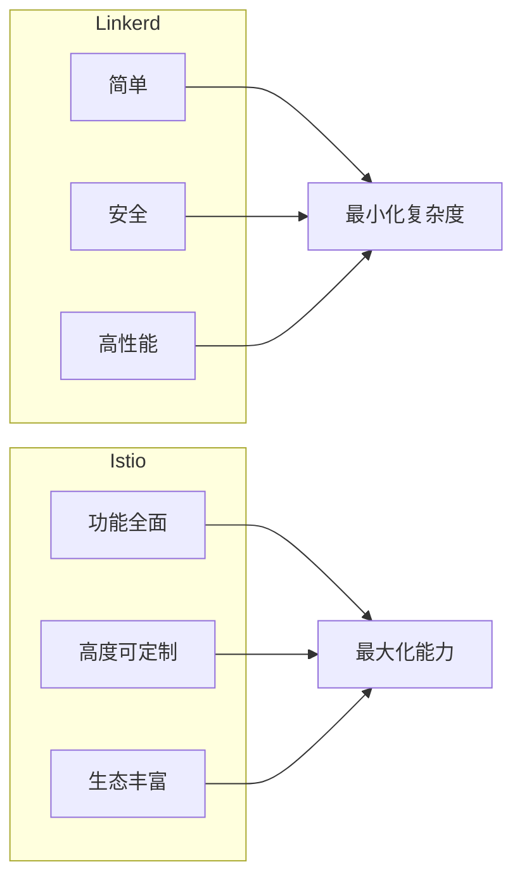
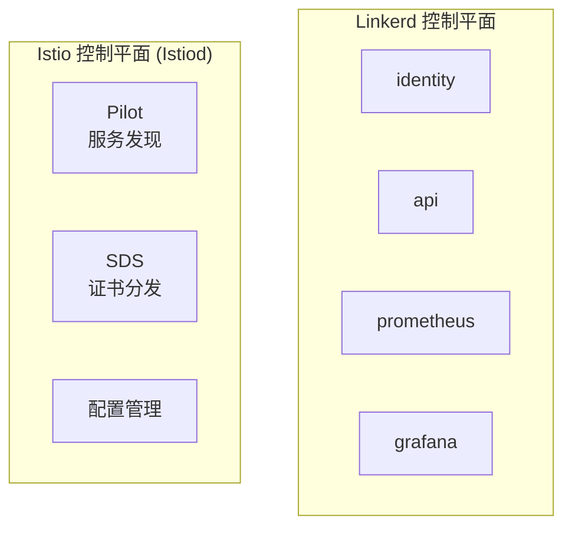
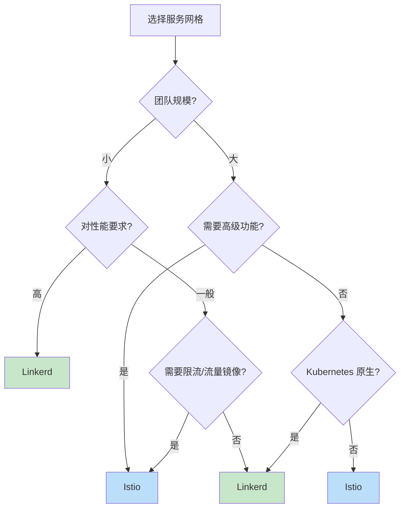

在选择服务网格时，Linkerd 和 Istio 是两个最常被比较的方案。它们代表了不同的设计哲学：Linkerd 追求「简单、安全、高性能」，Istio 追求「功能全面、高度可定制」。

本文将从架构、功能、性能、运维等多个维度进行深入对比。

## 设计哲学对比



| 设计理念 | Linkerd | Istio |
| --- | --- | --- |
| **核心目标** | 简单、安全、高性能 | 功能全面、高度可定制 |
| **设计原则** | 做少但做好 | 做全做到极致 |
| **社区态度** | 保持克制 | 持续扩展 |
| **适用人群** | 追求简单实用 | 需要精细控制 |

## 架构对比

### 控制平面架构

| 组件 | Linkerd | Istio |
| --- | --- | --- |
| **架构** | 简化设计，组件少 | 多组件（Citadel/Pilot/Mixer） |
| **统一性** | Istiod 统一控制 | 组件独立，功能分离 |
| **资源消耗** | 较低 | 较高 |
| **部署复杂度** | 低 | 高 |



### 数据平面架构

| 维度 | Linkerd | Istio |
| --- | --- | --- |
| **代理** | linkerd-proxy (Rust) | Envoy (C++) |
| **语言** | Rust | C++ |
| **资源消耗** | 10-20 MB/代理 | 50-100 MB/代理 |
| **启动时间** | < 100ms | 1-2s |
| **内存安全** | 编译时保证 | 运行时检查 |

## 功能对比

### 流量管理

| 功能 | Linkerd | Istio |
| --- | --- | --- |
| **基础路由** | ✓ | ✓ |
| **权重路由** | ✓ | ✓ |
| **Header 路由** | ✓ | ✓ |
| **流量镜像** | ✗ | ✓ |
| **流量分割** | ✓ (TrafficSplit) | ✓ |
| **超时配置** | ✓ | ✓ |
| **重试配置** | ✓ | ✓ |
| **熔断** | ✓ | ✓ |
| **限流** | ✗ (需插件) | ✓ |

### 安全功能

| 功能 | Linkerd | Istio |
| --- | --- | --- |
| **mTLS** | 默认开启 | 需配置 |
| **自动证书轮换** | ✓ | ✓ |
| **服务身份** | Kubernetes SA | SPIFFE |
| **授权策略** | 基础 | 细粒度 |
| **外部 CA 集成** | Limited | 完善 |

### 可观测性

| 功能 | Linkerd | Istio |
| --- | --- | --- |
| **指标** | ✓ | ✓ |
| **追踪** | ✓ | ✓ |
| **日志** | ✓ | ✓ |
| **可视化** | Linkerd Viz | Kiali |
| **Dashboard** | 内置 | 需安装 |
| **分布式追踪** | OpenCensus | OpenTelemetry |

## 性能对比

### 资源消耗

| 指标 | Linkerd | Istio |
| --- | --- | --- |
| **控制平面 CPU** | ~500m | ~2 cores |
| **控制平面内存** | ~512 MB | ~2 GB |
| **Sidecar CPU** | ~10m | ~50m |
| **Sidecar 内存** | ~15 MB | ~50-100 MB |
| **P99 延迟增加** | < 1ms | 1-2ms |

### 延迟对比测试

根据公开的基准测试数据：

| 场景 | 无代理 | Linkerd | Istio |
| --- | --- | --- | --- |
| **P50 延迟** | 1ms | 1.2ms | 1.5ms |
| **P99 延迟** | 5ms | 5.5ms | 7ms |
| **吞吐量** | 10k QPS | 9.5k QPS | 8.5k QPS |

:::info
**性能差异原因**：
- Linkerd-proxy 使用 Rust 编写，无 GC 开销
- Linkerd 功能更少，代码路径更短
- Envoy 功能丰富，处理逻辑更复杂
:::

## 配置对比

### 路由配置

#### Linkerd 配置

```yaml title="linkerd-route.yaml"
apiVersion: linkerd.io/v1alpha2
kind: ServiceProfile
metadata:
  name: review-service.default.svc.cluster.local
spec:
  routes:
    - name: GET /reviews
      condition:
        method: GET
        path: /reviews
      timeout: 1s
```

#### Istio 配置

```yaml title="istio-route.yaml"
apiVersion: networking.istio.io/v1beta1
kind: VirtualService
metadata:
  name: review-service
spec:
  hosts:
    - review-service
  http:
    - match:
        - uri:
            prefix: "/reviews"
      route:
        - destination:
            host: review-service
            subset: v1
      timeout: 1s
```

### 认证配置

#### Linkerd

```yaml title="linkerd-mtls.yaml"
# Linkerd mTLS 默认开启，无需额外配置
# 检查 mTLS 状态
linkerd viz edges
```

#### Istio

```yaml title="istio-mtls.yaml"
apiVersion: security.istio.io/v1beta1
kind: PeerAuthentication
metadata:
  name: default
  namespace: istio-system
spec:
  mtls:
    mode: STRICT
```

## 学习曲线对比

### Linkerd

| 阶段 | 时间 | 内容 |
| --- | --- | --- |
| **入门** | 1-2 小时 | 安装、基础概念 |
| **进阶** | 1 天 | Service Profile、流量分割 |
| **生产** | 3-5 天 | 高可用、安全加固 |

### Istio

| 阶段 | 时间 | 内容 |
| --- | --- | --- |
| **入门** | 1-2 天 | 安装、基础概念 |
| **进阶** | 1 周 | VirtualService、DestinationRule |
| **精通** | 2-4 周 | AuthorizationPolicy、自定义配置 |
| **生产** | 1-2 月 | 高可用、多集群 |

## 适用场景对比

### 选择 Linkerd 的场景

| 场景 | 说明 |
| --- | --- |
| **团队规模小** | 配置简单，学习成本低 |
| **追求性能** | 对延迟敏感，资源受限 |
| **Kubernetes 原生** | 主要运行在 K8s 环境 |
| **快速落地** | 需要快速看到效果 |
| **基础安全需求** | 只需要 mTLS 基础安全 |

### 选择 Istio 的场景

| 场景 | 说明 |
| --- | --- |
| **企业级应用** | 需要丰富的高级功能 |
| **多语言架构** | Java/Go/Python 等多种语言 |
| **精细化控制** | 需要细粒度的流量管理 |
| **复杂网络** | 多集群、混合云 |
| **深度集成** | 与现有系统深度集成 |

## 功能矩阵

| 功能 | Linkerd | Istio |
| --- | --- | --- |
| **流量管理** | | |
| - 基于权重的路由 | ✓ | ✓ |
| - 基于 Header 的路由 | ✓ | ✓ |
| - 流量镜像 | ✗ | ✓ |
| - 金丝雀发布 | ✓ | ✓ |
| - A/B 测试 | ✓ | ✓ |
| **弹性能力** | | |
| - 超时 | ✓ | ✓ |
| - 重试 | ✓ | ✓ |
| - 熔断 | ✓ | ✓ |
| - 限流 | ✗ | ✓ |
| - 故障注入 | ✓ | ✓ |
| **安全** | | |
| - mTLS | ✓ (默认) | ✓ (需配置) |
| - 自动证书轮换 | ✓ | ✓ |
| - 细粒度授权 | ✗ | ✓ |
| - 外部 CA | Limited | ✓ |
| **可观测性** | | |
| - 指标 | ✓ | ✓ |
| - 追踪 | ✓ | ✓ |
| - 日志 | ✓ | ✓ |
| - 可视化 Dashboard | Linkerd Viz | Kiali |

## 迁移考虑

### 从 Linkerd 迁移到 Istio

**难度**：高

**原因**：
- 配置格式完全不同
- 需要重新设计安全策略
- 需要迁移 Service Profile 到 VirtualService

**建议**：
1. 渐进式迁移，避免一次性切换
2. 保持双网格运行，逐步迁移
3. 充分测试后再切换生产流量

### 从 Istio 迁移到 Linkerd

**难度**：高

**原因**：
- Linkerd 功能较少，可能不满足需求
- 需要简化现有配置

**建议**：
1. 评估现有功能是否都可在 Linkerd 实现
2. 简化安全策略，利用 Linkerd 默认安全
3. 逐步迁移，避免业务中断

## 总结

### 选择决策树



### 快速对比表

| 维度 | Linkerd | Istio |
| --- | --- | --- |
| **复杂度** | ⭐⭐ | ⭐⭐⭐⭐⭐ |
| **性能** | ⭐⭐⭐⭐⭐ | ⭐⭐⭐ |
| **功能** | ⭐⭐⭐ | ⭐⭐⭐⭐⭐ |
| **学习曲线** | ⭐⭐ | ⭐⭐⭐⭐ |
| **资源消耗** | ⭐⭐⭐⭐⭐ | ⭐⭐⭐ |
| **可扩展性** | ⭐⭐ | ⭐⭐⭐⭐⭐ |

**最终建议**：

- **选 Linkerd**：团队小、追求简单、需要高性能
- **选 Istio**：企业级需求、需要高级功能、愿意投入运维成本

**延伸思考**：随着服务网格技术的成熟，未来可能出现「统一控制平面 + 可插拔数据平面」的架构，同时支持 Linkerd-proxy 和 Envoy，让用户可以根据需求选择数据平面。
