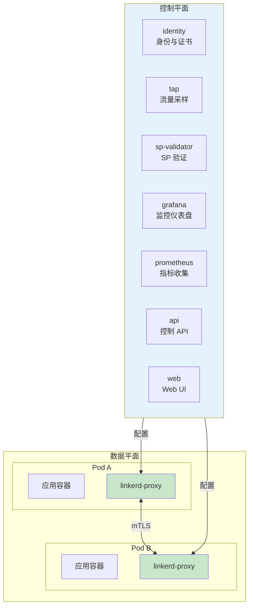
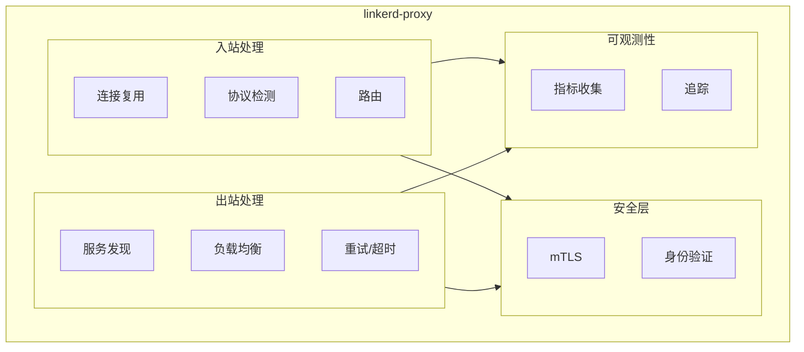
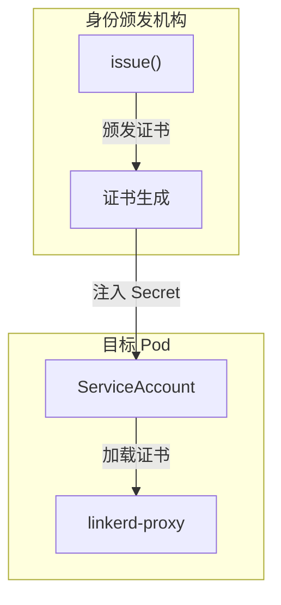

在 Istio 越来越复杂的背景下，Linkerd 以「简单、安全、高性能」为口号，成为了另一个值得关注的的服务网格方案。

Linkerd 由 Buoyant 公司开发，采用 Rust 语言重写了数据平面代理（Linkerd2-proxy），追求极致的性能和安全性。本文将深入解析 Linkerd 的架构设计。

## 核心理念

Linkerd 的设计哲学可以概括为三个关键词：

| 关键词 | 说明 | Istio 对比 |
| --- | --- | --- |
| **简单** | 配置简单，学习曲线平缓 | 配置复杂 |
| **安全** | 零信任，mTLS 默认开启 | 需要手动配置 |
| **高性能** | Rust 编写，内存安全，延迟极低 | Envoy C++，延迟稍高 |

:::info
**为什么选择 Rust**：
Rust 提供了内存安全保证，无需垃圾回收器，避免了 GC 暂停；同时 Rust 的性能与 C++ 相当，是构建高性能数据平面代理的理想选择。
:::

## 架构概览



## 核心组件

### 控制平面组件

| 组件 | 职责 | 部署位置 |
| --- | --- | --- |
| **identity** | mTLS 证书颁发 | 命名空间级别 |
| **tap** | 实时流量采样 | 控制平面 |
| **sp-validator** | 服务配置文件验证 | 控制平面 |
| **prometheus** | 指标收集存储 | 控制平面 |
| **grafana** | 监控仪表盘 | 控制平面 |
| **api** | 控制平面 API | 控制平面 |
| **web** | Web UI | 控制平面 |

### 数据平面组件

| 组件 | 职责 |
| --- | --- |
| **linkerd-proxy** | Rust 编写的超轻量代理 |

## Linkerd-proxy 深度解析

### 为什么要用 Rust 重写

Envoy 是用 C++ 编写的，虽然性能优秀，但存在以下问题：

| 问题 | 说明 |
| --- | --- |
| **内存安全** | C++ 需要手动内存管理，容易出现缓冲区溢出等安全问题 |
| **GC 暂停** | 虽然 C++ 没有 GC，但某些库可能引入延迟 |
| **资源消耗** | Envoy 功能丰富，但资源消耗也较高 |

Linkerd2-proxy 使用 Rust 重写，实现了：

- **内存安全**：Rust 的所有权系统和借用检查器保证内存安全
- **零 GC**：无垃圾回收器，延迟可预测
- **极低资源消耗**：每个代理约 10-20MB 内存
- **极低延迟**：官方数据 P99 延迟增加 < 1ms

### Linkerd-proxy 架构



### 与 Envoy 的对比

| 维度 | Linkerd-proxy | Envoy |
| --- | --- | --- |
| **语言** | Rust | C++ |
| **内存消耗** | 10-20 MB | 50-100 MB |
| **CPU 消耗** | 极低 | 中等 |
| **启动时间** | < 100ms | 1-2s |
| **配置复杂度** | 低 | 高 |
| **L7 协议支持** | HTTP/gRPC | HTTP/gRPC/TCP/MongoDB 等 |
| **Filter 扩展** | 不支持 | 支持 |
| **社区生态** | 中等 | 庞大 |

## 服务配置文件

Linkerd 使用 **Service Profile** 定义服务的行为，这是 Linkerd 独特的配置方式：

### 基础配置

```yaml title="service-profile.yaml"
apiVersion: linkerd.io/v1alpha2
kind: ServiceProfile
metadata:
  name: review-service.default.svc.cluster.local
  namespace: default
spec:
  routes:
    - name: GET /reviews/{id}
      condition:
        method: GET
        path: /reviews/[^/]+
      timeout: 1s
      responseClasses:
        - condition:
            status:
              min: 200
              max: 299
          isSuccess: true
        - condition:
            status:
              min: 500
              max: 599
          isSuccess: false
```

### 重试配置

```yaml title="retry-config.yaml"
apiVersion: linkerd.io/v1alpha2
kind: ServiceProfile
metadata:
  name: review-service.default.svc.cluster.local
  namespace: default
spec:
  routes:
    - name: GET /reviews
      isRetryable: true
      retryConditions:
        - status_5xx
        - reset
      timeout: 5s
```

### 断路器配置

```yaml title="circuit-breaker.yaml"
apiVersion: linkerd.io/v1alpha2
kind: ServiceProfile
metadata:
  name: database-service.default.svc.cluster.local
  namespace: default
spec:
  # 熔断配置
  outlierDetection:
    consecutiveErrors: 5
    interval: 10s
    baseEjectionTime: 30s
```

## 流量管理

### 流量分割（金丝雀发布）

```yaml title="traffic-split.yaml"
apiVersion: flagger.app/v1beta1
kind: Canary
metadata:
  name: review-service
  namespace: default
spec:
  targetRef:
    apiVersion: apps/v1
    kind: Deployment
    name: review-service
  service:
    port: 8080
  analysis:
    interval: 1m
    threshold: 5
    maxWeight: 50
    stepWeight: 10
---
apiVersion: splittedv1alpha3
kind: TrafficSplit
metadata:
  name: review-service
  namespace: default
spec:
  service: review-service
  backends:
    - service: review-service-v1
      weight: 90
    - service: review-service-v2
      weight: 10
```

### 灰度路由

Linkerd 通过 Service Profile 实现基于路由的灰度：

```yaml title="header-routing.yaml"
apiVersion: linkerd.io/v1alpha2
kind: ServiceProfile
metadata:
  name: api-service.default.svc.cluster.local
  namespace: default
spec:
  routes:
    # 内部用户走 v2
    - name: GET /api/internal
      condition:
        headers:
          x-user-type: internal
      destination:
        service: api-service-v2
    # 其他用户走 v1
    - name: GET /api
      destination:
        service: api-service-v1
```

## 安全架构

### mTLS 默认开启

Linkerd 默认启用 mTLS，无需额外配置：

```bash
# 检查 mTLS 配置
linkerd viz edges -n production

# 输出示例
SRC                          DST                       SECURED   TLSRELAY   ADDED    METRIC
review.default               product.default           √         true       5m58s    rps:0.9
product.default              database.default          √         true       5m58s    rps:12.4
```

### 身份系统

Linkerd 使用 Kubernetes ServiceAccount 作为身份标识：



## 可观测性

### Dashboard

```bash
# 打开 Linkerd Dashboard
linkerd viz dashboard &

# 查看命名空间概览
linkerd viz stat namespaces

# 查看服务详情
linkerd viz stat svc -n production

# 查看 Pod 延迟分布
linkerd viz top -n production
```

### 常用指标

```bash
# 查看服务 QPS
linkerd viz routes svc/review -n production

# 查看错误率
linkerd viz auth -n production

# 查看延迟 P99
linkerd viz stat svc -n production --from deploy/product
```

### 与 Prometheus/Grafana 集成

Linkerd 自带 Prometheus 和 Grafana，也可以接入外部系统：

```yaml title="external-prometheus.yaml"
apiVersion: v1
kind: ConfigMap
metadata:
  name: linkerd-config
  namespace: linkerd
data:
  global: |
    {
      "prometheusUrl": "http://prometheus.monitoring:9090"
    }
```

## 安装与升级

### 简化安装

```bash
# 安装 Linkerd CLI
curl -sL https://run.linkerd.io/install | sh

# 验证安装
linkerd version

# 安装到集群
linkerd install | kubectl apply -f -

# 安装控制平面组件
linkerd install --crds | kubectl apply -f -
linkerd install | kubectl apply -f -
```

### 自动注入

```bash
# 为命名空间启用自动注入
kubectl annotate namespace default linkerd.io/inject=enabled

# 部署应用
kubectl apply -f deployment.yaml

# 验证注入
kubectl get pod -o yaml | grep linkerd-proxy
```

### 升级

```bash
# 检查版本
linkerd upgrade | kubectl apply -f -

# 验证升级
linkerd check
```

## 与 Istio 对比总结

| 维度 | Linkerd | Istio |
| --- | --- | --- |
| **数据平面** | Rust (linkerd-proxy) | C++ (Envoy) |
| **控制平面** | Go | Go |
| **资源消耗** | 极低 | 中等 |
| **配置复杂度** | 低 | 高 |
| **学习曲线** | 平缓 | 陡峭 |
| **功能丰富度** | 基础但够用 | 极其丰富 |
| **扩展性** | 有限 | 强大 |
| **生态工具** | Linkerd Viz | Kiali/Prometheus/Jaeger |
| **适合场景** | 追求简单安全 | 企业级复杂场景 |

## 适用场景

### 推荐使用 Linkerd

- 团队规模小，希望快速上手服务网格
- 追求简单、安全，不需要太多高级功能
- 对性能敏感，需要极低延迟
- Kubernetes 原生应用

### 推荐使用 Istio

- 企业级应用，需要丰富的高级功能
- 多语言技术栈，需要精细化控制
- 需要与其他系统深度集成
- 团队有足够能力运维复杂系统

## 总结

Linkerd 以「简单、安全、高性能」为核心理念，提供了一个轻量级的服务网格解决方案：

| 特性 | Linkerd 优势 |
| --- | --- |
| **简单性** | 配置简洁，学习曲线平缓 |
| **安全性** | mTLS 默认开启，无需额外配置 |
| **性能** | Rust 编写，资源消耗极低 |
| **可靠性** | 代码量少，经过严格测试 |

**延伸思考**：Linkerd 和 Istio 代表了两种不同的设计哲学——Linkerd 追求「做得少但做得好」，Istio 追求「做得全」。没有绝对的优劣之分，只有适合与否。在实际项目中，可以根据团队能力和业务需求进行选择，也可以考虑两者结合使用。
