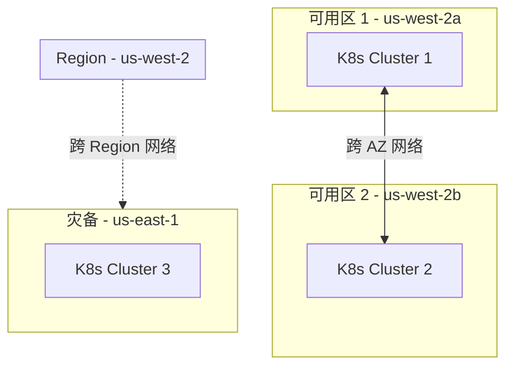
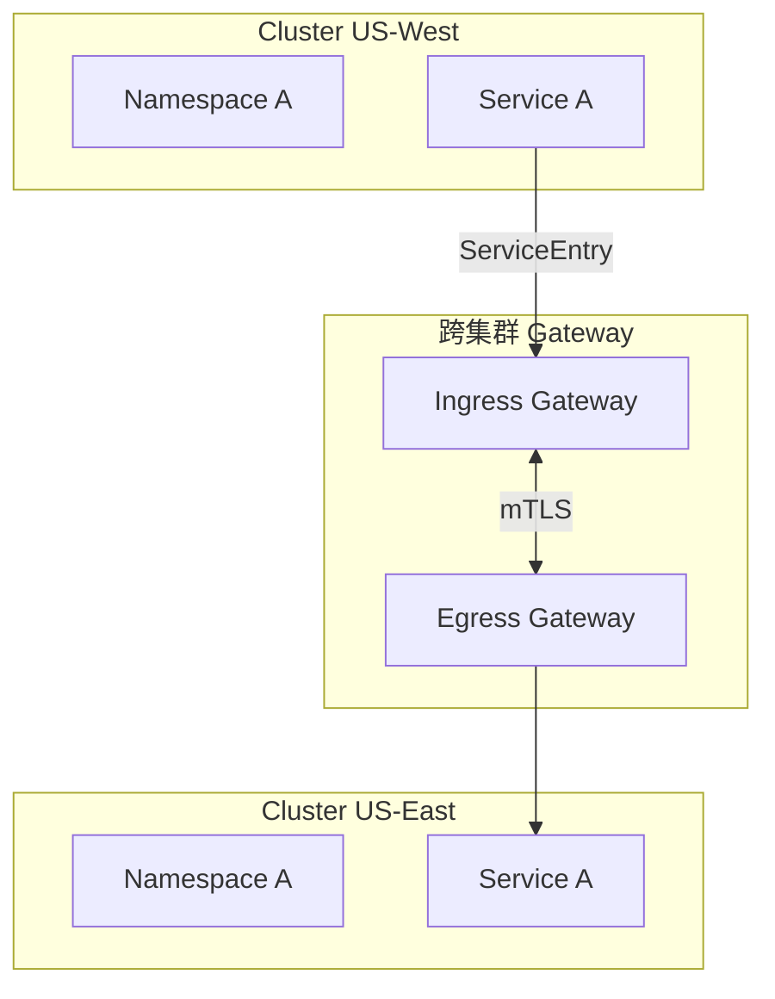
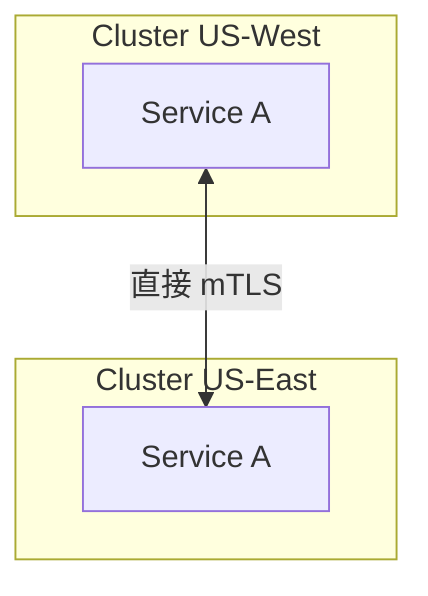
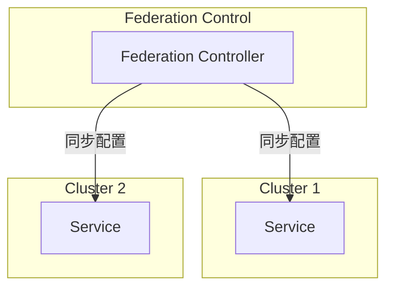
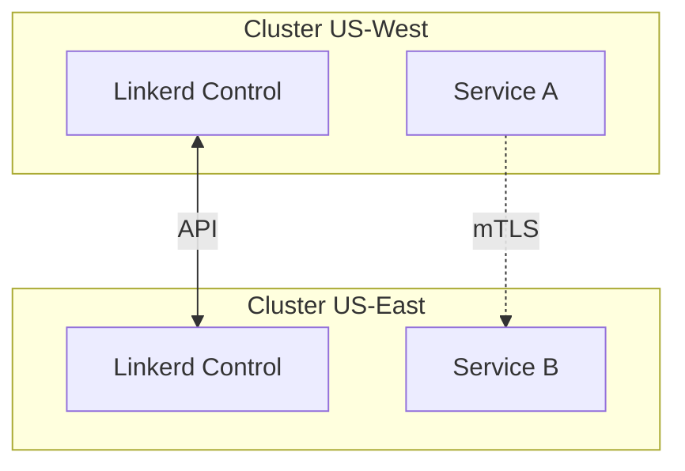
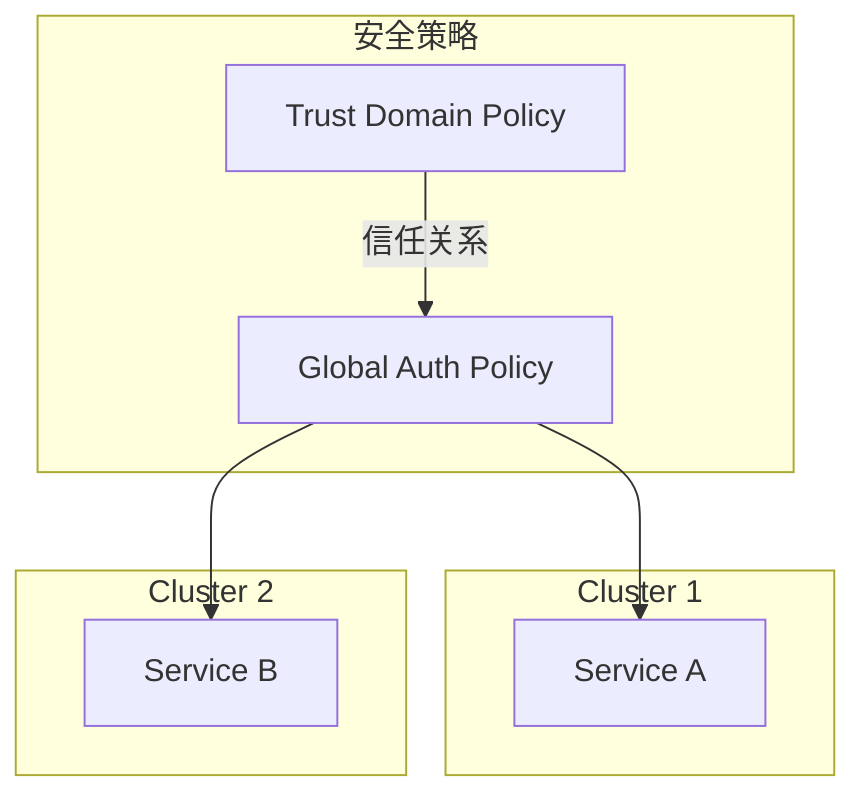
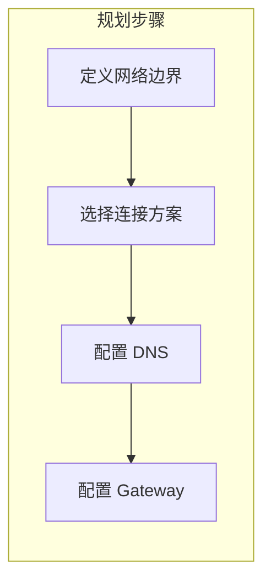

随着业务规模的增长，单个 Kubernetes 集群往往无法满足需求。你可能需要：

- 跨可用区（AZ）部署，提高可用性
- 跨地域部署，降低延迟
- 隔离不同环境（测试/生产）
- 支持多租户场景

多集群服务网格应运而生，它让服务可以透明地跨集群通信，同时保持统一的安全策略和可观测性。

## 多集群需求场景



| 场景 | 需求 | 挑战 |
| --- | --- | --- |
| **高可用** | 跨 AZ 部署 | 网络延迟、一致性 |
| **低延迟** | 跨地域部署 | 网络延迟、路由选择 |
| **环境隔离** | 测试/生产分离 | 配置同步、安全隔离 |
| **多租户** | 逻辑隔离 | 资源隔离、访问控制 |

## 多集群服务网格模型

### 模型一：多网络（Multi-Network）

集群处于不同的网络，需要通过 Gateway 连接：



**适用场景**：集群间网络隔离、需要严格控制跨集群流量

### 模型二：扁平网络（Flat Network）

所有集群共享扁平网络，服务可直接通信：



**适用场景**：集群间网络互通、追求最低延迟

### 模型三：联邦（Federation）

通过联邦机制同步配置和服务：



**适用场景**：需要统一管理配置、跨集群服务发现

## Istio 多集群方案

### 方案一：Cross-Cluster Service Discovery

通过 ServiceEntry 手动配置跨集群服务：

```yaml title="cross-cluster-entry.yaml"
# 在 Cluster 1 上定义 Cluster 2 的服务
apiVersion: networking.istio.io/v1beta1
kind: ServiceEntry
metadata:
  name: service-a-remote
spec:
  hosts:
    - service-a.cluster-2.svc.global
  location: MESH_INTERNAL
  ports:
    - name: http
      number: 8080
      protocol: HTTP
  resolution: DNS
  endpoints:
    - address: <cluster-2-gateway-ip>
      locality: us-east-1
      ports:
        http: 15443
```

### 方案二：Mesh Federation

Istio 1.18+ 支持原生的 Mesh Federation：

```yaml title="mesh-federation.yaml"
# Cluster 1 上的 Peering 配置
apiVersion: networking.istio.io/v1alpha3
kind: MeshConfig
metadata:
  name: default
spec:
  locality:
    enabled: true
  defaultConfig:
    proxyMetadata:
      ISTIO_META_DNS_AUTO_ALLOCATE: "true"
      ISTIO_META_DNS_CAPTURE: "true"
```

### 配置示例

```yaml title="east-west-gateway.yaml"
# 部署跨集群网关
apiVersion: install.istio.io/v1alpha1
kind: IstioOperator
metadata:
  name: eastwestgateway
  namespace: istio-system
spec:
  profile: empty
  components:
    ingressGateways:
      - name: istio-eastwestgateway
        namespace: istio-system
        enabled: true
        label:
          istio: eastwestgateway
        k8s:
          service:
            type: ClusterIP
            ports:
              - name: tls
                port: 15443
              - name: https
                port: 443
```

## Linkerd 多集群

### 架构



### 安装多集群支持

```bash
# 在每个集群上启用多集群
linkerd multicluster link --cluster-name us-west | kubectl apply -f -
linkerd multicluster link --cluster-name us-east | kubectl apply -f -
```

### 服务导出

```yaml title="service-export.yaml"
apiVersion: multicluster.linkerd.io/v1alpha1
kind: ServiceMirror
metadata:
  name: backend-service
spec:
  sourceCluster: us-west
  sourceNamespace: production
  targetCluster: us-east
  targetNamespace: production
```

## 跨集群流量管理

### 本地优先策略

```yaml title="locality-routing.yaml"
# 优先使用本地服务，跨集群作为备份
apiVersion: networking.istio.io/v1beta1
kind: DestinationRule
metadata:
  name: service-a
spec:
  host: service-a
  trafficPolicy:
    localityLbSetting:
      enabled: true
      distribute:
        - from: us-west-2/*
          to:
            "us-west-2/*": 100
        - from: us-east-1/*
          to:
            "us-east-1/*": 100
            "us-west-2/*": 0
```

### 故障转移策略

```yaml title="failover.yaml"
apiVersion: networking.istio.io/v1beta1
kind: DestinationRule
metadata:
  name: critical-service
spec:
  host: critical-service
  trafficPolicy:
    outlierDetection:
      consecutive5xxErrors: 3
      interval: 30s
      baseEjectionTime: 60s
      # 允许故障转移到其他集群
      maxEjectionPercent: 100
```

## 统一安全管理

### 跨集群 mTLS

```yaml title="cross-cluster-mtls.yaml"
# 跨集群认证策略
apiVersion: security.istio.io/v1beta1
kind: AuthorizationPolicy
metadata:
  name: cross-cluster-auth
spec:
  selector:
    matchLabels:
      app: api-gateway
  rules:
    # 允许来自 us-west 集群的 payment 服务
    - from:
        - source:
            principals:
              - "cluster/us-west/ns/production/sa/payment"
      to:
        - operation:
            methods: ["POST"]
```

### 统一的安全策略



## 可观测性

### 统一监控

```yaml title="unified-monitoring.yaml"
# 配置 Prometheus 跨集群抓取
prometheus:
  server:
    remoteWriteConfigs:
      - url: http://central-prometheus:9090/api/v1/write

# 或使用 Thanos 实现全局视图
thanos:
  sidecar:
    - cluster: us-west
      prometheus: prometheus-us-west
    - cluster: us-east
      prometheus: prometheus-us-east
```

### 分布式追踪

```yaml title="distributed-tracing.yaml"
# 配置 Jaeger 跨集群追踪
apiVersion: v1
kind: ConfigMap
metadata:
  name: istio
  namespace: istio-system
data:
  mesh: |
    defaultConfig:
      tracing:
        sampling: 10
        zipkin:
          address: jaeger-collector.observability:9411
        openCensusAddress: jaeger-agent.observability:55678
```

## 常见问题与解决

### 问题一：跨集群延迟高

**原因**：跨集群网络延迟不可控

**解决方案**：
- 本地优先路由
- 考虑业务分区
- 使用就近访问

### 问题二：配置同步困难

**原因**：多个集群需要保持配置一致

**解决方案**：
- GitOps 管理
- Federation 机制
- 配置即代码

### 问题三：故障隔离困难

**原因**：跨集群依赖可能放大故障

**解决方案**：
- 独立部署、独立扩容
- 合理的超时和重试配置
- 熔断和降级策略

## 最佳实践

### 架构设计原则

| 原则 | 说明 |
| --- | --- |
| **服务独立** | 跨集群调用不是必须的，设计时可以避免 |
| **本地优先** | 同集群内优先，故障转移再跨集群 |
| **统一治理** | 安全策略、监控配置统一管理 |
| **渐进演进** | 先单集群，再逐步扩展到多集群 |

### 网络规划建议



| 步骤 | 要点 |
| --- | --- |
| **网络边界** | 确定哪些服务需要跨集群 |
| **连接方案** | VPN/Direct Connect/Public |
| **DNS 设计** | 全局 DNS vs 本地 DNS |
| **Gateway** | Ingress/Egress 规划 |

### 配置管理建议

```bash
# 使用 GitOps 管理多集群配置
# repo 结构
├── clusters/
│   ├── us-west/
│   │   └── istio-config.yaml
│   └── us-east/
│       └── istio-config.yaml
├── base/
│   └── istio-template.yaml
└── overlays/
    └── production/
        └── kustomization.yaml
```

## 总结

多集群服务网格是复杂但必要的架构选择：

| 方案 | 复杂度 | 适用场景 |
| --- | --- | --- |
| **Istio Cross-Cluster** | 高 | 已有 Istio，需要跨集群 |
| **Istio Federation** | 中 | Istio 1.18+，需要原生支持 |
| **Linkerd Multicluster** | 低 | 追求简单，已有 Linkerd |
| **Consul Federation** | 中 | 已有 Consul，需要一致性 |

**选择建议**：

1. **先评估需求**：是否真的需要多集群
2. **选择合适方案**：根据现有技术栈选择
3. **渐进演进**：不要一次性跨所有集群
4. **统一治理**：配置、策略、监控统一管理

**延伸思考**：多集群服务网格的运维复杂度远超单集群。在决定多集群架构之前，应该充分评估团队能力和运维成本。有时候，在单集群内部通过多命名空间实现逻辑隔离可能是更务实的选择。
