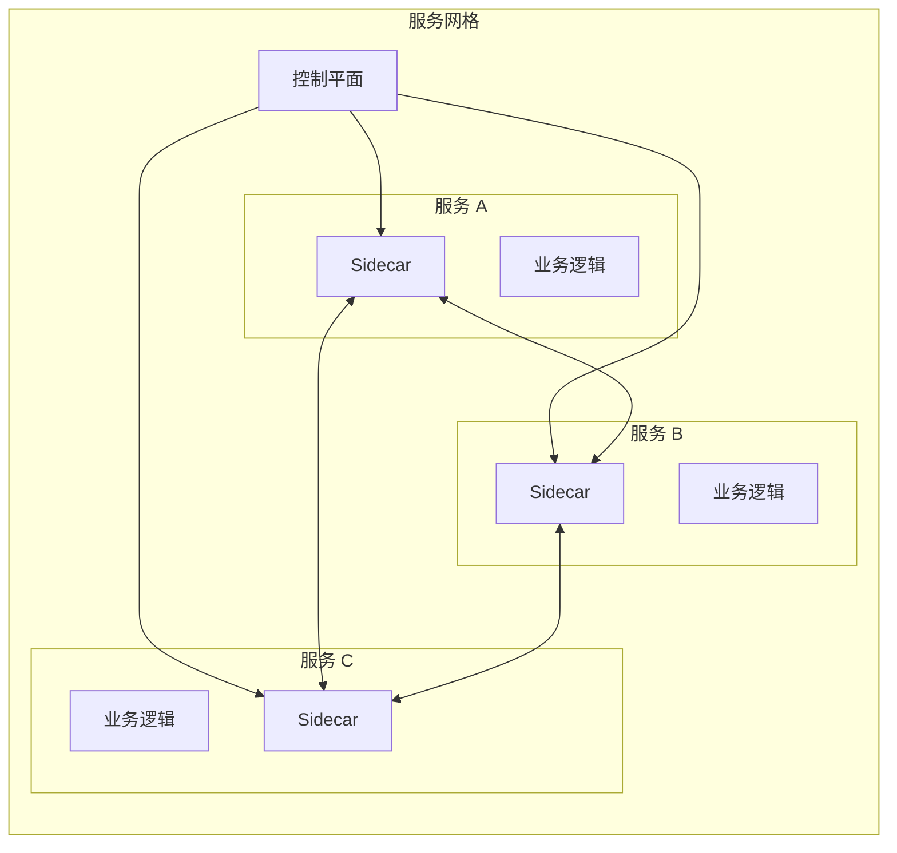
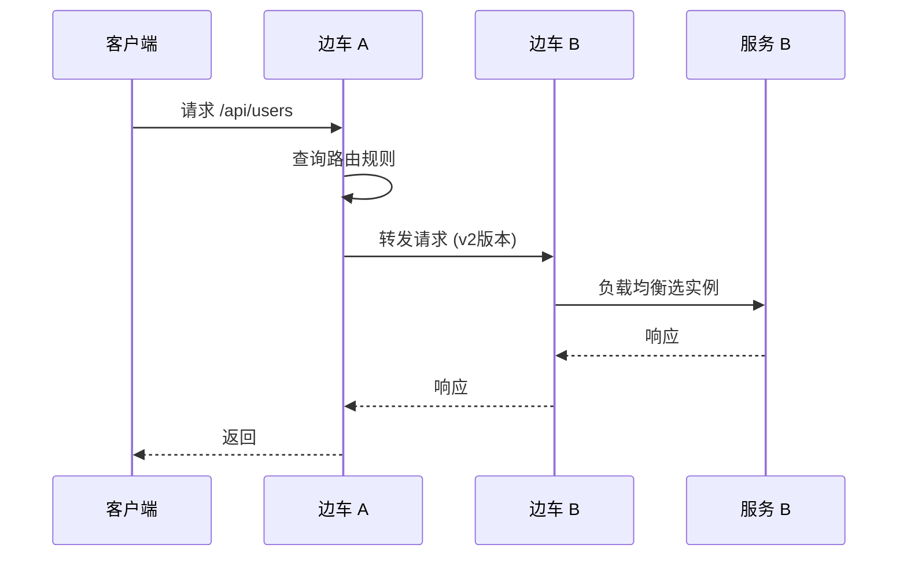

当微服务数量从几个增长到几十个时，服务治理的复杂性会指数级上升。你需要管理服务发现、负载均衡、熔断限流、链路追踪、访问安全……每一个功能都可能需要专门的库来处理。

早期的做法是在代码里引入 `Netflix OSS` 全家桶：`Eureka` 做注册中心、`Ribbon` 做负载均衡、`Hystrix` 做熔断、`Zuul` 做网关。听起来不错，但问题是：**这些能力分散在每个微服务的代码里，每改一次都要重新部署所有服务。**

如果有一个东西，能把这些治理逻辑从业务代码里抽离出来，变成基础设施的一部分，对业务代码完全透明——那会是什么？

这就是服务网格（Service Mesh）要解决的问题。

## 服务网格是什么

服务网格是一个**基础设施层**，专门处理服务间的通信。在典型的服务网格架构中，每个服务实例旁边都会部署一个**边车代理（Sidecar Proxy）**，所有出站和入站的请求都会经过这个代理。



这个架构带来了两个核心价值：

**价值一：业务逻辑与治理逻辑分离**。开发者只需要关心业务逻辑的实现，服务发现、负载均衡、熔断、加密这些能力全部由代理提供，业务代码零侵入。

**价值二：治理能力可以统一配置和动态更新**。修改一个配置项，所有服务的代理同时生效，不需要重新部署业务服务。

:::tip
服务网格的核心设计思想：**把「怎么做」和「配置什么策略」分开**。代理负责「怎么做」，控制平面负责「配置什么策略」。这样策略变更不需要改代码，更不需要重部署。
:::

## 服务网格的两大平面

服务网格的架构通常被拆分为两个平面：

### 数据平面（Data Plane）

数据平面��**边车代理**组成，负责处理所有数据包的转发、拦截和处理。

数据平面的核心功能：

- **流量拦截**：通过 iptables、eBPF 等技术拦截所有出入站流量
- **流量转发**：根据配置将请求路由到目标服务
- **可观测性**：收集请求的延迟、成功率等指标，生成分布式追踪
- **安全通信**：实现 mTLS 双向TLS认证，加密服务间通信

### 控制平面（Control Plane）

控制平面负责**管理和配置**所有的边车代理。

控制平面的核心功能：

- **策略分发**：将路由规则、安全策略、限流配置下发到各个代理
- **服务发现**：聚合来自服务注册中心的服务信息
- **证书管理**：签发和轮换 TLS 证书
- **配置管理**：管理代理的配置，支持热更新

:::info
用一个不太准确但形象的比喻：数据平面像是**道路**，控制平面像是**交通规则和信号灯系统**。道路负责实际的车辆通行，交通系统负责告诉车辆该怎么走、什么时候走、能不能走。
:::

## 服务网格的核心能力

### 流量管理

服务网格提供了细粒度的流量控制能力：

| 能力 | 说明 | 典型场景 |
| --- | --- | --- |
| **负载均衡** | 轮询、加权、最小连接、一致性哈希 | 金丝雀发布、A/B测试 |
| **路由** | 基于 header、权重、版本的服务路由 | 灰度发布、流量镜像 |
| **熔断** | 自动隔离故障实例 | 服务降级、故障隔离 |
| **限流** | 基于来源、目标的请求速率限制 | 防刷、流量保护 |



### 安全

服务网格将安全能力下沉到基础设施层：

- **mTLS 双向认证**：服务间通信强制加密和认证，无需应用代码处理证书
- **身份与授权**：基于服务身份的细粒度访问控制
- **流量加密**：所有服务间流量默认加密，包括 namespace 内部

```java title="服务网格安全示意"
# 无服务网格：应用需要自己处理 TLS
public class UserService {
    private SSLContext sslContext;  // 应用自己管理证书

    public User getUser(String id) {
        // 每个应用都要操心 TLS 配置
        HttpsURLConnection conn = (HttpsURLConnection)
            new URL("https://order-service/api/orders").openConnection();
        conn.setSSLSocketFactory(sslContext.getSocketFactory());
        // ... 处理证书过期、信任链验证 ...
    }
}

# 有服务网格：应用只关心业务逻辑
public class UserService {
    public User getUser(String id) {
        // 直接调用，不需要任何 TLS 代码
        return orderClient.getUserOrders(id);
    }
}
```

### 可观测性

服务网格为每个请求生成完整的追踪上下文：

- **分布式追踪**：每个请求带有 TraceID，跨服务串联
- **指标采集**：QPS、延迟、成功率、流量分布
- **日志关联**：通过 TraceID 将分散的日志聚合

```yaml title="可观测性配置示例"
apiVersion: v1
kind: DestinationRule
metadata:
  name: reviews
spec:
  host: reviews
  trafficPolicy:
    connectionPool:
      http:
        h2UpgradePolicy: UPGRADE
        http2MaxRequests: 100
        http1MaxPendingRequests: 100
        maxRequestsPerConnection: 100
    outlierDetection:
      consecutive5xxErrors: 5
      interval: 30s
      baseEjectionTime: 30s
      maxEjectionPercent: 50
```

:::warning
**可观测性不是银弹**。收集了数据，还需要配套的告警和可视化平台。如果只是把指标收集起来，没有人看、没有人用，那和没收集没什么区别。
:::

## 服务网格 vs 传统方案

| 维度 | 传统方案（代码库嵌入） | 服务网格 |
| --- | --- | --- |
| **实现方式** | 在每个应用里引入 SDK（如 Spring Cloud） | 边车代理，透明拦截流量 |
| **语言绑定** | 通常与特定语言绑定 | 语言无关，任何语言都可接入 |
| **升级方式** | 改代码、重新部署每个服务 | 更新代理，动态配置，热生效 |
| **一致性** | 不同服务可能用不同版本的库 | 所有代理版本统一，行为一致 |
| **运维负担** | 每个团队维护自己的依赖 | 需要运维整个网格，有额外学习成本 |
| **延迟开销** | 库调用直接执行 | 边车代理一跳，网络栈开销增加 1~3ms |

:::info
很多人会问：服务网格比 SDK 方案多了边车代理这一跳，延迟会不会很明显？

答案是：确实会增加延迟，但通常在 1~3ms 之间。对于大多数业务场景，这个开销是可以接受的。如果对延迟极其敏感（比如高频交易），可能需要更谨慎评估。
:::

## 服务网格的代价

任何架构设计都有 trade-off，服务网格也不例外：

**学习成本**：团队需要理解服务网格的概念、架构、配置方式。不是所有公司都有这个人力储备。

**资源消耗**：每个边车代理都在消耗 CPU 和内存。主流服务网格的边车代理开销大约在 50~100MB 内存、5~10% CPU。

**复杂度提升**：引入了新的基础设施组件，需要有人维护控制平面、升级代理版本、处理代理故障。

**调试难度**：流量经过边车代理后，出现问题时需要判断是应用问题还是代理问题。

## 什么时候应该考虑服务网格

服务网格不是万能药。以下场景可以考虑引入：

- 微服务数量较多（通常 > 20 个），服务治理逻辑复杂
- 多语言团队，不同服务用不同语言开发
- 对服务间安全通信有强制要求（如金融、政务行业）
- 需要统一的可观测性和链路追踪
- 正在进行微服务改造，需要渐进式演进

以下场景可能不需要服务网格：

- 服务数量少（个位数），团队可以轻松维护 SDK
- 单体应用或简单架构
- 对延迟极其敏感，代理开销不可接受
- 团队规模小，没有专职基础设施工程师

:::tip
**选型建议**：如果你的团队已经在用 Spring Cloud/Netflix OSS，服务网格提供的能力很多可以用 SDK 实现。只有当 SDK 方案的维护成本开始超过服务网格的引入成本时，才是真正需要考虑迁移的时机。
:::

## 术语表

| 术语 | 英文 | 解释 |
| --- | --- | --- |
| 服务网格 | Service Mesh | 处理服务间通信的基础设施层 |
| 数据平面 | Data Plane | 边车代理组成的流量处理层 |
| 控制平面 | Control Plane | 管理配置下发的控制层 |
| 边车代理 | Sidecar Proxy | 部署在每个服务实例旁的代理 |
| 流量拦截 | Traffic Interception | 拦截并处理所有出入站流量 |

## 延伸思考

服务网格解决了微服务治理的问题，但它本身也在演进。当前主流的服务网格实现（Istio、Linkerd、Consul Connect）各有侧重，选择时需要考虑：

- **与 Kubernetes 的集成深度**：是否需要 K8s 原生支持
- **性能优先级 vs 功能丰富度**：Linkerd 更轻量，Istio 功能更全但更重
- **运维复杂度**：控制平面和数据平面的升级是否平滑

更重要的是：服务网格解决了「服务间怎么通信」的问题，但它不解决「服务应该怎么拆分」的问题。在引入服务网格之前，先把微服务的边界想清楚，比什么都重要。
