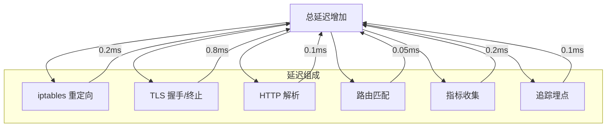
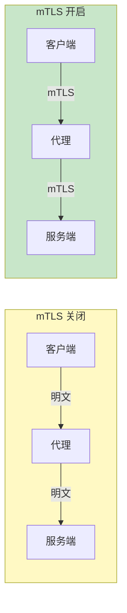

服务网格通过 Sidecar 代理处理所有流量，带来了便利性，但也引入了额外的性能开销。在做技术选型时，你需要清楚地了解这些开销，并评估是否在业务可接受范围内。

## 性能开销的来源

### Sidecar 代理的额外跳点

没有服务网格时，请求直接通过网络栈：

```
客户端 → 服务 A → 服务 B → 服务 C
```

引入服务网格后，每个请求都经过 Sidecar 代理：

```
客户端 → Sidecar A → Sidecar B → Sidecar C → 服务 A → 服务 B → 服务 C
```

每个 Sidecar 代理都会引入额外的处理延迟。

### 延迟来源分析

| 阶段 | 说明 | 延迟贡献 |
| --- | --- | --- |
| **iptables 重定向** | 流量重定向到 Sidecar | 0.1-0.3ms |
| **TLS 握手** | mTLS 加密/解密 | 0.5-1ms |
| **协议解析** | HTTP/gRPC 解析 | 0.1-0.2ms |
| **配置处理** | xDS 配置应用 | 0.05ms |
| **日志/指标** | 可观测性数据收集 | 0.1-0.3ms |

## 延迟测试数据

### 基准测试对比

基于公开的测试数据（不同服务网格实现）：

| 场景 | 无代理 | Linkerd | Istio (Envoy) | Consul |
| --- | --- | --- | --- | --- |
| **P50 延迟** | 1ms | 1.2ms | 1.5ms | 1.4ms |
| **P99 延迟** | 5ms | 5.5ms | 7ms | 6ms |
| **P999 延迟** | 10ms | 11ms | 15ms | 13ms |
| **吞吐量** | 10k QPS | 9.5k QPS | 8.5k QPS | 9k QPS |

:::info
**测试环境**：
- 100 个 Pod
- 单次调用链深度 3 层
- mTLS 启用
- 有效负载 1KB
:::

### 延迟分解（Istio/Envoy）



## 资源消耗分析

### Sidecar 资源消耗

| 指标 | Linkerd-proxy | Envoy (Istio) |
| --- | --- | --- |
| **内存** | 10-20 MB | 50-100 MB |
| **CPU** | 10-30m | 50-100m |
| **启动时间** | < 100ms | 1-2s |
| **最大连接数** | 1000 | 10000 |

### 控制平面资源消耗

| 组件 | Linkerd | Istio |
| --- | --- | --- |
| **Istiod** | - | 2 核 CPU, 2GB 内存 |
| **identity** | 100m CPU, 128MB | - |
| **Prometheus** | 内置 | 内置 |
| **推荐节点数** | 3 | 3+ |

### 集群规模与资源估算

```yaml title="resource-estimation.yaml"
# 基于 100 个 Pod 的估算
# Linkerd
resources:
  controlPlane:
    cpu: 500m
    memory: 512MB
  dataPlane:
    perPod:
      memory: 20MB
      cpu: 20m

# 总计（100 Pod）
# 控制平面：500m CPU + 512MB 内存
# 数据平面：2 核 CPU + 2GB 内存

---
# Istio
resources:
  controlPlane:
    istiod:
      cpu: 2000m
      memory: 2GB
    ingressGateway:
      cpu: 1000m
      memory: 1GB
  dataPlane:
    perPod:
      memory: 80MB
      cpu: 50m

# 总计（100 Pod）
# 控制平面：3 核 CPU + 3GB 内存
# 数据平面：5 核 CPU + 8GB 内存
```

## 影响性能的因素

### mTLS 影响



| 配置 | 延迟增加 | CPU 增加 |
| --- | --- | --- |
| **无 TLS** | 0 | 0 |
| **mTLS (单向)** | 0.5ms | 5% |
| **mTLS (双向)** | 0.8ms | 10% |

### 追踪采样率影响

```yaml title="tracing-impact.yaml"
# 追踪采样率对性能的影响
sampling:
  rate: 100%    # P99 +0.5ms, CPU +15%
  rate: 10%     # P99 +0.2ms, CPU +5%
  rate: 1%      # P99 +0.1ms, CPU +2%
```

### xDS 推送频率影响

| 推送频率 | 内存消耗 | CPU 消耗 |
| --- | --- | --- |
| **每次变更推送** | 低 | 中 |
| **每 1 秒推送** | 中 | 中 |
| **每 10 秒推送** | 高 | 低 |

## 性能优化策略

### Sidecar 资源配置

```yaml title="sidecar-resources.yaml"
# 优化 Sidecar 资源配置
resources:
  requests:
    cpu: 100m
    memory: 128Mi
  limits:
    cpu: 1000m
    memory: 1Gi

# 限制并发连接
concurrency: 2  # 控制工作线程数
```

### 延迟优化

```yaml title="latency-optimization.yaml"
# Istio 配置优化
meshConfig:
  enableAutoMtls: true
  defaultConfig:
    # 减少追踪采样
    tracing:
      sampling: 5.0  # 5% 采样

    # 优化代理性能
    proxyMetadata:
      # 禁用 DNS 代理
      ISTIO_META_DNS_CAPTURE: "false"

# DestinationRule 优化
trafficPolicy:
  connectionPool:
    tcp:
      maxConnections: 100
    http:
      maxRequestsPerConnection: 100  # 长连接复用
```

### 吞吐量优化

```yaml title="throughput-optimization.yaml"
# 启用 HTTP/2
clusters:
  - name: service-a
    http2ProtocolOptions:
      maxConcurrentStreams: 100

# 优化连接池
trafficPolicy:
  connectionPool:
    tcp:
      connectTimeout: 5s
    http:
      h2UpgradePolicy: UPGRADE
      http1MaxPendingRequests: 100
```

## 性能测试方法

### 基准测试工具

```bash
# 使用 Fortio 进行基准测试
fortio load -c 10 -qps 100 -t 30s http://service-a:8080/api

# 使用 Wrk 进行 HTTP 基准测试
wrk -t 10 -c 100 -d 30s http://service-a:8080/api
```

### 测试脚本

```bash title="benchmark.sh"
#!/bin/bash

# 基准测试函数
benchmark() {
    local url=$1
    local name=$2

    echo "Testing $name..."
    fortio load -c 10 -qps 100 -t 60s "$url" > "result_${name}.json"

    # 提取延迟数据
    cat "result_${name}.json" | jq '.DurationHistogram'
}

# 测试不同场景
benchmark "http://service-v1/api" "baseline"
benchmark "http://service/api" "with-mesh"
```

### Prometheus 监控指标

```text title="performance-queries"
# Sidecar 延迟
histogram_quantile(0.99,
  sum(rate(envoy_cluster_upstream_rq_time_bucket[5m])) by (le, cluster_name)
)

# Sidecar 吞吐量
sum(rate(envoy_cluster_upstream_rq_total[5m])) by (cluster_name)

# mTLS 握手延迟
histogram_quantile(0.99,
  sum(rate(envoy_cluster_ssl_connection_error[5m])) by (cluster_name)
)

# 代理内存使用
envoy_server_memory_allocated
```

## 性能基准参考

### 业务场景与推荐方案

| 业务场景 | 可接受延迟增加 | 推荐方案 |
| --- | --- | --- |
| **实时交易** | < 1ms | Linkerd |
| **API 响应** | < 5ms | Linkerd / Istio |
| **后台任务** | 无限制 | 任意 |
| **长连接服务** | < 10ms | Linkerd |

### 容量规划指南

```yaml title="capacity-planning.yaml"
# 假设：100 Pod 集群

# 1. Sidecar 资源（每 Pod）
linkerd:
  memory: 20MB
  cpu: 20m

istio:
  memory: 80MB
  cpu: 50m

# 2. 控制平面资源
linkerd:
  total: 500m CPU + 1GB memory

istio:
  total: 3 cores CPU + 4GB memory

# 3. 网络带宽
# Sidecar 处理会额外消耗带宽
# 估算：基础流量 × 1.1
```

## 常见性能问题与解决

### 问题一：Sidecar 启动延迟

```yaml title="startup-fix.yaml"
# 增加 readinessProbe 等待时间
readinessProbe:
  initialDelaySeconds: 10
  periodSeconds: 5

# 或禁用 Sidecar 的某些功能
meshConfig:
  defaultConfig:
    proxyMetadata:
      # 禁用某些可选功能
      ISTIO_META_DNS_AUTO_ALLOCATE: "false"
```

### 问题二：高延迟 P99

```yaml title="high-latency-fix.yaml"
# 检查是否 mTLS 性能问题
# 考虑使用更快的 CPU
# 或减少追踪采样

# 启用连接池复用
trafficPolicy:
  connectionPool:
    http:
      maxRequestsPerConnection: 1000
```

### 问题三：内存使用过高

```yaml title="memory-fix.yaml"
# 限制 Envoy 缓存大小
static_resources:
  listener:
    - config:
        listener_filters:
          - name: envoy.filters.listener.original_dst

# 减少日志量
meshConfig:
  defaultConfig:
    tracing:
      sampling: 1.0  # 降低采样率
```

## 总结

服务网格的性能开销是真实存在的，但通常在可接受范围内：

| 指标 | Linkerd | Istio | 评估 |
| --- | --- | --- | --- |
| **P99 延迟增加** | ~0.5ms | ~2ms | 大多数业务可接受 |
| **内存消耗/Pod** | ~20MB | ~80MB | 需要预留资源 |
| **CPU 消耗/Pod** | ~20m | ~50m | 需要预留资源 |
| **吞吐量影响** | ~5% | ~15% | 高并发场景需评估 |

**优化建议**：

1. **评估实际影响**：在测试环境进行性能测试
2. **选择合适方案**：对性能敏感选 Linkerd
3. **优化配置**：调整采样率、资源配置
4. **预留资源**：规划集群时考虑 Sidecar 开销

**延伸思考**：随着 Sidecar 模式的成熟，「无 Sidecar」的 Ambient Mesh 正在成为新趋势，它通过节点级代理替代 Pod 级 Sidecar，理论上可以降低资源消耗，但目前成熟度还不够。
