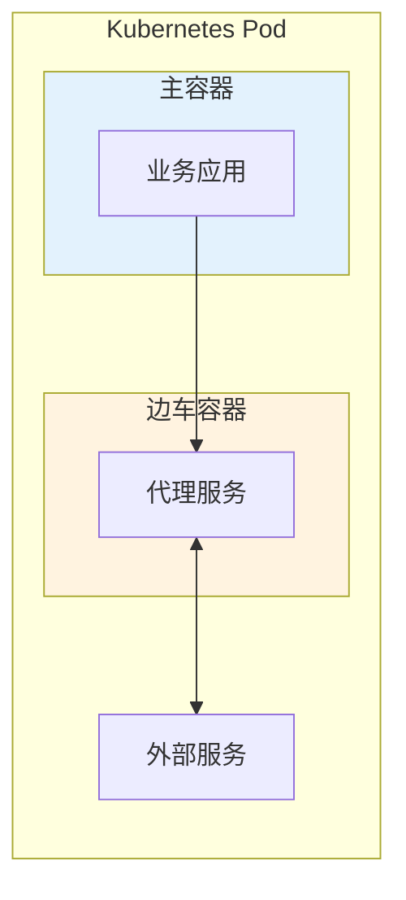
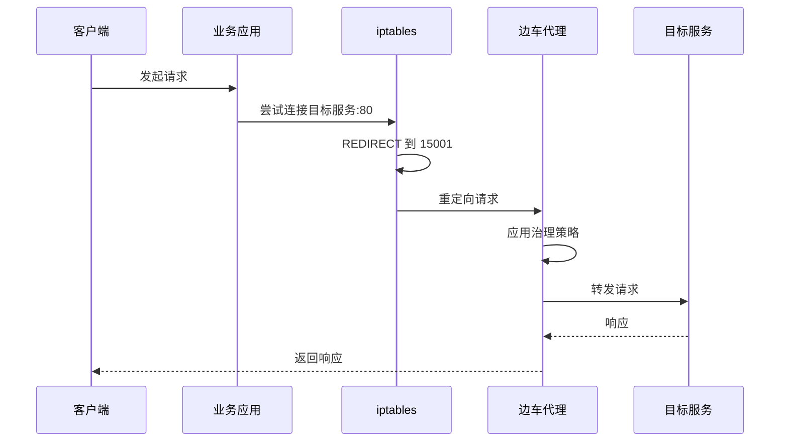
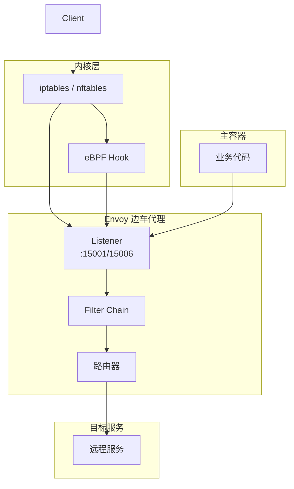
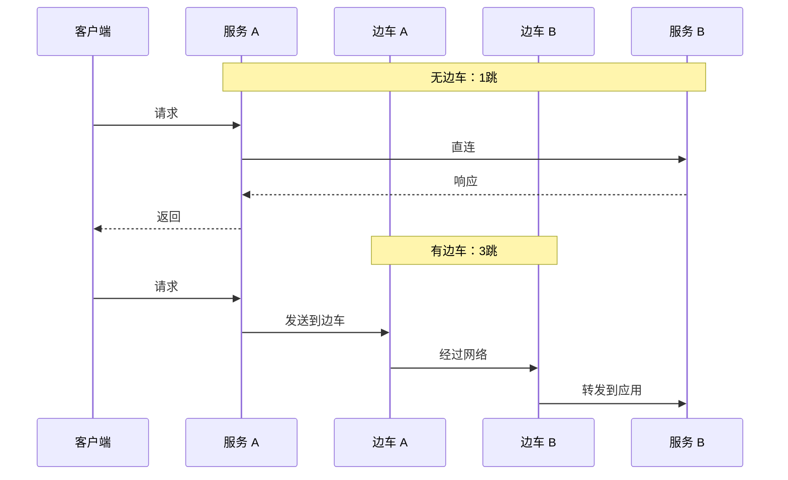

当你打开汽车的两侧车门时，会看到每侧车门旁边都有一个较小的座位——那是边车（Sidecar）的位置。在汽车出现之前，边车是挎在摩托车旁边的辅助座位。

软件架构中的边车模式借鉴了这个比喻：**在主服务旁边部署一个「辅助座位」，承载治理逻辑，让主服务专心处理业务。**

这个设计解决了一个古老的难题：如何在不修改业务代码的情况下，给服务添加流量管理、安全、可观测性等能力？

## 边车模式的核心思想

边车模式是一种**进程级别的解耦方式**。它将治理逻辑从主服务进程中抽离出来，单独部署为一个「边车」容器，与主服务部署在同一个 Pod 中（K8s 场景）。



### 边车与主服务的关系

| 维度 | 主容器（Main） | 边车容器（Sidecar） |
| --- | --- | --- |
| **职责** | 业务逻辑 | 治理逻辑（路由、安全、可观测性） |
| **生命周期** | 业务需求决定 | 通常与主容器一致 |
| **资源消耗** | 业务决定 | 固定开销（约 50~100MB 内存） |
| **语言依赖** | 业务语言 | 语言无关（二进制代理） |

:::info
**为什么叫「边车」而不是「辅助容器」？**

这个术语来自摩托车。边车固定在摩托车侧面，扩展了摩托车的功能，但本身不驱动摩托车前进。边车容器也一样，它扩展了主服务的功能，但本身不包含业务逻辑。
:::

## 流量劫持原理

边车模式的关键是：**所有出入站流量都必须经过边车代理**。这需要通过流量劫持（Traffic Interception）实现。

### iptables 流量重定向

最常见的方式是使用 iptables 的 `REDIRECT` 规则将流量重定向到边车代理。

```bash title="流量劫持 iptables 规则示例"
# 将出站 HTTP 流量重定向到边车代理端口 15001
iptables -t nat -A OUTPUT -p tcp --dport 80 -j REDIRECT --to-ports 15001

# 将入站流量重定向到边车代理端口 15006
iptables -t nat -A PREROUTING -p tcp -j REDIRECT --to-ports 15006

# 边车代理监听这些端口，接收并处理流量
```



### eBPF 流量拦截

在更现代的实现中，eBPF（Extended Berkeley Packet Filter）提供了更高效的流量拦截方式：

| 维度 | iptables | eBPF |
| --- | --- | --- |
| **工作层级** | 网络层（Netfilter） | 内核级别 |
| **性能开销** | 较高（每次规则匹配） | 较低（内核态处理） |
| **灵活性** | 规则修改需要刷新 | 支持动态更新 |
| **复杂度** | 简单 | 较复杂 |
| **兼容性** | 所有 Linux 版本 | 需要较新内核（4.x+） |

Istio 从 1.7 版本开始支持 eBPF 模式，性能比 iptables 提升约 20%。

### Envoy 的流量拦截流程



## 边车注入

边车代理是如何部署到每个 Pod 中的？这涉及到**边车注入（Sidecar Injection）**。

### 自动注入

在 Kubernetes + Istio 环境中，可以通过 `istio-injection=enabled` 标签启用自动注入：

```bash title="启用自动注入"
# 为 namespace 启用自动注入
kubectl label namespace default istio-injection=enabled

# 所有新建的 Pod 会自动注入边车
kubectl apply -f deployment.yaml
```

启用后，Istio 的 mutating webhook 会在 Pod 创建时自动修改 YAML，添加边车容器：

```yaml title="注入前"
apiVersion: v1
kind: Pod
metadata:
  name: order-service
spec:
  containers:
  - name: order-service
    image: myapp/order-service:v1.0
    ports:
    - containerPort: 8080
```

```yaml title="注入后"
apiVersion: v1
kind: Pod
metadata:
  name: order-service
  annotations:
    sidecar.istio.io/status: '{"version":"..."}'
spec:
  containers:
  - name: order-service
    image: myapp/order-service:v1.0
    ports:
    - containerPort: 8080
  - name: istio-proxy          # 自动添加的边车
    image: docker.io/istio/proxyv2:1.20.0
    ports:
    - containerPort: 15090
    - containerPort: 15021
    - containerPort: 15006
    env:
    - name: ISTIO_META_DNS_CAPTURE
      value: "true"
```

### 手动注入

如果需要更多控制，可以手动注入：

```bash title="手动注入"
# 查看原始 YAML
kubectl get pod order-service -o yaml > original.yaml

# 使用 istioctl 注入边车
istioctl kube-inject -f original.yaml > injected.yaml

# 应用注入后的配置
kubectl apply -f injected.yaml
```

### Init 容器

在边车容器之前，还会注入一个 `init` 容器，负责配置 iptables 规则：

```yaml title="Init 容器配置"
initContainers:
- name: istio-init
  image: docker.io/istio/proxyv2:1.20.0
  args:
  - istio-iptables
  - --route-propagate
  - --redirect
  - --InboundPorts=8080
  - --OutboundPorts=
  - --UID=1337
  - --GID=1337
```

:::warning
**Init 容器的限制**：Init 容器在 Pod 生命周期中只运行一次，配置 iptables 规则。如果规则配置失败，Pod 无法启动。这意味着边车注入失败会导致整个 Pod 无法部署。
:::

## 边车模式的优势

### 业务代码零侵入

最大的价值：**不需要在业务代码里引入任何 SDK**。

```java title="无服务网格版本"
public class OrderService {
    // 每个服务都要引入一堆依赖
    private DiscoveryClient discoveryClient;
    private LoadBalancerClient loadBalancer;
    private CircuitBreakerRegistry circuitBreakerRegistry;
    private TracingClient tracingClient;

    public Order getOrder(Long orderId) {
        // 每个调用都要手动处理熔断、重试、追踪
        String serviceId = "inventory-service";
        CircuitBreaker cb = circuitBreakerRegistry.circuitBreaker(serviceId);
        Span span = tracingClient.startSpan("getOrder");

        return Decorators.ofSupplier(() -> {
            String url = loadBalancer.choose(serviceId);
            return restTemplate.getForObject(url + "/inventory/" + orderId, Order.class);
        })
        .withCircuitBreaker(cb)
        .withRetry(retry)
        .decorate()
        .get();
    }
}
```

```java title="有服务网格版本"
public class OrderService {
    // 业务代码只需要关心业务
    private RestTemplate restTemplate;

    public Order getOrder(Long orderId) {
        // 直接调用，像调用本地服务一样
        return restTemplate.getForObject(
            "http://inventory-service/inventory/" + orderId,
            Order.class
        );
        // 熔断、重试、追踪全部由边车代理透明处理
    }
}
```

### 多语言支持

边车代理是**语言无关的**。无论你的服务用 Java、Go、Python 还是 Node.js 写的，都能获得相同的治理能力。

### 配置统一管理

所有边车代理从控制平面获取配置，配置变更可以热生效，不需要重启服务。

## 边车模式的代价

### 资源开销

每个 Pod 都需要运行一个边车容器：

| 资源 | 典型开销 |
| --- | --- |
| 内存 | 50~100 MB |
| CPU | 5~15% 单核 |
| 启动时间 | 1~3 秒 |

对于有 100 个 Pod 的集群，额外资源开销大约是 5~10 GB 内存。

### 网络跳数增加

从「应用直连」变成「应用 → 边车 → 目标边车 → 目标应用」，增加了两跳。



延迟增加约 1~3ms，大多数场景可接受。

### 调试复杂度

当请求出现问题时，需要判断是业务代码问题还是边车代理问题。增加了排查难度。

:::tip
**调试建议**：在开发环境保留一个「无代理」模式，方便排查问题。Istio 支持通过 `istioctl` 查看边车代理日志：

```bash
# 查看边车代理日志
kubectl logs -f order-service-xxx -c istio-proxy

# 抓取边车代理流量
istioctl proxy-config log order-service --level debug
```
:::

## 边车 vs 共享代理 vs SDK

| 模式 | 说明 | 优势 | 劣势 |
| --- | --- | --- | --- |
| **边车模式** | 每个 Pod 一个代理 | 完全隔离，语言无关 | 资源开销高 |
| **共享代理** | 多个 Pod 共享一个代理节点 | 资源开销低 | 需要节点级部署，复杂 |
| **SDK 嵌入** | 库直接嵌入应用进程 | 无额外网络跳数 | 需要改代码，语言绑定 |

## 常见问题与反模式

### 反模式一：边车代理版本不一致

不同 Pod 运行的边车代理版本不同，行为不一致，可能导致奇怪的问题。

**正确做法**：通过控制平面统一管理代理版本，确保所有边车代理版本一致。

### 反模式二：忽略边车资源规划

部署边车后没有调整 Pod 资源限制，导致节点资源不足。

**正确做法**：在规划集群容量时，把边车代理的资源开销计算进去。

### 反模式三：边车故障没有降级

边车代理出现问题时，请求直接失败，没有降级方案。

**正确做法**：配置边车代理的故障转移策略，必要时跳过边车直连。

## 术语表

| 术语 | 英文 | 解释 |
| --- | --- | --- |
| 边车模式 | Sidecar Pattern | 在主服务旁部署辅助容器的架构模式 |
| 边车注入 | Sidecar Injection | 自动或手动将边车代理部署到 Pod 中 |
| Init 容器 | Init Container | Pod 启动前运行的容器，负责配置网络规则 |
| 流量劫持 | Traffic Interception | 将流量重定向到边车代理的技术 |
| Mutating Webhook | Mutating Webhook | Kubernetes 准入控制器，自动修改 Pod 配置 |

## 延伸思考

边车模式是服务网格的基础，但它的应用不限于服务网格。任何需要「从业务逻辑中分离，但又需要与业务进程紧耦合」的治理功能，都可以用边车实现。

比如：

- **日志收集边车**：主容器写日志到共享卷，边车收集并转发到日志服务
- **健康检查边车**：主容器可能没有健康检查接口，边车可以提供自定义健康检查
- **配置同步边车**：从配置中心拉取配置，注入到主容器

但要注意：**不是所有东西都需要做成边车**。如果治理逻辑足够简单、足够通用，直接嵌入 SDK 可能更轻量。引入边车会增加运维复杂度，需要权衡投入产出比。

另一个需要考虑的问题是：**当服务网格的边车数量达到数百甚至数千时，如何高效管理？** 这涉及到控制平面的设计，接下来我们会深入讨论。
