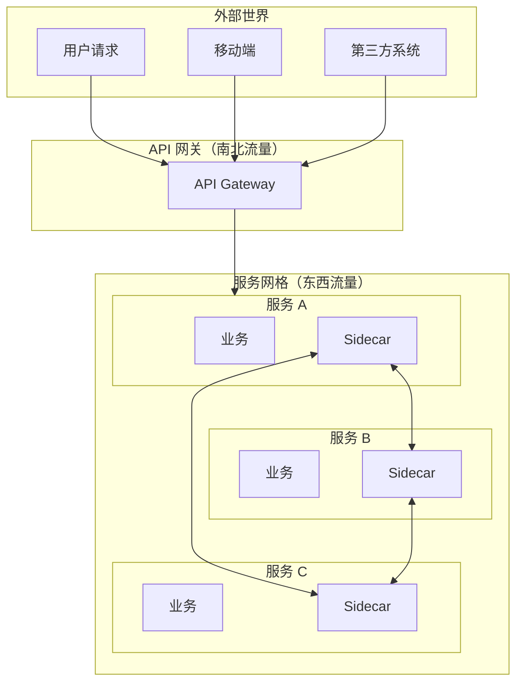
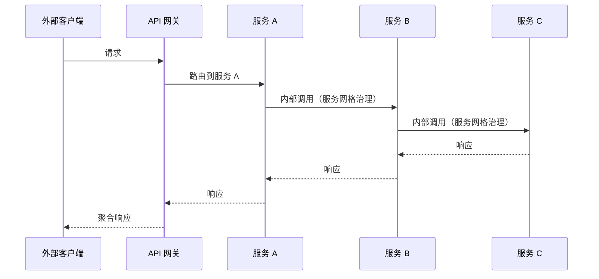
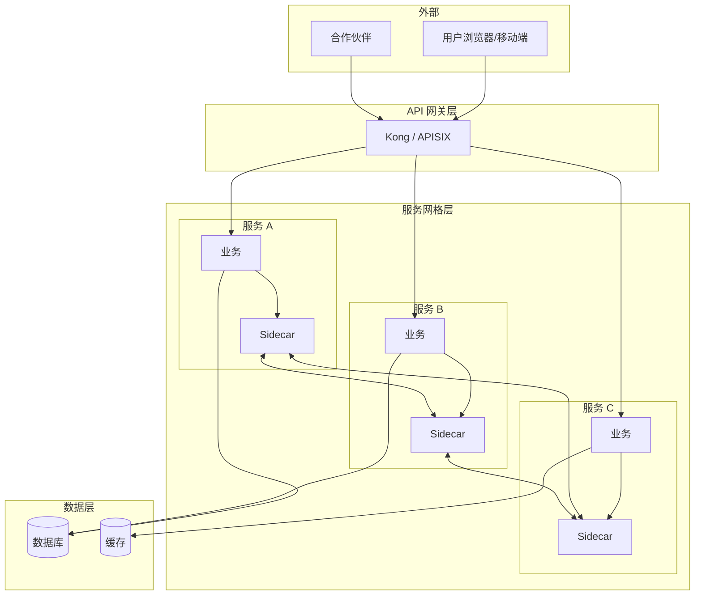

凌晨两点，你被告警叫醒：「订单服务不可用」。你登录监控平台一看，发现订单服务的多个实例都显示异常。但奇怪的是，只有来自**外部用户**的请求大量超时，内部服务调用却一切正常。

你排查了半天，终于发现：不是订单服务本身有问题，而是它依赖的第三方支付接口响应变慢，导致连接池被打满。奇怪的是，为什么外部请求受影响，而内部请求不受影响？

答案是：你的 API 网关做了限流和熔断，但内部服务间的调用没有。这暴露了一个很常见的误解：**很多人以为有了 API 网关，就解决了所有的服务治理问题**。

实际上，API 网关和服务网格解决的是不同层面的问题。

## 两种流量的两种困境

在微服务架构中，流量可以分为两类：

**南北流量（North-South）**：从外部进入集群的流量。比如用户通过手机 App 访问你的服务。这类流量通常经过 API 网关。

**东西流量（East-West）**：集群内部服务之间的流量。比如订单服务调用库存服务、用户服务调用积分服务。



API 网关处理**边界流量**，服务网格处理**内部流量**。两者各司其职，配合使用。

## API 网关的定位

API 网关是**集群的单一入口**，负责处理所有来自外部的请求。它的核心职责包括：

### 请求入口管理

- **协议转换**：外部通常用 HTTP/HTTPS，内部可能是 gRPC、Dubbo、私有协议
- **身份认证**：验证 API Key、JWT Token、OAuth 2.0
- **流量控制**：基于 IP、用户、API Key 的限流
- **协议适配**：RESTful 到内部 RPC 的转换

### API 聚合与编排

```java title="API 网关聚合示例"
// 客户端需要调用多个后端服务
// 没有网关：客户端发起 4 次请求
User user = userClient.getUser(id);           // 请求1
List<Order> orders = orderClient.getOrders(id);  // 请求2
BigDecimal balance = walletClient.getBalance(id); // 请求3
List<Coupon> coupons = couponClient.getCoupons(id); // 请求4

// 有网关：客户端一次请求，网关聚合
GET /api/user-dashboard
{
  "user": {...},
  "orders": [...],
  "balance": "100.00",
  "coupons": [...]
}
```

### 核心特点

| 特点 | 说明 |
| --- | --- |
| **部署位置** | 集群边界，对外暴露的单一端点 |
| **处理对象** | 外部客户端请求 |
| **主要功能** | 认证、限流、协议转换、路由 |
| **技术选型** | Kong、APISIX、Nginx、Spring Cloud Gateway |

## 服务网格的定位

服务网格处理的是**服务间通信**，也就是东西流量。它的核心职责是：

### 服务间治理

- **服务发现**：自动感知服务实例变化
- **负载均衡**：服务级别的流量分发
- **熔断限流**：防止故障传播
- **流量加密**：mTLS 自动加密
- **可观测性**：请求级追踪和监控

### 内部流量管理



服务网格不处理外部请求，它对业务代码透明，只在服务间通信时发挥作用。

## 核心区别

| 维度 | API 网关 | 服务网格 |
| --- | --- | --- |
| **处理流量** | 南北流量（外部 → 内部） | 东西流量（内部 ↔ 内部） |
| **部署位置** | 集群边界，通常是独立部署 | 分布在每个服务实例旁 |
| **核心职责** | 入口管理、协议转换、API 聚合 | 服务治理、安全、可观测性 |
| **配置方式** | 按 API 路由配置 | 按服务/namespace 配置 |
| **参与者** | 网关 + 少量配置 | 大量边车代理 + 控制平面 |
| **故障影响** | 影响所有外部请求 | 影响内部服务调用 |

:::warning
**关键误解澄清**：API 网关不处理内部服务间的故障传播。一个服务调用另一个服务超时，这个超时是由服务间的**连接管理**控制的，不是网关。网关只负责外部请求，所以网关配置了熔断，内部服务调用依然可能拖垮整个系统。
:::

## 两者配合使用

在实际生产环境中，API 网关和服务网格通常**同时存在**，形成完整的流量治理体系。



### 分层治理策略

**第一层：API 网关**

- 身份认证和授权
- 面向外部的限流和 DDoS 防护
- 协议转换和 API 聚合
- SSL/TLS 终止

**第二层：服务网格**

- 服务级别的负载均衡和熔断
- mTLS 双向认证
- 内部流量追踪和监控
- 金丝雀发布和流量镜像

## 场景对比

| 场景 | 应该用 API 网关 | 应该用服务网格 |
| --- | --- | --- |
| 外部客户端访问内部服务 | API 网关 | ❌ 不适用 |
| 服务 A 调用服务 B，需要熔断 | ❌ 网关无法处理内部调用 | 服务网格 |
| 第三方系统回调接口 | API 网关（统一入口） | ❌ 不适用 |
| 内部服务间加密通信 | ❌ 网关处理不到内部流量 | 服务网格（mTLS） |
| 金丝雀发布（10% 流量到新版本） | ❌ 网关只知道目标服务，不知道版本 | 服务网格 |
| 外部用户限流 | API 网关 | ❌ 不适用 |
| 服务 A 故障，防止拖垮服务 B | ❌ 内部调用不经过网关 | 服务网格（熔断器） |

:::tip
**选型判断方法**：如果你要解决的问题是「外部请求怎么进来」，用 API 网关；如果你要解决的问题是「服务之间怎么通信」，用服务网格。很多时候，两个问题同时存在，所以两者都需要。
:::

## 常见问题与反模式

### 反模式一：把 API 网关当作服务网格用

有人会想：「我在 API 网关配置所有路由规则，包括内部服务调用。这样就不需要服务网格了？」

**为什么是错的**：API 网关只处理南北流量。如果服务 A 调用服务 B，这个调用不走网关，所以网关的熔断、限流、重试配置对内部调用完全无效。

**正确做法**：南北流量用 API 网关治理，东西流量用服务网格治理。

### 反模式二：服务网格替代 API 网关

反过来，有人觉得「有了服务网格，为什么还需要 API 网关？」

**为什么是错的**：服务网格没有统一入口的概念，它不知道哪个请求是来自外部、哪个是内部。如果不用网关，所有服务都要对外暴露端口，安全风险极大。

**正确做法**：API 网关做边界防护，服务网格做内部治理。

### 反模式三：内部服务直连，不经过任何治理

「我们的服务都在内网，直接调用不就行了？」

**为什么是错的**：内网不等于安全。攻击者如果突破了某个服务，可以横向移动到其他服务。没有 mTLS，服务间通信是明文的，内网嗅探可以截获所有数据。

**正确做法**：即使是内网，也要用服务网格实现零信任网络，所有流量加密和认证。

## 选型建议

### 什么时候只需要 API 网关

- 微服务数量少（< 10 个），服务间调用简单
- 没有强制的服务间安全要求
- 团队没有精力维护复杂的基础设施

### 什么时候需要 API 网关 + 服务网格

- 微服务数量多，调用关系复杂
- 有严格的安全合规要求（如金融、政务）
- 需要统一的服务可观测性
- 多语言团队，不同服务用不同技术栈

### 产品选型

| 类型 | 推荐产品 | 适用场景 |
| --- | --- | --- |
| API 网关 | Kong / APISIX | 高性能、插件丰富 |
| API 网关 | Spring Cloud Gateway | Java 生态，与 Spring Cloud 集成 |
| 服务网格 | Istio | 功能全面，适合大型组织 |
| 服务网格 | Linkerd | 轻量、简单、安全优先 |
| 服务网格 | Consul Connect | 已有 Consul 基础 |

## 术语表

| 术语 | 英文 | 解释 |
| --- | --- | --- |
| 南北流量 | North-South Traffic | 外部到内部的流量 |
| 东西流量 | East-West Traffic | 内部服务间的流量 |
| 单一入口 | Single Entry Point | API 网关作为所有外部请求的入口 |
| 零信任 | Zero Trust | 不信任内网，所有请求都需要认证 |

## 延伸思考

API 网关和服务网格的关系，有点像「小区大门」和「楼道监控」的关系：

- **小区大门**（API 网关）：检查进入小区的每个人，登记、测温、控制人流
- **楼道监控**（服务网格）：楼道里发生的事、每户之间的交往，都在这个系统里记录

只装大门不装监控，进去之后干什么没人知道；只装监控不装大门，任何人都可以进入小区。

真正的安全感，需要两层防护一起工作。

但在投入资源之前，先问自己一个问题：**你的团队现在真的需要这两层防护吗？** 如果微服务数量还很少，调用关系很简单，过度设计反而是负担。
