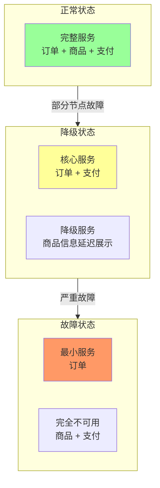
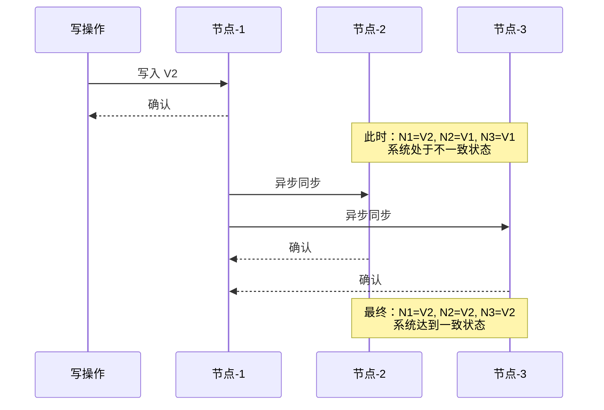
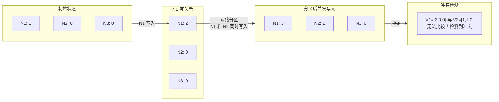
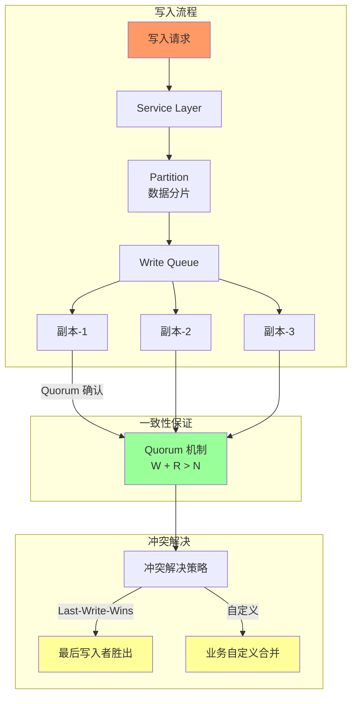

CAP 定理告诉我们：「当网络分区发生时，你必须在一致性和可用性之间做出选择。」

这听起来像是一个悲伤的结论——要么接受系统不可用，要么接受数据不一致。

但真的没有第三条路吗？

2008 年，eBay 的架构师 Dan Pritchett 在 ACM Queue 发表了一篇论文《BASE: An Acid Alternative》，提出了一个完全不同的思路：**不是去追求「如何同时满足 C 和 A」，而是去想「如何在弱化一致性的情况下，依然让系统可用且实用」**。

这套思路，后来被称为 **BASE** 理论。

## 一、BASE 的诞生背景

在 BASE 出现之前，ACID 是数据库系统的黄金标准。事务的原子性、一致性、隔离性、持久性——这些属性保证了数据的可靠性。

但 ACID 有它的代价：**为了保证强一致，事务必须在所有相关节点完成之后才能提交**。这意味着：

- **可用性下降**：事务期间，相关数据被锁定
- **延迟增加**：跨节点的分布式事务，可能需要数十甚至数百毫秒
- **扩展性受限**：强一致要求限制了水平扩展的能力

eBay 面临的正是这个问题：他们有数十亿条交易记录，需要在全球范围内分布式部署，但传统的 ACID 数据库无法满足他们的规模和性能需求。

Dan Pritchett 的解决方案是：**放弃 ACID 中的强一致性，接受「最终一致」作为替代**。这就是 BASE 的核心思想。

## 二、BASE 三要素详解

BASE 这个名字本身就是一个缩写，代表了三个核心概念：

### Basically Available（基本可用）

基本可用并不意味着系统「可以挂掉」。它的真正含义是：**在系统出现故障时，保证核心功能可用，而非所有功能可用**。

例如，Amazon Dynamo 的设计哲学是：「永远可以接受订单，但可能会暂时找不到商品的所有信息」。在 Dynamo 的早期版本中，即使商品目录数据不完整，结账流程依然可以继续。



基本可用的实现方式包括：

- **功能降级**：关闭非核心功能，保证核心功能
- **服务降级**：返回缓存数据或默认值，而非实时数据
- **延迟处理**：将非紧急操作排队，等待故障恢复

### Soft State（软状态）

软状态是 BASE 中最容易被误解的概念。它指的是：**系统的状态可以随时间变化，且不需要实时同步到所有节点**。

与 ACID 的「硬状态」相比，软状态有三个关键特征：

| 特征 | 硬状态（ACID） | 软状态（BASE） |
|-----|---------------|---------------|
| **状态来源** | 仅来自已提交的事务 | 可来自未确认的操作 |
| **同步要求** | 必须立即同步 | 可延迟同步 |
| **一致性时机** | 事务提交时立即一致 | 在某个未来时刻达到一致 |
| **存储内容** | 最新已提交数据 | 可能是旧数据或冲突数据 |

举一个直观的例子：

在 MySQL 的主从复制中，主库的数据是「硬状态」——它总是最新的。从库的数据是「软状态」——它可能是旧数据，需要时间追上主库。如果我们在从库上查询，拿到的不一定是最新数据。

### Eventually Consistent（最终一致）

最终一致性是 BASE 的核心保证。它的定义是：

> **在没有新更新的情况下，系统会在有限时间内（通常很短）自动达到一致状态。**

这里有几个关键词需要解释：

1. **「没有新更新」**：一致性的前提是「静止」——只要还有写入，系统就可能不一致
2. **「有限时间」**：不是「无限等待后的最终」，而是一个合理的时间窗口
3. **「自动达到」**：不需要人工干预，系统通过自身机制恢复一致



最终一致性有几个重要的变体：

| 类型 | 说明 | 典型场景 |
|-----|------|---------|
| **读己之所写** | 能读到自己的最新写入 | 用户评论发表后自己能看到 |
| **会话一致性** | 在同一个会话中保持一致 | 电商购物车 |
| **因果一致性** | 有因果关系的操作保持顺序 | 社交评论 |
| **单调读** | 不会读到比之前更旧的数据 | 时序性要求 |
| **单调写** | 写操作按提交顺序执行 | 顺序敏感业务 |

## 三、ACID vs BASE：两种哲学的对比

ACID 和 BASE 代表了分布式系统设计的两种极端哲学。

### 核心理念对比

| 维度 | ACID | BASE |
|-----|------|------|
| **核心目标** | 强一致性 | 高可用性 |
| **一致性时机** | 事务提交时立即一致 | 某个未来时刻一致 |
| **数据锁定** | 悲观锁，锁定资源 | 乐观锁，允许冲突 |
| **事务粒度** | 细粒度控制 | 粗粒度补偿 |
| **扩展性** | 垂直扩展为主 | 水平扩展友好 |
| **性能特征** | 低延迟，但吞吐受限 | 高吞吐，但延迟不确定 |
| **适用场景** | 金融、库存、订单 | 社交、电商、CDN |

### 哲学差异的形象比喻

想象你在餐厅吃饭：

- **ACID 就像「封闭式包间」**：服务生必须等你点完菜、吃完饭、结完账，才能服务下一桌。每一步都精确控制，但餐厅的翻台率（吞吐量）很低。

- **BASE 就像「开放式大堂」**：服务生快速响应每桌需求，可能先上饮料再上主菜。如果后厨出了点小问题，大堂依然运转，只是某些菜品可能慢一点。

### 什么时候选 ACID，什么时候选 BASE？

没有绝对的好坏，只有场景的匹配。

| 场景 | 推荐 | 原因 |
|-----|------|------|
| 银行转账 | ACID | 金额不一致是灾难性的 |
| 电商库存 | ACID（核心链路） | 超卖后果严重 |
| 社交点赞 | BASE | 少一个赞不会世界末日 |
| 购物车 | BASE + 会话一致性 | 允许短暂不一致 |
| 消息通知 | BASE | 延迟几秒不影响业务 |
| 商品搜索 | BASE | 搜索结果短暂不一致可接受 |

## 四、最终一致性的实现机制

既然选择了最终一致性，就需要一套机制来保证「最终」真的能到达一致。这些机制包括：

### 读修复（Read Repair）

读修复发生在**客户端读取数据时**。当客户端从多个节点读取数据时，如果发现某个节点的数据版本较旧，就在响应后触发异步更新。

```java
// 读修复伪代码
List<Node> replicas = getReplicas(key);
Map<Node, Value> responses = readFromAll(replicas);

// 找到最新版本
Value latest = findLatestVersion(responses);

// 异步修复旧版本节点
for (Node node : replicas) {
    if (node.value.version < latest.version) {
        async.repair(node, latest);  // [!code highlight]
    }
}
```

读修复的优点是**实现简单**，缺点是**不经常被读取的数据可能永远得不到修复**。

### 写修复（Write Repair）

写修复发生在**数据写入时**。当客户端写入数据时，同时更新多个副本。如果某个节点写入失败，就记录失败，后续重试。

```java
// 写修复伪代码
List<Node> replicas = getReplicas(key);
List<Future> writes = new ArrayList<>();

for (Node replica : replicas) {
    Future future = async.write(replica, value);  // [!code highlight]
    writes.add(future);
}

// 等待多数派确认
int successCount = waitForMajority(writes);

// 修复失败的节点
for (Future future : writes) {
    if (!future.isSuccess()) {
        queueForRetry(future.node, value);  // 异步重试
    }
}
```

写修复的优点是**保证数据最终一致**（只要不断重试），缺点是**写入延迟取决于最慢的节点**。

### 墓碑机制（Tombstone）

墓碑机制用于处理**数据删除**。当一条数据被删除时，系统不是立即删除它，而是写入一个「墓碑」标记，表示「这条数据已删除」。

```java
// 墓碑机制示例
// 原始数据
{ "id": "user-123", "name": "张三", "_deleted": false }

// 删除后（墓碑）
{ "id": "user-123", "name": "张三", "_deleted": true, "_tombstone_time": 1699999999 }

// 墓碑被垃圾回收后
// 数据彻底消失
```

墓碑机制解决了两个问题：

1. **删除确认**：写入墓碑后，可以确认删除成功
2. **区分「不存在」和「已删除」**：在墓碑过期前，可以告诉客户端「这条数据已被删除」而非「不存在」

### 向量时钟（Vector Clock）

向量时钟是**跟踪数据因果关系**的机制。每个节点维护一个「版本向量」，记录自己看到的所有版本。



向量时钟的优点是**能够检测并发修改的冲突**，缺点是**版本向量会随节点数线性增长**。

## 五、BASE 的适用场景与局限性

### 适用场景

BASE 特别适合以下场景：

| 场景 | 为什么适合 BASE |
|-----|----------------|
| **互联网高并发** | 追求高吞吐，允许短暂不一致 |
| **电商秒杀** | 库存超卖比服务宕机危害小 |
| **社交 Feed** | 数据量大，强一致成本太高 |
| **日志收集** | 允许少量日志丢失 |
| **CDN 内容分发** | 缓存不一致不影响核心功能 |
| **大数据批处理** | 计算结果允许短暂不一致 |

### 局限性

BASE 不是银弹，它有明显的局限性：

1. **开发者承担一致性责任**：在 ACID 中，数据库保证一致性；在 BASE 中，开发者需要自己处理冲突
2. **系统行为更难预测**：由于不一致窗口的存在，调试问题变得困难
3. **补偿逻辑复杂**：当操作失败时，需要编写复杂的补偿（回滚）逻辑
4. **不是所有业务都适用**：金融、库存等强一致性要求的场景，BASE 无法满足

### BASE 的反模式

以下是使用 BASE 时最常见的错误：

| 错误做法 | 问题 | 正确做法 |
|---------|------|---------|
| 把「最终一致」当「永远不一致」 | 数据长期无法收敛 | 设置合理的收敛时限 |
| 不处理冲突 | 导致数据永久丢失 | 实现冲突解决策略 |
| 忽视补偿逻辑 | 失败后无法恢复 | 设计幂等操作或补偿事务 |
| 不做监控 | 无法发现数据不一致 | 建立一致性监控指标 |

## 六、真实案例：Amazon DynamoDB 的 BASE 实践

Amazon DynamoDB 是 BASE 理论的典型践行者。它的设计哲学是：

> 「永远可用，即使可能读到脏数据。」

DynamoDB 的关键设计决策包括：

1. **数据分片 + 副本**：数据自动分片到多个节点，每个分片有多个副本
2. **异步复制**：写入先在本节点确认，然后异步复制到其他副本
3. **向量时钟 + 冲突解决**：使用向量时钟跟踪版本，冲突时使用「最后写入者胜出」（LWW）或业务自定义策略
4. **墓碑 + TTL**：删除操作写入墓碑，TTL 过期后真正删除

DynamoDB 的工程师在论文中写道：

> 「最终一致性是 Dynamo 的核心设计目标，不是迫不得已的妥协。通过精心设计的冲突解决机制，我们可以在保证高可用的同时，提供足够好的一致性保证。」



## 术语表

| 术语 | 英文 | 定义 |
|-----|------|------|
| 基本可用 | Basically Available | 系统故障时保证核心功能可用 |
| 软状态 | Soft State | 系统状态可以随时间变化，无需实时同步 |
| 最终一致性 | Eventually Consistent | 在没有新更新的情况下，系统会最终达到一致 |
| 读修复 | Read Repair | 读取时检测并修复旧版本数据 |
| 写修复 | Write Repair | 写入时同步修复失败的副本 |
| 墓碑机制 | Tombstone | 标记数据已删除，而非立即物理删除 |
| 向量时钟 | Vector Clock | 跟踪分布式系统中事件的因果关系 |
| Quorum | Quorum | 分布式系统中的多数派机制 |
| 补偿事务 | Compensating Transaction | 事务失败后执行的回滚/补偿操作 |

---

BASE 理论告诉我们：**一致性和可用性不是非此即彼的选择，而是一个连续谱**。

CAP 告诉了我们「不能什么」——不能同时保证强一致和强可用。

BASE 告诉了我们「能做什么」——通过接受最终一致性，可以在保证可用性的同时，提供足够好的一致性保证。

关键在于理解你的业务本质：**哪些数据必须强一致，哪些可以容忍最终一致？哪些操作必须高可用，哪些可以短暂降级？** 

当你能够清晰地回答这些问题时，你就真正理解了 BASE 的精髓。