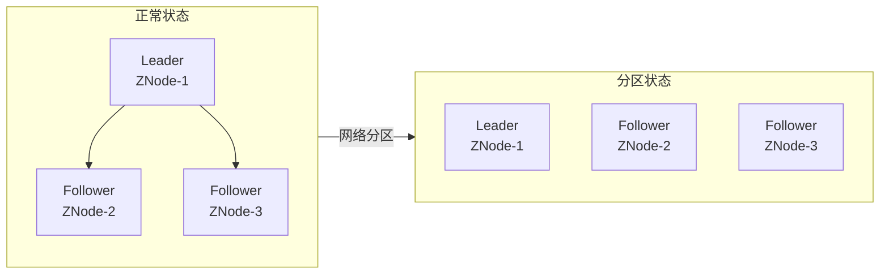
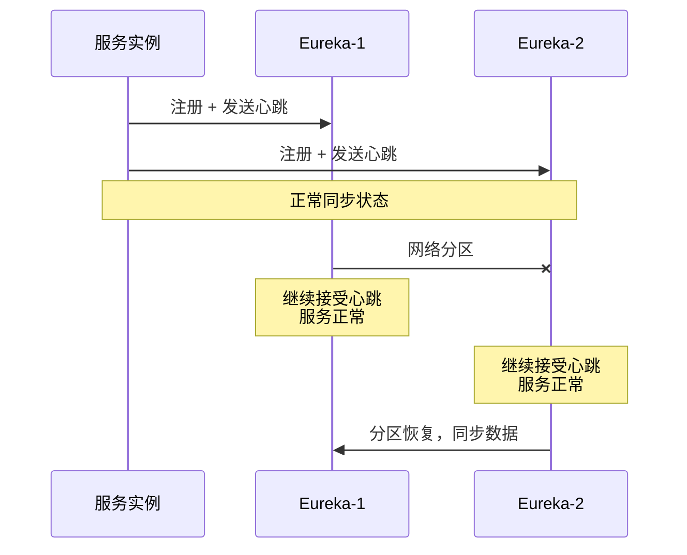
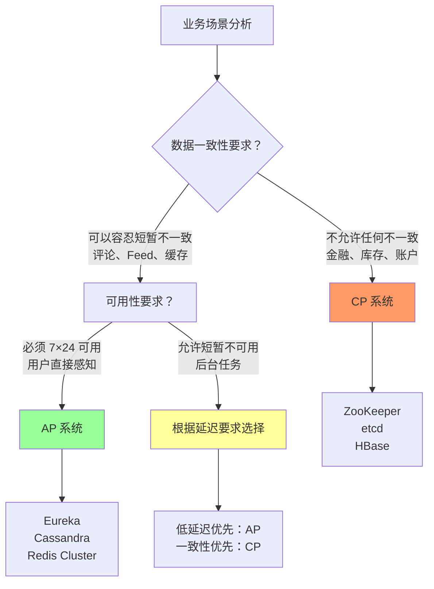
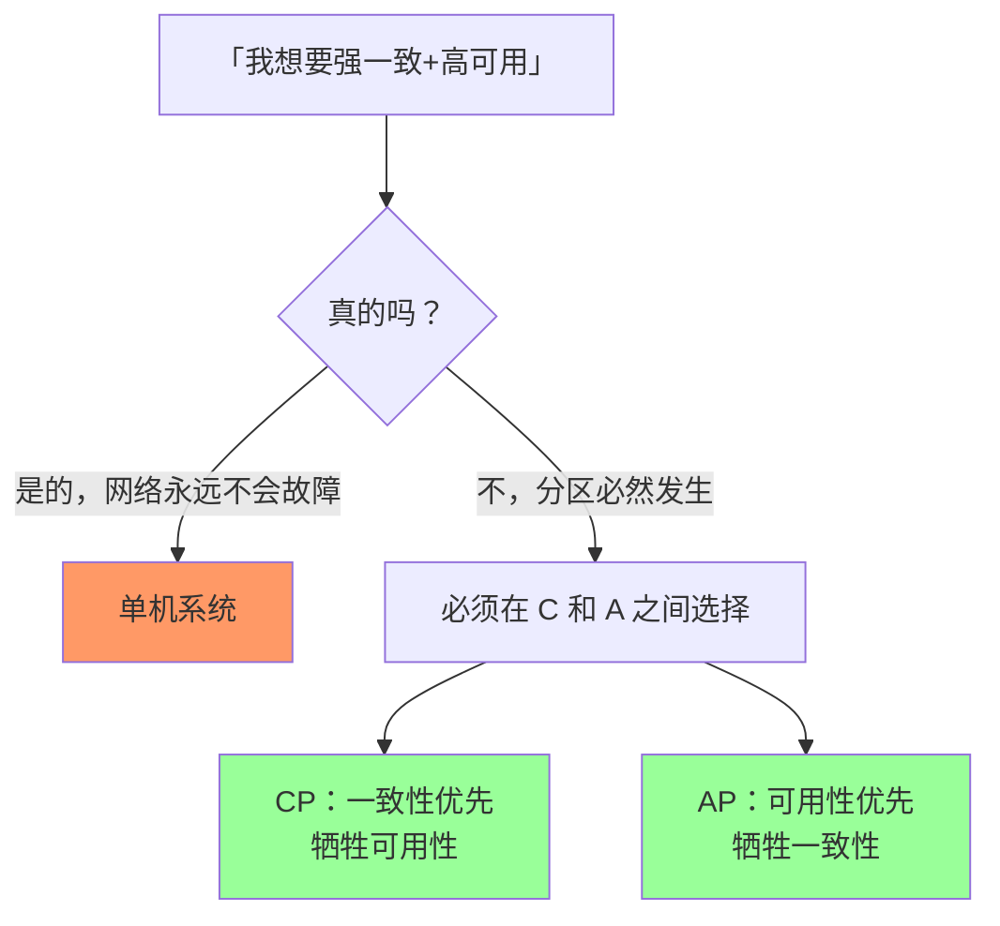

2015 年，Netflix 宣布他们放弃了 ZooKeeper，转而使用自行研发的 Eureka 作为服务注册中心。消息一出，分布式系统社区炸开了锅。

有人嘲笑 ZooKeeper「过时了」，有人质疑「Eureka 的可用性真有那么重要吗」，还有人困惑：「ZooKeeper 不也能做服务发现吗？」

实际上，这场「争议」背后是一个经典的架构问题：**你的系统应该选 CP 还是 AP？**

这个问题的答案，不是「AP 更好」或「CP 更安全」那么简单。它取决于你的业务本质——是数据一致性优先，还是服务可用性优先。

## 一、CP 与 AP 的本质区别

在深入讨论之前，我们需要先明确一个关键点：**CP 和 AP 不是系统的静态标签，而是系统在分区时做出的行为选择**。

一个系统在 99% 的时间里可能表现得像 AP（高可用、弱一致），但在关键的分区时刻，它必须明确地站在 C 或 A 的一边。

### CP 系统：在分区时放弃可用性

CP 系统的核心特征是：**宁可停止服务，也不返回不一致的数据**。

当网络分区发生时，CP 系统会：

1. 检测到分区
2. 停止部分节点的响应（因为无法保证一致性）
3. 在分区恢复后，进行数据同步
4. 恢复服务

代表系统包括：ZooKeeper、etcd、HBase、MongoDB（副本集模式）、Redis Sentinel

### AP 系统：在分区时放弃一致性

AP 系统的核心特征是：**宁可返回旧数据，也要保证服务可用**。

当网络分区发生时，AP 系统会：

1. 检测到分区
2. 让各分区独立继续服务
3. 在分区恢复后，通过后台同步或冲突解决机制逐步恢复一致
4. 可能产生「脑裂」——多个分区各自为政

代表系统包括：Eureka、Cassandra、DynamoDB、Redis Cluster

## 二、典型系统分析

### ZooKeeper：CP 的教科书

ZooKeeper 是 CP 系统的典型代表。它的 ZAB 协议（ZooKeeper Atomic Broadcast）保证了：

- **强一致性**：所有节点对状态的看法完全一致
- **原子性**：写入要么在所有节点成功，要么失败
- **分区容忍**：能够容忍网络故障

但代价是：**在 Leader 节点故障或网络分区期间，整个系统不可用**。



当网络分区导致 Follower 与 Leader 失联时：

- Leader 所在的分区继续工作
- 失联的 Follower 被视为「不存在」
- 如果无法达成多数派写入，系统会**停止服务**

这就是为什么 ZooKeeper 适合做**分布式协调服务**（如分布式锁、配置管理），但不适合做**需要高可用的服务发现**——想象一下，当你的 Kubernetes Master 节点网络抖动时，整个集群的服务发现突然不可用……

### Eureka：AP 的践行者

Netflix 设计 Eureka 的核心理念是：**服务注册中心必须是永远可用的**。

Eureka 的工作方式完全不同：

- 每个 Eureka Server 节点都是对等的，都可以接受服务注册
- 服务启动时向所有 Eureka Server 注册
- 节点之间通过心跳同步数据（但不保证强一致）
- **分区期间，每个分区独立继续工作**



Eureka 的代价是：

- **可能出现「脏读」**：消费者可能读到已下线服务的注册信息
- **数据不是强一致的**：不同节点的注册表可能暂时不同
- **依赖客户端缓存**：Eureka 客户端会缓存注册表，以应对 Server 不可用

Netflix 认为，对于服务发现来说，**短暂的「读到脏数据」比「服务完全不可用」要好得多**。这个判断，基于他们自身的业务场景——Netflix 的服务需要 7×24 小时可用，任何全局性的服务不可用都会直接影响用户体验。

### Redis：两种模式的集合

Redis 是一个有趣的案例：它同时支持 CP 和 AP 两种模式，取决于你使用哪种部署架构。

| 部署模式 | CAP 分类 | 一致性实现 | 可用性实现 |
|---------|---------|-----------|-----------|
| Redis Sentinel | CP | 主从同步、Raft 选主 | 故障转移后恢复可用 |
| Redis Cluster | AP | 异步复制、Gossip 同步 | 分片独立服务 |
| Redis 主从（无 Sentinel） | AP | 异步复制 | 主节点故障需手动处理 |

**Redis Sentinel（CP）**：当主节点故障时，Sentinel 会通过 Raft 协议选举新主。在选举期间，整个集群不可写。一旦新主当选，数据会从旧主同步过来，然后恢复服务。

**Redis Cluster（AP）**：每个分片都有主从节点，但分片之间是独立的。当某个分片的主节点故障时，该分片的从节点会升级为主节点。**但其他分片继续正常服务**。这就是 Redis Cluster 能够在部分分区时继续服务的原理。

## 三、权衡矩阵：如何选择

选 CP 还是 AP，不是非此即彼的选择题。它需要基于业务场景进行权衡。

### 核心权衡维度

| 维度 | CP 系统 | AP 系统 |
|-----|--------|--------|
| **一致性强度** | 强一致 | 最终一致 |
| **可用性** | 分区时不可用 | 分区时仍可用 |
| **响应延迟** | 可能更高（同步开销） | 通常更低 |
| **数据冲突处理** | 无冲突（单主） | 需要冲突解决策略 |
| **运维复杂度** | 相对简单 | 复杂（需处理冲突） |
| **适用场景** | 数据一致性优先 | 可用性优先 |

### 选型决策树



### 场景化选型建议

| 场景 | 推荐选择 | 代表系统 | 理由 |
|-----|---------|---------|------|
| **分布式锁** | CP | ZooKeeper、etcd | 锁的一致性是核心，不允许重复获取 |
| **配置管理** | CP | ZooKeeper、etcd | 配置变更必须原子一致 |
| **服务注册与发现** | AP | Eureka、Consul | 分区时服务仍需可发现 |
| **商品信息、CDN** | AP | Cassandra、DynamoDB | 高可用优先，一致性可延迟 |
| **订单处理、支付** | CP | HBase、PostgreSQL | 强一致性是法规要求 |
| **用户 Session** | AP | Redis Cluster | 允许分布式 Session，丢一个节点不致命 |
| **消息队列 Offset** | CP | Kafka | 消费进度的准确性决定消息是否丢失 |
| **社交 Feed** | AP | Cassandra | 高写入吞吐量，可容忍 Feed 延迟 |

## 四、混合方案：CP + AP 的实践

Netflix 的实践告诉我们：**大型系统往往需要同时使用 CP 和 AP 系统，它们服务不同的业务需求**。

### Netflix 的混合架构

Netflix 的服务治理架构同时包含：

- **Eureka（AP）**：服务注册与发现，保证服务在任何时候都可被发现
- **Zuul/APIGateway**：路由层，根据 Eureka 的信息进行负载均衡
- **Hystrix/Resilience4j**：熔断器，在服务不可用时快速失败
- **Archaius**：配置中心，使用 ZooKeeper（CP）保证配置一致性

这种设计的思路是：

1. 用 **AP 系统**处理「让服务活着」的问题
2. 用 **CP 系统**处理「让数据正确」的问题
3. 用 **熔断器**在两者之间建立隔离层

### 混合选型的决策框架

```
                    ┌─────────────────┐
                    │  业务需求分析   │
                    └────────┬────────┘
                             │
              ┌──────────────┼──────────────┐
              ▼              ▼              ▼
      ┌───────────┐  ┌───────────┐  ┌───────────┐
      │ 数据一致性 │  │ 可用性要求 │  │ 延迟容忍度 │
      │ 要求极高   │  │ 极高       │  │ 低         │
      └─────┬─────┘  └─────┬─────┘  └─────┬─────┘
            │              │              │
            ▼              ▼              ▼
      ┌───────────┐  ┌───────────┐  ┌───────────┐
      │   CP      │  │   AP      │  │ 需要混合   │
      │ ZooKeeper │  │  Eureka   │  │ CP + AP   │
      └───────────┘  └───────────┘  └───────────┘
```

## 五、真实案例：选型踩坑记

### 案例一：电商公司 ZooKeeper 选型失败

某中型电商公司在 2018 年进行微服务改造，技术选型时认为 ZooKeeper「更成熟、更可靠」，于是用它做服务注册中心。

问题很快出现：

1. **单点瓶颈**：所有服务都连向 ZooKeeper 集群，在双十一大促期间，ZooKeeper 成为性能瓶颈
2. **可用性事故**：一次机房网络抖动导致 ZooKeeper 集群分区，大量服务实例被判定为「死亡」，服务发现完全不可用
3. **扩容困难**：需要为 ZooKeeper 分配独立的高配机器，成本高昂

最后这家公司不得不迁移到 Eureka，并在 Eureka 之上实现了服务隔离和熔断机制。

### 案例二：金融公司 Eureka 选型后的噩梦

另一家金融公司听说 Eureka「高可用」，于是用它做交易系统的服务发现。

问题是：**金融交易对一致性有严格要求**。当网络分区时，Eureka 可能让两个不同的服务实例同时认为自己是「主节点」，导致重复扣款。

这家公司后来在 Eureka 之上实现了「双注册」机制：服务同时向 Eureka（AP）和 ZooKeeper（CP）注册，路由层只在 ZooKeeper 中发现「主节点」——这是一个典型的 CP + AP 混合方案。

## 六、反模式：同时要求强一致和强可用

最后，让我们讨论一个最常见的错误认知：**存在「既 CP 又 AP」的系统吗？**

答案是：**不存在**。

如果你听到有人说「我们的系统既保证一致性，又保证可用性」，要么是：

1. 他们对 CAP 理论理解有误
2. 他们的系统不是真正的分布式系统（单机或假设永不分区）
3. 他们说的「一致性」不是 CAP 中的强一致性（可能是最终一致性）



## 术语表

| 术语 | 英文 | 定义 |
|-----|------|------|
| CP 系统 | CP System | 分区时选择一致性、牺牲可用性的系统 |
| AP 系统 | AP System | 分区时选择可用性、牺牲一致性的系统 |
| ZAB 协议 | ZooKeeper Atomic Broadcast | ZooKeeper 的原子广播协议，保证强一致 |
| 服务发现 | Service Discovery | 分布式系统中自动发现服务实例的机制 |
| 故障转移 | Failover | 主节点故障时自动切换到备用节点 |
| 脑裂 | Split-Brain | 网络分区导致多个节点独立认为自己是主节点 |
| 最终一致性 | Eventual Consistency | 系统保证在没有新更新的情况下，最终达到一致状态 |

---

回到文章开头的那个问题：Netflix 为什么放弃 ZooKeeper？

答案很简单：**因为 ZooKeeper 是 CP 系统，而服务发现需要 AP 系统**。Netflix 的业务场景决定了，他们宁可接受服务发现的短暂不一致，也不能容忍任何时刻的服务不可用。

你的业务场景呢？是选 CP 还是 AP？答案不在于「哪个更好」，而在于「哪个更符合你的业务本质」。