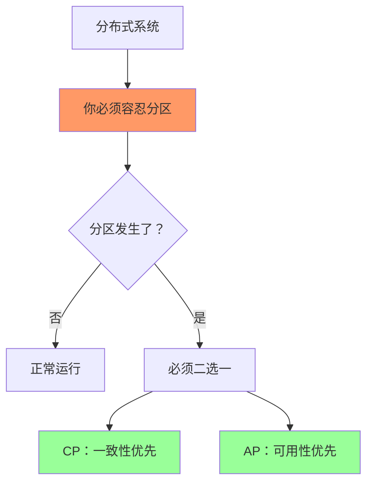
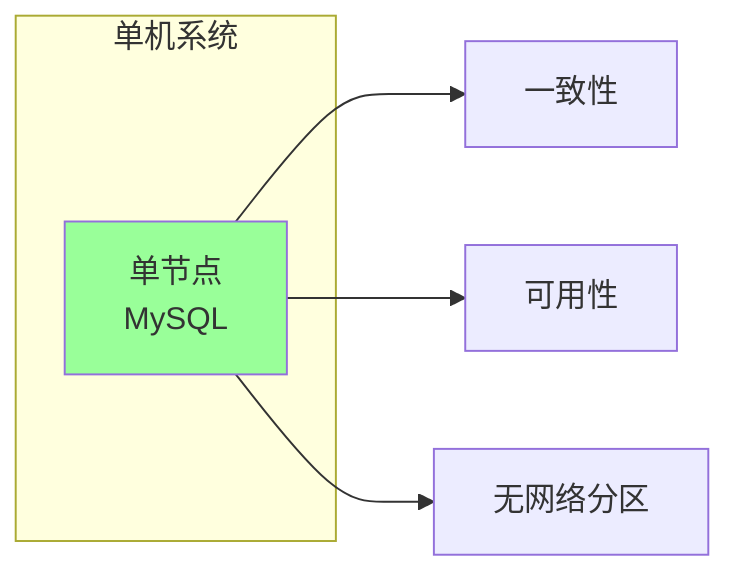
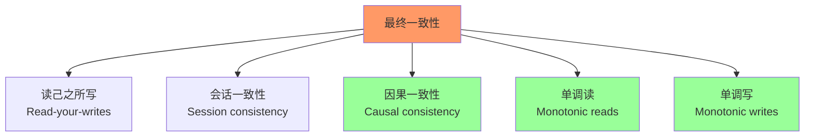
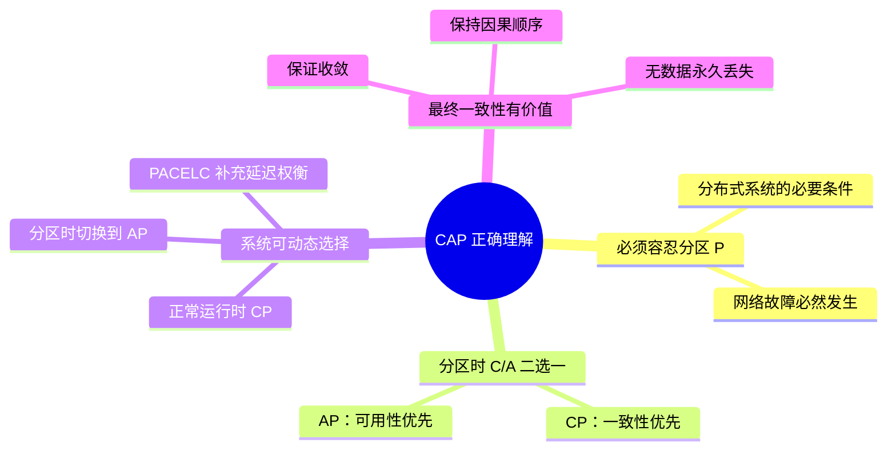

CAP 也许是分布式系统领域被误解最多的定理。

几乎每个面试官都喜欢问 CAP，几乎每个候选人都能说出「CAP 三选二」。但能真正理解 CAP 精髓的人，少之又少。

更可怕的是，很多错误的理解已经深入人心，以至于当你试图纠正时，对方会坚定地反驳：「我学过的就是这样的。」

本文将逐一澄清 CAP 的常见误区，并准备几个经典的面试陷阱题。

## 一、误区一：「CAP 让我三选二」

这是最常见、也是最根本的误解。

### 错误的理解

很多人以为 CAP 意味着：在 Consistency（一致性）、Availability（可用性）、Partition Tolerance（分区容忍）中，你需要选择两个。

### 为什么错了

Gilbert 和 Lynch 的原始论文明确指出：**P（分区容忍）是分布式系统的必要条件，不是可选项。**

> 在一个分布式系统中，网络分区必然发生。如果系统声称可以在没有分区的情况下运作，那它就不是一个真正分布式系统。

也就是说，你**必须选 P**。剩下的选择是：「当分区发生时，我选 C 还是 A？」

### 正确的理解



CAP 的正确解读是：

- **分布式系统必须容忍网络分区（P）**
- **当分区发生时，必须在 C 和 A 之间做出选择**
- **不是「三选二」，而是「C 和 A 的二选一」**

### 为什么这个误区如此普遍

这个误区的流行，有几个原因：

1. **直觉上「三选二」更容易理解**：用一个简单的选择题概括一个复杂理论
2. **教科书简化**：很多教科书为了简化描述，直接说「CAP 三选二」
3. **缺乏原文阅读**：大多数人没有读过 Gilbert & Lynch 的原始论文

## 二、误区二：「存在 CA 系统」

### 错误的理解

有些文章会说：「MySQL 是 CA 系统，因为它既一致又可用。」

### 为什么错了

在**单机系统**中，CA 系统确实存在。但**分布式系统**中，不存在真正的 CA 系统。

原因很简单：**分布式系统的定义就是「跨越多个节点」，而多节点之间通过网络通信，网络故障必然发生**。

如果你说「我的系统永不分区」，那么：

- 要么你不是真正的分布式系统
- 要么你假设了一个永远不会故障的网络（不现实）

### 什么才是真正的 CA 系统



单机数据库是 CA 的，因为：

- 没有网络通信
- 没有分区问题
- 但也不是分布式系统

### 常见的「伪 CA」说法

| 说法 | 问题 |
|-----|------|
| 「MySQL 是 CA 系统」 | MySQL 主从复制是 AP，不是 CA |
| 「PostgreSQL 是 CA 系统」 | 分布式 PostgreSQL（如 Citus）是 CP 或 AP |
| 「我们系统是 CA」 | 如果部署在多个节点，就是 CP 或 AP |

## 三、误区三：「CAP 是静态选择」

### 错误的理解

很多人以为：「这个系统是 CP，那个系统是 AP，选定后就不能变。」

### 为什么错了

Gilbert & Lynch 的原始论文描述的是**系统在分区期间的行为**，而不是系统的静态属性。

一个系统可以在不同情况下表现出不同的 CAP 行为：

| 系统 | 正常运行时 | 分区时 |
|-----|----------|--------|
| ZooKeeper | CP | CP |
| Redis Sentinel | CP | CP |
| Redis Cluster | CP | AP |
| Cassandra | AP | AP |
| Eureka | AP | AP |

### Redis Cluster：既是 CP 又是 AP

Redis Cluster 是一个有趣的例子：

- **正常运行时**：通过主从复制保证数据一致（CP 特性）
- **分区发生时**：各分片独立服务（AP 特性）

这就是为什么说「Redis Cluster 是 AP」——因为它的设计允许在分区时继续服务。但代价是：可能丢失数据。

### PACELC 模型的补充

PACELC 模型进一步指出：**即使没有分区，C 和 L（延迟）之间也存在权衡**。

> **If there is a partition (P), how does the system tradeoff C vs A? Else (E), how does the system tradeoff L (Latency) vs C?**

这意味着 CAP 不是唯一的权衡维度。

## 四、误区四：「最终一致性等于弱一致性」

### 错误的理解

有些人把「最终一致性」等同于「数据随便改，反正最终会一致」，认为它是一种「很弱」的一致性保证。

### 为什么错了

最终一致性保证的是：**在没有新更新的情况下，系统会最终达到一致状态**。

它弱化的是「一致性的时机」，而不是「一致性本身」。

### 最终一致性的重要保证

| 保证 | 说明 |
|-----|------|
| **所有副本最终收敛** | 不会再有新的不一致 |
| **操作有序性** | 满足特定顺序约束（如因果顺序） |
| **无数据丢失** | 最终一致不等于可以丢失数据 |
| **冲突可被发现** | 并发修改的冲突会被记录和处理 |

### 不同类型的最终一致性



**因果一致性**尤其重要：它保证有因果关系的操作保持顺序。例如：

1. 用户 A 发了一条评论
2. 用户 B 回复了这条评论

在因果一致的系统里，用户 B 的回复**一定在**用户 A 的评论之后被处理。即使其他不相关的评论处理顺序不同，也不影响这个因果关系。

### 最终一致性 vs 弱一致性

| 维度 | 最终一致性 | 弱一致性 |
|-----|----------|--------|
| **最终状态** | 保证收敛 | 不保证 |
| **有序性** | 可以保证因果顺序 | 不保证 |
| **冲突处理** | 必须有机制 | 可能忽略 |
| **适用场景** | 大多数业务场景 | 极端性能要求 |

## 五、误区五：「BASE 是 CAP 的妥协」

### 错误的理解

有些人认为 BASE 是「在 CAP 面前妥协」的产物，是一种退而求其次的选择。

### 为什么错了

BASE 不仅仅是「妥协」，它代表的是**一种不同的设计哲学**。

| 维度 | CAP 视角 | BASE 视角 |
|-----|---------|----------|
| **核心问题** | 分区时，C 和 A 如何选择？ | 如何在弱化一致性的情况下保证可用？ |
| **关注点** | 系统属性（静态） | 系统行为（动态） |
| **设计方法** | 先分析约束，再设计系统 | 先保证可用，再逐步收敛 |
| **一致性时机** | 事务提交时立即一致 | 某个未来时刻达到一致 |

BASE 不是「CAP 的妥协」，而是「在 CAP 约束下的工程化实现策略」。

## 六、误区六：「CAP 只考虑网络分区」

### 错误的理解

CAP 只考虑网络分区的情况，忽略了节点故障、时钟偏移等其他分布式系统问题。

### 为什么错了

CAP 的核心洞察是：**网络分区是分布式系统中最难处理的故障模式**，因为它同时影响了系统的可用性和一致性。

但 CAP 并不是说「只有网络分区才重要」。它的数学模型可以扩展到其他故障模式：

- **节点故障**：可以视为「节点永久离线」的分区
- **时钟偏移**：可以导致「逻辑分区」（节点间的时钟不一致）
- **消息延迟**：可以导致「暂时的分区」

CAP 提供的是一个**分析框架**，而不是一个完整的系统设计指南。

## 七、面试陷阱题

理解了这些误区之后，让我们来看几个经典的面试题。

### 陷阱题一：「Redis Cluster 是 CAP 吗？」

#### 面试官的陷阱

这个问题没有标准答案，因为 Redis Cluster **既是 CP 又是 AP**，取决于你从哪个角度观察。

#### 正确回答

> Redis Cluster 在不同层面表现出不同的 CAP 特性：
>
> - **数据复制层面**：使用异步复制，Primary 写入后立即响应，然后异步同步到 Replica。这意味着它**不是强一致的**，更接近 AP。
> - **分区容忍层面**：当某个分片的 Primary 故障时，该分片的 Replica 会自动提升为新 Primary，**其他分片继续服务**。这是 AP 特性。
> - **一致性保证**：由于异步复制，Redis Cluster **可能丢失数据**（主节点写入后同步前宕机）。这确认了它的 AP 特性。
>
> 但从客户端视角看：
> - 客户端连接到某个节点，如果该节点是请求数据的分片主节点，数据是一致的（CP 特性）
> - 如果需要跨分片查询，或者节点重定向，数据可能不一致
>
> 因此，更准确的描述是：**Redis Cluster 是 AP 系统，在一致性和可用性之间选择了可用性**。

### 陷阱题二：「ZooKeeper 分区时会发生什么？」

#### 面试官的陷阱

很多人会说「ZooKeeper 会继续服务」或「ZooKeeper 会停止服务」——但这个问题的答案取决于**哪个节点在多数派那边**。

#### 正确回答

> ZooKeeper 在网络分区时的行为取决于分区的具体情况：
>
> 1. **拥有多数派的分区**：
>    - 如果 Leader 在该分区，Leader 继续处理请求
>    - 如果 Leader 不在，重新选举新 Leader
>    - 该分区**继续提供服务**
>
> 2. **未拥有多数派的分区**：
>    - 所有节点进入「不可用」状态
>    - 不接受任何写请求
>    - 客户端会收到连接错误或超时
>
> 3. **分区愈合后**：
>    - 少数派分区的节点重新加入
>    - 从 Leader 同步最新数据
>    - 恢复正常状态
>
> 这正是 ZooKeeper 的 **CP 特性**：宁可停止服务，也不提供不一致的数据。
>
> ```mermaid
> flowchart TD
>     Z["ZooKeeper 集群<br/>(3 节点)"] --> P["网络分区"]
>
>     P --> P1["分区-A<br/>ZNode-1, ZNode-2"]
>     P --> P2["分区-B<br/>ZNode-3"]
>
>     P1 --> L1["拥有多数派(2/3)"]
>     P1 --> S1["选举新 Leader<br/>继续服务"]
>
>     P2 --> L2["未拥有多数派(1/3)"]
>     P2 --> S2["停止服务<br/>等待恢复"]
>
>     style S1 fill:#9f9
>     style S2 fill:#f96
> ```

### 陷阱题三：「为什么服务发现通常用 AP 系统？」

#### 面试官的陷阱

面试官可能想引导你回答「AP 比 CP 好」——但这是一个错误的结论。正确答案是「服务发现的业务需求决定了 AP 更合适」。

#### 正确回答

> 服务发现通常用 AP 系统（如 Eureka），而不是 CP 系统（如 ZooKeeper），原因是**业务需求不同**：
>
> | 需求 | CP 系统的问题 | AP 系统的优势 |
> |-----|-------------|--------------|
> | **服务可用性** | 分区时，服务注册可能消失 | 分区时，服务仍可被发现 |
> | **服务注册延迟** | 需要强一致，延迟较高 | 允许最终一致，延迟低 |
> | **服务下线感知** | 下线需要同步通知所有节点 | 下线后，可能短暂存在脏数据 |
>
> **关键洞察**：服务发现对「短暂的不一致」是可以容忍的。消费者缓存了服务列表，即使短期内有「已下线服务」的残留，只要消费者实现了「快速失败」和「重试」机制，就不会造成严重问题。
>
> 但如果用 ZooKeeper 做服务发现，一旦 ZooKeeper 不可用（分区期间），整个服务发现就完全不可用——这是不可接受的。
>
> **因此**：服务发现的业务需求（高可用、可容忍短暂不一致）决定了 AP 系统更合适。

### 陷阱题四：「CAP 和 BASE 的关系是什么？」

#### 面试官的陷阱

很多人会说「CAP 告诉不能什么，BASE 告诉能做什么」——这虽然正确，但太表面了。面试官想看你是否理解它们的深层关系。

#### 正确回答

> CAP 和 BASE 是**理论与实践**的关系：
>
> | 维度 | CAP | BASE |
> |-----|-----|-----|
> | **定位** | 理论约束（不能什么） | 工程实现（能做什么） |
> | **关注点** | 一致性 + 可用性的权衡 | 如何在弱化一致性下保证可用 |
> | **一致性类型** | 强一致（线性一致） | 最终一致 |
> | **系统设计** | 先确定 C/A 选择 | 先保证可用，逐步收敛 |
> | **代表系统** | ZooKeeper、etcd | DynamoDB、Cassandra |
>
> **更深层的理解**：
>
> - CAP 是**必要条件**（必须接受分区，必须在 C/A 间选择）
> - BASE 是**充分条件**的实现策略（如何实现最终一致性）
>
> CAP 告诉你「这个世界上没有完美的系统」，BASE 告诉你「即使不完美，我们也可以构建可用的系统」。
>
> **两者的结合**：
>
> - 在分区时：CAP 迫使系统做出选择（CP 或 AP）
> - 选择 AP 后：BASE 提供了「最终一致」的实现路径
> - BASE 的「软状态」和「最终一致」，正是 AP 系统在分区期间的表现

### 陷阱题五：「能同时实现强一致和高可用吗？」

#### 面试官的陷阱

这是一个陷阱题，很多人会说「可以」或「不可以」——但正确答案是「在分布式系统中不可以，但可以尽可能接近」。

#### 正确回答

> 在**真正的分布式系统**中，**不能同时实现强一致和高可用**。这是 CAP 定理的数学结论，不可违背。
>
> 但有几个值得讨论的点：
>
> 1. **单机系统可以**：单机数据库（如单节点 MySQL）可以同时实现强一致和高可用。但它不是分布式系统。
>
> 2. **尽可能接近**：
>    - **减少分区的概率**：通过高质量的网络设备和机房，降低分区发生概率
>    - **减少不可用的时间**：通过快速故障检测和切换，将不可用时间降到秒级
>    - **提供读副本**：主库负责写入，从库负责读取，提高读取可用性
>
> 3. **混合架构**：
>    - **CP 组件**：分布式锁、配置管理（需要强一致）
>    - **AP 组件**：服务发现、缓存（需要高可用）
>    - **两者配合**：用 AP 保证服务可用，用 CP 保证数据正确
>
> 总结：**强一致 + 高可用 = 单机系统** 或 **CP + AP 混合架构**。没有单一系统能同时满足两者。

## 八、总结：CAP 的正确理解

| 误区 | 正确理解 |
|-----|---------|
| CAP 是「三选二」 | CAP 是「分区时 C/A 二选一」 |
| 存在 CA 分布式系统 | 分布式系统必须容忍分区，不存在 CA 分布式系统 |
| CAP 是静态选择 | 系统可以在 CP 和 AP 之间动态选择 |
| 最终一致性 = 弱一致性 | 最终一致性保证收敛，只是时机不确定 |
| BASE 是 CAP 的妥协 | BASE 是 CAP 约束下的工程实现策略 |
| CAP 只考虑网络分区 | CAP 是分析框架，可扩展到其他故障模式 |



## 术语表

| 术语 | 英文 | 定义 |
|-----|------|------|
| CAP 定理 | CAP Theorem | 分布式系统无法同时满足一致性、可用性、分区容忍 |
| PACELC 模型 | PACELC Model | 补充 CAP，描述无分区时延迟与一致性的权衡 |
| 强一致性 | Strong Consistency | 所有操作立即对所有节点可见 |
| 最终一致性 | Eventual Consistency | 在没有新更新的情况下最终达到一致 |
| 弱一致性 | Weak Consistency | 不保证何时达到一致 |
| 因果一致性 | Causal Consistency | 保证有因果关系的操作有序 |
| 线性一致性 | Linearizability | 操作具有全局时间顺序 |
| 顺序一致性 | Sequential Consistency | 操作按某个顺序执行，但未必是时间顺序 |

---

理解 CAP 的误区，不只是为了面试。更重要的是，它能帮助你**在架构决策时不被错误观念误导**。

下次有人跟你说「CAP 三选二」或「MySQL 是 CA 系统」时，你可以自信地告诉他：「这个理解不够准确。让我来解释一下 CAP 的真正含义。」

这不仅展示了你的技术深度，也展示了你的**批判性思维能力**——这是架构师最重要的能力之一。