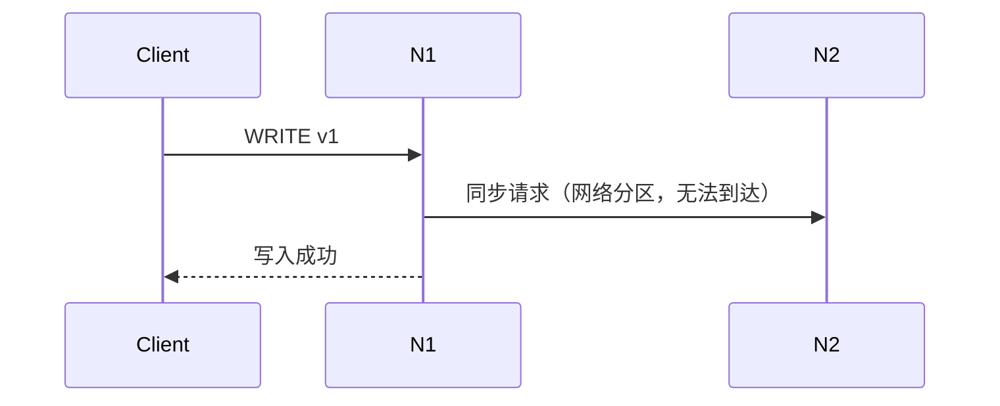
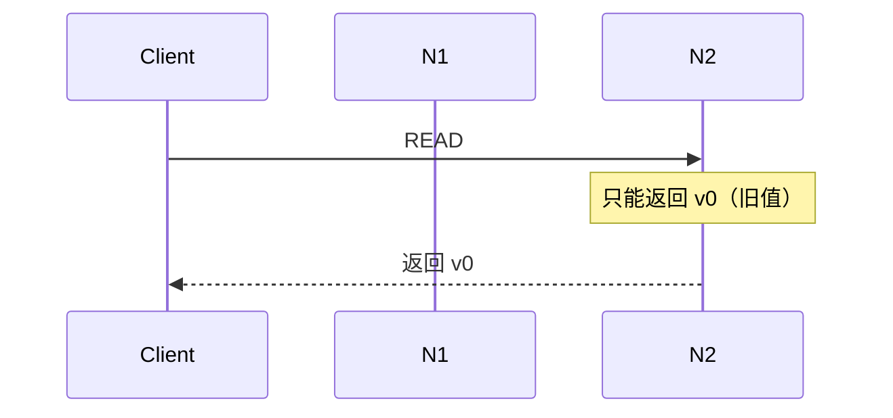
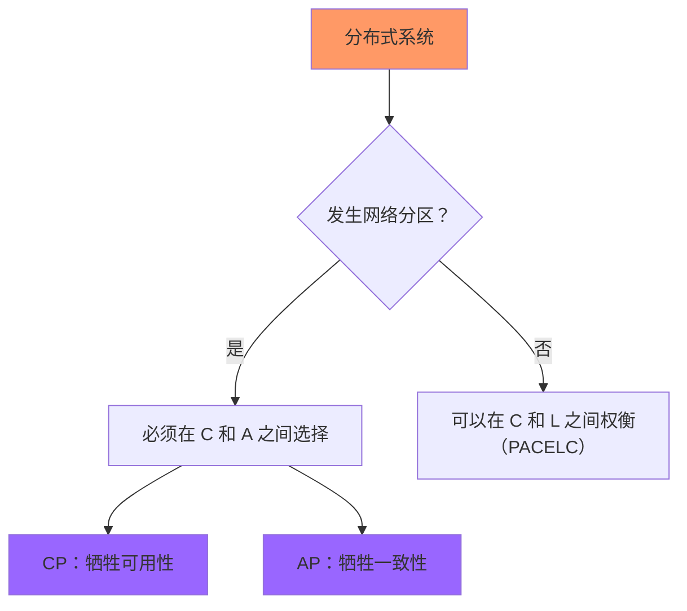

凌晨两点，你正在值班。监控系统突然报警：数据库主从复制延迟了 800ms。用户还在继续操作，订单系统还在写入，支付接口还在回调。你盯着屏幕上闪烁的告警，心里清楚一个事实——网络分区发生了。

此刻，系统面临一个艰难的抉择：是要保证所有节点返回一致的数据，还是要让每个节点都能正常响应用户请求？

CAP 定理告诉你，这两个目标不可能同时实现。但为什么？这背后的数学原理是什么？

## 一、起源：从猜想到证明

2000 年的 PODC（分布式计算原理年会）上，Eric Brewer 提出了一个后来影响整个分布式系统领域的猜想：分布式系统无法同时满足一致性（Consistency）、可用性（Availability）和分区容忍（Partition Tolerance）三个属性。

这个猜想在当时更多是一种直觉判断，而非严格的数学命题。

两年后，麻省理工学院的 Seth Gilbert 和 Nancy Lynch 在论文《Brewer's Conjecture and the Feasibility of Consistent, Available, Partition-Tolerant Web Services》中给出了严格的数学证明。他们不仅证明了 Brewer 的猜想，还给出了每个属性精确的形式化定义。

这篇论文至今仍是分布式系统领域的必读经典，被引用超过两万次。

## 二、CAP 三要素的形式化定义

在理解证明之前，我们需要先明确 CAP 三个要素的精确定义。很多误解的产生，恰恰是因为对这些定义的理解不够准确。

### Consistency（一致性）

Gilbert 和 Lynch 将一致性定义为**原子一致性**（Atomic Consistency），或者说是线性一致性（Linearizability）的一种特殊形式。一个系统如果满足一致性，意味着：

- 任何读操作返回的都是最近一次写操作的结果
- 所有节点对数据的视图完全相同
- 读和写操作在时间上具有全序关系

用更通俗的话说：**要么读到最新数据，要么读到错误**——不存在「读到旧数据但系统声称这是新数据」的情况。

### Availability（可用性）

可用性定义为：系统中的每个节点在收到合法请求后，必须在有限时间内返回响应。关键约束包括：

- **每个节点都必须能响应**——如果某个节点永远不响应，系统就不满足可用性
- **响应时间有限**——无限等待的请求不算作「收到响应」
- **响应必须是有效的**——不能返回错误信息说「系统不可用」

### Partition Tolerance（分区容忍）

分区容忍的定义比较微妙。在分布式系统中，网络分区是一种**必然会发生的故障模式**，而不是一种可选特性。一个系统要成为分布式系统，就必须能容忍网络分区——否则一旦发生网络故障，整个系统就完全不可用了。

Gilbert 和 Lynch 在论文中明确指出：

> 在一个分布式系统中，网络分区必然发生。如果系统声称可以在没有分区的情况下运作，那它就不是一个真正分布式系统。

这就是为什么 CAP 定理实际上应该被理解为「三选二」：**不是在三个属性中选择两个，而是在 C 和 A 之间选择**——因为 P（分区容忍）是分布式系统的必要条件，你无法放弃它。

## 三、核心证明：反证法

Gilbert 和 Lynch 的证明使用了经典的**反证法**（Proof by Contradiction）。思路很简单：假设存在一个系统同时满足 CAP 三个属性，然后证明这个假设会导出矛盾。

### 假设条件

设系统 G 满足以下条件：

1. **分区容忍（P）**：系统能在网络分区时继续运作
2. **可用性（A）**：每个请求都能在有限时间内得到响应
3. **一致性（C）**：所有读写操作都是原子一致的

现在，我们构造一个场景来产生矛盾。

### 构造矛盾场景

考虑一个只有两个节点 N1 和 N2 的系统，它们通过网络通信。由于分区容忍是必需的，我们假设这两个节点之间的网络连接中断了——这就是一次网络分区。

现在，客户端向 N1 写入值 `v1`：

由于网络分区，N1 无法将这次写操作同步给 N2。但根据可用性假设，N1 必须返回写入成功的响应。

接下来，同一个客户端向 N2 读取数据：

根据可用性要求，N2 必须返回一个响应。由于 N2 没有收到 N1 的写操作，它只能返回旧值 `v0`。

### 矛盾产生

此时，客户端观察到了不一致的状态：

- N1 返回「写入 v1 成功」
- N2 返回「读到了 v0」

如果系统是一致的，那么在写入 v1 之后，所有后续的读操作都应该返回 v1。但实际上，客户端读到了旧值 v0。这违反了**一致性**的定义。

如果系统保持可用，那么客户端在 N2 上能获得响应，但这个响应与 N1 上的写入结果冲突。这违反了**一致性**的定义。

如果我们试图保持一致性，就必须拒绝客户端在 N2 上的读请求——但这样就违反了**可用性**假设。

反之，如果我们保持可用性，就必须允许 N2 返回旧值——但这样就违反了**一致性**假设。

### 证明结论

因此，在网络分区期间，**不可能同时满足一致性 C 和可用性 A**。系统必须在两者之间做出选择：

- 选择 **CP**：在分区期间，停止接受可能导致不一致的请求（牺牲可用性）
- 选择 **AP**：允许节点返回旧数据，继续提供服务（牺牲一致性）

这就是 CAP 定理的精髓：**分区必然发生，一旦发生，必须在 C 和 A 之间二选一**。

## 四、PACELC 模型：没有分区时的权衡

CAP 定理描述的是「有分区时」的行为。但 Gilbert 和 Lynch 的论文之后，研究者又提出了一个补充模型：**PACELC**（Partition Asymmetry + Else CAP, Otherwise Latency vs Consistency）。

这个模型由 Amazon Dynamo 的研究者提出，描述了一个更完整的权衡图景：

> **If there is a partition (P), how does the system tradeoff C vs A? Else (E), how does the system tradeoff L (latency) vs C?**

### PACELC 的核心观点

即使在没有网络分区的情况下，**一致性和延迟之间也存在权衡**：

| 系统 | 分区期间行为 | 无分区时的选择 |
|------|------------|--------------|
| DynamoDB（DB） | 保持可用，放弃一致性 | 选择低延迟（弱一致） |
| DynamoDB（WA） | 保持可用，放弃一致性 | 选择一致性（高延迟） |
| Cassandra | 保持可用，放弃一致性 | 选择低延迟 |
| HBase | 牺牲可用性，保证一致性 | 选择一致性 |

例如，Amazon Dynamo 的设计哲学是：「永远可用」——即使在分区期间也不例外。但代价是，你可能读到过期数据。而 HBase 的设计哲学是：「永远一致」——代价是在某些场景下响应会变慢。

## 五、常见误区澄清

理解了证明之后，我们来澄清几个最常见的误解。

### 误区一：CAP 是「三选二」的静态选择

很多人以为 CAP 意味着「你必须在 C、A、P 中选两个」。但实际上，**P 不是可选的**——它是分布式系统的必要条件。你真正面对的选择是：「当分区发生时，我选 C 还是 A？」

系统可以在运行时动态调整其行为。例如，Redis Sentinel 在正常运行时提供可用性，在主节点故障时进入不可用状态（CP）。但这不是一个静态的「三选二」，而是一个动态决策过程。

### 误区二：存在「CA 系统」

理论上，CA 系统（同时满足一致性和可用性，但不满足分区容忍）是存在的。但它们只存在于**单机系统或完美网络环境**中。在现实世界中，网络故障必然发生，所以不存在真正可用的 CA 分布式系统。

如果你看到一个系统声称自己是「CA 系统」，它要么是：

- 单机系统（不是分布式）
- 假设网络永远不会故障（不现实）

### 误区三：CAP 是二选一，不是三选二

Gilbert 和 Lynch 的原始论文明确指出，**CAP 的含义是：在存在分区 P 时，必须在 C 和 A 之间选择**。

### 误区四：一致性只有「有」和「无」两种状态

一致性不是一个布尔值，而是一个光谱。从强到弱，常见的模型包括：

- **线性一致性（Linearizability）**：最严格，读写操作具有全局时间顺序
- **顺序一致性（Sequential Consistency）**：保证操作按某个顺序执行，但不一定是全局时间顺序
- **因果一致性（Causal Consistency）**：只保证有因果关系的操作有序
- **最终一致性（Eventual Consistency）**：只保证在「足够长」的时间后达到一致

CAP 中的 C 指的是**最强的一致性**——线性一致性/原子一致性。

## 六、证明的现实意义

理解了 CAP 的数学证明后，我们再来看它对实际系统设计的影响。

### 设计启示

分布式系统的设计者必须理解：**网络分区不是「异常情况」，而是「正常情况」**。 CAP 定理告诉我们的，不是「系统在某些情况下会出问题」，而是「系统在设计时就必须考虑分区」。

在 CAP 框架下做决策，需要考虑以下问题：

1. **业务允许什么样的不一致窗口？** 如果业务不能容忍任何不一致，CP 是必选
2. **业务对可用性的要求有多高？** 如果必须 7×24 可用，AP 是必选
3. **数据的冲突解决策略是什么？** AP 系统必须有能力处理冲突数据

### CAP 与业务场景的匹配

| 业务场景 | 推荐选择 | 原因 |
|---------|---------|------|
| 金融交易、库存管理 | CP | 不允许任何不一致 |
| 社交 Feed、评论系统 | AP | 可以容忍短暂不一致 |
| 电商商品信息 | AP（最终一致） | 高可用优先 |
| 分布式锁、协调服务 | CP | 一致性是核心需求 |

## 术语表

| 术语 | 英文 | 定义 |
|-----|------|------|
| CAP 定理 | CAP Theorem | 分布式系统无法同时满足一致性、可用性和分区容忍 |
| 原子一致性 | Atomic Consistency | 所有操作像在单个节点上执行一样原子 |
| 线性一致性 | Linearizability | 操作具有全局时间顺序 |
| 分区容忍 | Partition Tolerance | 系统能在网络分区时继续运作 |
| PACELC 模型 | PACELC Model | 描述分区和无分区两种情况下的权衡模型 |
| 反证法 | Proof by Contradiction | 假设命题不成立，导出矛盾，从而证明命题成立 |

---

理解 CAP 定理的数学证明，不只是为了应付面试。更重要的是，它能帮助你**在做架构决策时，不再凭直觉猜测，而是有坚实的理论依据**。当你下次在凌晨两点面对那个告警时，你会清楚地知道：系统在分区期间的行为，取决于你在设计时的选择。

如果业务要求强一致，那么系统必须在分区时牺牲可用性；如果业务要求高可用，那么系统必须接受分期间的不一致。没有什么「完美方案」，只有「适合场景的方案」。