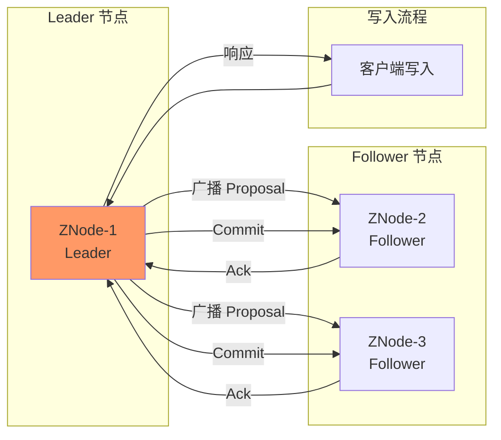
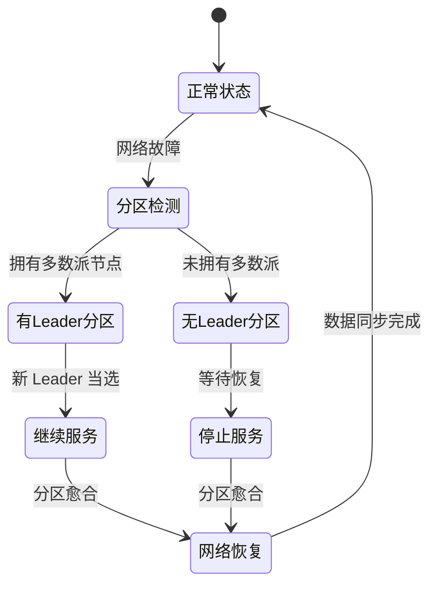
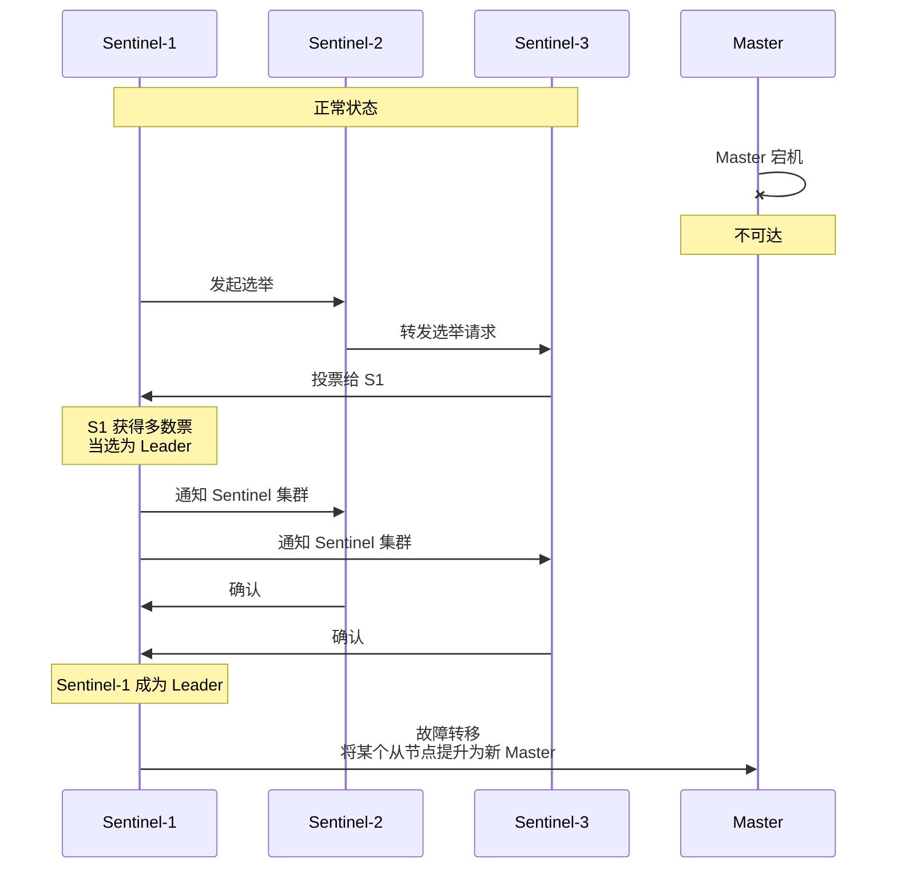
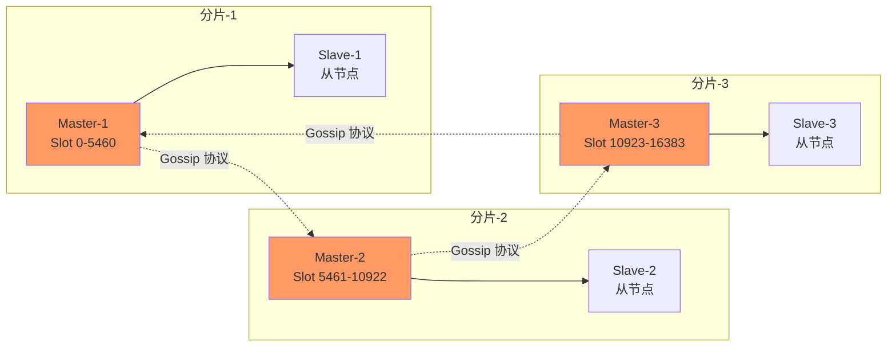
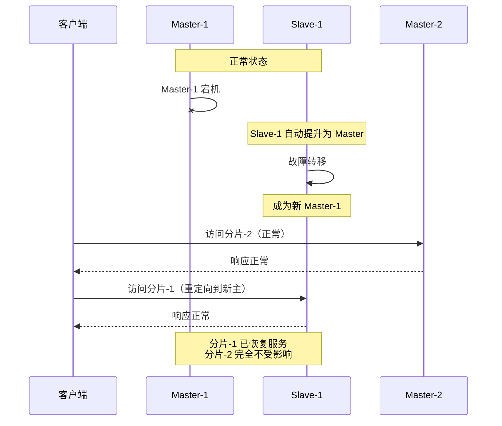
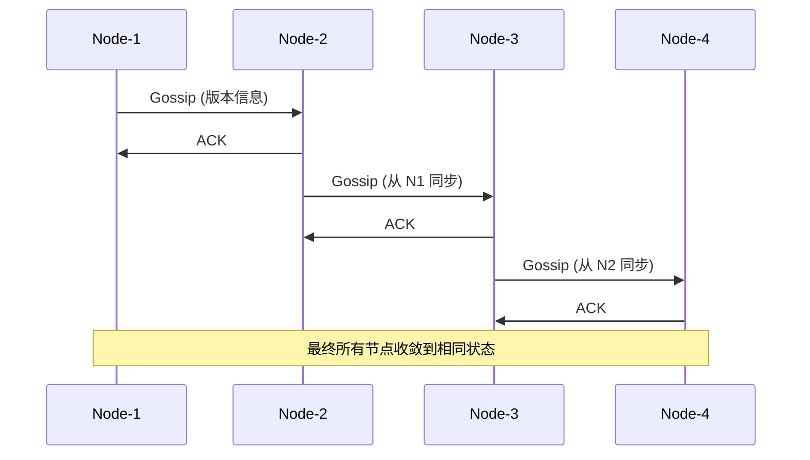
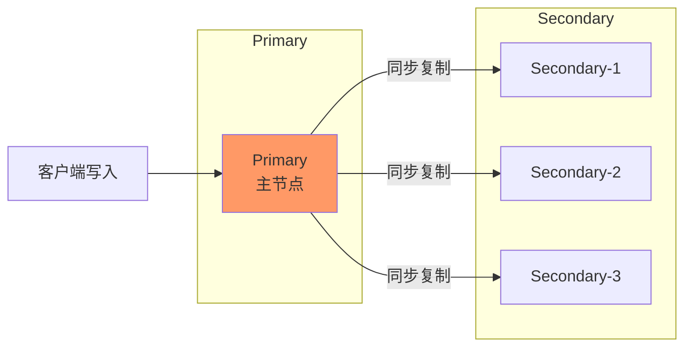
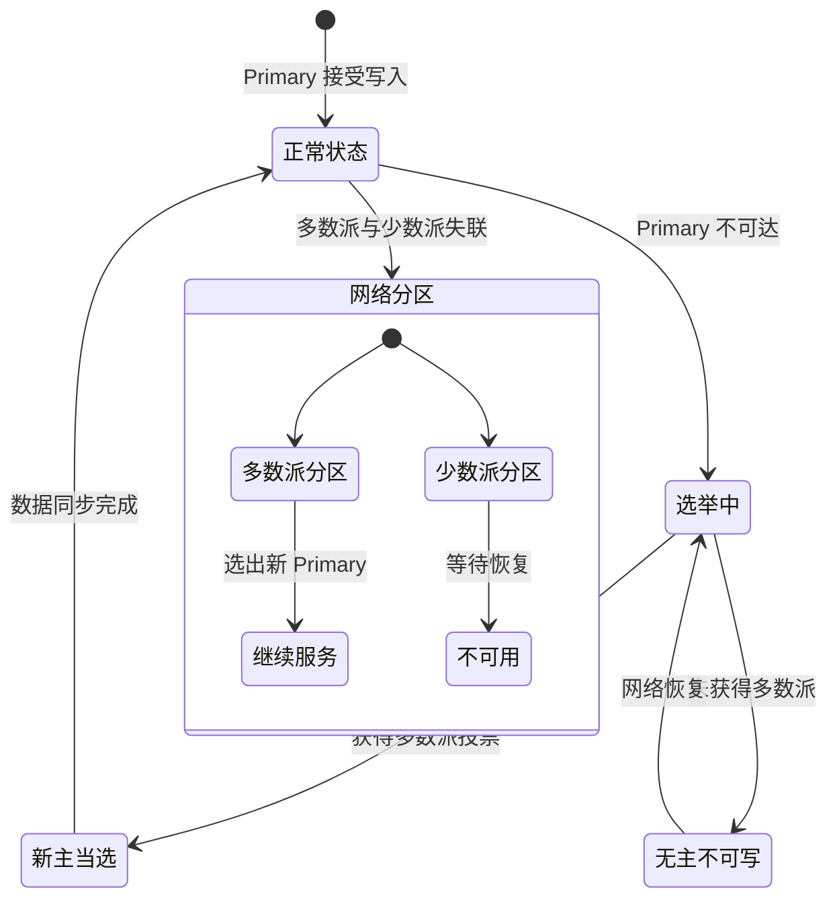

理论讲完了，现在让我们把目光转向真实世界。

ZooKeeper 真的是 CP 吗？Redis Cluster 在分区时会发生什么？Cassandra 的「无主复制」听起来很美好，但代价是什么？

理解 CAP 理论的最好方式，不是背诵定义，而是**看真实系统如何做出权衡**。

本文将深入分析 6 个主流分布式系统的 CAP 属性，揭示它们的设计决策，以及这些决策对实际应用的影响。

## 一、ZooKeeper：CP 的教科书实现

### 设计哲学

ZooKeeper 从诞生之初就定位为「分布式协调服务」。它的核心设计哲学是：

> **正确性第一，可用性第二。**

协调服务（如分布式锁、Leader 选举）如果提供错误的数据，后果是灾难性的。一把「重复发放」的分布式锁，可能导致数据被覆盖。一次「错误的 Leader 选举」，可能导致脑裂和数据损坏。

因此，ZooKeeper 选择了 **CP**：宁可停止服务，也不返回错误数据。

### 一致性实现：ZAB 协议

ZooKeeper 使用 **ZAB 协议**（ZooKeeper Atomic Broadcast）保证强一致性。



ZAB 的核心机制：

1. **Leader 接收请求**：所有写请求必须经过 Leader
2. **两阶段提交**：Leader 广播 Proposal，收到多数派 Ack 后 Commit
3. **顺序保证**：所有操作按 Leader 提交的顺序执行
4. **崩溃恢复**：Leader 崩溃后，重新选举新 Leader

### 分区时的行为

当网络分区发生时，ZooKeeper 的行为是明确的：

- **有 Leader 的分区**：继续提供服务
- **无 Leader 的分区**：停止服务，直到选出新 Leader



这就是为什么 ZooKeeper 的节点数通常配置为 **奇数**（3、5、7）——这样可以最大化可用性的同时，保证能形成多数派。

| 节点数 | 容忍失败节点数 | 需要多数派 |
|-------|---------------|-----------|
| 3 | 1 | 2 |
| 5 | 2 | 3 |
| 7 | 3 | 4 |

### 适用场景与局限

**适用场景**：

- 分布式锁（需要强一致）
- Leader 选举
- 配置管理
- 服务协调（如 Kafka Controller）

**不适用的场景**：

- 服务注册与发现（需要高可用）
- 需要跨数据中心部署（延迟太高）
- 需要支持大量客户端连接（ZooKeeper 连接数有限）

## 二、Eureka：AP 的践行者

### 设计哲学

Netflix 设计 Eureka 时，核心理念是：

> **服务注册中心必须永远可用，宁可返回旧数据，也不能让服务消失。**

Netflix 的业务场景决定了这一点：他们的服务需要 7×24 小时可用。如果服务注册中心在凌晨三点不可用，整个流媒体服务就会中断。

### 可用性实现：去中心化 + 心跳

Eureka 的架构与 ZooKeeper 完全相反：

```mermaid
flowchart TD
    subgraph Eureka Server 集群
        E1["Eureka-1<br/>（对等节点）"]
        E2["Eureka-2<br/>（对等节点）"]
        E3["Eureka-3<br/>（对等节点）"]
    end
    
    subgraph 服务实例
        S1["服务-1"]
        S2["服务-2"]
        S3["服务-3"]
    end
    
    S1 --> E1: 注册 + 心跳
    S1 --> E2: 注册 + 心跳
    S1 --> E3: 注册 + 心跳
    
    S2 --> E1
    S2 --> E2
    S2 --> E3
    
    E1 -.->|"Gossip 同步"| E2
    E2 -.->|"Gossip 同步"| E3
    E3 -.->|"Gossip 同步"| E1
    
    style E1 fill:#9f9
    style E2 fill:#9f9
    style E3 fill:#9f9
```

**关键设计**：

- **无 Leader**：所有节点对等，都可以接受服务注册
- **心跳续约**：服务实例定期发送心跳，超过阈值未续约则剔除
- **Gossip 同步**：节点之间通过 Gossip 协议逐步同步数据
- **客户端缓存**：客户端缓存注册表，不依赖 Server 一直可用

### 分区时的行为

当网络分区发生时，Eureka 的行为是：

- **每个分区独立继续工作**：服务可以继续注册和心跳
- **分区愈合后同步**：各分区积累的注册数据通过 Gossip 合并
- **可能产生「脏数据」**：已下线服务的注册信息可能在部分节点残留

Netflix 认为这是**可接受的权衡**：消费者可能在短时间内访问到已下线服务，但只要消费者实现了「快速失败」和「重试」，这种不一致不会造成严重后果。

### 为什么不选 ZooKeeper 做服务发现？

| 维度 | ZooKeeper（CP） | Eureka（AP） |
|-----|-----------------|--------------|
| **Leader 依赖** | 强依赖，Leader 故障时短暂不可用 | 无 Leader，所有节点等价 |
| **连接数限制** | ~60000 连接/节点 | ~20000 连接/节点 |
| **服务感知延迟** | 快（强一致） | 慢（最终一致） |
| **分区容忍** | 分区时部分节点不可用 | 分区时各分区独立服务 |
| **客户端复杂度** | 简单（直接从 Server 读取） | 复杂（需要缓存 + 重试） |

## 三、Redis Sentinel：CP 的主从方案

### 设计哲学

Redis Sentinel 是 Redis 的**高可用解决方案**。它的设计目标是：

> **保证主从数据一致，在主节点故障时快速切换到从节点。**

注意，Sentinel 不是「永远可用」的解决方案，而是「快速恢复」的解决方案。

### 一致性实现：Raft 选主

Redis Sentinel 使用 **Raft 协议**进行 Leader 选举：



**关键点**：在选举期间，整个 Redis 集群不可写。这就是 Redis Sentinel 的 CP 特性。

### 故障转移过程

Redis Sentinel 的故障转移分为几个阶段：

| 阶段 | 时长 | 服务状态 |
|-----|------|---------|
| 故障检测 | ~10 秒 | 可能不可写 |
| 选举新主 | ~5 秒 | 不可写 |
| 配置传播 | ~1 秒 | 不可写 |
| **总计** | **~15-30 秒** | **不可写** |

这就是 Redis Sentinel 的主要缺陷：**主从切换期间，服务不可用**。

### 适用场景

Redis Sentinel 适合：

- 对数据一致性要求高的场景
- 可以容忍短暂不可用（< 1 分钟）的场景
- 小规模部署（单个数据中心）

## 四、Redis Cluster：AP 的分片方案

### 设计哲学

Redis Cluster 是 Redis 的**分布式集群解决方案**。它的设计目标是：

> **高可用 + 可扩展，允许多个主节点同时服务。**

与 Sentinel 不同，Redis Cluster 的核心特点是**分片**：数据分布在多个主节点上，每个主节点可以有多个从节点。

### 架构设计



**关键设计**：

- **16384 个 Slot**：数据通过哈希槽分布在 16384 个 Slot 中
- **无中心架构**：节点之间通过 Gossip 协议通信
- **去中心化路由**：客户端可以连接任意节点，节点负责转发

### 分区容忍的实现

Redis Cluster 的 AP 特性体现在：**当某个分片的主节点故障时，该分片的从节点自动升级为主节点，其他分片继续服务。**



**关键优势**：Redis Cluster 不会因为**一个分片**的故障导致**整个集群**不可用。只有故障分片不可用，其他分片继续服务。

### 异步复制的代价

Redis Cluster 使用**异步复制**：主节点写入后，立即响应客户端，然后异步同步到从节点。

这意味着：

- **可能丢失数据**：主节点写入后同步前宕机，数据丢失
- **最终一致性**：主从数据可能短暂不一致

这就是 Redis Cluster 的 AP 特性：**保证可用性，接受数据丢失的风险**。

## 五、Cassandra：AP 的无主架构

### 设计哲学

Apache Cassandra 从诞生之初就定位为「永远可用的分布式数据库」。它的设计哲学是：

> **CAP 中，我选择 AP。C 只是留给用户的选择，不是系统的默认值。**

Cassandra 的架构中没有「主节点」的概念——**所有节点都是对等的**，都可以接受读写请求。

### 一致性实现：可调一致性

Cassandra 提供了**可调一致性**（Tunable Consistency），让用户决定每一步操作的一致性级别：

| 一致性级别 | 读取 | 写入 | 说明 |
|-----------|------|------|------|
| ONE | 1 个节点 | 1 个节点 | 最高可用，最低一致 |
| QUORUM | N/2 + 1 个节点 | N/2 + 1 个节点 | 平衡模式 |
| ALL | 所有节点 | 所有节点 | 最高一致，最低可用 |
| LOCAL_QUORUM | 本地数据中心多数派 | 本地数据中心多数派 | 跨数据中心场景 |

```java
// Cassandra 可调一致性示例
// 强一致读取
SELECT * FROM users WHERE id = ? 
USING CONSISTENCY QUORUM;

// 高可用写入（可能丢失其他节点数据）
INSERT INTO users (id, name) VALUES (?, ?) 
USING CONSISTENCY ONE;

// 跨数据中心场景
INSERT INTO users (id, name) VALUES (?, ?) 
USING CONSISTENCY LOCAL_QUORUM;
```

### 数据复制与 Gossip

Cassandra 使用 **Gossip 协议**进行节点间通信和数据同步：



Gossip 协议的特点：

- **最终一致**：所有节点最终会收敛到相同状态
- **去中心化**：没有单点故障
- **容错性强**：节点临时离线不影响其他节点通信

### 分区容忍的实现

当网络分区发生时，Cassandra 的行为是：

- **每个数据中心独立继续服务**：各自接受读写请求
- **分区愈合后同步**：使用 Gossip 协议合并冲突
- **墓碑 + TTL**：删除操作写入墓碑，过期后清理

**冲突解决策略**：

- **Last-Write-Wins（LWW）**：时间戳最新的写入胜出
- **业务自定义**：使用「列级冲突解决」或「合并函数」

## 六、MongoDB：CP 的副本集

### 设计哲学

MongoDB 的副本集设计哲学是：

> **数据安全第一。如果不能保证一致性，宁可停止服务。**

### 副本集架构

MongoDB 使用 **副本集**（Replica Set）实现高可用：



**关键设计**：

- **单主模式**：只有一个 Primary 接受写请求
- **同步复制**：写入 Primary 后，同步到多数派节点才确认
- **自动故障转移**：Primary 故障后，从节点选举新 Primary

### 写入关注与读取偏好

MongoDB 提供了**写入关注**（Write Concern）和**读取偏好**（Read Preference）控制一致性：

```javascript
// 强一致写入（需要多数派确认）
db.users.insertOne(
    { name: "张三" },
    { writeConcern: { w: "majority" } }  // [!code highlight]
);

// 可用性优先写入（只确认主节点）
db.users.insertOne(
    { name: "李四" },
    { writeConcern: { w: 1 } }
);

// 读取偏好
db.users.find({}).readPref("primary");       // 只读主节点（强一致）
db.users.find({}).readPref("secondary");     // 只读从节点（可能旧数据）
db.users.find({}).readPref("nearest");       // 读最近的节点（延迟最低）
```

### 分区时的行为

当 Primary 节点故障时，MongoDB 副本集会进入选举流程：



**分区的后果**：

- **多数派分区**：选出新 Primary，继续服务
- **少数派分区**：停止服务，等待网络恢复

这就是 MongoDB 的 CP 特性：**宁可停止服务，也不接受不一致的写入**。

## 七、权衡矩阵：系统对比总结

| 系统 | CAP 分类 | 一致性实现 | 可用性实现 | 典型场景 | 核心权衡 |
|-----|---------|-----------|-----------|---------|---------|
| ZooKeeper | CP | ZAB 协议 | 重新选主后恢复 | 分布式锁、配置管理 | 分区时完全不可用 |
| Eureka | AP | 最终一致 | 去中心化 + Gossip | 服务注册发现 | 可能读到脏数据 |
| Redis Sentinel | CP | 同步复制 | 故障转移后恢复 | 哨兵监控、高可用 | 切换期间不可写 |
| Redis Cluster | AP | 异步复制 | 分片独立服务 | 缓存、分片存储 | 可能丢失数据 |
| Cassandra | AP | 可调一致性 | 无主复制 + Gossip | 时序数据、大数据 | 一致性可调，但有代价 |
| MongoDB | CP | 多数派写入 | 重新选主后恢复 | 文档数据库 | 分区时少数派不可用 |

## 八、选型建议

### 场景化选型指南

| 需求 | 推荐系统 | 原因 |
|-----|---------|------|
| 分布式锁 | ZooKeeper、etcd | 强一致保证，无重复获取风险 |
| 服务发现 | Eureka、Consul | 高可用，服务不消失 |
| 缓存层 | Redis Cluster | 分片扩展，高可用 |
| 配置中心 | etcd、Consul | 强一致，配置变更原子 |
| 时序数据 | Cassandra | 高写入吞吐，可调一致性 |
| 文档存储 | MongoDB | 副本集保证数据安全 |
| 消息队列 Offset | Kafka | 强一致，消费进度不丢失 |

### 不要这样选型

| 错误选型 | 问题 | 正确做法 |
|---------|------|---------|
| 用 ZooKeeper 做服务发现 | 分区时服务不可用 | 用 Eureka 或 Consul |
| 用 Eureka 做分布式锁 | 可能产生重复锁 | 用 ZooKeeper 或 etcd |
| 用 MongoDB 做高写入吞吐 | Primary 成为瓶颈 | 用 Cassandra |
| 用 Redis Cluster 做强一致存储 | 异步复制可能丢数据 | 用 Redis Sentinel 或主从复制 |

## 术语表

| 术语 | 英文 | 定义 |
|-----|------|------|
| ZAB 协议 | ZooKeeper Atomic Broadcast | ZooKeeper 的原子广播协议，保证强一致 |
| Gossip 协议 | Gossip Protocol | 去中心化的节点通信协议，最终一致 |
| 副本集 | Replica Set | 一主多从的数据库集群架构 |
| 可调一致性 | Tunable Consistency | Cassandra 的特性，允许用户选择一致性级别 |
| 写入关注 | Write Concern | MongoDB 控制写入确认级别的机制 |
| 读取偏好 | Read Preference | MongoDB 控制读取节点选择的机制 |
| 墓碑 | Tombstone | 标记删除而非立即物理删除的机制 |
| 故障转移 | Failover | 主节点故障时自动切换到备用节点 |

---

理解真实系统的 CAP 属性，不只是为了面试。更重要的是，它能帮助你在架构设计时做出**正确的技术选型**。

没有「最好的系统」，只有「最适合当前场景的系统」。当你理解了一个系统的 CAP 属性，你就理解了它的**设计边界**——在什么情况下它会出问题，出了问题会是什么后果。

下次选型时，问问自己：**我的业务能容忍什么程度的不一致？能容忍多长时间的服务不可用？** 答案会告诉你，应该选 CP 还是 AP。