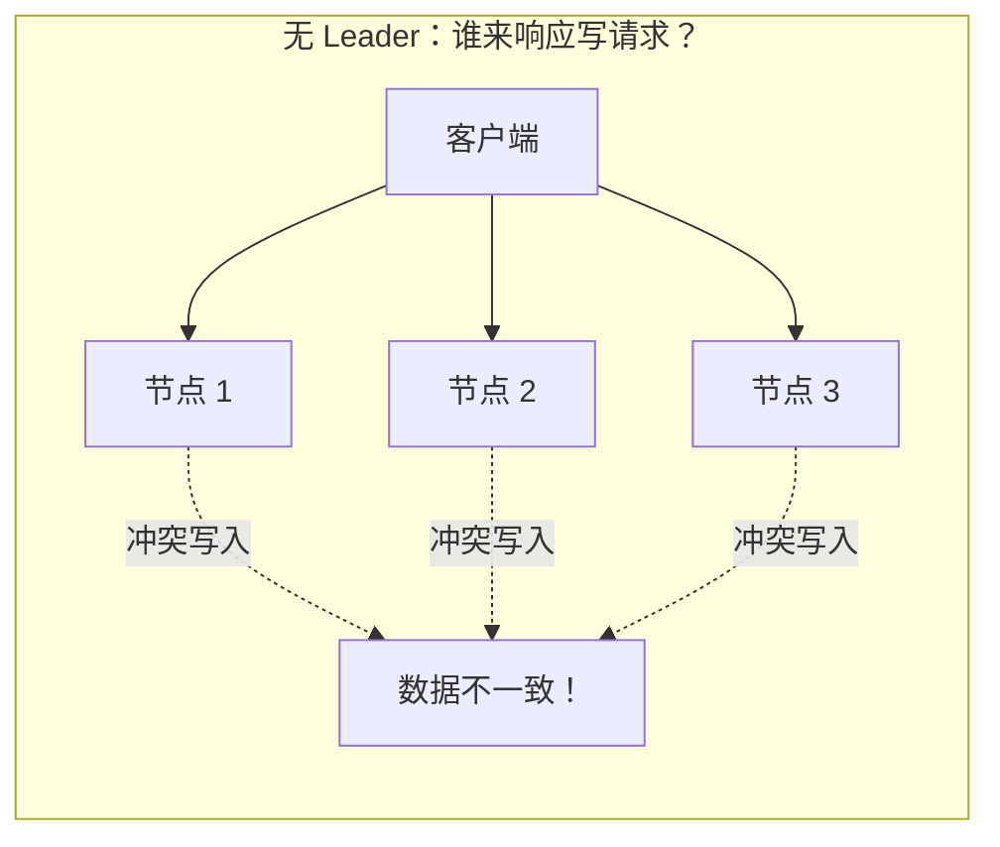
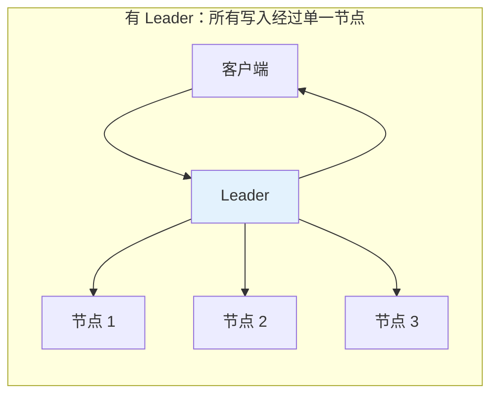
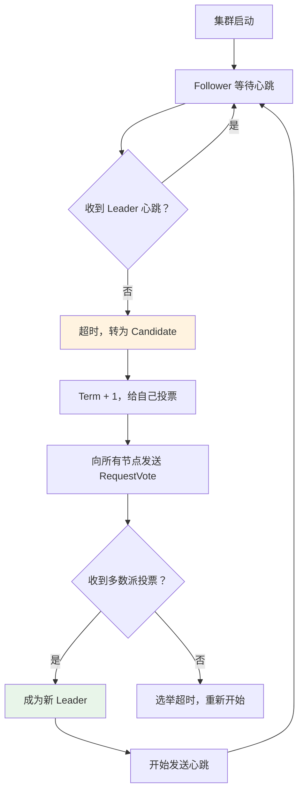
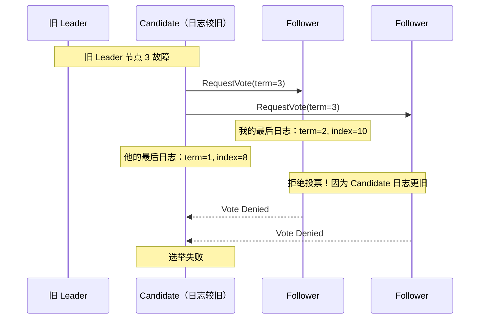
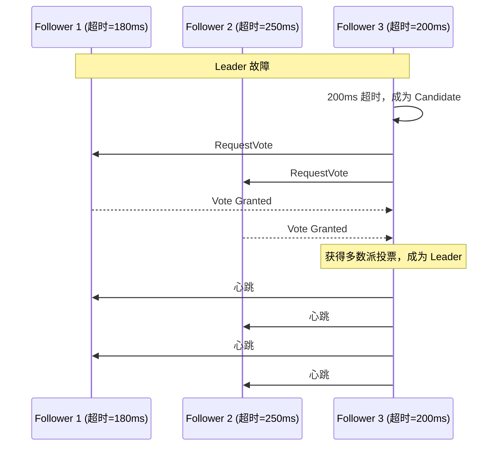
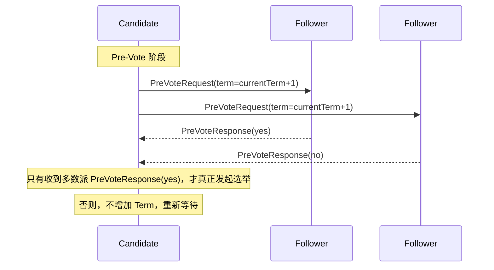
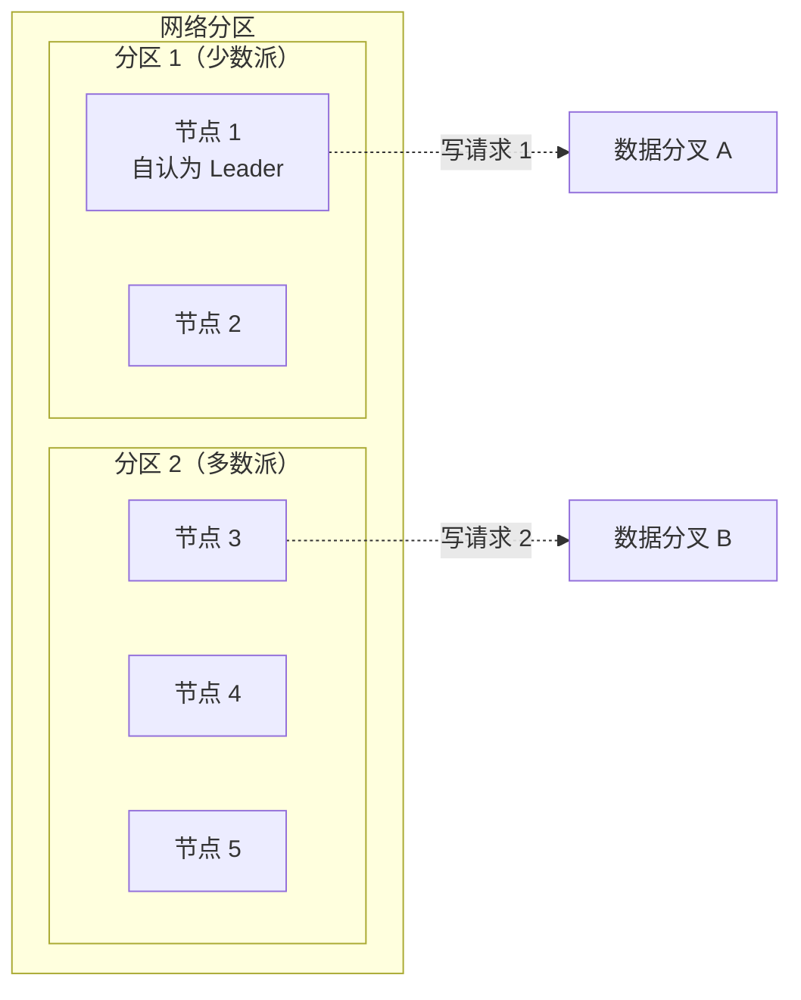

为什么分布式系统需要 Leader？

一个直观的答案是：因为集中式协调比分布式协调更简单。如果每个节点都可以发起决策，需要额外的协议来协调「谁来做决定」——这本身就是一个分布式问题。

但集中式协调也有代价：**单点问题**。Leader 挂了，整个系统就瘫痪了。所以我们需要 Leader 选举——一种让集群在 Leader 故障后**自动恢复**的机制。

## 为什么需要 Leader

考虑一个没有 Leader 的分布式 KV 存储：



两个客户端同时写入相同 key，不同节点可能收到不同的值——**冲突**。

**有了 Leader**：



所有写入经过 Leader，**顺序天然一致**，冲突概率大幅降低。

:::info
**Leader 的本质**：一个**集中式协调器**，负责将并发请求串行化。它不是必须的，但有了它，很多分布式问题会简单得多。
:::

## 选举触发条件

在 Raft 中，Leader 选举由**心跳超时**触发。



### 关键参数：选举超时

```java
public class RaftConfig {
    // 心跳间隔：Leader 向 Follower 发送心跳的频率
    public static final int HEARTBEAT_INTERVAL_MS = 150;

    // 选举超时范围：Follower 等待心跳的最大时间
    // 150ms ~ 300ms 之间的随机值
    public static final int ELECTION_TIMEOUT_MIN_MS = 150;
    public static final int ELECTION_TIMEOUT_MAX_MS = 300;
}
```

:::warning
**选举超时必须大于心跳间隔**。如果选举超时等于心跳间隔，Follower 可能刚好在 Leader 发送心跳前超时，导致不必要的选举。
:::

## 选举安全性：为什么 Leader 必须是「最新的」

选举不是「谁先发起谁赢」。Raft 规定：**只有包含最新日志的 Candidate 才能赢得选举**。

为什么？



### 投票规则详细说明

```java
public class RaftNode {
    /**
     * 投票规则：
     * 1. Term 必须 >= 当前 Term（否则拒绝，可能是旧 Leader）
     * 2. 当前 Term 还没投过票，或投给了同一个 Candidate
     * 3. Candidate 的日志必须比本地日志「更新」
     */
    public boolean canVoteFor(CandidateInfo candidate) {
        // 规则 1
        if (candidate.term < currentTerm) {
            return false;
        }

        // 规则 2
        if (currentTerm > votedFor && !votedFor.equals(candidate.id)) {
            return false;
        }

        // 规则 3：比较谁的日志更新
        LogEntry myLastLog = log.getLast();
        LogEntry candidateLastLog = candidate.getLastLog();

        // 「更新」的定义：
        // - 最后日志的 term 更大，或
        // - term 相同但 index 更大
        if (candidateLastLog.term < myLastLog.term) {
            return false;
        }
        if (candidateLastLog.term == myLastLog.term &&
            candidateLastLog.index < myLastLog.index) {
            return false;
        }

        return true;
    }
}
```

:::tip
**这个规则保证了 Leader Completeness**：如果一个日志条目在某个 Term 被提交，那么后续所有 Leader 必须包含这个条目。因为 Leader 必须有「最新日志」，而「最新日志」意味着包含所有已提交的条目。
:::

## 随机化设计：避免平票僵局

如果所有节点的选举超时相同，多个 Candidate 可能同时发起选举，各自获得部分票数，陷入**平票僵局**。

Raft 的解决方案：**随机化选举超时**。

```java
// 随机选择选举超时
public class RaftFollower implements Runnable {
    private final Random random = new Random();
    private long electionTimeout;

    public void resetElectionTimeout() {
        // 在 [150ms, 300ms] 范围内随机选择
        electionTimeout = 150 + random.nextInt(151);
        lastHeartbeat = System.currentTimeMillis();
    }

    public void run() {
        while (running) {
            long elapsed = System.currentTimeMillis() - lastHeartbeat;
            if (elapsed > electionTimeout) {
                // 超时，发起选举
                startElection();
            }
            Thread.sleep(10);
        }
    }
}
```



:::info
**为什么随机化有效？**

假设 5 个节点，超时范围 150~300ms。Leader 故障后，第一个超时的节点会在 150ms 左右发起选举。如果它能获得多数派投票（通常需要约 200ms 的 RPC 时间），其他节点还在等待心跳，不会变成 Candidate。
:::

## Pre-Vote 优化：减少无效选举

标准 Raft 中，Candidate 直接发起选举。如果选举失败，会**增加 Term**，这可能「逼退」其他正常节点。

Pre-Vote 是一种优化：**正式发起选举前，先探查是否能获得多数派投票**。



```java
public class RaftNode {
    public void onElectionTimeout() {
        // 发送 Pre-Vote 请求
        int preVoteYes = 0;
        for (Follower f : followers) {
            boolean willVote = f.preVoteCheck();
            if (willVote) preVoteYes++;
        }

        // 只有多数派同意，才真正发起选举
        if (preVoteYes > totalNodes / 2) {
            startRealElection();
        }
    }
}
```

:::warning
**Pre-Vote 的代价**：增加一次网络往返（1 × RTT）。收益是避免无效的 Term 增加。实际实现中，建议在高延迟网络（如跨机房部署）使用。
:::

## 脑裂问题与防护

**脑裂（Split Brain）**：网络分区后，两个节点都认为自己是 Leader，都可以接受写入——导致数据不一致。



**共识算法如何防止脑裂？**

答案：**多数派投票**。

- 只有获得**多数派投票**的节点才能成为 Leader
- 网络分区后，少数派无法获得多数派，无法成为 Leader
- 多数派分区选出新 Leader，继续服务
- 少数派分区的「旧 Leader」在发现更高 Term 后自动退位

```java
public class RaftNode {
    public void handleAppendEntries(Request request) {
        // 发现更高 Term，说明有更新的 Leader
        if (request.term > currentTerm) {
            currentTerm = request.term;
            state = NodeState.FOLLOWER;
            votedFor = null;
        }
    }
}
```

## Lease 机制：更灵活的 Leader 身份

标准 Raft 中，Leader 必须持续发送心跳来维持身份。如果心跳暂时丢失，Follower 会发起选举——即使 Leader 还活着。

**Lease（租约）** 机制允许 Follower 在一定时间内**相信 Leader 还活着**，减少不必要的选举。

```java
public class RaftLeader {
    private volatile long leaseExpiry;

    // 发送心跳时，同时带上 lease 时间
    public void sendHeartbeat() {
        AppendEntriesRequest req = new AppendEntriesRequest(
            currentTerm,
            nodeId,
            prevLogIndex,
            prevLogTerm,
            entries,
            commitIndex,
            leaseDurationMs   // Lease 时长
        );
        for (Follower f : followers) {
            sendRequest(f, req);
        }
        leaseExpiry = System.currentTimeMillis() + leaseDurationMs;
    }
}

public class RaftFollower {
    public void onHeartbeatReceived(Request request) {
        lastHeartbeat = System.currentTimeMillis();

        // 如果 lease 还没过期，不发起选举
        if (System.currentTimeMillis() < leaseExpiry) {
            electionTimeout = leaseExpiry - System.currentTimeMillis() + MARGIN;
        }
    }
}
```

:::tip
**Lease 的 trade-off**：Lease 减少了不必要的选举，但也引入了「假阳性」——Leader 真的挂了，但 Follower 还在等 Lease 过期。Lease 时长需要根据网络延迟和业务容忍度来权衡。
:::

## 权衡矩阵

| 维度 | 标准选举 | + Pre-Vote | + Lease |
| --- | --- | --- | --- |
| 选举次数 | 多 | 较少 | 少 |
| Term 错误增加 | 可能 | 避免 | 避免 |
| 网络 RTT | 1 × RTT | 2 × RTT | 1 × RTT |
| 实现复杂度 | 低 | 中 | 中 |
| 适用场景 | 本地网络 | 跨机房 | 对延迟敏感 |

## 术语表

| 术语 | 英文 | 解释 |
| --- | --- | --- |
| Leader 选举 | Leader Election | 在集群中选出唯一 Leader 的过程 |
| 心跳 | Heartbeat | Leader 向 Follower 发送的周期性信号，维持 Leader 身份 |
| 选举超时 | Election Timeout | Follower 等待心跳的最大时间，超时后发起选举 |
| 投票 | Vote | Follower 投票给 Candidate 的行为 |
| 多数派 | Quorum | 超过半数的节点集合 |
| 脑裂 | Split Brain | 网络分区后出现多个 Leader 的异常状态 |
| Pre-Vote | Pre-Vote | 正式选举前的探查阶段，避免无效 Term 增加 |
| Lease | Lease / Lease Duration | Leader 身份的有效期，Lease 期内 Follower 相信 Leader 存活 |
| Term | Term | Raft 中的时间单位，全局递增 |
| Leader Completeness | Leader Completeness | 已提交的日志一定被后续所有 Leader 包含 |

## 延伸思考

Leader 选举看似简单，但细节里全是坑。

一个常见的工程问题：**时钟漂移**。如果集群中节点的时钟不同步，随机化的选举超时可能失效——两个节点可能在不同时间「同时」发起选举。在物理机上部署 Raft 时，建议使用 NTP 同步时钟；在容器环境中，由于容器时钟与宿主机绑定，更需要小心。

另一个问题：**网络分区后的数据恢复**。少数派分区重新加入多数派时，它的日志可能比 Leader 的日志「更旧」或「冲突」。Raft 的处理方式是强制 Follower 复制 Leader 的日志——这意味着少数派的数据可能**被覆盖**。如果业务对数据持久化有严格要求，需要考虑**写 quorum** 的配置。

下一个问题：日志复制和 Leader 选举如何配合，保证系统的安全性？
