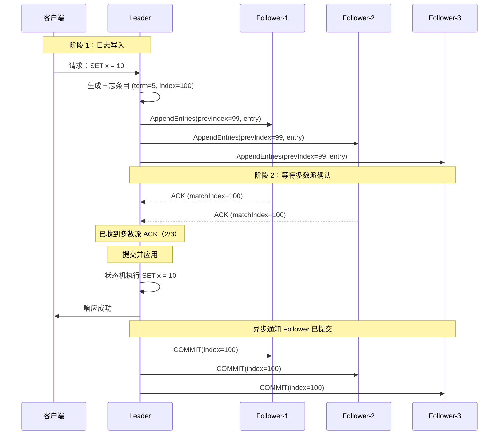
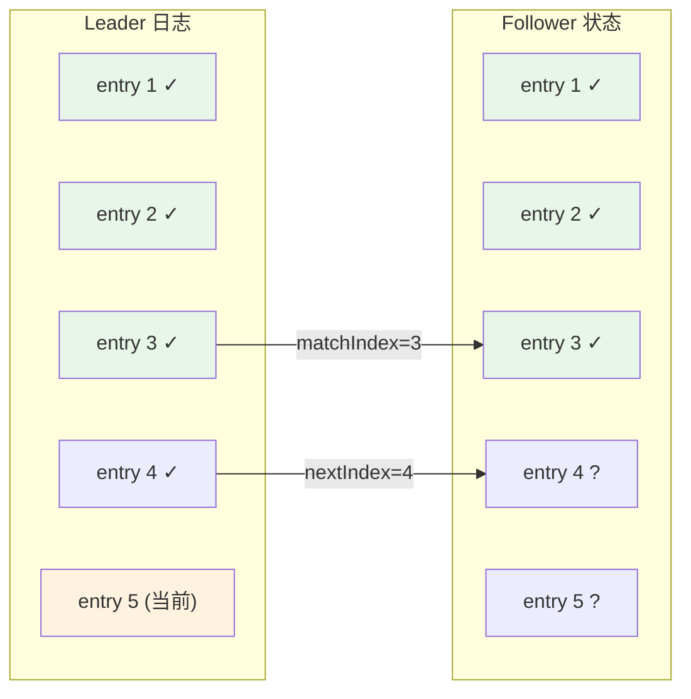
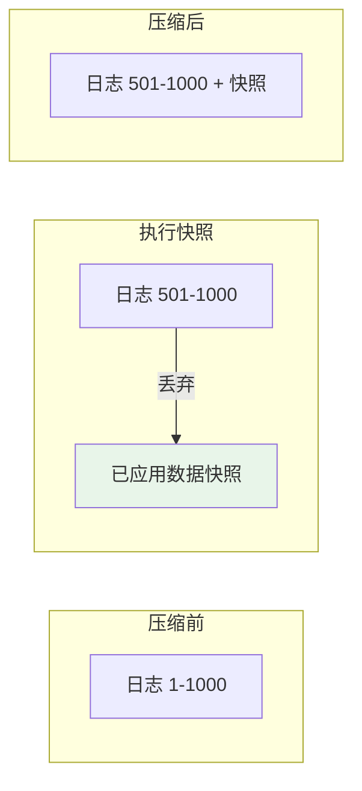

共识算法的核心不是「值的一致」，而是「**日志的顺序**」。

这句话听起来有点反直觉——我们不是说好要让所有节点对「某个值」达成一致吗？为什么变成日志了？

因为：**只要所有节点以相同顺序应用相同的日志条目，最终状态必然一致**。值只是日志执行后的「结果」，日志才是「因」。

这是一个重要的思维方式转变：分布式系统不纠结于「如何同步最终状态」，而是确保「**所有节点看到的操作历史完全相同**」。这个思路，比试图直接同步状态，要简单得多。

## 日志条目结构

在 Raft 中，每个日志条目包含三个核心字段：

```java
public class LogEntry {
    private long term;       // 创建该条目时的任期号
    private int index;       // 该条目在日志中的唯一位置
    private Command command; // 待执行的操作命令

    // 省略 getter/setter
}
```

```
日志示例：

Index  |  Term  |  Command
-------|--------|------------------
  1    |   1    |  SET x = 5
  2    |   1    |  SET y = 3
  3    |   2    |  INCR x
  4    |   2    |  SET z = 10
  5    |   3    |  DEL y
```

:::info
**Term 的作用**：Term 就像日志的「时间戳」，用于判断哪条日志「更新」。结合 index，可以精确定位任意一条日志。
:::

## 复制流程：两阶段提交

Leader 接收客户端请求后，通过两阶段提交将日志复制到所有节点。



### 代码实现：Leader 端

```java
public class RaftLeader {
    private int commitIndex = 0;  // 已知的被多数派接受的日志位置
    private int lastApplied = 0;  // 已应用到状态机的日志位置

    public void handleClientRequest(Command command) {
        // 1. 创建新日志条目
        LogEntry entry = new LogEntry(
            currentTerm,
            nextIndex++,  // 下一个日志索引
            command
        );
        log.append(entry);

        // 2. 并行发送给所有 Follower
        for (Follower f : followers) {
            int prevIndex = entry.index - 1;
            long prevTerm = log.get(prevIndex).term;

            AppendEntriesRequest req = new AppendEntriesRequest(
                currentTerm,
                leaderId,
                prevIndex,
                prevTerm,
                List.of(entry),  // 增量日志
                commitIndex
            );

            // 异步发送，不阻塞
            sendAsync(f, req);
        }
    }

    // 当收到 Follower 的 ACK 时调用
    public void onAppendEntriesAck(Follower f, AppendEntriesResponse resp) {
        if (resp.success()) {
            // 更新 matchIndex
            f.setMatchIndex(resp.matchIndex());
            f.setNextIndex(resp.matchIndex() + 1);

            // 检查是否可以提交
            if (countMatchingReplicas(f.getMatchIndex()) > majority) {
                // 多数派已接受，可以提交
                if (log.get(resp.matchIndex()).term == currentTerm) {
                    commitIndex = resp.matchIndex();
                    applyEntries();
                }
            }
        } else {
            // 拒绝：回退 nextIndex，重试
            f.setNextIndex(f.getNextIndex() - 1);
            retryAppendEntries(f);
        }
    }

    private void applyEntries() {
        while (lastApplied < commitIndex) {
            lastApplied++;
            LogEntry entry = log.get(lastApplied);
            stateMachine.apply(entry.command());
        }
    }
}
```

## 三个关键索引

理解日志复制，需要理解三个核心索引：

| 索引 | 名称 | 说明 |
| --- | --- | --- |
| **nextIndex** | 下一个待发送索引 | Leader 记录每个 Follower 下一个要发送的日志位置 |
| **matchIndex** | 已匹配索引 | Leader 记录每个 Follower 已确认匹配的日志位置 |
| **commitIndex** | 已提交索引 | 已知被多数派接受的日志位置 |



## 安全性保证

### 不变式 1：Leader 不会覆盖已提交日志

```
Leader Completeness Property：
如果某个日志条目在某个 Term 被提交，
那么后续所有 Leader 都必须包含这个条目。
```

这是通过**投票规则**保证的：只有日志比本地更新的 Candidate 才能获得投票。

### 不变式 2：日志匹配特性

```
Log Matching Property：
如果两个节点的日志在某个 index 之前都匹配，
则 index 之前的所有日志都匹配。
```

这是通过 AppendEntries 的**一致性检查**保证的。

```java
public class RaftFollower {
    public AppendEntriesResponse handleAppendEntries(AppendEntriesRequest req) {
        // 一致性检查
        if (req.prevLogIndex > 0) {
            // 如果 prevLogIndex 超出本地日志范围
            if (req.prevLogIndex > log.size()) {
                return new AppendEntriesResponse(false, log.size());
            }

            // 如果 prevLogIndex 处的 term 不匹配
            if (log.get(req.prevLogIndex - 1).term != req.prevLogTerm) {
                // 冲突：需要回退日志
                truncateLog(req.prevLogIndex);
                return new AppendEntriesResponse(false, log.size());
            }
        }

        // 通过检查，追加新日志
        for (LogEntry entry : req.entries) {
            log.append(entry);
        }

        // 更新 commitIndex
        if (req.leaderCommit > commitIndex) {
            commitIndex = Math.min(req.leaderCommit, log.size());
        }

        return new AppendEntriesResponse(true, log.size());
    }
}
```

:::warning
**日志回退是必要的**。当 Follower 的日志比 Leader 更长（但有冲突）时，Follower 必须**回退**自己的日志来匹配 Leader。这是 Raft 保证一致性的关键。
:::

## Leader 故障后的恢复

Leader 故障时，Follower 可能处于不同的日志状态。新 Leader 上任后，需要同步所有 Follower 的日志。

```mermaid
flowchart TB
    subgraph "Leader 故障前的状态"
        L["Leader: 1,2,3,4,5"]
        F1["Follower-1: 1,2,3,4"]
        F2["Follower-2: 1,2,3,4,5,6"]
        F3["Follower-3: 1,2,3"]
    end

    subgraph "新 Leader（Follower-2）当选"
        L2["新 Leader: 1,2,3,4,5,6"]
        F1_["Follower-1: 1,2,3,4,7?"]
        F3_["Follower-3: 1,2,3,8?"]
    end

    L2 -->|"发送 prevIndex=6, prevTerm=2"| F1_
    L2 -->|"发送 prevIndex=6, prevTerm=2"| F3_

    Note over F1_: 不匹配！回退到 4，重新同步
    Note over F3_: 不匹配！回退到 3，重新同步
```

## 日志压缩：如何避免日志无限增长

理论上，日志可以无限增长。但在实际系统中，存储是有限的。

Raft 采用**快照（Snapshot）+ 日志保留**的方式解决：



```java
public class RaftNode {
    private int lastSnapshotIndex = 0;
    private byte[] snapshotData;

    public void takeSnapshot(int lastIncludedIndex) {
        // 1. 状态机生成快照
        snapshotData = stateMachine.snapshot();

        // 2. 丢弃快照之前的日志
        log.truncateBefore(lastIncludedIndex);

        // 3. 记录快照位置
        lastSnapshotIndex = lastIncludedIndex;
    }

    // 发送快照给落后太远的 Follower
    public void sendSnapshot(Follower f) {
        SnapshotRequest req = new SnapshotRequest(
            lastSnapshotIndex,
            snapshotData
        );
        sendAsync(f, req);
    }

    public SnapshotResponse handleSnapshotRequest(SnapshotRequest req) {
        // 用快照覆盖本地状态
        stateMachine.restore(req.snapshotData());
        log.restoreFrom(req.lastIncludedIndex());
        return new SnapshotResponse(true);
    }
}
```

:::tip
**快照时机**：通常在日志大小达到某个阈值（如 64MB）或快照间隔（如每 10000 条日志）时触发。快照太频繁会消耗 CPU；日志太长会占用过多磁盘。
:::

## 权衡矩阵

| 维度 | 日志复制 | 快照压缩 |
| --- | --- | --- |
| **存储增长** | 线性增长 | 可控增长 |
| **恢复时间** | 快（直接回放） | 慢（需要加载快照） |
| **磁盘 I/O** | 顺序写，性能高 | 全量写，I/O 压力大 |
| **网络传输** | 增量传输 | 快照传输量大 |
| **适用场景** | 日志不长的系统 | 长期运行的系统 |

## 常见问题

### 问题 1：客户端请求重复

网络问题可能导致客户端没有收到 Leader 的响应，客户端重试。

```java
public class RaftLeader {
    // 幂等处理
    public Response handleClientRequest(Request req) {
        // 检查请求 ID 是否已处理
        if (processedRequests.contains(req.id())) {
            return getCachedResponse(req.id());
        }

        // 正常处理
        Response resp = processRequest(req);
        processedRequests.put(req.id(), resp);
        return resp;
    }
}
```

:::info
**幂等性的重要性**：共识算法本身保证「日志顺序一致」，但不保证「请求只执行一次」。应用层需要实现幂等性，比如使用唯一请求 ID。
:::

### 问题 2：Follower 落后太多

如果 Follower 落后太多（超过一个快照的距离），Leader 需要发送**整个快照**。

```java
public class RaftLeader {
    public void onAppendEntriesFailure(Follower f, AppendEntriesResponse resp) {
        int gap = log.size() - f.getMatchIndex();

        if (gap > SNAPSHOT_THRESHOLD) {
            // 差距太大，发送快照
            sendSnapshot(f);
        } else {
            // 差距不大，逐步回退重试
            f.setNextIndex(f.getNextIndex() - 1);
            retryAppendEntries(f);
        }
    }
}
```

### 问题 3：网络分区导致日志不一致

网络分区时，分区两侧的日志可能不一致。恢复网络后，少数派分区的日志会被多数派覆盖。

:::danger
**这意味着少数派分区上的「未提交」数据可能丢失**。这是共识算法的设计选择——为了保证一致性，牺牲了分区期间的可用性。
:::

## 术语表

| 术语 | 英文 | 解释 |
| --- | --- | --- |
| 日志条目 | Log Entry | 包含 term、index、command 的日志单元 |
| 日志复制 | Log Replication | Leader 将日志复制到所有 Follower 的过程 |
| 多数派 | Majority | 超过半数的节点集合 |
| 已提交 | Committed | 被多数派接受的日志条目 |
| 已应用 | Applied | 已应用到状态机的日志条目 |
| nextIndex | Next Index | Leader 下一个要发送给 Follower 的日志索引 |
| matchIndex | Match Index | Leader 已知 Follower 匹配的日志索引 |
| commitIndex | Commit Index | 已知被多数派接受的日志位置 |
| 日志匹配 | Log Matching | 如果两个节点在某个 index 匹配，则之前都匹配 |
| Leader 完整性 | Leader Completeness | 已提交日志一定被后续 Leader 包含 |
| 快照 | Snapshot | 状态机的完整快照，用于日志压缩 |
| 幂等性 | Idempotency | 同一操作执行多次，结果相同 |

## 延伸思考

日志复制看似机械，但有几个深层问题值得关注。

**问题一：时钟与逻辑时间**。Raft 使用物理时钟（Term）标记日志时代，但物理时钟可能出现回拨。etcd 使用 Hybrid Logical Clock（HLC）来解决这个问题——如果当前 Term 已足够大，优先使用逻辑时钟，避免时钟回拨导致的问题。

**问题二：持久化策略**。日志必须写入磁盘才能算「已接受」吗？不一定。ZAB 允许 Follower 内存中预写，收到 COMMIT 再刷盘——这提升了性能，但牺牲了故障恢复时的数据安全性。Raft 通常选择写盘后才 ACK，安全性更高。

**问题三：读写性能**。强一致读必须经过 Leader，但 Leader 可能成为瓶颈。一个常见的优化是**读写分离**：Follower 提供只读请求（通过 Lease 机制保证不过期），只有写请求经过 Leader。

回到核心问题：理论已经清晰，工程实践如何？
