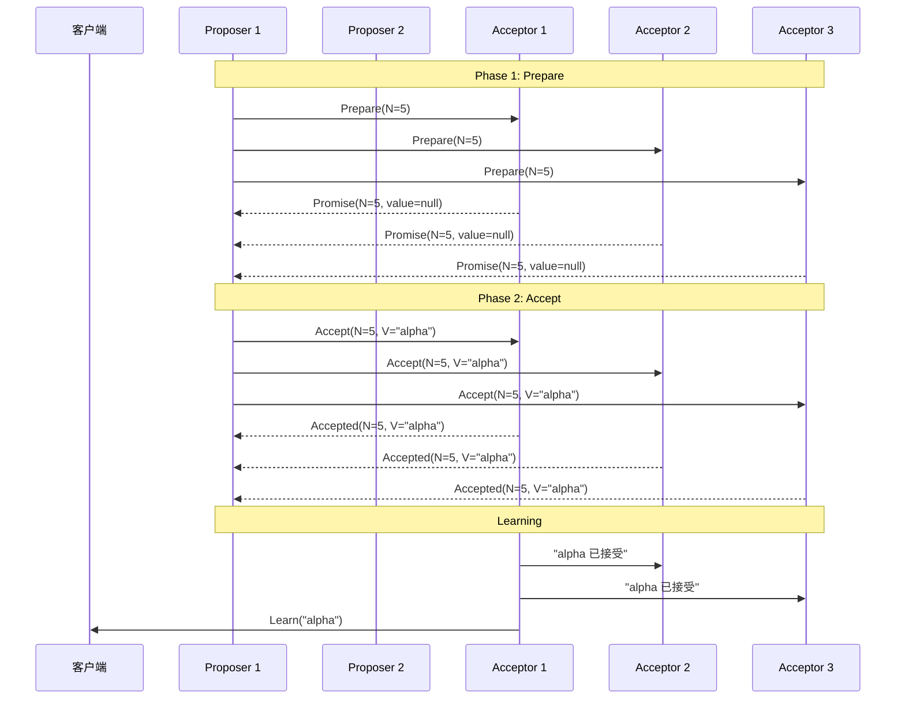
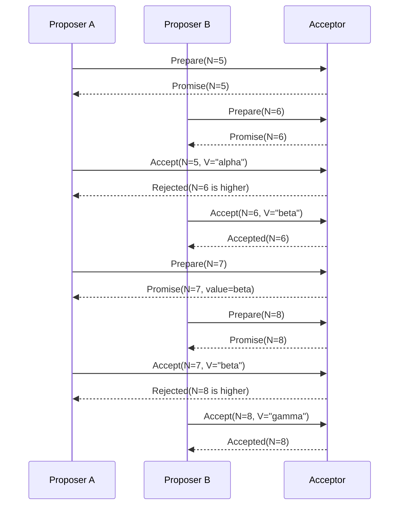
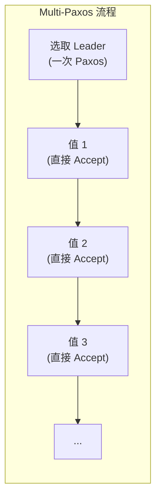

1998 年，Leslie Lamport 发表了一篇论文，标题叫《The Part-Time Parliament》。审稿人读完一头雾水——不是因为内容太深，而是因为 Lamport 用古希腊寓言的笔法写论文，把 Paxos 算法描述成了一群「兼职议员」在议会中的投票过程。论文被当成文学作品，束之高阁好几年。

直到后来 Lamport 把 Paxos 的核心逻辑重新整理成更「正经」的论文，人们才发现：这个算法，解决了分布式系统中最核心的问题——**如何在存在故障的节点中就某个值达成一致**。

今天，Google Chubby、Apache Zookeeper（的底层设计）、无数分布式锁和协调服务，背后都是 Paxos 或它的变体。理解 Paxos，是理解 Raft、ZAB 等后续协议的基石。

## 核心角色

Paxos 算法中有三种核心角色：

| 角色 | 职责 |
| --- | --- |
| **Proposer（提议者）** | 提出提案（Proposal），包含提案编号和提案值 |
| **Acceptor（接受者）** | 接收并投票决策，一个值被多数派接受后才算达成共识 |
| **Learner（学习者）** | 记录被接受的提案值，通知应用层 |

:::info
在实际实现中，通常每个节点同时扮演三种角色——既是 Proposer，又是 Acceptor，也是 Learner。
:::

## 两阶段执行流程

Paxos 的核心是**两阶段提交**。我们先看完整的时序图，再逐步拆解每个阶段。



### 第一阶段：Prepare（准备阶段）

Proposer 提出一个提案编号 `N`，发送给所有 Acceptor：

```java
// Proposer: 发起 Prepare 请求
public class Proposer {
    private int proposalNumber = 0;
    private final Acceptor[] acceptors;

    public void prepare() throws Exception {
        proposalNumber++; // 递增提案编号

        // 向所有 Acceptor 发送 Prepare 请求
        PromiseResponse[] responses = new PromiseResponse[acceptors.length];
        for (int i = 0; i < acceptors.length; i++) {
            responses[i] = acceptors[i].prepare(proposalNumber);
        }

        // 如果收到多数派（> 半数）的 Promise，进入 Accept 阶段
        long promiseCount = countPromises(responses);
        if (promiseCount > acceptors.length / 2) {
            proceedToAccept(responses);
        }
    }
}
```

Acceptor 收到 Prepare 请求后，做两件事：

1. **如果 `N` 大于该 Acceptor 已承诺的最高编号**，则返回 Promise，并带上之前已接受的最大编号提案（如果有）
2. **如果 `N` 小于等于已承诺编号**，则拒绝

```java
public class Acceptor {
    private int promisedNumber = 0;     // 已承诺的最高编号
    private int acceptedNumber = 0;     // 已接受的最高编号
    private Object acceptedValue = null; // 已接受的值

    public PromiseResponse prepare(int n) throws Exception {
        if (n > promisedNumber) {
            promisedNumber = n;
            // 返回已接受的提案（如果有）
            return new PromiseResponse(acceptedNumber, acceptedValue);
        } else {
            // 拒绝：不承诺更高的编号
            throw new RejectException();
        }
    }
}
```

:::tip
**为什么需要多数派（Quorum）？**

如果只有 2 个节点，其中 1 个故障则无法达成共识。N 个节点中，需要 **> N/2 个节点同意** 才能确保：
- 任意两个多数派必有交集
- 新 Leader 一定能看到上一个被多数派接受的提案
- 不可能出现两个值都被多数派接受的情况
:::

### 第二阶段：Accept（接受阶段）

当 Proposer 收到多数派 Acceptor 的 Promise 后，进入 Accept 阶段。此时有两个选择：

1. **如果所有 Promise 都返回空值（`null`）**：Proposer 可以提交自己的值
2. **如果某个 Promise 返回了之前的值**：Proposer 必须使用那个**编号最大的已接受值**

```java
private void proceedToAccept(PromiseResponse[] responses) {
    // 找出所有 Promise 中已接受的值，取编号最大的
    Object chosenValue = null;
    int maxAcceptedNumber = 0;

    for (PromiseResponse r : responses) {
        if (r.hasAcceptedValue() && r.getAcceptedNumber() > maxAcceptedNumber) {
            maxAcceptedNumber = r.getAcceptedNumber();
            chosenValue = r.getAcceptedValue();
        }
    }

    // 如果没有已接受的值，使用自己的值
    if (chosenValue == null) {
        chosenValue = myProposedValue;
    }

    // 向所有 Acceptor 发送 Accept 请求
    for (Acceptor a : acceptors) {
        a.accept(proposalNumber, chosenValue);
    }
}
```

Acceptor 收到 Accept 请求后：

```java
public AcceptedResponse accept(int n, Object value) throws Exception {
    if (n >= promisedNumber) {
        // 接受该提案
        acceptedNumber = n;
        acceptedValue = value;
        promisedNumber = n;
        return new AcceptedResponse(n, value);
    } else {
        // 已经被更高级的编号「锁定」，拒绝
        throw new RejectException();
    }
}
```

## 活锁问题

Paxos 有一个经典陷阱——**活锁（Livelock）**。

考虑这种情况：Proposer A 提出编号 5 的提案，但还没完成 Accept 阶段，Proposer B 已经提出了编号 6 的提案。A 的 Accept 被拒绝（因为 B 承诺了更高的 6），于是 A 重新提出编号 7 的提案，B 则提出编号 8……两个 Proposer 不断交替升级编号，但没有一方能完成 Accept。



:::warning
**活锁的本质**：两个 Proposer 轮流提出更高编号的提案，导致没有一方能完成 Accept 阶段。

**解决方案**：
- 随机退让（最常见）：Proposer 等待一段随机时间后再重试
- Multi-Paxos：用一个 Leader 统一发起提案，避免多个 Proposer 竞争
:::

## Multi-Paxos 优化

Basic Paxos 每个值都需要一次完整的两阶段提交，效率较低。Multi-Paxos 的核心思想是：**选取一个 Leader，只执行一次 Prepare，后续值直接走 Accept 阶段**。



Multi-Paxos 的优势：

| 方面 | Basic Paxos | Multi-Paxos |
| --- | --- | --- |
| 两阶段提交次数 | 每个值一次 | Leader 任期只需一次 |
| 网络开销 | O(N) × 提案数 | O(N) × 1 |
| 延迟 | 2 × RTT | 1 × RTT（稳定后） |
| 并发写入 | 可行，但复杂 | 不建议，串行更安全 |

## 完整示例：简化的 Acceptor 实现

```java
import java.util.concurrent.ConcurrentHashMap;

/**
 * 简化的 Paxos Acceptor 实现
 * 实际生产中需要处理持久化、故障恢复、网络超时等细节
 */
public class SimpleAcceptor {
    private int promisedNumber = 0;      // 已承诺的最高提案编号
    private int acceptedNumber = 0;      // 已接受的最高提案编号
    private String acceptedValue = null; // 已接受的值

    // 已承诺的提议者集合（用于 Multi-Paxos Leader 选举）
    private final ConcurrentHashMap<Integer, String> promisedProposers = new ConcurrentHashMap<>();

    public synchronized PromiseResponse prepare(int proposalNumber) {
        if (proposalNumber > promisedNumber) {
            promisedNumber = proposalNumber;
            return new PromiseResponse(true, acceptedNumber, acceptedValue);
        }
        // 拒绝：提案编号不够高
        return new PromiseResponse(false, 0, null);
    }

    public synchronized AcceptResponse accept(int proposalNumber, String value) {
        if (proposalNumber >= promisedNumber) {
            acceptedNumber = proposalNumber;
            acceptedValue = value;
            return new AcceptResponse(true);
        }
        // 拒绝：已被更高的提案「锁定」
        return new AcceptResponse(false);
    }

    public synchronized ProposalState getState() {
        return new ProposalState(promisedNumber, acceptedNumber, acceptedValue);
    }

    // 内部类：请求/响应对象
    public record PromiseResponse(boolean accepted, int acceptedNumber, String acceptedValue) {}
    public record AcceptResponse(boolean accepted) {}
    public record ProposalState(int promisedNumber, int acceptedNumber, String acceptedValue) {}
}
```

:::tip
**实现要点**：
- `synchronized` 在真实分布式环境中需要替换为分布式锁或无锁算法
- `promisedNumber` 必须持久化到磁盘，防止节点重启后「失忆」
- 实际实现中，Acceptor 通常还会记录「已向哪些 Proposer 发送过 Promise」
:::

## 权衡矩阵

| 维度 | Basic Paxos | Multi-Paxos |
| --- | --- | --- |
| 性能 | 每次提案 2 × RTT | 稳定后 1 × RTT |
| 实现复杂度 | 中等 | 较高（需处理 Leader 选举、租约等） |
| 并发提案 | 支持，但可能活锁 | 通常串行，吞吐量更高 |
| 故障恢复 | 单次决策，快速恢复 | Leader 故障后需重新选主 |
| 适用场景 | 单次值决策 | 连续日志复制 |

## 术语表

| 术语 | 英文 | 解释 |
| --- | --- | --- |
| 提案 | Proposal | Proposer 发起的提议，包含编号和值 |
| 提案编号 | Proposal Number / Ballot | 用于区分提案优先级，全局唯一递增 |
| 承诺 | Promise | Acceptor 承诺不再接受编号更低的提案 |
| 接受 | Accept | Acceptor 正式接受某个提案 |
| 多数派 | Quorum | 超过半数节点的集合，确保交集必存在 |
| 学习 | Learn | Learner 发现提案已被多数派接受 |
| 活锁 | Livelock | 两个 Proposer 轮流升级编号，无法完成 Accept |
| 强领导者 | Strong Leader | Multi-Paxos 中由 Leader 统一协调提案 |

## 延伸思考

Paxos 的理论优美，但实现坑很多。Google Chubby 的论文曾总结过几个实践要点：Learner 通知延迟、磁盘 I/O 阻塞 Proposer、Master 租约失效后的「空窗期」——这些问题在论文里「不存在」，但在线上会要命。

理解 Paxos 的论文只是起点，真正的考验在工程落地。下一个问题：既然 Paxos 这么复杂，有没有更易于理解的替代方案？
