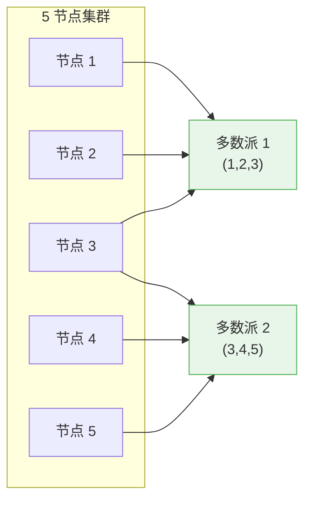
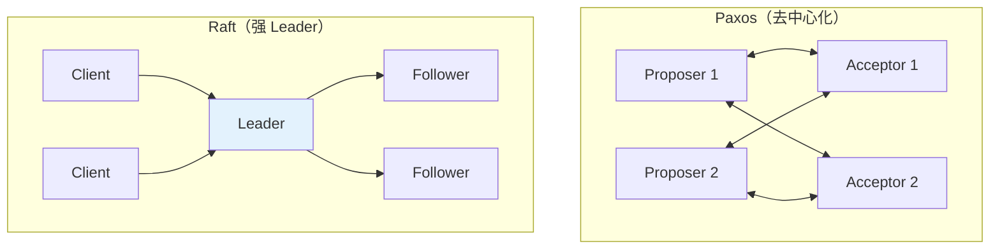
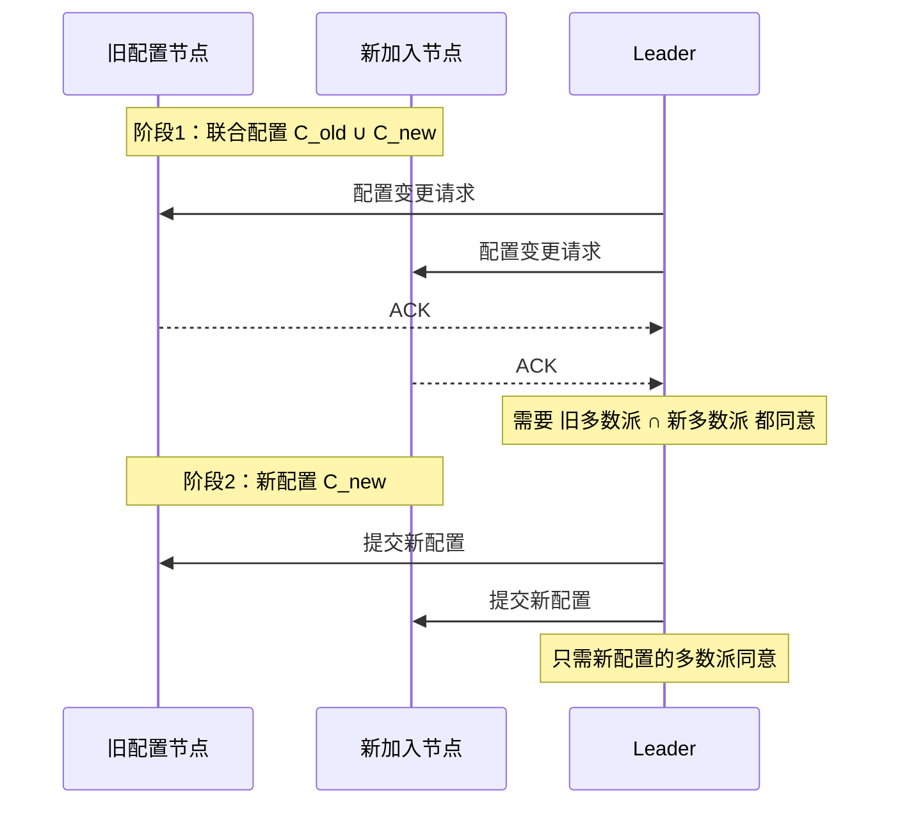
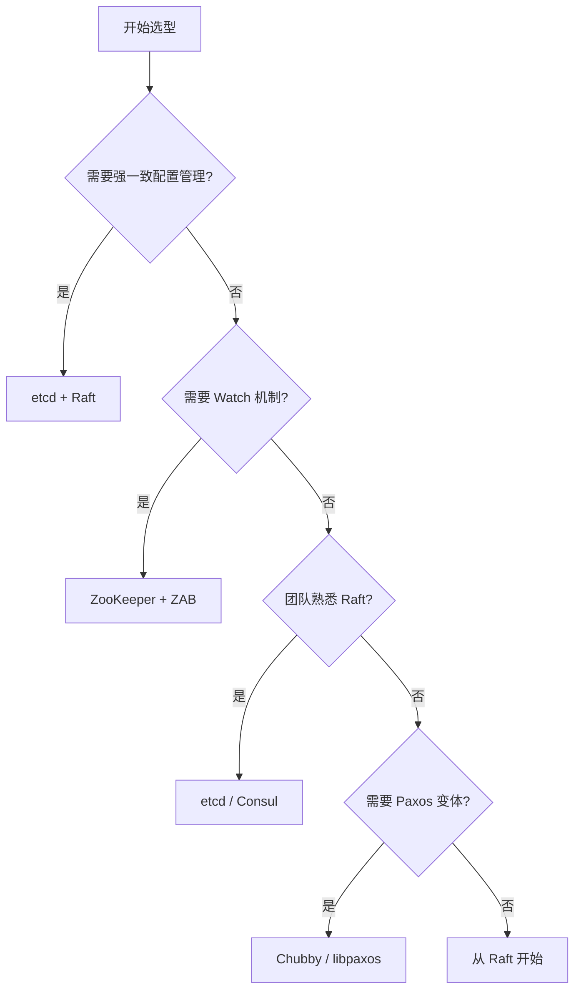

2014 年，Raft 论文发表时，第一句话就是：「Raft 的设计目标，是比 Paxos 更易于理解」。这句话既是宣言，也是对 Paxos 的委婉批评。

十年过去了，这场「可理解性 vs 通用性」的争论有结论了吗？

没有完全有。但在实践中，Raft 确实获得了更广泛的应用——不是因为它一定比 Paxos 更好，而是因为**够用、好懂、好实现**。

这篇文章，我们从多个维度深入对比两种协议，帮你做出选型决策。

## 核心哲学差异

在讨论技术细节之前，先理解两种协议的设计哲学：

| 维度 | Paxos | Raft |
| --- | --- | --- |
| **设计目标** | 理论完备性、数学优雅 | 工程可实现性、可理解性 |
| **解决问题** | 单值共识（Multi-Decree Paxos 扩展为多值） | 多值日志共识 |
| **角色约束** | 任意节点可发起提案 | 强 Leader，所有请求经过 Leader |
| **论文风格** | 抽象数学证明 | 逐步推导、图文并茂 |
| **提出者** | Leslie Lamport（1989 提出） | Diego Ongaro & John Ousterhout（2014） |

:::info
Lamport 曾在访谈中说：「我那篇论文里的希腊寓言，是为了说明 Paxos 背后的直觉。但大多数人读完寓言就放弃了，根本没去看数学证明。」Raft 的作者们正是抓住了这个痛点。
:::

## 完整对比表

| 维度 | Paxos | Raft |
| --- | --- | --- |
| **算法复杂度** | 高（单值决策） | 中（分解为子问题） |
| **实现难度** | 高（论文太抽象） | 中（论文可直接指导实现） |
| **Leader 强制** | 否（可选） | 是（强 Leader） |
| **日志连续性** | 无要求，可有间隙 | 必须连续 |
| **成员变更** | 需要额外协议（不知道哪篇） | 联合共识（两阶段） |
| **活锁风险** | 有（Multi-Paxos） | 较小（随机选举超时） |
| **网络效率** | 2 × RTT | 2 × RTT（Basic），1 × RTT（稳定后） |
| **论文可读性** | 低（「The Part-Time Parliament」） | 高（ACM 最佳论文） |
| **工业实现数量** | 少（Chubby、libpaxos） | 多（etcd、Consul、TiKV） |
| **正确性证明** | 完整 | 完整 |
| **并发写入** | 支持（多个 Proposer） | 不支持（串行） |

## 共同点：为什么它们能相提并论

尽管设计哲学不同，Paxos 和 Raft 有几个**本质相同**的约束：

### 1. 多数派原则



**任意两个多数派必有交集**——这是 Paxos 和 Raft 共同的安全基石。

:::tip
为什么需要多数派而不是「过半数即可」？

「超过半数」就是「多数派」的定义。在 Paxos/Raft 中，「多数派」=`> N/2`，确保：
- 任意两个多数派必有交集（可以传递信息）
- 最多只有一个多数派能对新值达成共识（避免脑裂）
:::

### 2. 线性一致性

两种协议都提供**线性一致性（Linearizability）**——所有节点看到的数据更新顺序，与实际发生的顺序一致。

```java
// 线性一致性的直观理解
TimeLine
    C1["客户端1: 写 x=1"] --> C2["客户端2: 读 x"]
    C2 --> C3["必须读到 1"]

    // 如果读到旧值，说明系统不满足线性一致性
    C1 -.->|错误路径| C4["客户端2: 读 x=0"]
```

### 3. 领导者租赁（Leader Lease）

两种协议都需要处理一个问题：**旧 Leader「复活」时认为自己还是 Leader**。解决方案都是基于「**更大的 Term/Zxid 获胜**」。

## 关键差异深度解析

### 差异一：Leader 的角色

这是 Paxos 和 Raft 最核心的分歧。

**Paxos（无强制 Leader）**：
- 任意节点都可以发起提案
- 多个 Proposer 可以并发提出不同的值
- 可能发生活锁，需要额外机制解决
- 适合「去中心化」场景

**Raft（强 Leader）**：
- 所有客户端请求必须经过 Leader
- Leader 统一协调日志复制顺序
- 日志天然连续，无间隙
- 牺牲部分灵活性，换取实现简单性



### 差异二：日志模型

**Paxos 对日志结构没有约束**——它只关心「某个值是否被多数派接受」，不关心日志是否连续。这意味着 Paxos 的日志可以有**空洞（gap）**。

**Raft 要求日志严格连续**——这是因为 Raft 的 AppendEntries 使用 `prevLogIndex` 做一致性检查，如果日志有空洞，Leader 无法向 Follower 发送空洞处的日志。

```java
// Raft 的日志连续性约束
public record AppendEntriesRequest(
    int prevLogIndex,    // 必须等于 Follower 当前日志长度
    long prevLogTerm,     // 必须匹配
    List<LogEntry> entries
) {}

// 如果 prevLogIndex=5 但 Follower 只有 3 条日志，会被拒绝
// 这确保了 Raft 日志的连续性
```

:::warning
**日志连续性的 trade-off**：

**优点**：Leader 故障恢复时，新 Leader 一定包含所有已提交的日志（Leader Completeness），无需额外恢复逻辑。

**缺点**：如果 Leader 性能差，会成为整个集群的瓶颈——所有请求都必须经过它。
:::

### 差异三：成员变更

**Paxos**：成员变更需要额外协议。理论上可以用 Basic Paxos 对成员变更本身做共识，但实现复杂，业界没有统一方案。

**Raft**：提供联合共识（Joint Consensus）两阶段方案：
1. `C_old ∪ C_new`：需要新旧配置**双方**的多数派都同意
2. `C_new`：只需新配置的多数派同意



### 差异四：工程实现成熟度

| 实现 | 语言 | 协议 | 生产使用 |
| --- | --- | --- | --- |
| etcd/raft | Go | Raft | Kubernetes、etcd 本身 |
| Consul | Go | Raft | HashiCorp 全家桶 |
| TiKV | Rust | Raft | 字节跳动、知乎 |
| CockroachDB | Go/Rust | Raft | CockroachDB 本身 |
| Chubby | C++ | Paxos | Google |
| libpaxos | C | Paxos | 学术项目 |
| zookeeper | Java | ZAB | Hadoop 生态 |

## 性能对比

性能不是选择 Paxos 还是 Raft 的决定性因素——两者在同一量级。但有一些结构性差异值得注意：

| 指标 | Paxos（Multi） | Raft |
| --- | --- | --- |
| **稳定状态延迟** | 2 × RTT | 2 × RTT（首次），1 × RTT（稳定后） |
| **高负载吞吐** | 可能活锁 | 串行，更稳定 |
| **读扩展** | 弱一致读可任意节点 | Leader 读，Follower 读需 Lease |
| **写扩展** | 可去中心化 | 不可，必须经过 Leader |
| **Leader 故障恢复** | 可能活锁 | 快速选举 |

:::tip
**Raft 强 Leader 的隐藏优势**：由于所有写都经过 Leader，日志顺序天然一致，简化了客户端逻辑。Paxos 中，客户端需要自己判断「哪个值已经被共识」，实现复杂度更高。
:::

## 选型决策树



## 常见误区

### 误区 1：Paxos 比 Raft 更「高级」

**错误**。Paxos 和 Raft 的**表达能力等价**——任何可以用 Raft 解决的问题，都可以用 Paxos 解决，反之亦然。Raft 不是 Paxos 的简化版，而是一个**不同的算法**，只是解决的问题域有重叠。

### 误区 2：Raft 不能处理并发写入

**半对半错**。Raft 本身是串行的（强 Leader），但可以通过**分片（Shard）** 实现并发写入。每个分片独立选主，写入不同分片的请求可以并行处理——TiKV 就是这么做的。

### 误区 3：Paxos 活锁问题无解

**错误**。Multi-Paxos 的活锁问题可以通过：
- **强 Leader**：用一个 Leader 统一提案
- **随机退让**：Proposer 失败后随机等待再重试
- **Pre-Vote**：正式投票前先探查是否可能获胜

## 权衡矩阵

| 维度 | Paxos | Raft |
| --- | --- | --- |
| **团队经验** | 无 Paxos 经验 | 有 Raft 经验 |
| 团队经验 | 需要分布式理论深度 | 需要工程实现能力 |
| **场景** | 读多写少 | 写多读少 |
| **一致性要求** | 最终一致即可 | 强一致 |
| **性能要求** | 需要去中心化写入 | 串行可接受 |
| **维护成本** | Paxos 实现少，难维护 | Raft 库成熟，社区活跃 |

## 术语表

| 术语 | 英文 | 解释 |
| --- | --- | --- |
| 线性一致性 | Linearizability | 分布式系统中「看起来像单机」的顺序保证 |
| 强 Leader | Strong Leader | 所有请求必须经过 Leader 的约束 |
| 日志空洞 | Log Gap | Paxos 中允许的日志不连续状态 |
| 联合共识 | Joint Consensus | Raft 成员变更的两阶段方案 |
| Leader Lease | Leader Lease | Leader 身份的有效期，防止旧 Leader 干扰 |
| 去中心化 | Decentralized | 无单一 Leader，多节点可并发提案 |
| 分片 | Shard | 将数据划分为多个分区，每个分区独立共识 |

## 延伸思考

选 Paxos 还是 Raft，本质上是「**理论优雅 vs 工程实用**」的选择。

如果你的团队有足够的理论功底，Paxos 的灵活性可能带来性能优势。但如果追求快速落地、降低维护成本，Raft 是更安全的选择——它的生态更成熟，坑已经被前人踩过。

更重要的是：**不要为了「用更高级的算法」而选 Paxos**。99% 的场景下，Raft 足够好。如果你真的遇到了 Raft 的瓶颈（比如强 Leader 成为瓶颈），那应该考虑的是**架构层面的优化**（分片、读写分离），而不是换 Paxos。
