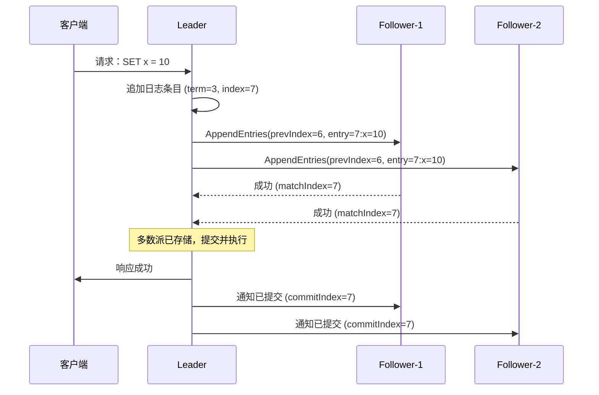
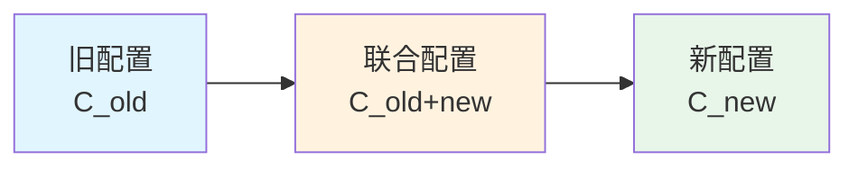

Paxos 太难了。Lamport 本人都承认，那篇用寓言体写的论文「很难理解」。2014 年，Diego Ongaro 和 John Ousterhout 发表论文《In Search of an Understandable Consensus Algorithm (Extended Version)》，提出了 Raft——一个**刻意设计成更容易理解**的共识算法。

论文的标题本身就是宣言：Raft 的首要设计目标，不是性能最优，不是表达能力最强，而是**让工程师真正能搞懂它**。

这个目标实现了吗？相当程度上是的。Raft 已经成为 etcd、Consul、TikV、CockroachDB 等主流分布式系统的共识引擎。理解 Raft，几乎是现代后端工程师的必修课。

## 设计哲学：问题分解

Raft 的核心思想是把共识问题拆解为三个**相对独立**的子问题：

1. **Leader 选举**：如何在集群中选出一个 Leader？
2. **日志复制**：Leader 如何把客户端请求复制到所有 Follower？
3. **安全性**：如何保证 Raft 不会丢失数据或产生不一致？

:::info
这种分解方式比 Paxos 的「单一协议」更符合人类直觉。Paxos 试图用一套优雅的数学框架解决所有问题，Raft 则选择「分而治之」——用三个更具体的子问题，换取实现的可理解性。
:::

## Leader 选举

Raft 把时间划分为**任期（Term）**，每个任期以一次选举开始。

```mermaid
stateDiagram-v2
    [*] --> Follower: 集群启动

    state Follower {
        [*] --> Follower
        Follower --> Follower: 收到 Leader 心跳
    }

    Follower --> Candidate: 心跳超时
    Candidate --> Candidate: 未赢得选举
    Candidate --> Leader: 获得多数派投票
    Candidate --> Follower: 发现新 Leader 或新 Term
    Leader --> Follower: Leader 发现更高 Term
    Follower --> [*]: 集群关闭
```

### 关键机制

```java
public class RaftNode {
    // 持久化状态（必须写入磁盘）
    private long currentTerm = 0;           // 当前任期
    private String votedFor = null;         // 当前任期投票给的候选人
    private List<LogEntry> log = new ArrayList<>(); // 日志条目

    // 节点状态
    private NodeState state = NodeState.FOLLOWER;
    private String nodeId;

    // 选举相关计时器
    private long electionTimeout;          // 选举超时时间
    private long lastHeartbeat = 0;         // 上次收到心跳的时间

    // 投票规则
    public boolean canVoteFor(String candidateId, long candidateTerm, int candidateLogLength) {
        // 规则1：任期必须 >= 当前任期
        if (candidateTerm < currentTerm) return false;

        // 规则2：当前任期还没投过票，或投给了同一个候选人
        if (currentTerm > votedFor && votedFor != null) return false;

        // 规则3：候选人日志必须比本地日志「更新」
        // 「更新」的定义：term 更大，或 term 相同但 index 更大
        LogEntry lastLocalLog = log.get(log.size() - 1);
        LogEntry candidateLastLog = new LogEntry(candidateLogLength, 0, null);

        return candidateLastLog.isNewerThan(lastLocalLog);
    }
}

public enum NodeState {
    FOLLOWER,   // 跟随者：被动接收心跳
    CANDIDATE,  // 候选人：发起选举
    LEADER      // 领导者：处理所有客户端请求
}
```

### 选举超时

Follower 在**心跳超时**后转为 Candidate。Raft 的关键设计：**选举超时是随机化的**（通常是 150~300ms 之间的随机值）。

```java
// 选举超时逻辑
public void onHeartbeatTimeout() {
    state = NodeState.CANDIDATE;
    currentTerm++;                          // 新任期
    votedFor = nodeId;                      // 给自己投票
    electionTimeout = RANDOM_RANGE(150, 300); // 随机超时

    // 向所有节点发送 RequestVote
    for (String peer : peers) {
        sendRequestVote(peer, currentTerm, nodeId, getLastLogInfo());
    }
}
```

:::tip
**为什么随机化很重要？**

如果所有 Follower 的超时时间相同，选举时会产生**平票僵局**。随机化确保大多数情况下只有一个 Candidate 会在其他节点超时前发起选举并获胜，快速收敛。
:::

## 日志复制

Leader 接收客户端请求后，将命令追加到本地日志，然后**并行**发送给所有 Follower。只有当**多数派节点都已存储该日志条目**时，Leader 才提交该条目并执行命令。



### AppendEntries 的一致性检查

Follower 收到 AppendEntries 后，会进行**一致性检查**：验证 prevLogIndex 和 prevLogTerm 是否匹配。

```java
public class RaftNode {
    public AppendEntriesResponse handleAppendEntries(AppendEntriesRequest req) {
        // 一致性检查：prevLogIndex 之前的日志必须匹配
        if (req.prevLogIndex > 0 &&
            (log.size() < req.prevLogIndex ||
             log.get(req.prevLogIndex - 1).term != req.prevLogTerm)) {
            // 不匹配：拒绝并返回本地日志长度
            return new AppendEntriesResponse(false, log.size());
        }

        // 匹配：追加新日志
        for (LogEntry entry : req.entries) {
            appendLog(entry);
        }

        // 更新 commitIndex
        if (req.leaderCommit > commitIndex) {
            commitIndex = Math.min(req.leaderCommit, log.size());
        }

        return new AppendEntriesResponse(true, log.size());
    }
}
```

:::warning
**日志不一致时的处理**：如果 Follower 的日志与 Leader 不一致，Raft 的解决方案是「**Leader 强制 Follower 复制自己的日志**」。Leader 维护每个 Follower 的 `nextIndex`，如果 Follower 拒绝，Leader 递减 `nextIndex` 并重试——最终达到一致。
:::

## 安全性保证

Raft 的安全性通过几个关键不变式保证：

### 不变式 1：Leader 不会覆盖已提交日志

```
Leader Completeness Property:
如果某个日志条目在某个任期被提交了，
那么后续所有 Leader 都必须包含这个日志条目。
```

这个不变式的证明依赖于：**只有包含最新日志的 Candidate 才能赢得选举**。

### 不变式 2：日志匹配特性

```
Log Matching Property:
如果两个节点的日志在某个 index 之前都匹配，
则 index 之前的所有日志都匹配。
```

AppendEntries 的一致性检查天然保证了这一点。

### 简化代码：日志匹配检查

```java
public class LogEntry {
    private long term;       // 创建该条目时的任期
    private int index;       // 日志索引
    private Command command; // 操作命令

    // 比较两个日志条目是否匹配
    public boolean matches(LogEntry other) {
        return this.term == other.term && this.index == other.index;
    }
}

// Leader 在发送 AppendEntries 时携带 prevEntry 的信息
public record AppendEntriesRequest(
    long term,
    String leaderId,
    int prevLogIndex,
    long prevLogTerm,
    List<LogEntry> entries,
    int leaderCommit
) {}
```

## 成员变更

最危险的分布式操作之一：**如何安全地往集群中增加或移除节点？**

:::danger
**直接添加节点可能引发脑裂**：假设原来 3 节点集群，需要扩展到 5 节点。如果新节点刚加入时旧 Leader 宕机，新旧节点可能分别选出不同的 Leader——**两个 Leader 都认为自己拥有多数派**。
:::

### Joint Consensus（联合共识）

Raft 采用两阶段成员变更（这里简化描述核心思路）：



第一阶段：集群使用 **C_old ∪ C_new** 配置，所有操作需要**两边**的多数派都同意。
第二阶段：切换到 **C_new**，只需要新配置的多数派同意。

:::details 点击展开：更安全的成员变更流程

实际实现中，Raft 成员变更有几个关键点：

1. **一次只变更一个节点**：避免多节点同时变更带来的复杂性
2. **新节点先以 Learner 身份加入**：不参与投票，只同步日志，避免拖慢选举
3. **移除节点前先转移 Leadership**：如果移除的是 Leader，先让它把 Leadership 转给其他节点

:::

## 与 Paxos 的核心对比

| 维度 | Raft | Paxos |
| --- | --- | --- |
| **核心思想** | 强 Leader + 分解问题 | 无角色约束 + 单值决策 |
| **Leader 角色** | 强 Leader，所有请求经过它 | 任意节点可发起提案 |
| **日志模型** | 日志连续，无间隙 | 日志可以有间隙 |
| **成员变更** | 联合共识（两阶段） | 需要额外协议 |
| **可理解性** | 论文标题就是「In Search of...」 | 被戏称为「The Part-Time Parliament」 |
| **工业实现** | etcd/Consul/TiKV | Google Chubby |

## 权衡矩阵

| 场景 | 推荐方案 | 原因 |
| --- | --- | --- |
| 需要强一致性的配置管理 | Raft | Leader 简化决策链 |
| 需要连续日志复制 | Raft | 日志连续，无间隙 |
| 需要高性能写入（无 Leader 瓶颈） | Paxos/Multi-Raft | 去中心化写入 |
| 快速原型开发 | Raft | 库成熟（Hashcorp/Raft、JGroups） |
| 对延迟敏感（广域网） | Raft + 读本地化 | 允许 Follower 提供过期读取 |

## 术语表

| 术语 | 英文 | 解释 |
| --- | --- | --- |
| 任期 | Term | Raft 时间线的基本单位，全局递增 |
| 日志条目 | Log Entry | 包含命令、term、index 的日志单元 |
| Leader | Leader | 负责处理所有客户端请求的节点 |
| Follower | Follower | 被动接收心跳和日志的节点 |
| Candidate | Candidate | 发起选举时的临时状态 |
| 心跳超时 | Heartbeat Timeout | Leader 向 Follower 发送心跳的间隔 |
| 选举超时 | Election Timeout | Follower 未收到心跳后转为 Candidate 的时间 |
| 提交索引 | Commit Index | 已知被多数派复制的日志位置 |
| 应用索引 | Apply Index | 已应用到状态机的日志位置 |
| 一致性检查 | Consistency Check | AppendEntries 中验证 prevLog 匹配性的机制 |

## 延伸思考

Raft 的强 Leader 特性既是优势也是劣势。在跨数据中心部署时，所有请求都经过 Leader 意味着**跨机房延迟是不可避免的**。如果业务对延迟敏感，可以考虑：

- **读本地化**：允许 Follower 提供「可能过期但最终一致」的读
- **读选举**：从 Candidate 中读（需额外验证）
- **分片 Raft**：每个分片独立选主，分散热点

但这些优化都引入了新的复杂性。回到核心问题：Raft 的可理解性是以牺牲某些灵活性为代价的——这个 trade-off 在大多数场景下是值得的。
