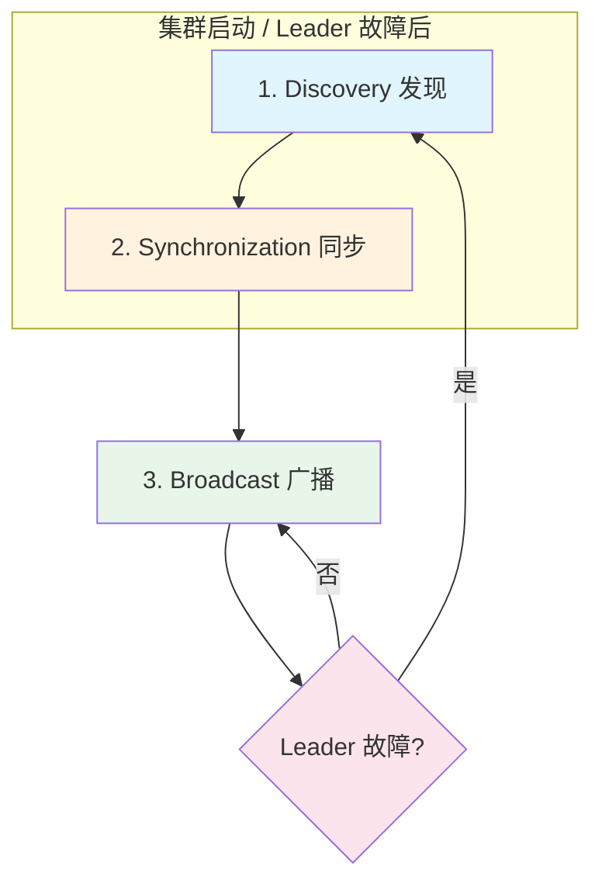
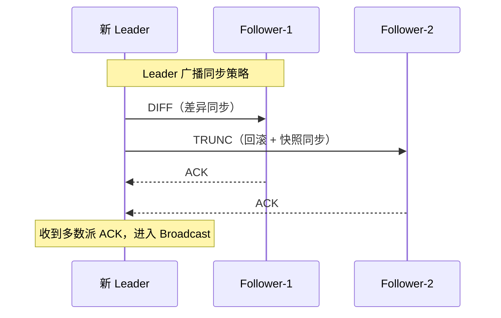
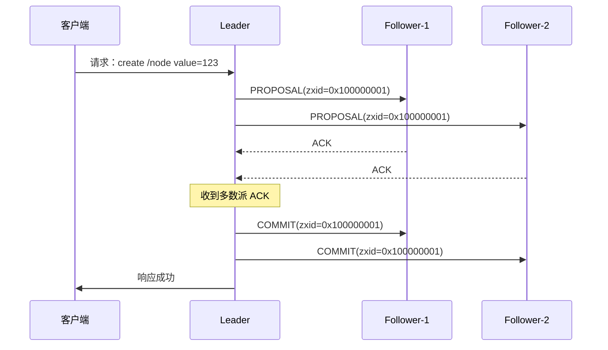
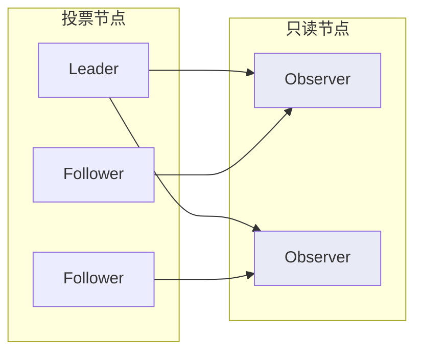

2006 年，Yahoo! 的工程师们遇到了一个难题：如何让分布式应用协调一致地行动？Master-Slave 架构太脆弱，任何一个节点宕机都可能让整个系统瘫痪。
他们需要一种机制，让集群在节点故障时自动恢复，同时保证**操作顺序的一致性**。

最终，Yahoo! 设计出了 **ZAB（ZooKeeper Atomic Broadcast）**——一种专门为 ZooKeeper 量身定制的原子广播协议。ZAB 不是对 Paxos 的简单改造，而是一个**独立的协议族**，在设计哲学上与 Raft 有很多相似之处，但细节上差异显著。

今天，ZooKeeper 依然是 Hadoop、Kafka、HBase、Kubernetes（早期版本）等系统的重要组件。理解 ZAB，是理解这些系统底层一致性的钥匙。

## ZAB 与 Raft：同与不同

| 维度 | ZAB | Raft |
| --- | --- | --- |
| **事务 ID** | zxid（高 32 位 epoch + 低 32 位 counter） | term + index |
| **Leader 生命周期** | epoch（类似任期，但包含更丰富信息） | term（纯数字） |
| **Follower 类型** | Follower + Observer | Follower（无 Observer 特殊处理） |
| **恢复流程** | Discovery → Synchronization → Broadcast | Leader 选举 → 日志复制 |
| **消息顺序** | 严格因果顺序（通过 zxid 保证） | 附加顺序（AppendEntries 保证） |
| **Leader 选举** | Fast Leader Election（FLE）或原始 Leader Election | RequestVote RPC |

:::info
**zxid 的设计很巧妙**：高 32 位是 epoch（相当于 Raft 的 term），低 32 位是 counter（递增计数器）。这种设计让 ZAB 能够精确保证「先处理的事务一定有更小的 zxid」——这对 ZooKeeper 的 Watch 机制至关重要。
:::

## 四阶段运行模型

ZAB 的生命周期分为四个阶段，其中 **Recovery（恢复）和 Broadcast（广播）是交替运行的常态阶段**。



### 阶段 1：Discovery（发现）

当集群启动或 Leader 故障后，节点之间需要**发现彼此的状态**，并选举出新的 Leader。

```mermaid
sequenceDiagram
 participant F1 as Follower-1
 participant F2 as Follower-2
 participant L as 候选 Leader

 F1->>L: FOLLOWINFO(lastZxid)
 F2->>L: FOLLOWINFO(lastZxid)
 Note over L: 收集多数派节点的最新 zxid
 L->>F1: NEWEPOCH
 L->>F2: NEWEPOCH
 Note over L,F1,L: 确定新 epoch
```

关键点：
- 每个 Follower 向候选 Leader 报告自己的**最新事务 ID**（lastZxid）
- Leader 收集多数派的响应后，计算出**新的 epoch**
- epoch 一定比所有 Follower 报告的 epoch 更大

### 阶段 2：Synchronization（同步）

新 Leader 将自己的状态同步给所有 Follower，确保集群中所有节点的**历史日志一致**。



:::tip
**同步策略选择**：
- **DIFF**：Follower 日志与 Leader 差异不大，使用增量同步
- **SNAP**：Follower 日志差距太大，直接发送完整快照
- **TRUNC**：Follower 日志比 Leader 多，需要回滚到指定位置
:::

### 阶段 3：Broadcast（广播）

正常运行的 Leader 接收客户端请求，将事务**广播**到所有 Follower。



**Broadcast 阶段的本质是两阶段提交**：
1. **Proposal（提议）**：Leader 向所有 Follower 发送 PROPOSAL
2. **Commit（提交）**：收到多数派 ACK 后，Leader 发送 COMMIT

:::warning
**关键区别**：ZAB 的 Broadcast 不需要 Follower 在收到 PROPOSAL 时写盘，只需要**内存中记录**。真正的持久化发生在 COMMIT 之后。这与 Raft 的「先落盘再 ACK」不同，是 ZAB 性能更高的原因之一。
:::

### 阶段 4：Recovery（恢复）

当 Leader 故障时，系统自动进入 Recovery 流程，选举新 Leader 并重新同步——这与 Raft 的 Leader 选举+日志复制本质相同，只是细节有差异。

## Observer 的角色

ZooKeeper 引入了一种 Raft 没有的特殊角色：**Observer（观察者）**。



| 角色 | 参与投票 | 参与写请求 | 参与读请求 |
| --- | --- | --- | --- |
| **Leader** | 是 | 是 | 是 |
| **Follower** | 是 | 是 | 是 |
| **Observer** | 否 | 否 | 是 |

:::info
**为什么需要 Observer？**

当 ZooKeeper 集群需要**横向扩展读能力**时，如果只增加 Follower，每次写入都需要更多节点的 ACK，反而拖慢性能。Observer 不参与投票，写入时不需要等它 ACK——但客户端可以从 Observer 读取，提升了整体读吞吐。
:::

## Watch 机制与 ZAB 的顺序保证

ZooKeeper 的 Watch 机制允许客户端**监听**某个 ZNode 的变化。但很少有人注意到，这个机制之所以可行，依赖的是 ZAB 的**严格顺序保证**。

```java
// ZooKeeper Watch 示例
ZooKeeper zk = new ZooKeeper("localhost:2181", 3000, watcher);

zk.exists("/config", new Watcher() {
    @Override
    public void process(WatchedEvent event) {
        System.out.println("/config 发生了变化: " + event);
        // 重新设置 Watch，继续监听
    }
});

// 触发 Watch
zk.setData("/config", "new-value".getBytes(), -1);
```

ZAB 如何保证 Watch 的正确性？

1. **所有写操作按 zxid 顺序广播**——这确保了所有节点看到的操作顺序一致
2. **Watch 事件只在对应事务提交后才触发**——不会「看到」还没提交的状态
3. **Leader 按 zxid 顺序处理请求**——不会有「乱序」导致的 Watch 误报

```java
// ZAB 事务处理伪代码
public class zab.Proposer {
    public void handleRequest(Request request) {
        // 生成新 zxid：epoch << 32 | counter
        long newZxid = generateZxid(currentEpoch, counter++);

        // 构造事务
        Proposal proposal = new Proposal(newZxid, request);

        // 按顺序广播（ZAB 保证串行处理）
        broadcast(proposal);
    }
}
```

:::danger
**一个常见的误解**：ZooKeeper 的 Watch 是「推送」的。实际上，ZooKeeper 的 Watch 是**一次性触发+客户端拉取**的组合。事件通知告诉你「数据变了」，但你需要重新发起 GET 来获取新值。
:::

## 代码示例：ZooKeeper 分布式锁

```java
import org.apache.zookeeper.*;
import org.apache.zookeeper.data.Stat;

import java.util.Collections;
import java.util.List;
import java.util.concurrent.CountDownLatch;

/**
 * 基于 ZooKeeper 的分布式锁实现
 * 利用 ZAB 的顺序保证，确保锁的公平性
 */
public class ZooKeeperDistributedLock implements Watcher {
    private final ZooKeeper zk;
    private final String lockPath;
    private String currentNode;
    private final CountDownLatch latch = new CountDownLatch(1);

    public ZooKeeperDistributedLock(ZooKeeper zk, String lockName) {
        this.zk = zk;
        this.lockPath = "/locks/" + lockName;
    }

    /**
     * 尝试获取锁
     * @return true 获取成功，false 被其他节点持有
     */
    public boolean tryLock() throws Exception {
        // 创建临时顺序节点
        currentNode = zk.create(
            lockPath + "/lock-",
            new byte[0],
            ZooDefs.Ids.OPEN_ACL_UNSAFE,
            CreateMode.EPHEMERAL_SEQUENTIAL
        );

        // 获取所有子节点并排序
        List<String> nodes = zk.getChildren(lockPath, false);
        Collections.sort(nodes);

        String smallestNode = nodes.get(0);

        // 如果自己是最小的，获得锁
        if (currentNode.endsWith(smallestNode)) {
            return true;
        }

        // 否则监听前一个节点
        int myIndex = nodes.indexOf(currentNode.substring(lockPath.length() + 1));
        String previousNode = nodes.get(myIndex - 1);

        // 注册 Watch：当前一个节点消失时，尝试重新获取锁
        zk.exists(lockPath + "/" + previousNode, this);

        // 等待被唤醒（通过 Watch 机制）
        latch.await();
        return true;
    }

    @Override
    public void process(WatchedEvent event) {
        if (event.getType() == Event.EventType.NodeDeleted) {
            latch.countDown(); // 前一个节点消失，唤醒尝试重新获取
        }
    }

    public void unlock() throws Exception {
        zk.delete(currentNode, -1);
    }
}
```

## 权衡矩阵

| 场景 | ZAB/ZooKeeper | Raft/etcd | 原因 |
| --- | --- | --- | --- |
| **写多读少** | 一般 | 较好 | ZAB 的 Observer 对读多场景友好 |
| **纯配置管理** | 首选 | 可选 | ZooKeeper API 更简洁 |
| **需要 Watch** | 首选 | 不支持 | ZAB 天然保证顺序 |
| **多数据中心** | 一般 | 较好 | ZAB 的 Observer 不适合跨机房 |
| **生态集成** | 丰富 | 一般 | Kafka/Hadoop/HBase 原生支持 ZooKeeper |
| **新项目** | 不推荐 | 推荐 | ZooKeeper 社区萎缩，etcd 生态更活跃 |

## 术语表

| 术语 | 英文 | 解释 |
| --- | --- | --- |
| ZAB | ZooKeeper Atomic Broadcast | ZooKeeper 原子广播协议 |
| zxid | ZooKeeper Transaction ID | 唯一的事务标识，高 32 位为 epoch，低 32 位为 counter |
| epoch | Epoch Number | 领导者任期编号，类似 Raft 的 term |
| Proposal | Proposal | ZAB 中的提议阶段，Leader 向 Follower 发送待投票的事务 |
| Discovery | Discovery Phase | ZAB 第一阶段，发现集群状态并选举 Leader |
| Synchronization | Synchronization Phase | ZAB 第二阶段，同步日志到一致状态 |
| Broadcast | Broadcast Phase | ZAB 第三阶段，正常运行时广播事务 |
| Recovery | Recovery Phase | Leader 故障后的恢复流程 |
| Observer | Observer Node | 只读节点，不参与投票，用于扩展读能力 |
| Watch | Watch | ZooKeeper 的事件监听机制，一次性触发 |

## 延伸思考

ZAB 的设计非常务实：不是为了追求「通用一致性」而设计，而是为 ZooKeeper 的具体场景（配置管理、分布式锁、Master 选举）量身打造。zxid 的设计、Observer 角色、内存中预写——每一个细节都有具体的工程考量。

但这也意味着 ZAB 的局限性：它不适合需要**高吞吐量写入**的场景，因为所有写入都要经过单一 Leader。如果你的系统需要每个节点都能接收写入请求，ZAB 可能不是好选择。

下一个问题：既然三种协议（Paxos、Raft、ZAB）各有优劣，实践中应该如何选择？
