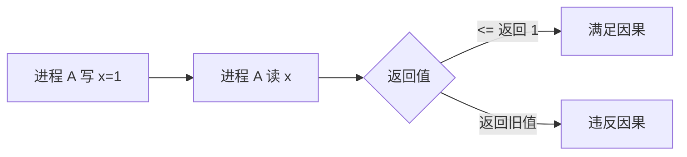
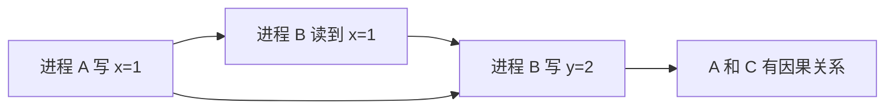
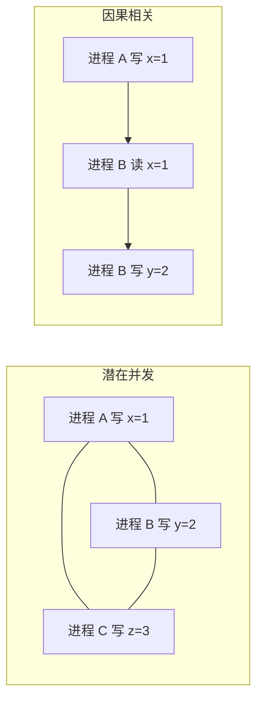
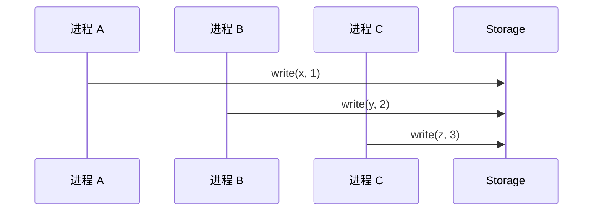

# 因果一致性

社交媒体上，你关注了一个人。你先看到他的动态 A，然后看到他对动态 A 的评论 B，再然后你发现他的动态 A 被删了——但评论 B 还在。这就是**因果不一致**。

在这个场景中：

- 动态 A 和评论 B 有因果关系（评论依赖动态存在）
- 删除 A 和评论 B 没有因果关系（两者是独立的）
- 但系统的最终状态（评论 B 还在，动态 A 没了）看起来很奇怪

因果一致性要解决的问题是：**只保证有因果关系的操作有序，允许无因果关系的操作乱序**。

## 什么是因果关系

因果关系（Casual Relationship）是因果一致性的核心概念。两个操作之间存在因果关系，当且仅当满足以下条件之一：

### 写后读（Read-after-Write）



如果进程 A 先写入了一个值，然后读取，应该能看到自己刚才写入的值。

### 写后写（Write-after-Write）

如果进程 A 先写 x=1，然后进程 B 写 x=2，那么所有节点都应该认为 A 的写在 B 的写之前（或者用某种策略解决冲突，但必须明确知道谁先谁后）。

### 传递性

因果关系具有传递性：如果 A 导致 B，B 导致 C，则 A 导致 C。



## 因果一致性的形式化定义

> **因果一致性**：如果操作 A 和操作 B 之间存在因果关系，则所有进程必须以相同的顺序看到 A 和 B。如果 A 和 B 之间没有因果关系（即它们是**潜在并发**的），则不同进程可以以不同顺序看到 A 和 B。

### 关键概念：潜在并发

两个操作是潜在并发的，当且仅当：

1. 它们发生在不同的进程之间
2. 无法从操作本身推断出先后关系



## 因果一致性 vs 顺序一致性

因果一致性比顺序一致性更宽松：**顺序一致性要求所有操作有序，因果一致性只要求有因果关系的操作有序**。

| 特性 | 顺序一致性 | 因果一致性 |
|------|----------|-----------|
| 全局顺序 | 所有操作都要有序 | 只有因果相关的操作要序 |
| 性能 | 中 | 高（允许更多乱序） |
| 实现复杂度 | 中 | 中高 |
| 典型场景 | 日志、消息队列 | 社交媒体、协作工具 |

### 具体对比

考虑三个并发写操作：



在**顺序一致性**下，所有节点必须以相同的顺序看到 x=1、y=2、z=3 三个操作。

在**因果一致性**下，由于这三个操作之间没有因果关系，不同节点可以以任意顺序看到它们。这是合法的，因为**没有因果关系的操作，谁先谁后并不影响最终的业务正确性**。

## 向量时钟：判断因果关系的工具

如何判断两个操作是否有因果关系？这就需要**向量时钟**（Vector Clock）。

### 基本原理

向量时钟为每个进程维护一个向量：

- `VC[i]` 表示进程 i 已经看到的最大逻辑时钟
- 当进程 i 执行操作时，VC[i] 加 1
- 当进程 i 收到来自进程 j 的消息时，更新 VC[i] = max(VC[i], VC[j])

```java
public class VectorClock {
    // 每个进程的逻辑时钟
    private Map<String, Long> clock;

    public VectorClock() {
        this.clock = new HashMap<>();
    }

    // 进程执行操作
    public void increment(String processId) {
        clock.merge(processId, 1L, Long::sum);
    }

    // 进程间同步
    public void merge(VectorClock other) {
        other.clock.forEach((key, value) ->
            clock.merge(key, value, Math::max)
        );
    }

    // 判断因果关系
    public CasualRelation compare(VectorClock other) {
        boolean dominated = true;
        boolean dominates = true;

        for (Map.Entry<String, Long> entry : clock.entrySet()) {
            long thisValue = entry.getValue();
            Long otherValue = other.clock.get(entry.getKey());

            if (otherValue == null) otherValue = 0L;

            if (thisValue > otherValue) dominated = false;
            if (thisValue < otherValue) dominates = false;
        }

        // 检查 other 中是否有更新的时钟
        for (Map.Entry<String, Long> entry : other.clock.entrySet()) {
            if (!clock.containsKey(entry.getKey())) {
                dominates = false;
            }
        }

        if (dominates) return CasualRelation.BEFORE;
        if (dominated) return CasualRelation.AFTER;
        return CasualRelation.CONCURRENT;
    }

    public enum CasualRelation {
        BEFORE,   // self 在 other 之前
        AFTER,    // self 在 other 之后
        CONCURRENT // 并发，无法判断因果
    }
}
```

### 因果判断规则

| 关系 | 条件 | 含义 |
|------|------|------|
| A `<` B（A 在 B 之前） | VC_A `<=` VC_B 且 VC_A `<` VC_B | A 的所有时钟 <= B，且至少一个小于 |
| A `>` B（A 在 B 之后） | VC_A `>=` VC_B 且 VC_A `>` B | A 的所有时钟 >= B，且至少一个大于 |
| A `||` B（并发） | 既不 A `<=` B 也不 A `>=` B | 无法判断因果 |

```mermaid
flowchart LR
    A[VC_A = {A:2, B:1}] -->|小于| B[VC_B = {A:2, B:2}]
    B -->|大于| C[VC_C = {A:2, B:3}]
    A -->|并发| D[VC_D = {C:1}]
```

## 典型系统

### Cassandra 的因果一致性

Cassandra 从 2.0 版本开始支持因果一致性，但默认不启用。开启方式：

```bash
# 在 cassandra.yaml 中配置
# 启用 LWT（Lightweight Transaction）以支持因果一致性
enable_materialized_views = true
```

因果一致性在 Cassandra 中通过 **Paxos** 实现，性能比最终一致性低 3-5 倍。

```java
// Cassandra Java 驱动：使用 LWT 实现因果一致性
Session session = cluster.connect("mykeyspace");

// 读取当前值和对应的时间戳
ResultSet rs = session.execute(
    "SELECT * FROM counter_table WHERE id = ?",
    "item-1"
);
Row row = rs.one();

// 使用 Paxos 投票确保因果一致性
session.execute(
    "UPDATE counter_table SET count = count + 1 WHERE id = ?",
    "item-1"
);
```

### MongoDB 的因果会话

MongoDB 3.6+ 引入了**因果会话**（Causal Sessions），保证会话内的读写操作有序：

```java
// MongoDB Java 驱动：因果会话
MongoClient client = MongoClients.create("mongodb://localhost:27017");
ClientSessionOptions options = ClientSessionOptions.builder()
    .snapshot(true)  // 启用因果一致性
    .build();

try (ClientSession session = client.startSession(options)) {
    // 所有在这个会话中的操作都保证因果一致
    collection.insertOne(session, new Document("item", "value1"));
    collection.updateOne(session,
        Filters.eq("item", "value1"),
        new Document("$set", new Document("status", "updated"))
    );
    collection.find(session, Filters.eq("item", "value1"));
}
```

### 协作工具（如 Google Docs）

Google Docs、Notion 等协作工具需要因果一致性：

1. 用户 A 在段落 1 插入文字（因果依赖于段落 1 存在）
2. 用户 B 在段落 2 插入文字（独立于用户 A 的操作）
3. 系统需要保证 A 的操作对所有用户可见的顺序一致，但允许 B 的操作和 A 的操作乱序

## 权衡矩阵

| 维度 | 因果一致性 | 线性一致性 | 最终一致性 |
|------|----------|-----------|-----------|
| 因果关系保证 | 有 | 有 | 无 |
| 实时序保证 | 无 | 有 | 无 |
| 实现复杂度 | 中高 | 高 | 低 |
| 延迟 | 中 | 高 | 低 |
| 适用场景 | 社交媒体、协作 | 金融、分布式锁 | 缓存、日志 |

## 因果一致性的局限性

:::warning 因果一致性不保证「读到自己最新写入之后的所有更新」

考虑这个场景：

1. 用户 A 发了一条动态（写入）
2. 用户 B 看到这条动态，点了赞（读后写，有因果关系）
3. 用户 A 修改了这条动态（独立写入）
4. 用户 B 刷新页面，看到的是修改后的动态，但赞可能不见了？

在因果一致性下，第 3 步和第 2 步可能是并发的（因为 B 的赞和 A 的修改之间没有明显的因果链），所以 B 可能看不到自己的赞。

:::

:::danger 分布式锁仍然无法用因果一致性实现

分布式锁需要实时序保证。因果一致性无法保证「如果 A 释放了锁，B 在 A 释放之后开始获取，则 B 一定能拿到锁」，因为 A 的释放和 B 的获取可能是并发的。

:::

## 真实案例

> **真实案例**：DynamoDB 的因果一致性
>
> Amazon DynamoDB 在 2017 年引入了因果一致性（称为「因果一致性读」）。在基准测试中，因果一致性读的延迟比强一致性读低 40%，吞吐量高 60%。
>
> - 原因：因果一致性不需要跨节点协调（只需要本地向量时钟）
> - 代价：应用层需要处理并发冲突（通过版本向量解决）
> - 来源：AWS re:Invent 2017 技术分享

## 术语表

| 术语 | 英文 | 定义 |
|------|------|------|
| 因果一致性 | Causal Consistency | 只保证有因果关系的操作有序 |
| 因果关系 | Casual Relation | 操作之间的先后依赖（写后读、写后写） |
| 潜在并发 | Potential Concurrency | 无法判断因果关系的并发操作 |
| 向量时钟 | Vector Clock | 判断操作因果关系的工具 |
| 逻辑时钟 | Logical Clock | 事件发生的逻辑顺序（非物理时间） |

## 延伸思考

因果一致性看起来是一个很好的权衡：**既保证了业务需要的因果关系，又允许无关联操作乱序提升性能**。

但它有一个根本局限：**它只关注「是否有因果关系」，不关注「什么时候收敛」**。

如果你的业务需要知道「数据什么时候能确认同步到所有副本」，因果一致性就不够了。这时候需要考虑**最终一致性**，它虽然不保证因果，但会明确告诉你「最终会收敛」。

不过，最终一致性也有自己的问题：**收敛前的不一致窗口有多长？冲突了怎么办？**

这些问题，将在下一节「最终一致性」中详细讨论。
