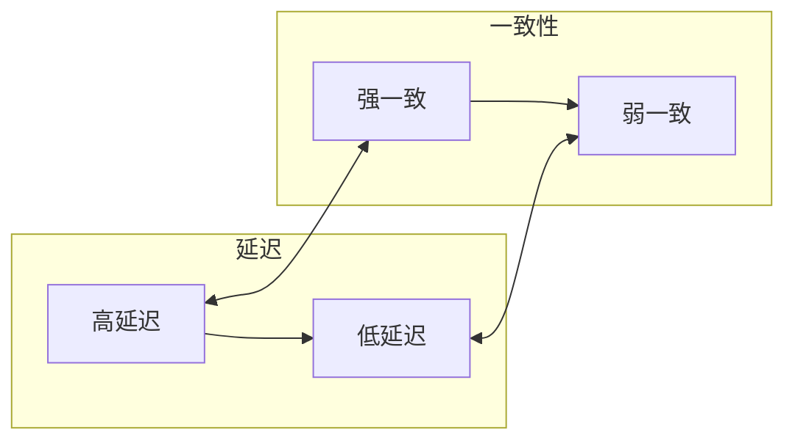
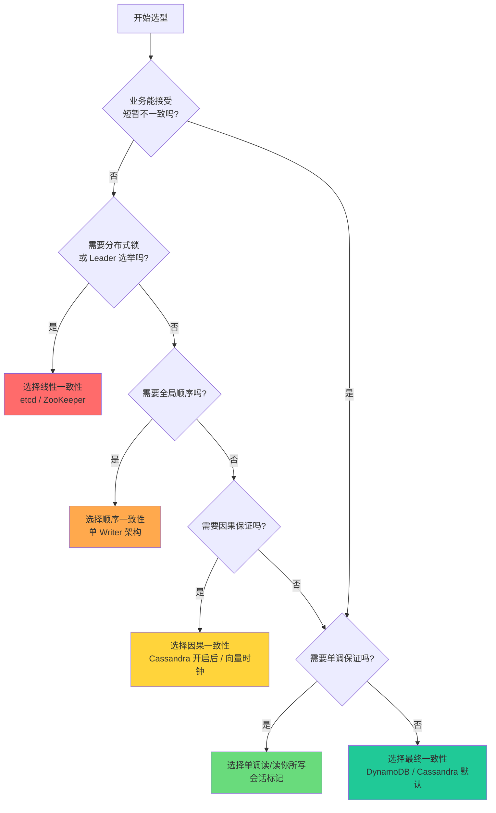
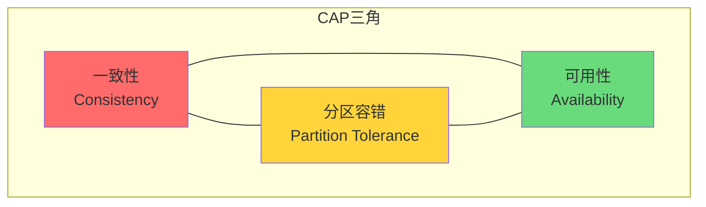

# 一致性级别对比矩阵

学完了线性一致性、顺序一致性、因果一致性、最终一致性，以及介于最终一致性和强一致性之间的单调保证，现在来做一次横向对比。

分布式系统的一致性不是一个二元问题，而是一个**从强到弱的光谱**。理解这个光谱的全貌，才能在系统设计时做出明智的权衡。

## 一致性光谱总览

```mermaid
flowchart LR
    subgraph 一致性光谱（从强到弱）
        ST[严格一致性]
        LIN[线性一致性]
        SEQ[顺序一致性]
        CAU[因果一致性]
        MR[单调读/读你所写]
        EC[最终一致性]
    end

    ST --> LIN --> SEQ --> CAU --> MR --> EC

    style ST fill:#ff6b6b
    style LIN fill:#ffa94d
    style SEQ fill:#ffd43b
    style CAU fill:#69db7c
    style MR fill:#38d9a9
    style EC fill:#20c997
```

每一级都比上一级更弱，但也更容易实现、性能更高。

## 完整对比表

| 一致性级别 | 全局顺序 | 实时序 | 因果保证 | 实现代价 | 写延迟 | 读延迟 | 典型系统 |
|-----------|---------|--------|---------|---------|--------|--------|---------|
| 严格一致性 | 必须 | 必须 | 是 | 不可能 | - | - | 单机系统 |
| 线性一致性 | 必须 | 必须 | 是 | 高 | 高 | 高 | etcd、ZooKeeper |
| 顺序一致性 | 必须 | 不必须 | 是 | 中 | 中 | 中 | SequalDB |
| 因果一致性 | 必须 | 不必须 | 是 | 中高 | 中 | 中 | Cassandra（开启） |
| 单调读/读你所写 | 不必须 | 不必须 | 部分 | 低 | 无影响 | 可能高 | Cassandra、DynamoDB |
| 最终一致性 | 不必须 | 不必须 | 否 | 低 | 低 | 低 | DynamoDB、Riak |

### 各维度详细说明

**全局顺序**：所有操作是否必须有一个统一的全局顺序？

- 严格一致性/线性一致性/顺序一致性：**必须**
- 因果一致性：**必须有**，但只针对有因果关系的操作
- 单调保证/最终一致性：**不必须**

**实时序**：是否要求「先完成」的操作排在「后开始」的操作前面？

- 严格一致性/线性一致性：**必须**
- 顺序一致性/因果一致性/单调保证/最终一致性：**不必须**

**因果保证**：是否保证「如果 A 导致 B，则 A 必须排在 B 前面」？

- 强一致性（严格/线性/顺序）：**是**（因为它们更强）
- 因果一致性：**是**（这是它的核心保证）
- 单调读/读你所写：**部分**（只保证会话内的因果）
- 最终一致性：**否**

## 延迟与一致性权衡

一致性和延迟的关系可以这样理解：



这个关系不是绝对的，但大致成立。原因在于：

1. **强一致性需要协调**：跨节点同步、共识协议、心跳保活，这些都会增加延迟
2. **弱一致性允许本地操作**：写操作可以立即返回，读操作可以从本地副本返回

### 量化对比

以下数据来自公开基准测试和论文（仅供参考，实际数值因场景而异）：

| 一致性级别 | 典型写延迟 | 典型读延迟 | 吞吐量相对值 |
|-----------|-----------|-----------|-------------|
| 线性一致性 | 5-20ms | 1-5ms | 1x（基准） |
| 顺序一致性 | 3-15ms | 1-3ms | 1.2-1.5x |
| 因果一致性 | 2-10ms | 1-2ms | 1.5-2x |
| 单调读保证 | 1-5ms | 1-3ms | 1.5-2x |
| 最终一致性 | 0.5-2ms | 0.5-1ms | 2-5x |

:::tip 说明

延迟的差异主要来自「是否需要跨节点协调」。线性一致性通常需要多数派确认（N/2+1 节点），最终一致性只需要写入本地节点。所以最终一致性的延迟可以比线性一致性低一个数量级。

:::

## 选型决策树

面对具体的业务场景，如何选择合适的一致性级别？



### 决策要点详解

**问题 1：业务能接受短暂不一致吗？**

如果**不能**（如金融交易、库存扣减），跳过剩余问题，直接考虑强一致性方案。

如果**能**（如社交动态、配置缓存），继续问题 2。

**问题 2：需要分布式锁或 Leader 选举吗？**

如果**是**，必须选择线性一致性。因为分布式锁依赖实时序。

如果**否**，继续问题 3。

**问题 3：需要全局顺序吗？**

如果**是**（如消息队列的分区顺序），选择顺序一致性。

如果**否**，继续问题 4。

**问题 4：需要因果保证吗？**

如果**是**（如协作编辑、评论排序），选择因果一致性。

如果**否**，继续问题 5。

**问题 5：需要单调保证吗？**

如果**是**（如展示用户状态、购物车），选择单调读/读你所写。

如果**否**，选择最终一致性。

## 场景选型表

| 业务场景 | 推荐一致性级别 | 理由 |
|---------|--------------|------|
| 银行转账 | 线性一致性 | 必须保证余额不出现负数 |
| 分布式锁 | 线性一致性 | 锁依赖实时序 |
| 订单支付 | 线性一致性 | 防止重复扣款 |
| 秒杀库存 | 线性一致性或因果一致性 | 防止超卖 |
| 消息队列 | 顺序一致性 | 分区内消息有序 |
| 社交动态时间线 | 因果一致性 | 评论要跟着动态走 |
| 协作文档编辑 | 因果一致性 | 编辑操作需要因果 |
| 购物车 | 单调读 + 读你所写 | 购物车状态单调增长 |
| 用户个人设置 | 读你所写 | 设置修改后能立即看到 |
| 点赞数/阅读量 | 最终一致性 | 短暂不一致可接受 |
| 日志收集 | 最终一致性 | 偶尔丢失可接受 |
| 配置下发 | 单调读 | 配置应该越来越新 |

## CAP 定理再理解

CAP 定理指出：在分区（Partition）发生时，必须在一致性（Consistency）和可用性（Availability）之间权衡。



但 CAP 定理常被误解。关键在于：**CAP 不是三选二，而是「分区时二选一」**。

| 组合 | 说明 |
|------|------|
| CA（不存在） | 单机系统，分区不会发生，但分区了就无法工作 |
| CP（一致+分区容错） | 分区时牺牲可用性（可能不可用） |
| AP（可用+分区容错） | 分区时牺牲一致性（返回可能过期数据） |

**重要澄清**：CAP 的 C 是指「线性一致性或等价的一致性」，不是「最终一致性」。

- **CP 系统**：etcd、ZooKeeper、HBase（分区时可能不可用）
- **AP 系统**：DynamoDB、Cassandra、Riak（分区时永远可用，但可能返回旧数据）

## 现实中的混合模式

现代分布式系统通常**不只使用一种一致性级别**，而是在不同模块使用不同级别：

### DynamoDB 的例子

DynamoDB 提供了多种一致性模式：

| 操作 | 一致性模式 | 说明 |
|------|-----------|------|
| 读取 | 最终一致性（默认） | 延迟最低 |
| 读取 | 强一致性 | 延迟高，但读到最新数据 |
| 读取 | 因果一致性 | 通过会话标记实现 |
| 写入 | 最终一致性（默认） | 延迟最低 |
| 写入 | 事务一致性 | 跨分区事务，强一致 |

```java
// DynamoDB Java SDK：不同一致性级别的读写
DynamoDB dynamoDB = new DynamoDB(dbClient);
Table table = dynamoDB.getTable("Orders");

// 最终一致性读（默认）
Item item1 = table.getItem("pk", "order-1");

// 强一致性读
GetItemSpec spec = new GetItemSpec()
    .withPrimaryKey("pk", "order-1")
    .withConsistentRead(true);
Item item2 = table.getItem(spec);

// 事务写入（强一致）
TransactWriteItemsSpec transactSpec = new TransactWriteItemsSpec()
    .withTransactItems(
        new TransactWriteItem()
            .withPut(new Put()
                .withItem(new Item()
                    .withString("pk", "order-1")
                    .withString("status", "paid")
                )
            )
    );
table.transactWriteItems(transactSpec);
```

### Cassandra 的例子

Cassandra 默认是最终一致性，但可以通过配置开启更强的保证：

| 场景 | 一致性级别 | 配置方式 |
|------|-----------|---------|
| 简单读取 | ONE（最终一致） | 默认 |
| 需要单调读 | QUORUM | `consistencyLevel = QUORUM` |
| 需要强一致 | ALL | `consistencyLevel = ALL`（不推荐，可用性低） |
| 因果一致 | SERIAL | `consistencyLevel = SERIAL` |

```java
// Cassandra Java 驱动：不同一致性级别
Session session = cluster.connect("mykeyspace");

// 最终一致性读（最低延迟）
session.execute(
    "SELECT * FROM users WHERE id = ?",
    ConsistencyLevel.ONE,
    "user-1"
);

// 单调读（需要 QUORUM）
session.execute(
    "SELECT * FROM users WHERE id = ?",
    ConsistencyLevel.QUORUM,
    "user-1"
);

// 因果一致性（需要 SERIAL）
session.execute(
    "INSERT INTO users (id, name) VALUES (?, ?)",
    ConsistencyLevel.SERIAL,
    "user-1",
    "张三"
);
```

## 面试总结

如果你是面试官，问到分布式一致性相关的问题，通常期望你掌握以下几点：

### 1. CAP 定理的准确理解

> CAP 不是三选二。分区时，必须在一致性和可用性之间选择。没有分区时，两者都可以保证。

### 2. 一致性光谱的完整图景

> 从强到弱：严格一致性 > 线性一致性 > 顺序一致性 > 因果一致性 > 最终一致性。每个级别的核心保证是什么，它们之间的关系是什么。

### 3. 选型的权衡思维

> 不是「越强越好」，而是「根据业务需求选择最合适的」。金融系统需要线性一致性，社交媒体可以接受最终一致性，协作工具需要因果一致性。

### 4. 典型系统的对应关系

> - etcd / ZooKeeper：线性一致性
> - DynamoDB / Cassandra：最终一致性（可配置）
> - SequalDB：顺序一致性

### 5. 实现代价的理解

> 强一致性需要共识协议、跨节点协调，这会带来延迟。理解为什么因果一致性比线性一致性快，最终一致性比因果一致性快。

## 思考题

**问题 1**：如果一个系统声称「同时满足 CAP 三角的三个方面」，这是可能的吗？

<details>
<summary>参考答案</summary>

不可能。在分布式系统中，分区（网络故障）是必然发生的。当分区发生时，CAP 三角的 P 是必然的，必须在 C 和 A 之间选择。

但有一种特殊情况：**单机系统**。单机系统不存在网络分区，所以可以同时满足 C 和 A。但这不是分布式系统的讨论范畴。

</details>

**问题 2**：DynamoDB 默认是最终一致性，但它是如何在「不需要用户处理冲突」的场景下工作的？

<details>
<summary>参考答案</summary>

DynamoDB 使用了多种策略：

1. **设计层面避免冲突**：DynamoDB 的数据模型（KV/文档）天然冲突少，不像关系数据库那样有复杂的事务依赖。

2. **冲突处理策略**：DynamoDB 默认使用「最后写入胜出」（LWW），对于购物车等场景使用语义合并。

3. **应用层可选**：DynamoDB 也支持「返回所有冲突版本」让应用层处理，这需要开发者承担更多责任。

关键点是：**DynamoDB 把「什么时候让用户处理冲突」这个决策权交给了开发者，而不是系统**。

</details>

**问题 3**：因果一致性比线性一致性「弱」，但为什么说它仍然是一种「强一致性」？

<details>
<summary>参考答案</summary>

「强一致性」和「弱一致性」的划分是相对的：

- 相对于**最终一致性**，因果一致性是「强」的，因为它保证了有意义的顺序
- 相对于**线性一致性**，因果一致性是「弱」的，因为它不要求实时序

所以「强一致性」通常指的是「比最终一致性更强的所有级别」，包括线性一致性、顺序一致性、因果一致性。

因果一致性被称为「强一致性」是因为它保证的核心东西——「有因果关系的操作有序」——对于大多数业务场景来说已经足够了，而且比线性一致性更容易实现。

</details>

## 术语表

| 术语 | 英文 | 定义 |
|------|------|------|
| 一致性光谱 | Consistency Spectrum | 从强到弱的一致性级别序列 |
| CAP 定理 | CAP Theorem | 分区时必须在一致性和可用性之间选择 |
| CP 系统 | CP System | 分区时优先保证一致性 |
| AP 系统 | AP System | 分区时优先保证可用性 |
| 权衡 | Trade-off | 不同特性之间的取舍关系 |
| 强一致性 | Strong Consistency | 比最终一致性更强的所有一致性级别 |
| 弱一致性 | Weak Consistency | 最终一致性及更弱的一致性级别 |

## 延伸阅读

如果你对一致性模型还想深入，可以继续探索：

- **悲观 vs 乐观并发控制**：一致性模型是「悲观」的（假设冲突一定会发生），而乐观锁是「乐观」的（假设冲突很少发生）
- **柔性事务（BASE）**：与 ACID 事务相对，BASE 强调基本可用、软状态、最终一致
- **CRDT（无冲突复制数据类型）**：一种可以在最终一致性系统下实现强语义的特殊数据结构

一致性是分布式系统中最核心的话题之一。希望这个系列文章能帮助你建立起完整的知识体系，在未来的系统设计中做出明智的权衡。
