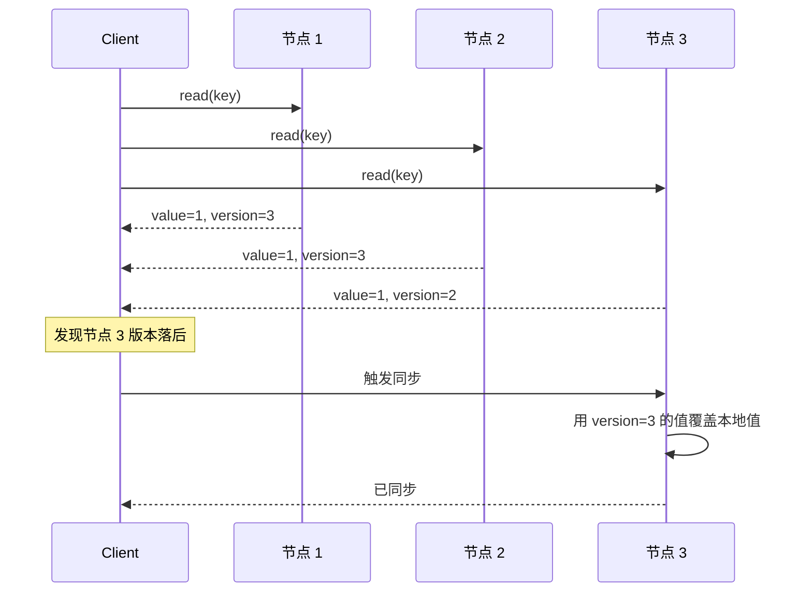

# 最终一致性

2012 年，Amazon CTO Werner Vogels 在 ACM Queue 发表了那篇著名的论文「Eventually Consistent」。他在开篇写道：

> 「最终一致性不是弱一致性，而是一种通过明确语义和清晰权衡来达到的更强的一致性。」

这句话奠定了最终一致性的理论基础：它不是「一致性不好」的借口，而是**在特定场景下有意选择的权衡**。

## 问题场景

凌晨 2 点，某社交平台发布了新功能。用户张三看到了新功能的入口，但点击进去却提示「功能不存在」。他刷新了几次，偶尔能进去，偶尔不能。

这不是 bug，这是最终一致性的**不一致窗口**（Inconsistency Window）。

在这个场景中：

- 后端服务已经把新功能标记为「已上线」
- 但配置中心的变更还没来得及同步到所有边缘节点
- 不同地域的用户可能看到不同的配置状态

最终一致性的核心承诺是：**只要没有新写入，所有副本最终会收敛到相同的值**。但这个「最终」是多久？可能是几毫秒，也可能是几分钟。

## 形式化定义

> **最终一致性（Eventual Consistency）**：如果一个数据项没有新的更新，那么最终所有对该数据项的读操作都会返回相同的值（收敛）。在没有故障的情况下，不一致窗口的长度取决于网络延迟和系统负载。

关键词：

1. **最终**：没有时间保证，可能是毫秒、秒、分钟
2. **收敛**：只要没有新写入，所有副本会变成相同的值
3. **无时间保证**：无法承诺具体的收敛时间

### 最终一致性 vs 因果一致性

| 特性 | 最终一致性 | 因果一致性 |
|------|----------|-----------|
| 因果关系保证 | 无 | 有 |
| 收敛保证 | 有（最终） | 有 |
| 实现复杂度 | 低 | 中高 |
| 性能 | 最高 | 中 |
| 典型系统 | DynamoDB、Cassandra、Riak | Cassandra（开启后）、Azure Cosmos DB |

因果一致性和最终一致性的核心区别：**因果一致性保证「有意义的顺序」，最终一致性只保证「最终相同」**。

## 收敛机制

最终一致性的实现依赖于三个核心机制：

### 1. 读修复（Read Repair）

当客户端读数据时，如果发现多个副本的版本不一致，主动触发同步：



读修复的优点是**延迟低**（只读本地副本），缺点是**只有被读到的数据才会被修复**，冷数据可能长期不一致。

### 2. 反熵（Anti-Entropy）

定期扫描所有副本，发现不一致时主动同步。使用 **Merkle 树**加速比较：

```mermaid
flowchart TD
    subgraph Merkle树结构
        R[根节点<br/>Hash: abc123] --> L1[左子节点<br/>Hash: def456]
        R --> L2[右子节点<br/>Hash: ghi789]
        L1 --> LL1[叶子1<br/>Hash: 001]
        L1 --> LL2[叶子2<br/>Hash: 002]
        L2 --> LL3[叶子3<br/>Hash: 003]
        L2 --> LL4[叶子4<br/>Hash: 004]
    end

    Note over R: 比较时，只比较根节点的 Hash<br/>不同则向下逐层比较
```

Merkle 树的优点是**可以精确找到不一致的范围**（只需要比较 O(log n) 个节点），缺点是**计算量大**，需要额外的存储和维护。

### 3. Gossip 传播

节点之间定期互相交换状态信息，慢慢扩散到整个集群：

```mermaid
flowchart LR
    N1[节点 A] <--> N2[节点 B]
    N2 <--> N3[节点 C]
    N3 <--> N4[节点 D]
    N4 <--> N1

    Note over N1,N4: 每轮 Gossip：随机选一个邻居同步<br/>收敛时间：O(log n) 轮
```

Gossip 的优点是**去中心化、容错性好**（任意节点挂了不影响传播），缺点是**收敛时间长**（O(log n) 轮），且**不能保证实时一致性**。

## DynamoDB 的最终一致性实现

Amazon Dynamo（ DynamoDB 的前身）是最著名的最终一致性系统之一。2007 年的论文「Dynamo: Amazon's Highly Available Key-value Store」详细描述了它的实现：

### NWR 模型

Dynamo 使用 NWR 模型控制一致性和可用性的权衡：

| 参数 | 含义 |
|------|------|
| N | 数据副本数 |
| W | 写操作需要确认的节点数 |
| R | 读操作需要读取的节点数 |

**一致性保证**：当 `W + R > N` 时，保证强一致性。

| 配置 | 一致性 | 可用性 | 性能 |
|------|--------|--------|------|
| W=1, R=1 | 低 | 最高 | 最快 |
| W=1, R=N | 低 | 高 | 读最慢 |
| W=N, R=1 | 低 | 高 | 写最慢 |
| W=N/2+1, R=N/2+1 | 最高 | 中 | 中等 |

### 冲突处理

Dynamo 允许多个并发写同时成功，冲突留到读的时候解决：

```java
public class DynamoConflictResolution {

    // 策略一：最后写入胜出（Last Write Wins, LWW）
    // 适合：日志、计数器等可以覆盖的场景
    public Object resolveLWW(List<Version> versions) {
        return versions.stream()
            .max(Comparator.comparing(Version::getTimestamp))
            .map(Version::getValue)
            .orElse(null);
    }

    // 策略二：语义合并
    // 适合：购物车等追加操作的场景
    public Object resolveSemantic(List<Version> versions) {
        Set<String> items = new TreeSet<>();
        for (Version v : versions) {
            // 合并所有版本中的数据
            items.addAll(parseCartItems(v.getValue()));
        }
        return serializeCartItems(items);
    }

    // 策略三：向量时钟冲突
    // 适合：需要保留多个版本的场景
    public List<Object> resolveWithVC(List<Version> versions) {
        // 返回所有冲突版本，由应用层决定如何处理
        return versions.stream()
            .map(Version::getValue)
            .collect(Collectors.toList());
    }
}
```

:::tip 购物车场景的特殊性

购物车是最适合 Dynamo 风格的场景：用户添加商品到购物车（追加），删除商品从购物车移除。如果用 LWW，删除可能被覆盖（用户以为删了，但又被加回来）。所以 Dynamo 对购物车使用「语义合并」——把添加和删除都当作追加，最后合并时只保留「当前存在」的项。

:::

## 不一致性窗口

不一致性窗口（Inconsistency Window）是从写入到所有副本收敛的时间长度。

```mermaid
gantt
    title 不一致性窗口示例
    dateFormat X
    axisFormat %s秒

    section 写入
    写入完成 (T=0)       :0, 1

    section 副本同步
    副本1同步 (T=10ms)   :0, 10
    副本2同步 (T=50ms)   :0, 50
    副本3同步 (T=100ms)  :0, 100

    section 窗口
    不一致性窗口       :0, 100
```



在这个例子中，写入在 T=0 完成，但最后一个副本直到 T=100ms 才同步完成。**不一致性窗口是 100ms**。

影响不一致性窗口的因素：

| 因素 | 影响 |
|------|------|
| 网络延迟 | 直接影响，越高窗口越大 |
| 副本数量 N | N 越大，窗口越大 |
| 节点故障 | 故障节点恢复后需要追赶 |
| 负载情况 | 高负载时同步可能被延迟 |

## 权衡矩阵

| 维度 | 最终一致性 | 因果一致性 | 线性一致性 |
|------|----------|-----------|-----------|
| 一致性强度 | 最弱 | 中 | 最强 |
| 写入延迟 | 最低（本地即可） | 中（需协调因果） | 最高（需共识） |
| 读取延迟 | 低（本地副本） | 中 | 高（需多数派） |
| 可用性 | 最高 | 高 | 中 |
| 开发者负担 | 高（需处理冲突） | 中（需处理因果） | 低（系统保证） |
| 适用场景 | 购物车、配置、日志 | 社交、协作 | 金融、锁、订单 |

## 常见误区

:::danger 误区一：最终一致性意味着「可以不一致」

最终一致性的「最终」是不确定的时间。在不一致窗口内，用户可能看到错误的值。如果业务无法容忍短暂不一致，就不应该用最终一致性。例如：银行转账、商品库存、库存扣减。

:::

:::danger 误区二：DynamoDB 是无主的，可以随便写

DynamoDB 的写入仍然需要写入到多个节点（W 个节点确认）。如果 W 配置太低，可能导致写入丢失（节点在同步前就挂了）。配置 NWR 需要根据业务的持久性要求仔细权衡。

:::

:::warning 误区三：Gossip 传播可以保证一致性

Gossip 传播的收敛时间是 O(log n) 轮，而且每轮的延迟取决于网络。在网络抖动或高负载情况下，收敛可能很慢。不能把 Gossip 当作强一致的保证。

:::

## 真实案例

> **真实案例**：Dynamo 论文中的购物车事故
>
> Amazon 内部的 Dynamo 最初版本在购物车场景下出现了「幽灵商品」问题：用户删除了购物车里的商品，但由于删除操作和之前的添加操作是并发的，删除可能被「覆盖」了。
>
> - 原因：LWW 策略导致删除操作丢失
> - 解决方案：语义合并策略，把删除当作「添加到删除列表」，合并时只保留「不在删除列表」的商品
> - 来源：Amazon Dynamo 论文 2007

## 术语表

| 术语 | 英文 | 定义 |
|------|------|------|
| 最终一致性 | Eventual Consistency | 允许短暂不一致，但最终收敛到相同值 |
| 不一致性窗口 | Inconsistency Window | 从写入到所有副本收敛的时间 |
| 读修复 | Read Repair | 读操作时主动同步不一致的副本 |
| 反熵 | Anti-Entropy | 定期主动同步副本 |
| Merkle 树 | Merkle Tree | 用于快速比较大量数据的哈希树 |
| Gossip 协议 | Gossip Protocol | 去中心化的状态传播协议 |
| NWR 模型 | N-W-R Model | 通过 N、R、W 参数控制一致性 |
| 最后写入胜出 | Last Write Wins (LWW) | 以时间戳判断哪个值更新 |

## 延伸思考

最终一致性把「处理冲突」的责任推给了应用层。这不是缺点，而是**明确的一致性边界**。

但问题是：**应用层真的知道怎么合并冲突吗？**

对于购物车，可以合并。对于计数器，可以累加。但对于「用户修改了文档的同一段落」这种冲突，应用层根本无法自动解决。

这时候，单调读和单调写登场了。它们是介于最终一致性和因果一致性之间的保证，虽然不如因果一致性「强」，但足够在很多场景下提供良好的用户体验——关键是，它们**不需要向量时钟等复杂机制**，实现代价更低。

下一节将详细讨论这四种「最终一致性之上的保证」：单调读、单调写、读你所写、写跟读。
