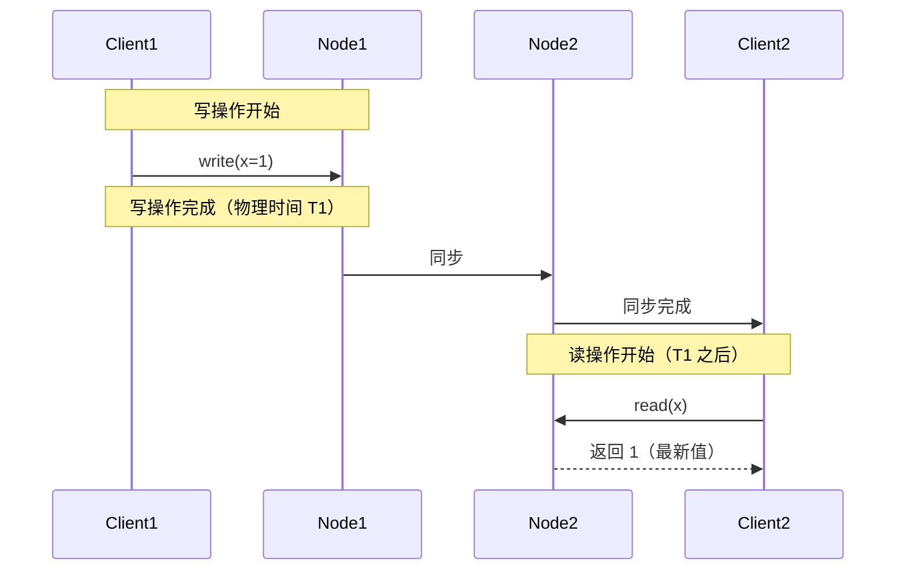
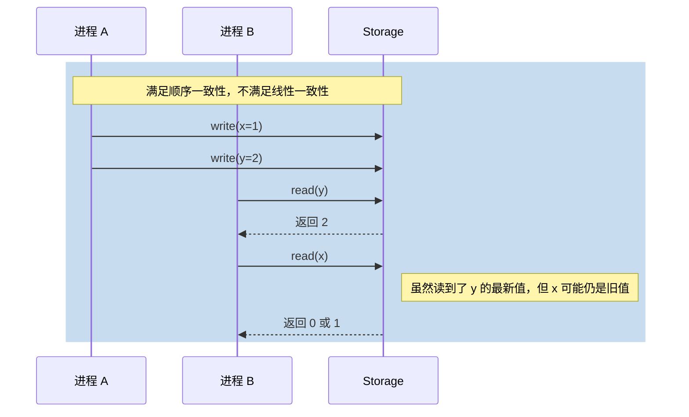
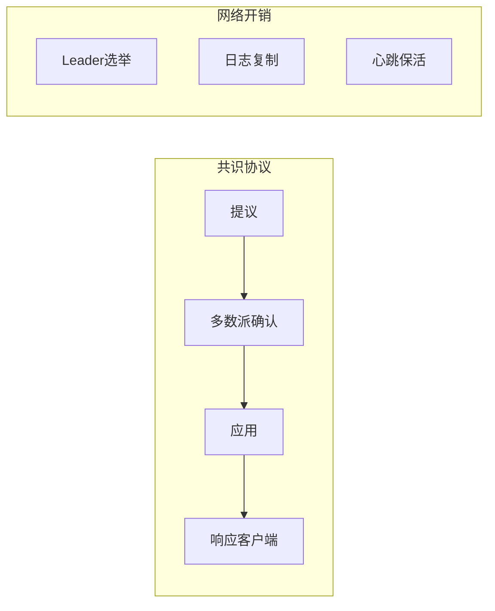

# 线性一致性

凌晨 2 点，某电商平台的库存服务突然出现了这样的现象：用户下单成功了，但支付时却提示「库存不足」。更诡异的是，这个用户的订单页面显示库存还有 3 件，但商品详情页却显示「已售罄」。这不是 bug，这是分布式系统里**一致性级别不够高**的典型症状。

如果我们把系统设计成线性一致的，这种现象就不会发生——所有读操作都能读到最近一次写操作的结果，就像整个系统只有一个人在操作。

## 形式化定义

线性一致性（Linearizability），也称为原子一致性（Atomic Consistency），是分布式系统能够提供的最强一致性保证。它的形式化定义来自 Herlihy 和 Wing 在 1990 年发表的论文：

> **线性一致性**：所有操作在全局实时顺序中看起来是原子的。每个读操作都能返回最近一次写操作的结果。

这句话有几个关键词需要拆解：

1. **全局实时顺序**：系统中所有操作（包括读和写）有一个唯一的、全局认同的先后顺序
2. **原子的**：操作没有重叠，没有「读到一半」的状态
3. **最近一次写操作**：读操作看到的是真正「最新」的值，而不是某个旧值

### 两个核心约束

线性一致性要求操作同时满足两个约束：

**协议序（Program Order）**：同一个进程内的操作必须按程序顺序执行。如果你先写 A 再写 B，那么所有节点都必须认为 A 先于 B 完成。

**实时序（Real-Time Order）**：如果操作 A 在操作 B 开始之前就完成了，那么 A 必须在全局顺序中排在 B 之前。这里「完成」的含义是物理时间上的完成。



## 线性一致性 vs 顺序一致性

理解线性一致性最好的方式，是把它和顺序一致性做对比。两者的核心区别在于**实时性要求**。

| 特性 | 线性一致性 | 顺序一致性 |
|------|-----------|-----------|
| 全局顺序 | 必须有 | 必须有 |
| 实时序要求 | 必须满足 | 不要求 |
| 「读到自己写入」 | 保证 | 不保证 |
| 实现代价 | 高 | 中 |

来看一个具体例子：



如果系统是线性一致的，由于进程 A 的 `write(x=1)` 在物理时间上早于进程 B 的第一次读，那么进程 B 的第一次读**必须**返回 `x=1`（如果它读了 x 的话）。如果系统只满足顺序一致性，进程 B 可能在第一次读 `y=2` 时，看到 `x` 仍然是旧值 0。

## 为什么实时序这么重要

实时序是线性一致性的核心要求，它解决了一个关键问题：**分布式锁的正确性**。

假设我们实现了一个分布式锁：

1. 进程 A 获取锁
2. 进程 A 释放锁
3. 进程 B 获取锁

在非线性一致的系统中，如果进程 B 的获取操作在进程 A 的释放操作「开始」之后才「发起」，但进程 A 的释放却先被某个节点处理了，那么进程 B 可能拿到一个「幽灵锁」——锁明明已经被释放了，但系统状态还认为锁被占用。

只有线性一致性才能保证：**如果 B 在 A 释放完成后才开始获取锁，那么 B 一定能拿到锁**。

## 实现代价

线性一致性不是免费的。它的实现需要以下几个组件的配合：

### 共识协议

线性一致性需要所有节点对「操作的全局顺序」达成共识。这通常通过 Paxos、Raft、ZAB 等共识协议实现。



### 全局协调

所有写操作必须经过一个全局协调者（通常是 Leader），或者通过共识协议在多个节点间协调。这带来了两个问题：

1. **延迟增加**：一次写操作需要经过「提议 → 多数派确认 → 应用 → 响应」四步，比最终一致性多了 2-3 倍的延迟
2. **可用性下降**：如果协调者挂了，需要重新选举，期间系统可能不可用

### 跨节点通信

线性一致性要求每次读操作都访问**足够多**的节点，以确保读到最新数据。这通常有三种实现方式：

1. **读 Leader**：只读 Leader，假设 Leader 一定是最新的（风险：如果同步没完成，Leader 也可能是旧的）
2. **读多数派**：读时向 N/2+1 个节点发送请求，取最新版本（最安全，但延迟最高）
3. **租约机制**：Leader 持有租约，租约期内认为 Leader 数据最新

## 典型系统

### ZooKeeper（ZAB 协议）

ZooKeeper 通过 ZAB（ZooKeeper Atomic Broadcast）协议提供线性一致性。ZAB 是一个基于 Paxos 的共识协议，所有更新都经过 Leader 广播给所有 Follower，只有多数派确认后才算完成。

**延迟特征**：ZooKeeper 的写操作延迟通常在 5-20ms 之间，读操作可以配置为线性一致读（走 Leader）或非一致读（走 Follower）。

### etcd（Raft 协议）

etcd 使用 Raft 协议，同样提供线性一致性。etcd 默认所有读操作走 Leader，通过 Raft 的日志复制保证线性一致。

**性能数据**（来自 etcd 官方基准测试）：

| 操作类型 | P50 延迟 | P99 延迟 | QPS |
|---------|---------|---------|-----|
| 线性一致写 | 1.5ms | 5ms | ~30k |
| 线性一致读 | 0.5ms | 1ms | ~100k |
| 最终一致读 | 0.2ms | 0.5ms | ~200k |

可以看到，线性一致读的延迟大约是最终一致读的 2-3 倍，但 QPS 只有一半。

### MongoDB 副本集

MongoDB 的副本集默认提供线性一致性。通过写关注（Write Concern）和读偏好（Read Preference）的配置，可以控制一致性和可用性的权衡。

```java
// Java MongoDB 驱动示例：配置线性一致性写
InsertOptions options = new InsertOptions()
    .writeConcern(WriteConcern.W1);  // W1 表示写入主节点即可
collection.insertOne(document, options);
```

## 性能权衡矩阵

| 维度 | 线性一致性 | 最终一致性 | 说明 |
|------|----------|-----------|------|
| 写延迟 | 高（多节点协调） | 低（本地写入即可） | 差距可达 5-10 倍 |
| 读延迟 | 高（需确认最新） | 低（可读本地副本） | 差距可达 2-3 倍 |
| 可用性 | 低（分区时可能不可用） | 高（永远可写） | CAP 定理的直接体现 |
| 开发复杂度 | 低（一致性由系统保证） | 高（应用层需处理冲突） | 最终一致性把责任推给开发者 |
| 数据新鲜度 | 实时最新 | 可能有延迟 | 不一致性窗口大小不同 |

## 适用场景

**应该使用线性一致性的场景**：

- 分布式锁和 Leader 选举
- 金融交易系统（账户余额、转账）
- 库存扣减（防止超卖）
- 需要「全局顺序」保证的业务（如消息队列的分区顺序）

**不应该使用线性一致性的场景**：

- 日志收集、指标上报（偶尔丢失可接受）
- 社交媒体的点赞数（最终一致即可）
- 缓存系统的数据更新（缓存本身就不是强一致）
- 超高写入量的场景（延迟和吞吐量要求高于一致性）

## 常见误区

:::danger 误区一：只要用了 Raft/Paxos，就是线性一致的

共识协议是实现线性一致性的**必要条件**，但不是**充分条件**。如果读操作不走共识路径（比如直接读 Follower），仍然可能读到旧数据。必须显式配置读操作走 Leader 或多数派。

:::

:::danger 误区二：线性一致性等于强一致性

线性一致性是**强一致性**的一种，但「强一致性」这个概念比线性一致性更宽泛。顺序一致性也是强一致性，但它不满足实时序要求。正确说法是：线性一致性是**最强的**强一致性。

:::

:::warning 误区三：所有场景都应该追求线性一致性

线性一致性的代价是延迟和可用性。如果业务可以接受短暂不一致（比如社交动态的点赞数），强行使用线性一致性反而会影响用户体验和系统吞吐量。

:::

## 真实案例

> **真实案例**：某互联网公司分布式锁事故
>
> - **现象**：订单支付时出现重复扣款，部分用户被扣了两次钱
> - **原因**：锁服务使用了非一致性的 Redis 集群，Redis Master-Slave 复制存在延迟，导致分布式锁失效
> - **解决方案**：改用 etcd 或 ZooKeeper 实现线性一致的分布式锁
> - **教训**：分布式锁必须使用线性一致性的存储，Redis 的主从复制**不能**保证线性一致

## 术语表

| 术语 | 英文 | 定义 |
|------|------|------|
| 线性一致性 | Linearizability | 最强的一致性保证——所有操作在全局实时顺序中原子的执行 |
| 原子一致性 | Atomic Consistency | 线性一致性的别称，强调操作的不可分割性 |
| 协议序 | Program Order | 同一进程内指令按程序顺序执行 |
| 实时序 | Real-Time Order | 按物理时间先后确定的操作顺序 |
| 共识协议 | Consensus Protocol | 如 Paxos、Raft，用于多节点就顺序达成一致 |
| 写关注 | Write Concern | MongoDB 中控制写操作成功标准的配置 |

## 延伸思考

如果你的业务确实需要线性一致性，但系统的吞吐量要求很高，该怎么办？

1. **分区策略**：将数据按业务 ID 哈希到不同分区，每个分区独立做线性一致，减少跨分区的协调开销
2. **读写分离**：写操作走线性一致，读操作走最终一致（适合读多写少场景）
3. **租约缓存**：在客户端缓存 Leader 信息，减少路由延迟

但无论采用什么优化策略，**线性一致性的核心代价——跨节点协调带来的延迟——是不可避免的**。如果你发现优化后延迟仍然无法接受，那可能需要重新审视业务需求：真的需要线性一致性吗？

---

如果你已经理解了线性一致性的代价，下一个问题是：**如果放宽实时序要求，只要求「每个进程看到的顺序一致」，能换来多少性能提升？**

这正是顺序一致性要回答的问题。
