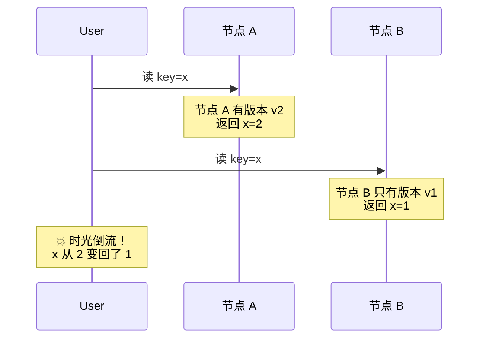
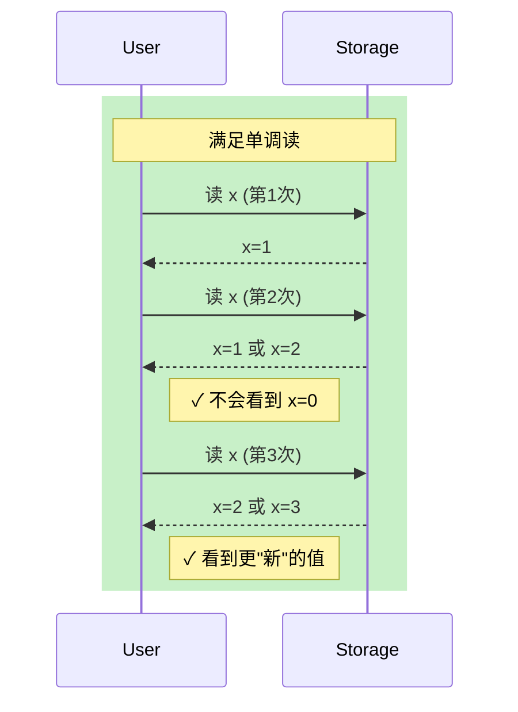
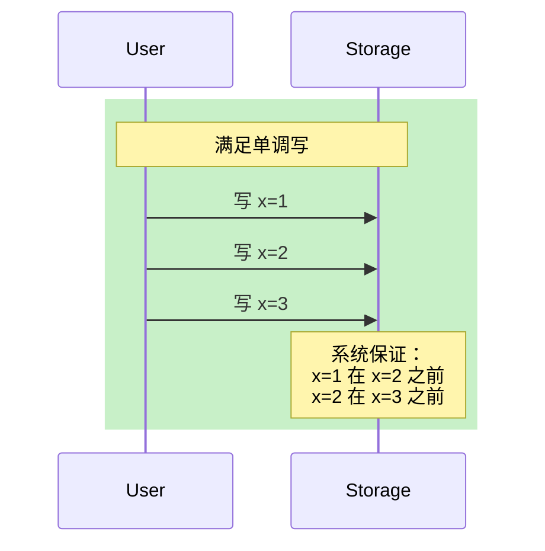
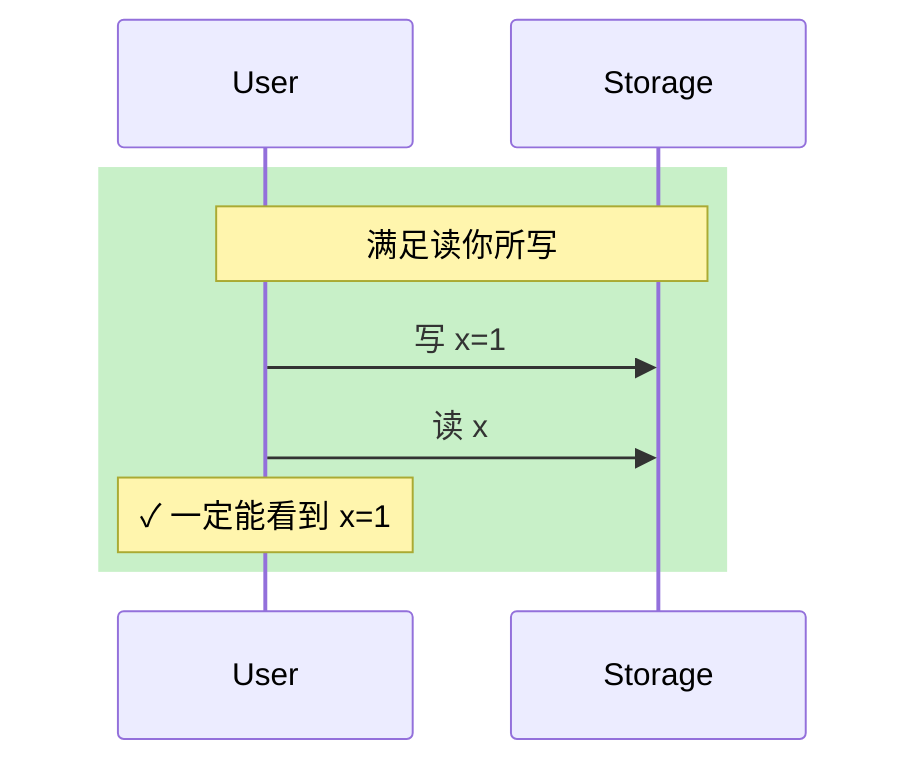
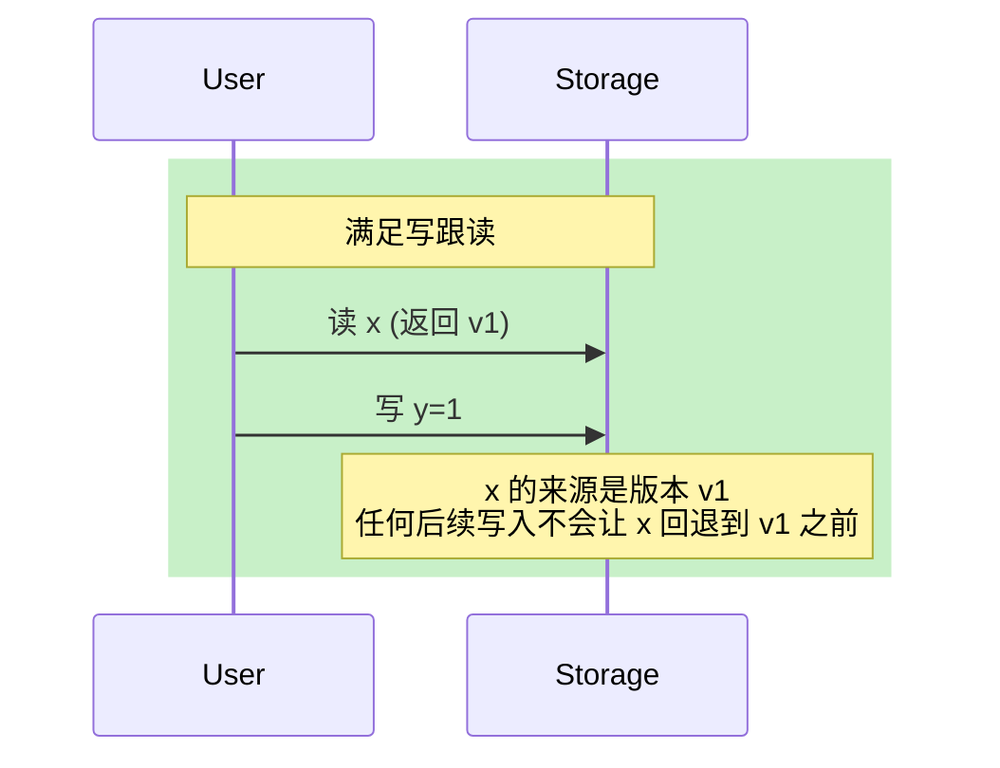
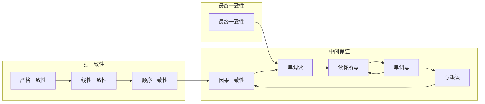

# 单调读与单调写

你刚在电商 App 里下了订单，状态显示「已支付」。你刷新了一下，状态变成了「待支付」。再刷新，又变回「已支付」。

这不是网络抖动，这是**时光倒流**（Time Travel）——读操作返回了比之前更旧的 值。

最终一致性系统里，这种现象是可能的。但对于用户体验来说，这种「时光倒流」是无法接受的。我们需要**单调保证**（Monotonic Guarantees）。

## 问题场景



在这个场景中，用户第一次读到了新值（x=2），第二次却读到了旧值（x=1）。这在最终一致性下是**完全合法的**——两个节点的数据同步需要时间，而用户的两次请求恰好打到了不同的节点。

但这违反了用户对「系统应该越来越新」的直觉预期。

## 四种单调保证

最终一致性之上的保证有四种，它们的强度关系如下：

```mermaid
flowchart TD
    subgraph 一致性光谱
        E[最终一致性]
        M1[单调读]
        M2[读你所写]
        M3[单调写]
        M4[写跟读]
        C[因果一致性]
    end

    E --> M1
    M1 --> M2
    M2 --> M3
    M3 --> M4
    M4 --> C

    Note over M1: 强度递增
```

### 1. 单调读（Monotonic Read）

> 如果一个进程读取到了值 V，则后续所有读取操作都不会返回 V 之前的值。

换句话说：**进程看到的值序列是非递减的**。



### 2. 单调写（Monotonic Write）

> 同一进程的写操作按其顺序执行，不会乱序。



### 3. 读你所写（Read Your Writes）

> 进程写入的值，后续读操作一定能读到。



### 4. 写跟读（Writes Follow Reads）

> 读到的值的来源，不会被后续写入覆盖。



## 保证之间的关系

这四种保证之间的关系：

| 保证 | 能否推出 | 被谁推出 |
|------|---------|---------|
| 因果一致性 | 推出读你所写、单调读 | 因果一致性 |
| 读你所写 | 推出单调读 | 读你所写 |
| 单调写 | 不推出其他 | - |
| 单调读 | 不推出其他 | - |

:::info 说明

读你所写可以推出单调读：如果进程能读到自己的写入，那么后续的读操作看到的值一定「不旧于」自己之前看到的值（因为自己的写入一定在之前看到的值之后）。

但读你所写不能推出单调写（写操作之间没有保证），单调写也不能推出读你所写。

:::

## 实现方式

### 基于版本号

最简单的实现方式是**全局版本号**：

```java
public class VersionBasedMonotonicRead {
    private final AtomicLong lastSeenVersion = new AtomicLong(0);

    public Object read(String key) {
        VersionedValue vv = storage.read(key);

        // 只返回版本号 >= 上次看到的版本
        if (vv.version >= lastSeenVersion.get()) {
            lastSeenVersion.set(vv.version);
            return vv.value;
        } else {
            // 版本号更旧，说明这个节点数据落后
            // 需要路由到更新数据的节点
            return forwardToLatestNode(key);
        }
    }

    private Object forwardToLatestNode(String key) {
        // 从元数据服务获取最新数据所在的节点
        Node latest = metadataService.getLatestNode(key);
        VersionedValue vv = latest.read(key);
        lastSeenVersion.set(vv.version);
        return vv.value;
    }
}
```

### 基于会话标记

DynamoDB 使用**会话标记**（Session Token）实现读你所写：

```java
// DynamoDB Java SDK：使用会话标记保证读你所写
DynamoDB dynamoDB = new DynamoDB(dbClient);

// 写入
Map<String, AttributeValue> item = new HashMap<>();
item.put("pk", new AttributeValue().withS("user-1"));
item.put("status", new AttributeValue().withS("paid"));
table.putItem(item);

// 获取会话标记（包含本次写入的版本信息）
String sessionToken = table.getItem(
    new GetItemSpec(
        new GetItemRequest()
            .withKey(item)
            .withConsistentRead(true)
    )
).toString();

// 后续读取使用相同的会话标记
QuerySpec query = new QuerySpec()
    .withKeyConditionExpression("pk = :pk")
    .withStringExpressionVariable(":pk", "user-1");

// 使用会话标记确保读到你刚才的写入
table.query(query);
```

### Cassandra 的单调读实现

Cassandra 通过**追踪协调节点**实现单调读：

```java
// Cassandra Java 驱动：单调读
Session session = cluster.connect("mykeyspace");

// 第一次读取：记录时间戳向量
ResultSet rs1 = session.execute(
    "SELECT * FROM orders WHERE user_id = ?",
    "user-123"
);
Row row1 = rs1.one();
VectorClock timestamp1 = row1.getVectorClock();

// 第二次读取：确保读到 >= timestamp1 的版本
PreparedStatement stmt = session.prepare(
    "SELECT * FROM orders WHERE user_id = ?"
);

BoundStatement bound = stmt.bind("user-123");
// 设置读修复策略为单调读
bound.setConsistencyLevel(ConsistencyLevel.QUORUM);
ResultSet rs2 = session.execute(bound);
Row row2 = rs2.one();

// 如果版本更旧，驱动会自动重试到正确的节点
VectorClock timestamp2 = row2.getVectorClock();
if (timestamp2.isBefore(timestamp1)) {
    throw new RetryException("需要重试以保证单调读");
}
```

## 与其他一致性级别的对比



| 保证 | 实现代价 | 适用场景 | 典型系统 |
|------|---------|---------|---------|
| 最终一致性 | 无 | 日志、缓存 | DynamoDB、Cassandra |
| 单调读 | 低（版本追踪） | 用户状态展示 | Cassandra、DynamoDB |
| 读你所写 | 中（会话标记） | 购物车、个人设置 | DynamoDB |
| 写跟读 | 中高（向量时钟） | 协作编辑 | Cassandra |
| 因果一致性 | 高（完整向量时钟） | 社交、协作 | Cassandra（开启后） |

## 权衡矩阵

| 维度 | 单调读 | 读你所写 | 单调写 | 写跟读 |
|------|--------|---------|--------|--------|
| 实现复杂度 | 低 | 中 | 中 | 高 |
| 读延迟影响 | 可能增加（需路由） | 无（会话内） | 无 | 可能增加 |
| 写延迟影响 | 无 | 无 | 可能增加 | 无 |
| 会话感知 | 需要 | 需要 | 不需要 | 需要 |

## 常见误区

:::warning 误区一：单调读保证读到最新值

单调读只保证**不会看到比之前更旧的值**，不保证**一定能看到最新值**。如果某个节点数据落后，系统可能路由你到其他节点，但如果所有节点都落后，你仍然只能读到旧值。

:::

:::warning 误区二：读你所写保证跨会话一致

读你所写是**会话级别**的保证。如果用户退出登录再登录，之前的写入可能已经不可见了（取决于系统如何处理会话终止）。如果需要跨会话的保证，需要因果一致性或更强的级别。

:::

:::danger 误区三：这四种保证是独立的

它们不是独立的单调保证，而是一个**强度递进的体系**。读你所写可以推出单调读（你写的值一定在你的读之后），写跟读是读你所写的「反向」保证（读的来源不会被后续写入覆盖）。

:::

## 真实案例

> **真实案例**：某社交平台的评论顺序事故
>
> - **现象**：用户 A 发了评论 A1，然后看到评论 A1 存在。用户 B 刷新后，评论 A1 消失了。
> - **原因**：用户 A 的写请求路由到了节点 X，用户 B 的读请求路由到了节点 Y。节点 X 已经同步了评论 A1，但节点 Y 还没来得及同步。
> - **解决方案**：对评论列表的读取实现单调读，当发现版本回退时，自动重试到正确节点或等待同步完成
> - **教训**：社交类场景的「时间线」展示特别需要单调读，否则用户会困惑「为什么我的评论/动态消失了」

## 术语表

| 术语 | 英文 | 定义 |
|------|------|------|
| 单调读 | Monotonic Read | 不会看到比之前更旧的值 |
| 单调写 | Monotonic Write | 同一进程写操作按顺序执行 |
| 读你所写 | Read Your Writes | 能读到自己写入的值 |
| 写跟读 | Writes Follow Reads | 读的来源不会被后续写入覆盖 |
| 会话标记 | Session Token | 用于追踪会话状态的标记 |
| 版本向量 | Version Vector | 记录数据版本的多维向量 |

## 延伸思考

单调读、单调写、读你所写、写跟读，这四种保证是最终一致性和强一致性之间的「中间地带」。它们的实现代价比因果一致性低，但已经能够解决大多数用户体验问题。

但问题来了：**在实际系统中，我们怎么知道应该用哪种保证？**

这就需要系统性地对比所有一致性级别，理解它们的强度关系、实现代价、适用场景。这就是最后一节「一致性级别对比矩阵」要解决的问题。

当你掌握了完整的一致性光谱，你就能根据业务需求做出明智的选型：**什么时候可以用最终一致性，什么时候必须上线性一致性，什么时候因果一致性是恰到好处的选择**。
