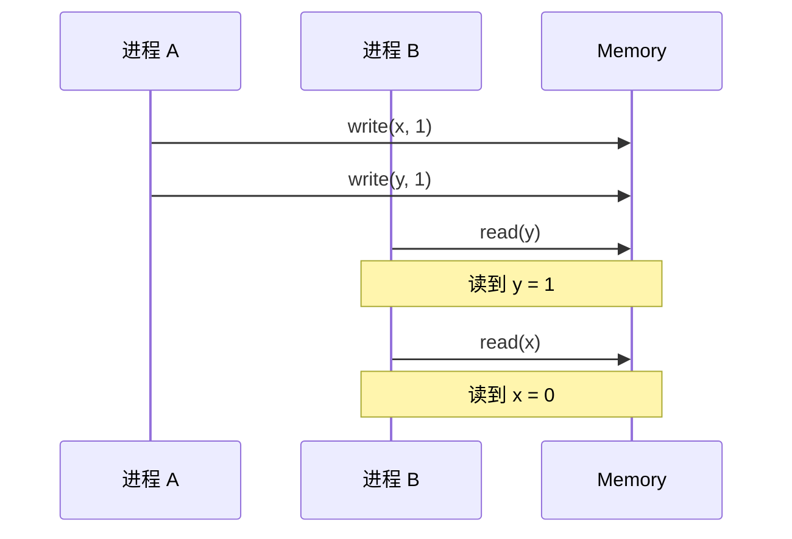
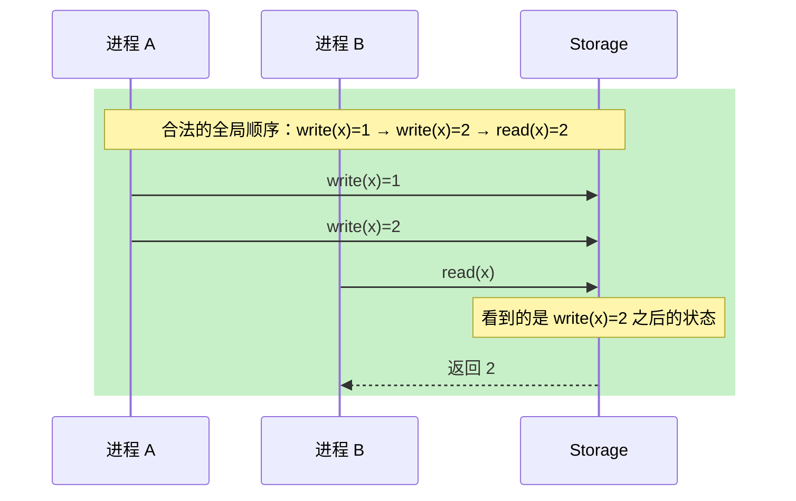
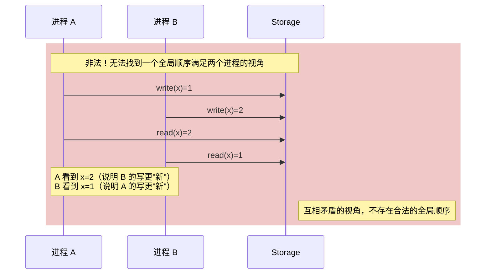
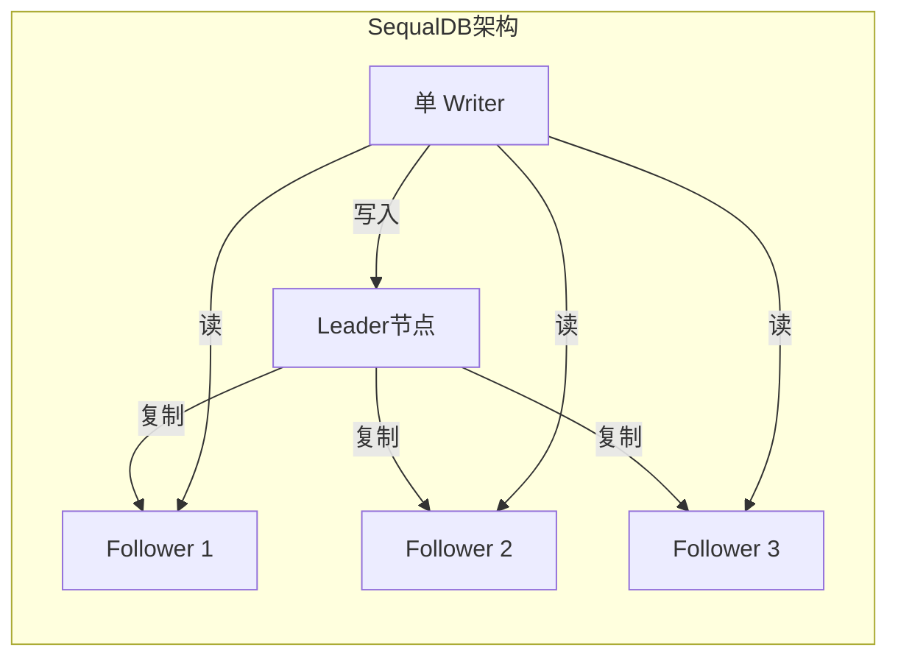

# 顺序一致性

线性一致性要求操作满足全局实时序，这带来了高昂的协调代价。有没有办法在保证「所有进程看到一致顺序」的同时，放宽实时性的要求？

这就是**顺序一致性**要解决的问题。它比线性一致性弱一点，但实现代价也更合理。

## 问题场景

先来看一个反直觉的例子：



进程 A 先写 x=1，再写 y=1。进程 B 先读到 y=1，但再读 x 时却读到 0。这在**顺序一致性**的定义下是允许的，因为：

1. 进程 A 内部的写顺序是保住的（x=1 在 y=1 之前）
2. 进程 B 看到的顺序是「先读 y=1，再读 x=0」，这也是一种合法的顺序

但在**线性一致性**下这是不允许的，因为进程 A 的 write(x=1) 在物理时间上早于 write(y=1)，如果进程 B 能在读 y 时看到 y=1，那么读 x 时也应该看到 x=1。

## 形式化定义

顺序一致性（Sequential Consistency）最早由 Lamport 在 1979 年提出：

> **顺序一致性**：所有进程的指令按照某种顺序执行，这个顺序是所有进程都认同的。每个进程内的指令顺序不变（intra-process order）。

关键词：

1. **某种顺序**：存在一个全局的、所有人都认同的操作序列
2. **进程内顺序不变**：每个进程自己发出的指令，在全局顺序中保持原来的相对顺序
3. **不要求实时序**：不要求「先完成」的操作排在「后开始」的操作前面

### 顺序一致性 vs 线性一致性

| 特性 | 线性一致性 | 顺序一致性 |
|------|-----------|-----------|
| 全局顺序 | 必须有 | 必须有 |
| 实时序要求 | 必须满足 | 不要求 |
| 实现代价 | 高 | 中 |
| 典型系统 | etcd、ZooKeeper | SequalDB、部分分布式数据库 |

两者的核心区别用一句话概括：**线性一致性 = 顺序一致性 + 实时序**。

## 时序图解

### 满足顺序一致性的场景



在这个场景中，进程 A 写了两次 x，先写 1 再写 2。进程 B 读到了 2。无论从物理时间的角度看，进程 B 的读是在第一次写之后还是第二次写之后开始的，在全局顺序中，进程 B 看到的都是「两次写之后」的状态。这满足顺序一致性。

### 不满足顺序一致性的场景



这个例子中，进程 A 写了 1，进程 B 写了 2。然后 A 读到了 2，B 读到了 1。这意味着：

- 要让 A 看到 2，B 的写必须在全局顺序中排在 A 的读前面
- 要让 B 看到 1，A 的写必须在全局顺序中排在 B 的读前面

这两个要求互相矛盾，找不到一个全局顺序能满足双方，因此不满足顺序一致性。

## 多线程场景

顺序一致性不仅存在于分布式系统，也存在于多线程编程中。CPU 的**内存重排序**就是为了优化性能而违反顺序一致性的典型例子。

```java
public class SequentialConsistencyDemo {
    private int x = 0;
    private int y = 0;

    // 线程 A
    public void writerA() {
        x = 1;       // 操作 1
        y = 1;       // 操作 2
    }

    // 线程 B
    public void readerB() {
        int r1 = y;  // 操作 3
        int r2 = x;  // 操作 4
    }
}
```

在**顺序一致性**下（即没有内存重排序），如果 r1=1，则 r2 **必须**为 1。因为操作 1 在操作 2 之前，所以 y=1 意味着 x 已经被赋值为 1 了。

但在实际 CPU（x86、ARM）上，由于**_store buffer** 和 **invalid queue** 的存在，线程 B 可能会看到 r1=1 但 r2=0。这就是**硬件级别的内存重排序**。

要保证顺序一致性，需要使用内存屏障（Memory Barrier）或 `volatile` 关键字：

```java
public class SequentialConsistencyWithVolatile {
    private volatile int x = 0;
    private volatile int y = 0;

    // 使用 volatile 禁止重排序
    public void writerA() {
        x = 1;       // volatile 写之前，所有之前的写都会同步
        y = 1;       // 这个写操作之前，x=1 已经对其他线程可见
    }

    public void readerB() {
        int r1 = y;  // volatile 读之后，所有后续读都能看到之前的写
        int r2 = x;
    }
}
```

## 分布式系统中的顺序一致性

### SequalDB

SequalDB 是一个实验性的分布式数据库，它默认提供顺序一致性。SequalDB 的核心设计思想是：**通过单 Writer 多 Reader 的架构，避免复杂的分布式协调**。



所有写操作都经过唯一的 Writer，然后复制到所有 Follower。只要 Writer 的顺序是对的，所有节点看到的数据顺序就是一致的。

### 与线性一致性的权衡

| 维度 | 顺序一致性 | 线性一致性 |
|------|----------|-----------|
| 实时序 | 不保证 | 保证 |
| 实现复杂度 | 中（单 Writer） | 高（共识协议） |
| 写吞吐 | 低（单点瓶颈） | 高（可多节点并发写） |
| Leader 故障 | 需要切换，有窗口期 | Raft 自动选举 |
| 适用场景 | 写少读多、需要强顺序 | 写多读多、需要全局顺序 |

## 为什么顺序一致性不够

顺序一致性有一个关键缺陷：**它不保证「读到自己最新写入之后的所有更新」**。

考虑一个社交媒体的场景：

1. 用户 A 发了一条动态
2. 用户 A 发了一条评论
3. 用户 B 先刷新看到了评论
4. 用户 B 再刷新却发现动态都没了

这在顺序一致性下是**可能**发生的。因为顺序一致性只保证「A 发动态」和「A 发评论」的相对顺序，但不保证 B 什么时候看到这些内容。

这就是**因果一致性**要解决的问题：它只保证有因果关系的操作有序，允许无因果关系的操作乱序。

## 常见误区

:::warning 误区一：顺序一致性比线性一致性「差一点」，实际差别不大

差别很大。线性一致性要求实时序，顺序一致性不要求。这导致**分布式锁、Leader 选举等依赖实时性的场景，顺序一致性无法正确工作**。

:::

:::warning 误区二：多线程程序的 volatile 就够了

在 Java 中，`volatile` 保证的是**可见性**和**禁止重排序**，但 JVM 为了性能优化，可能在编译器层面做重排序。如果需要严格的顺序一致性，需要 `synchronized` 或 `Lock`。

:::

:::danger 误区三：顺序一致性意味着所有操作串行执行

顺序一致性只要求**结果**看起来是串行的，不要求**执行**是串行的。底层仍然可以并发执行，只要最终结果等价于某种串行顺序即可。

:::

## 权衡矩阵

| 场景 | 推荐方案 | 不推荐方案 | 理由 |
|------|---------|-----------|------|
| 写多读少 | 线性一致性 + 乐观并发控制 | 顺序一致性 | 单 Writer 会成为瓶颈 |
| 读多写少 | 顺序一致性 | 线性一致性 | 读可以分散到多个节点 |
| 需要分布式锁 | 线性一致性 | 顺序一致性 | 锁依赖实时序 |
| 日志顺序消费 | 顺序一致性足够 | 不需要线性一致性 | 日志本身不需要跨时间比较 |

## 术语表

| 术语 | 英文 | 定义 |
|------|------|------|
| 顺序一致性 | Sequential Consistency | 全局存在一个一致的顺序，每个进程内顺序不变 |
| 内存重排序 | Memory Reordering | CPU/编译器为优化性能调整指令顺序 |
| 内存屏障 | Memory Barrier | 禁止特定类型重排序的硬件指令 |
| 进程内顺序 | Intra-process Order | 同一进程内指令必须保持原有相对顺序 |
| 全局顺序 | Global Order | 所有进程都认同的操作序列 |

## 延伸思考

如果单 Writer 架构无法满足你的写吞吐需求，顺序一致性就力不从心了。这时候需要引入更复杂的协调机制。

但还有另一个思路：**既然「所有操作有序」这么难，我们能不能只保证「有因果关系的操作有序」？**

这就是因果一致性要解决的问题。它只保证：

- 如果 A 导致 B，则 A 必须排在 B 前面
- 如果 A 和 B 没有因果关系，它们可以任意排序

这听起来更弱，但实现代价更低，性能更好，而且在很多场景下已经足够。

因果一致性能不能解决「分布式锁」的问题？答案是：**不能**，因为分布式锁需要实时序。但对于大多数业务场景，因果一致性可能是一个更好的权衡。
