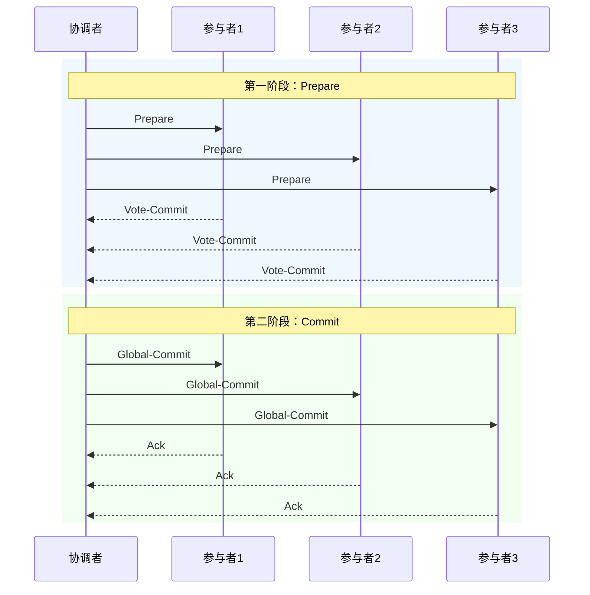

凌晨 2 点，电商平台的促销刚刚结束。库存在 Redis 里扣了，订单在 MySQL 里创建了，积分也扣了——结果支付服务宕机了。用户付了钱，但订单状态是「创建中」，库存没有真正释放，系统陷入了一片混乱。

这不是虚构的故障，而是分布式事务缺失时的必然结果。当一个业务操作跨越多个服务、多个数据库时，如何保证「要么全部成功，要么全部失败」？2PC（Two-Phase Commit）就是最早被提出的解决方案。

## 核心原理

:::tip
**2PC 的核心思想**

2PC 的思想非常直觉：先问一圈「大家准备好了吗」，所有人都说「准备好了」，再统一行动。任何一个人说「没准备好」或者超时，所有人就一起回滚。

这种「先民主后集中」的模式，是两阶段提交的精髓。
:::

### 两个阶段

**第一阶段：Prepare（准备阶段）**

协调者向所有参与者发送 `Prepare` 消息，要求它们准备提交事务。参与者在收到消息后，执行本地事务操作（锁定资源、写 redo log），但**不真正提交**。执行完成后，参与者向协调者回复 `Vote-Commit`（表示可以提交）或 `Vote-Abort`（表示无法提交）。

```
参与者视角的 Prepare 阶段：
1. 锁定相关资源
2. 记录 undo log（用于回滚）
3. 记录 redo log（用于恢复）
4. 回复协调者：「我准备好了」
```

**第二阶段：Commit（提交阶段）**

协调者收到所有参与者的响应后，作出最终决定：

- **全部 Vote-Commit**：协调者向所有参与者发送 `Global-Commit`，参与者正式提交事务，释放资源。
- **任一 Vote-Abort 或超时**：协调者向所有参与者发送 `Global-Abort`，参与者回滚事务，释放资源。



## Java 实现示例

下面是一个简化版的 2PC 协调者实现，帮助你理解核心逻辑：

```java title="TwoPhaseCommitCoordinator.java"
public class TwoPhaseCommitCoordinator {

    private final List<Participant> participants;
    private final Map<String, TransactionState> transactions;

    public static void main(String[] args) {
        TwoPhaseCommitCoordinator coordinator = new TwoPhaseCommitCoordinator();
        coordinator.executeDistributedTransaction();
    }

    public boolean executeDistributedTransaction() {
        String transactionId = UUID.randomUUID().toString();
        System.out.println("开始分布式事务: " + transactionId);

        // 第一阶段：Prepare
        boolean allPrepared = phaseOnePrepare(transactionId);
        if (!allPrepared) {
            System.out.println("Prepare 阶段失败，执行回滚");
            phaseTwoAbort(transactionId);
            return false;
        }

        // 第二阶段：Commit
        System.out.println("所有参与者 Prepare 成功，执行提交");
        phaseTwoCommit(transactionId);
        return true;
    }

    private boolean phaseOnePrepare(String transactionId) {
        // 向所有参与者发送 Prepare
        List<Future<Boolean>> results = new ArrayList<>();
        for (Participant participant : participants) {
            Future<Boolean> future = CompletableFuture.supplyAsync(() ->
                participant.prepare(transactionId)
            );
            results.add(future);
        }

        // 等待所有响应
        for (Future<Boolean> future : results) {
            try {
                Boolean vote = future.get(30, TimeUnit.SECONDS);
                if (!vote) {
                    return false; // 任何一个说 No，全部回滚
                }
            } catch (TimeoutException e) {
                System.out.println("参与者 Prepare 超时");
                return false;
            } catch (InterruptedException | ExecutionException e) {
                return false;
            }
        }
        return true;
    }

    private void phaseTwoCommit(String transactionId) {
        for (Participant participant : participants) {
            try {
                participant.commit(transactionId);
            } catch (Exception e) {
                // 记录日志，后续补偿
                System.out.println("提交失败，需要人工介入: " + participant);
            }
        }
    }

    private void phaseTwoAbort(String transactionId) {
        for (Participant participant : participants) {
            participant.rollback(transactionId);
        }
    }
}

interface Participant {
    boolean prepare(String transactionId);
    void commit(String transactionId);
    void rollback(String transactionId);
}
```

:::tip 简化示例说明
上述代码是概念性演示，生产环境需要考虑网络异常、参与者重启恢复、超时配置等复杂场景。真正的实现可以参考 JTA（Java Transaction API）或 XA 规范。
:::

## 2PC 的致命缺陷

:::danger
**2PC 的三个固有缺陷**

理解了原理之后，我们必须正视 2PC 的三个核心问题。这些问题不是实现上的缺陷，而是**协议本身的固有局限**：
:::

### 1. 协调者单点故障

协调者是整个 2PC 的核心枢纽。一旦协调者在第一阶段之后宕机，所有参与者都会陷入**无限等待**——它们已经 Prepare 了，资源被锁定，但不知道该提交还是回滚。

```
故障场景时序：
T1: 协调者发送 Prepare 给所有参与者 ✓
T2: 所有参与者回复 Vote-Commit ✓
T3: 协调者宕机
T4: 参与者处于 Prepared 状态，资源锁定，无限期等待...
```

这种情况下，参与者既不能提交（因为没收到 Global-Commit），也不能回滚（因为不知道是否应该回滚）。这就是 2PC 最经典的「阻塞等待」问题。

### 2. 同步阻塞

在 Prepare 之后、Commit 之前，参与者必须持有数据库行锁。这是 2PC 最大的性能杀手。

假设一个跨 10 个服务的分布式事务，平均每个服务需要锁定 100ms，10 个服务串行锁定就是 1 秒。1 秒听起来不长，但如果系统 QPS 是 1000，1000 个并发事务同时锁定，数据库早就爆了。

```
阻塞时间计算：
- 单个参与者锁定时间 = 等待所有参与者 Prepare + 等待协调者发 Commit
- 最坏情况 = N * 单个 Prepare 时间 + 网络延迟 + 协调者处理时间
- 100 个参与者 × 10ms = 1 秒（最小阻塞时间）
```

### 3. 数据不一致风险

协调者发出 `Global-Commit` 后，部分参与者收到并执行了，但部分参与者在收到消息之前宕机了。恢复后，这些参与者不知道全局事务的最终状态，可能导致数据不一致。

```
不一致场景：
1. 协调者发出 Global-Commit
2. P1 收到，执行 Commit（数据提交）
3. P2 未收到（P2 网络分区/宕机）
4. P2 恢复后...该 Commit 还是 Rollback？
```

2PC 无法保证这种场景下的数据一致性，因为它没有像 Paxos 那样的多数派确认机制。

:::warning 重要警示
2PC 的「单点协调者 + 无多数派确认」设计，使其在分布式系统中无法保证强一致性。它更适合作为 XA 规范的底层协议，而非独立的分布式事务解决方案。
:::

## 权衡矩阵

:::info
| 维度 | 评价 | 说明 |
| --- | --- | --- |
| **一致性强度** | 强一致 | 理论上所有参与者要么全部提交，要么全部回滚 |
| **可用性** | 低 | 协调者宕机时系统不可用，参与者会无限等待 |
| **性能** | 差 | 同步阻塞，持有锁时间长，并发度低 |
| **侵入性** | 中 | 需要数据库支持 XA 协议，应用改动较小 |
| **容错能力** | 弱 | 仅协调者宕机就会导致事务无法完成 |
| **适用场景** | 有限 | 适合对一致性要求极高、并发量不高的场景 |
:::

## 与 3PC 的对比

2PC 的问题催生了 3PC（三阶段提交）的改进思路：

| 特性 | 2PC | 3PC |
| --- | --- | --- |
| 阶段数 | 2 阶段 | 3 阶段 |
| 阻塞性 | 同步阻塞，阻塞时间长 | 引入超时机制，减少阻塞 |
| 单点故障 | 协调者宕机导致永久阻塞 | 参与者可基于超时自动决策 |
| 数据一致性 | 存在不一致风险 | 仍存在（网络分区时） |
| 性能 | 较差 | 略有改善 |

3PC 的具体原理将在下一篇文章中详细讲解。

## 术语表

| 术语 | 英文 | 解释 |
| --- | --- | --- |
| 协调者 | Coordinator | 负责发起和管理整个分布式事务的节点 |
| 参与者 | Participant | 参与分布式事务的实际执行节点 |
| Prepare | 准备阶段 | 协调者要求所有参与者准备提交事务 |
| Commit | 提交阶段 | 协调者决定提交或回滚事务 |
| Vote-Commit | 投票-提交 | 参与者表示可以提交 |
| Vote-Abort | 投票-中止 | 参与者表示无法提交 |
| Global-Commit | 全局提交 | 协调者发出的正式提交指令 |
| Global-Abort | 全局中止 | 协调者发出的回滚指令 |
| XA 规范 | XA Specification | Open Group 定义的分布式事务标准，2PC 是其核心 |

## 延伸思考

:::tip
**2PC 的问题与共识算法的兴起**

2PC 的问题本质上是「中心化协调」带来的单点瓶颈。有没有办法既保持强一致，又避免单点故障？

**答案是共识算法**。Paxos/Raft 通过多轮投票和多数派确认，可以在部分节点故障时继续工作，同时保证数据一致性。etcd、ZooKeeper 等分布式协调服务，就是这个思路的产物。

但共识算法的代价是性能——多轮网络通信、多数派写入，在高并发场景下延迟会显著增加。所以技术选型，**永远是在一致性和性能之间找平衡**。
:::
