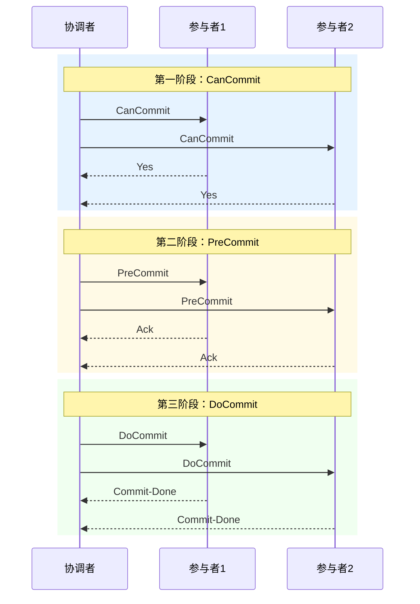

2PC 的阻塞问题困扰了分布式系统领域很久。协调者宕机后，参与者只能干等——这种设计在生产环境中几乎是不可接受的。能不能给参与者一个「自主决策」的机会？3PC（Three-Phase Commit）就是这个思路的产物。

但 3PC 真的解决了问题吗？答案没那么简单。

## 核心改进

3PC 在 2PC 的基础上增加了一个「预提交」阶段，并引入了超时自动决策机制。核心改进有两点：

1. **把「询问」和「执行」分开**：CanCommit 阶段只是问大家「能不能提交」，不锁定资源
2. **引入超时自动提交**：参与者等待超时后，可以根据自身状态自动决策

这种设计让参与者在协调者宕机时，不再陷入无限等待。

## 三个阶段详解

### 第一阶段：CanCommit（询问阶段）

协调者向所有参与者发送 `CanCommit` 消息，询问「你们有没有条件提交这个事务？」

参与者在收到消息后，检查本地资源是否满足提交条件，然后回复 `Yes` 或 `No`。**此时不锁定资源，不执行任何操作。**

```
CanCommit 阶段的价值：
- 快速失败：如果任何一个参与者不满足条件，直接 abort
- 资源保护：没有锁定资源，不影响其他事务
- 网络探测：确认所有参与者网络可达
```

### 第二阶段：PreCommit（预提交阶段）

协调者收到所有参与者的响应后，进入 PreCommit 阶段：

- **全部 Yes**：协调者发送 `PreCommit`，参与者收到后**锁定资源并记录事务状态**，但仍不真正提交。
- **任一 No 或超时**：协调者发送 `Global-Abort`，事务终止。

```
PreCommit 阶段的状态变化：
参与者侧：
1. 锁定相关资源
2. 记录 undo log
3. 记录 redo log
4. 状态置为「PreCommit」
```

### 第三阶段：DoCommit（正式提交阶段）

协调者发送 `DoCommit`（或 `Global-Abort`），参与者执行最终操作：

- 收到 `DoCommit`：正式提交事务，释放资源。
- 收到 `Global-Abort`：回滚事务，释放资源。
- **超时未收到**：参与者可以基于当前状态自动提交（因为已经 PreCommit 了）。



## 超时机制的威力

3PC 最重要的设计是超时自动决策。假设协调者在 PreCommit 之后宕机：

```
协调者宕机场景：

T1: 协调者发送 CanCommit ✓
T2: 所有参与者回复 Yes ✓
T3: 协调者发送 PreCommit ✓
T4: P1 收到 PreCommit，锁定资源
T5: P2 收到 PreCommit，锁定资源
T6: 协调者宕机！

P1 和 P2 现在的状态：PreCommit，资源锁定
P1 和 P2 现在的决策：如果超时未收到 DoCommit，自动提交

为什么可以自动提交？
因为：
1. 我们已经完成了 CanCommit（所有人都说了 Yes）
2. 我们已经 PreCommit（锁定资源，状态正确）
3. 事务的状态已经不可逆了，继续等待只会浪费资源
```

这个超时机制，让参与者从「被动等待」变成了「主动决策」，从根本上解决了 2PC 的无限阻塞问题。

## 3PC 仍然存在的问题

设计看起来更完善了，但 3PC 并没有完全解决所有问题。

### 网络分区导致的不一致

这是 3PC 最致命的缺陷。考虑这个场景：

```
网络分区场景：

分区前：
- 协调者发送 PreCommit 给 P1 和 P2
- P1 收到，执行 PreCommit
- 网络分区！P2 没有收到 PreCommit

分区后（协调者和 P1 在一侧，P2 在另一侧）：
- 协调者 + P1 侧：超时后自动 DoCommit（提交）
- P2 侧：等待超时，由于没有收到 PreCommit，选择 abort（回滚）

结果：P1 提交了，P2 回滚了。数据不一致。
```

为什么会这样？因为 3PC 的「超时自动提交」策略假设「没收到 PreCommit 就应该 abort」，但实际上没收到 PreCommit 可能是网络问题，不代表事务应该回滚。

:::danger 关键风险
3PC 在网络分区场景下，仍然无法保证数据一致性。超时机制只能解决协调者宕机的问题，无法解决「分区两侧做出不同决策」的问题。这是协议本身的理论局限，不是实现问题。
:::

### 同步开销仍然存在

虽然 3PC 把资源锁定推迟到了 PreCommit 阶段，但 PreCommit 之后仍然需要等待所有参与者的 Ack。如果有 100 个参与者，每个参与者 PreCommit 需要 10ms，那么最坏情况下需要 1 秒才能完成这个阶段。

## 2PC vs 3PC 深度对比

| 维度 | 2PC | 3PC |
| --- | --- | --- |
| **阶段数** | Prepare + Commit | CanCommit + PreCommit + DoCommit |
| **资源锁定时机** | Prepare 阶段立即锁定 | PreCommit 阶段才锁定 |
| **阻塞时间** | 长（从 Prepare 到 Commit） | 中（从 PreCommit 到 DoCommit） |
| **协调者宕机** | 参与者无限等待 | 参与者可超时自动决策 |
| **网络分区** | 可能不一致 | 可能不一致（但影响范围不同） |
| **实现复杂度** | 简单 | 中等 |
| **适用场景** | 低并发、强一致要求 | 中等并发、可用性要求稍高 |

## Java 实现：带超时感知的参与者

```java title="ThreePhaseCommitParticipant.java"
public class ThreePhaseCommitParticipant {

    private String participantId;
    private TransactionState state = TransactionState.IDLE;
    private ScheduledExecutorService scheduler = Executors.newScheduledThreadPool(1);

    // 三个阶段的超时配置
    private static final long CAN_COMMIT_TIMEOUT = 30_000;   // ms
    private static final long PRE_COMMIT_TIMEOUT = 60_000;  // ms
    private static final long DO_COMMIT_TIMEOUT = 30_000;    // ms

    public void onCanCommit(String transactionId, Coordinator coordinator) {
        // 检查本地资源是否满足条件
        boolean canCommit = checkLocalResources();

        if (canCommit) {
            state = TransactionState.CAN_COMMIT_SENT;
            coordinator.vote(transactionId, participantId, true);

            // 启动超时检测
            startTimeoutTask(CAN_COMMIT_TIMEOUT, () -> {
                // 如果超时未收到 PreCommit，选择 abort
                if (state == TransactionState.CAN_COMMIT_SENT) {
                    System.out.println("CanCommit 超时，执行 abort");
                    coordinator.vote(transactionId, participantId, false);
                    state = TransactionState.IDLE;
                }
            });
        } else {
            coordinator.vote(transactionId, participantId, false);
        }
    }

    public void onPreCommit(String transactionId, Coordinator coordinator) {
        state = TransactionState.PRE_COMMIT;

        // 锁定资源
        lockLocalResources();
        // 记录 undo/redo log
        prepareTransaction();

        // 发送 Ack
        coordinator.ack(transactionId, participantId);

        // 启动超时检测（超时后自动提交）
        startTimeoutTask(PRE_COMMIT_TIMEOUT, () -> {
            if (state == TransactionState.PRE_COMMIT) {
                System.out.println("PreCommit 超时，自动提交（基于之前 Yes）");
                doCommit(transactionId);
            }
        });
    }

    public void onDoCommit(String transactionId) {
        state = TransactionState.DO_COMMIT;
        doCommit(transactionId);
    }

    private void doCommit(String transactionId) {
        // 正式提交
        commitTransaction();
        releaseResources();
        state = TransactionState.IDLE;
        System.out.println("事务 " + transactionId + " 提交完成");
    }

    public void onGlobalAbort(String transactionId) {
        // 回滚
        rollbackTransaction();
        releaseResources();
        state = TransactionState.IDLE;
    }

    private void startTimeoutTask(long timeoutMs, Runnable onTimeout) {
        scheduler.schedule(onTimeout, timeoutMs, TimeUnit.MILLISECONDS);
    }

    private boolean checkLocalResources() {
        // 检查本地资源是否满足提交条件
        return true;
    }

    private void lockLocalResources() {
        // 锁定本地资源
    }

    private void prepareTransaction() {
        // 记录 undo/redo log
    }

    private void commitTransaction() {
        // 提交本地事务
    }

    private void rollbackTransaction() {
        // 回滚本地事务
    }

    private void releaseResources() {
        // 释放锁定的资源
    }

    enum TransactionState {
        IDLE,
        CAN_COMMIT_SENT,
        PRE_COMMIT,
        DO_COMMIT
    }
}
```

## 权衡矩阵

| 维度 | 评价 | 说明 |
| --- | --- | --- |
| **一致性强度** | 强一致（理论上） | 但网络分区时仍可能不一致 |
| **可用性** | 中 | 超时机制改善了部分可用性 |
| **性能** | 中 | 资源锁定时间短于 2PC，但多了一个网络往返 |
| **侵入性** | 中 | 需要改造协调者和参与者的超时逻辑 |
| **容错能力** | 中 | 可应对协调者宕机，无法应对网络分区 |
| **适用场景** | 中 | 对可用性有要求但仍需强一致的场景 |

## 术语表

| 术语 | 英文 | 解释 |
| --- | --- | --- |
| CanCommit | 能否提交 | 第一阶段，仅询问参与者是否具备提交条件 |
| PreCommit | 预提交 | 第二阶段，参与者锁定资源但仍不真正提交 |
| DoCommit | 正式提交 | 第三阶段，执行真正的提交操作 |
| 超时自动决策 | Timeout Auto-Decision | 参与者等待超时的自动处理策略 |
| 网络分区 | Network Partition | 网络被分割为两个或多个无法通信的部分 |

## 真实案例

> **案例**：某金融系统在 2019 年升级分布式事务框架时，最初选择了 3PC。
>
> **现象**：在一次机房网络抖动后，10% 的转账交易出现了「部分提交」——转出方扣钱了，但转入方没到账。
>
> **根因**：网络抖动导致协调者与部分参与者在 PreCommit 阶段分区，超时机制触发了两侧不同的决策。
>
> **教训**：3PC 的超时自动提交策略，在网络不稳定的环境下反而成为了风险源。最终该团队迁移到了 Paxos 共识算法。
>
> **来源**：内部技术复盘文档

## 延伸思考

3PC 给我们最重要的启示是：**减少阻塞不等于消除不一致**。超时机制让系统不再「卡死」，但如果超时策略设计不当，反而可能制造新的不一致。

真正在生产环境中广泛使用的强一致方案，要么是 XA 事务（基于 2PC），要么是共识算法（Paxos/Raft）。3PC 更多出现在教科书里，而不是生产系统。

但 3PC 的思想——「让参与者有自主决策能力」——却影响了后续的 TCC 和 Saga 模式，它们把更多的决策权交给了业务层，这是更务实的思路。
