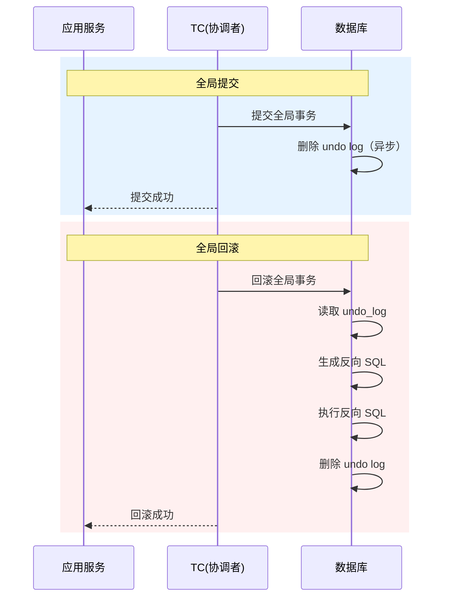
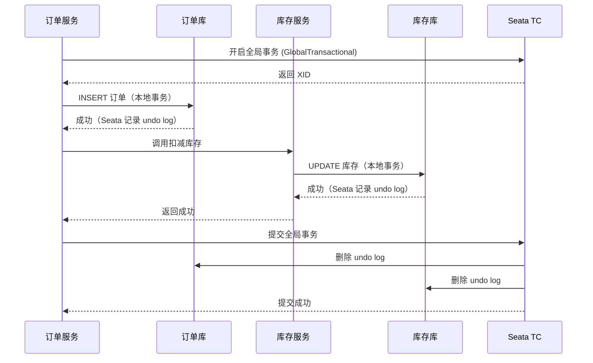
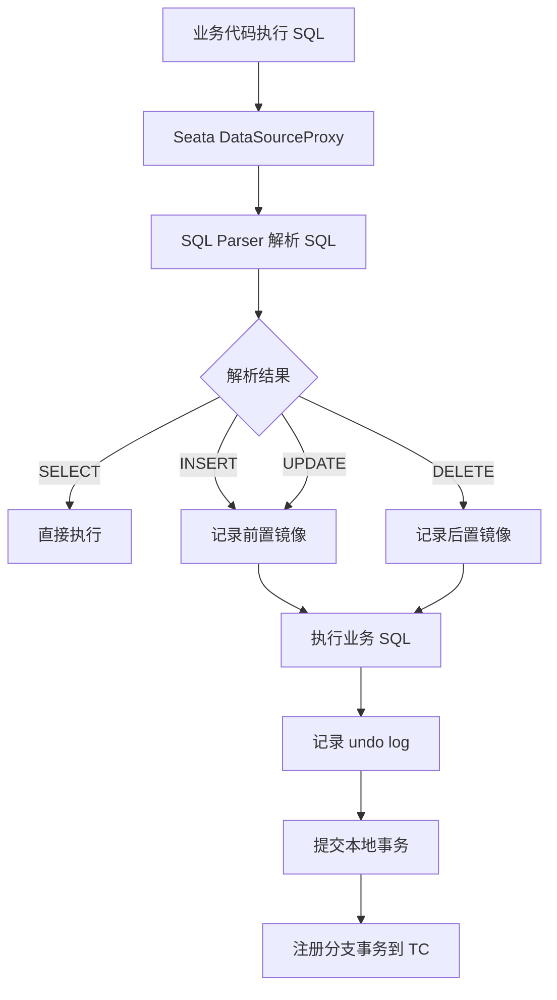

TCC 解决了 2PC 的性能问题，但代价是业务侵入性太高——每个服务都需要实现 Try/Confirm/Cancel 三个方法，代码量翻了三倍。能不能有一种方案，既能保证高性能，又不需要业务方写这么多代码？

Seata 的 AT 模式（Automatic Transaction）就是来解决这个问题的。它的核心思路是：**让框架自动生成回滚 SQL，业务方只需要写业务 SQL**。你写一条 `UPDATE inventory SET stock = stock - 10 WHERE id = 1`，框架自动帮你处理分布式事务的提交和回滚，对业务代码几乎零侵入。

这种「无侵入」的设计，让 AT 模式成为了 Seata 最受欢迎的模式。

## AT 模式的核心原理

AT 模式的本质是**基于 undo log 的自动补偿**。当你执行一条 SQL 时，Seata 的代理会：

1. **前置镜像**：在执行 SQL 前，查询并保存「修改前的数据」
2. **执行业务 SQL**：正常执行你的 SQL
3. **后置镜像**：在 SQL 执行后，查询并保存「修改后的数据」
4. **记录 undo log**：将前置镜像写入 undo_log 表

如果事务需要回滚，Seata 根据 undo log 自动生成反向 SQL，将数据恢复到修改前的状态。整个过程对业务代码完全透明。

```
AT 模式执行流程：

正常流程：
  业务 SQL (UPDATE) → 框架自动记录 undo log → 提交事务

回滚流程：
  事务失败 → 读取 undo log → 生成反向 SQL → 执行回滚 → 提交
```

### 为什么叫 AT？

AT 是「Automatic Transaction」的缩写，意思是「自动事务」。与 TCC 的「业务方手动实现回滚」不同，AT 模式的回滚是「框架自动生成」的，业务方不需要编写任何回滚逻辑。

## 两个阶段的工作机制

AT 模式也分为两个阶段，但与 2PC 有本质区别：

### 第一阶段：解析 SQL + 记录前置镜像 + 执行 + 记录后置镜像

```mermaid
sequenceDiagram
    participant App as 应用服务
    participant Proxy as Seata代理层
    participant DB as 数据库
    participant TC as TC(协调者)

    App->>Proxy: 执行 UPDATE SQL
    Proxy->>DB: SELECT (前置镜像查询)
    DB-->>Proxy: 返回修改前数据
    Proxy->>DB: 执行业务 SQL
    DB-->>Proxy: 返回结果
    Proxy->>DB: SELECT (后置镜像查询)
    DB-->>Proxy: 返回修改后数据
    Proxy->>DB: 写入 undo_log 表
    DB-->>Proxy: 写入成功
    Proxy->>TC: 注册分支事务
    TC-->>Proxy: 注册成功
    App<<--Proxy: SQL 执行成功
```

### 第二阶段：提交或回滚

- **全局提交**：TC 通知所有分支提交。Seata 异步删除对应的 undo log（因为数据已经正确，不需要回滚）
- **全局回滚**：TC 通知所有分支回滚。Seata 读取 undo log，生成反向 SQL，执行回滚



## undo log 的结构

undo log 是 AT 模式的核心。每个被修改的数据库行，都会对应一条 undo log 记录：

```sql title="undo_log 表结构"
CREATE TABLE `undo_log` (
  `id` bigint NOT NULL AUTO_INCREMENT,
  `branch_id` bigint NOT NULL,
  `xid` varchar(100) NOT NULL,
  `context` varchar(128) NOT NULL,
  `rollback_info` longblob NOT NULL,
  `log_status` int NOT NULL,
  `log_created` datetime NOT NULL,
  `log_modified` datetime NOT NULL,
  PRIMARY KEY (`id`),
  UNIQUE KEY `ux_undo_log` (`xid`,`branch_id`)
);
```

`rollback_info` 字段存储了完整的回滚信息（JSON 格式）：

```json
{
  "branchId": 123456,
  "xid": "192.168.1.1:8091:123456789",
  "undoItems": [
    {
      "afterImage": {
        "rows": [
          {
            "fields": [
              { "name": "id", "type": 4, "value": 1 },
              { "name": "stock", "type": 4, "value": 90 }
            ]
          }
        ],
        "tableName": "inventory"
      },
      "beforeImage": {
        "rows": [
          {
            "fields": [
              { "name": "id", "type": 4, "value": 1 },
              { "name": "stock", "type": 4, "value": 100 }
            ]
          }
        ],
        "tableName": "inventory"
      },
      "tableName": "inventory"
    }
  ]
}
```

通过对比 `beforeImage` 和 `afterImage`，Seata 可以精确还原数据到修改前的状态。

## AT 模式的全局锁机制

AT 模式通过 **全局锁** 实现了类似 TCC 的隔离效果。在执行 UPDATE 时：

1. Seata 会先尝试获取该行的「全局锁」
2. 如果获取成功，执行 SQL
3. 如果获取失败（其他分支事务持有锁），等待或报错

全局锁信息存储在 TC 的 session 表中：

```sql
-- 全局锁表结构（TC 端）
CREATE TABLE `lock_table` (
  `row_key` varchar(128) NOT NULL,
  `xid` varchar(96) DEFAULT NULL,
  `branch_id` bigint DEFAULT NULL,
  `pk` varchar(36) DEFAULT NULL,
  `gmt_create` datetime DEFAULT NULL,
  `gmt_modified` datetime DEFAULT NULL,
  PRIMARY KEY (`row_key`)
);
```

```
全局锁原理：

分支事务 A: UPDATE inventory SET stock = 90 WHERE id = 1
  → Seata 检查：TC 中是否有 id=1 的全局锁？
  → 如果没有，插入全局锁记录，允许执行
  → 如果有（其他分支持有），等待或报错

分支事务 B: UPDATE inventory SET stock = 80 WHERE id = 1
  → Seata 检查：TC 中是否有 id=1 的全局锁？
  → 发现分支事务 A 持有该锁
  → 分支事务 B 进入等待
  → 直到分支事务 A 提交/回滚，释放锁
```

这种设计让 AT 模式在「本地事务」层面实现了「全局隔离」的效果。

:::warning AT 模式的隔离性限制
AT 模式的全局锁只能保证「同一行数据」在「同一时刻」只被一个分支事务修改。但它不能防止「脏读」——如果分支事务 A 修改了数据但尚未提交，分支事务 B 仍然可以读取到修改后的值（因为本地事务已提交，但全局事务尚未完成）。

如果对隔离性要求极高（如转账场景），建议使用 TCC 模式或读已提交（Read Committed）隔离级别配合检查更新（Check-and-Set）模式。
:::

## AT 模式 vs TCC 模式

| 维度 | AT 模式 | TCC 模式 |
| --- | --- | --- |
| **侵入性** | 极低（只需加注解） | 高（需实现三个方法） |
| **开发成本** | 低 | 高 |
| **回滚方式** | 自动生成反向 SQL | 手动编写补偿逻辑 |
| **性能** | 好（无业务层预留） | 好（但预留有额外开销） |
| **隔离性** | 中（全局锁） | 高（资源预留） |
| **适用场景** | 大多数 CRUD 场景 | 复杂业务逻辑场景 |
| **SQL 支持** | 支持增删改查（有限制） | 任意业务逻辑 |
| **不可逆操作** | 不支持 | 支持 |

### AT 模式的 SQL 限制

AT 模式依赖 SQL 解析和镜像生成，因此对 SQL 有一定限制：

| 支持的操作 | 示例 |
| --- | --- |
| `INSERT` | 插入数据，自动记录用于回滚 |
| `UPDATE` | 更新数据，记录前后镜像 |
| `DELETE` | 删除数据，记录删除前的数据 |
| `SELECT ... FOR UPDATE` | 加行锁，支持全局锁 |

| 不支持的场景 | 说明 |
| --- | --- |
| 无主键的表 | 无法精确定位行 |
| 批量操作（不同主键） | 每个主键需要单独生成 undo log |
| 子查询 | 解析复杂度高 |
| 存储过程 | 无法解析 |
| 触发器 | 可能与 undo log 冲突 |

## Java 代码示例：AT 模式快速上手

AT 模式的最大优势是「零侵入」。你只需要：

1. 引入 Seata 依赖
2. 配置数据源代理
3. 在需要分布式事务的方法上加注解

### 1. 引入依赖

```xml title="pom.xml"
<dependency>
    <groupId>com.seata</groupId>
    <artifactId>seata-spring-boot-starter</artifactId>
    <version>2.0.0</version>
</dependency>
```

### 2. 配置 Seata

```yaml title="application.yml"
server:
  port: 8080

seata:
  enabled: true
  application-id: order-service
  tx-service-group: my-test-group
  service:
    vgroup-mapping:
      my-test-group: default
    grouplists: 127.0.0.1:8091
  config:
    type: nacos
    nacos:
      server-addr: 127.0.0.1:8848
      namespace: dev
      group: SEATA_GROUP
  registry:
    type: nacos
    nacos:
      server-addr: 127.0.0.1:8848
      namespace: dev
      group: SEATA_GROUP
```

### 3. 使用 @GlobalTransactional 注解

```java title="OrderService.java"
@Service
public class OrderService {

    @Autowired
    private OrderRepository orderRepo;

    @Autowired
    private InventoryFeignClient inventoryClient;

    @Autowired
    private AccountFeignClient accountClient;

    /**
     * 创建订单 - AT 模式
     *
     * 只需要加上 @GlobalTransactional 注解
     * 所有在这个方法中的数据库操作都会被 Seata 管理
     */
    @GlobalTransactional(rollbackFor = Exception.class)
    public Order createOrder(Long userId, Long skuId, Integer quantity,
                             BigDecimal amount) {
        // 1. 创建订单（本地数据库操作）
        Order order = new Order();
        order.setUserId(userId);
        order.setSkuId(skuId);
        order.setQuantity(quantity);
        order.setAmount(amount);
        order.setStatus(OrderStatus.PENDING);
        order = orderRepo.save(order);

        // 2. 扣减库存（远程服务，实际上也是数据库操作）
        inventoryClient.decreaseStock(skuId, quantity);

        // 3. 扣减余额（远程服务）
        accountClient.deductBalance(userId, amount);

        // 4. 更新订单状态
        order.setStatus(OrderStatus.SUCCESS);
        order = orderRepo.save(order);

        return order;
    }
}
```

```java title="InventoryFeignClient.java"
@FeignClient(name = "inventory-service")
public interface InventoryFeignClient {

    /**
     * 扣减库存
     * 这个接口在 inventory-service 中的实现
     * 会被 Seata 自动代理，支持分布式事务
     */
    @PostMapping("/inventory/decrease")
    void decreaseStock(@RequestParam Long skuId, @RequestParam Integer quantity);
}
```

```java title="InventoryController.java (inventory-service 端)"
@RestController
@RequestMapping("/inventory")
public class InventoryController {

    @Autowired
    private InventoryRepository inventoryRepo;

    @PostMapping("/decrease")
    public void decreaseStock(@RequestParam Long skuId, @RequestParam Integer quantity) {
        // AT 模式：直接写业务 SQL，Seata 自动管理回滚
        // INSERT/UPDATE/DELETE 都支持
        inventoryRepo.decreaseStock(skuId, quantity);
    }
}
```

### 4. 全局事务的开启与关闭



## AT 模式的高级配置

### 全局事务超时

```java
@GlobalTransactional(timeoutMills = 30000, rollbackFor = Exception.class)
public void someOperation() {
    // 全局事务超时时间，默认 60 秒
    // 超时后会自动回滚
}
```

### 事务传播行为

```java
// 支持 Spring 的事务传播行为
@GlobalTransactional(propagation = Propagation.REQUIRED)
public void outerOperation() {
    innerOperation(); // 嵌套的事务会加入当前全局事务
}

@GlobalTransactional(propagation = Propagation.REQUIRES_NEW)
public void innerOperation() {
    // 开启新的全局事务（独立于父事务）
}
```

### 回滚异常处理

```java
@GlobalTransactional(rollbackFor = Exception.class)
public void someOperation() {
    try {
        // 业务逻辑
    } catch (BusinessException e) {
        // 业务异常：Seata 会自动回滚
        throw e;
    }
}

@GlobalTransactional(noRollbackFor = BusinessException.class)
public void someOperation() {
    // BusinessException 不会触发回滚
}
```

## AT 模式的执行原理

### SQL 解析与代理

Seata 通过 `DataSourceProxy` 代理了原生 JDBC 数据源。当你的代码执行 SQL 时，实际执行流程是：



### 反向 SQL 的生成

当全局回滚发生时，Seata 读取 undo log，生成反向 SQL：

```sql
-- 原始 SQL
UPDATE inventory SET stock = 90 WHERE id = 1;

-- Seata 读取 undo log:
-- beforeImage: stock = 100
-- afterImage: stock = 90

-- 自动生成反向 SQL
UPDATE inventory SET stock = 100 WHERE id = 1;
```

```java
// AT 模式的回滚逻辑（简化版）
public void rollback() {
    // 1. 读取 undo log
    UndoLog undoLog = undoLogRepository.findByBranchIdAndXid(branchId, xid);

    // 2. 解析 rollback_info
    Map<String, Object> rollbackInfo = JSON.parse(undoLog.getRollbackInfo());

    // 3. 遍历每个数据项
    for (UndoItem item : rollbackInfo.getUndoItems()) {
        TableRecords beforeImage = item.getBeforeImage();
        TableRecords afterImage = item.getAfterImage();

        // 4. 根据操作类型生成反向 SQL
        if (isUpdate(item)) {
            // UPDATE: 用 beforeImage 覆盖 afterImage
            String sql = buildUpdateSql(beforeImage);
            jdbcTemplate.execute(sql);
        } else if (isInsert(item)) {
            // INSERT: 生成 DELETE
            String sql = buildDeleteSql(afterImage);
            jdbcTemplate.execute(sql);
        } else if (isDelete(item)) {
            // DELETE: 用 beforeImage 重新插入
            String sql = buildInsertSql(beforeImage);
            jdbcTemplate.execute(sql);
        }
    }

    // 5. 删除 undo log
    undoLogRepository.delete(undoLog);
}
```

## AT 模式的常见问题

### 问题 1：主键缺失导致回滚失败

```java
// 错误示例：表没有主键
@Entity
@Table(name = "inventory")
public class Inventory {

    @Column(name = "sku_id")
    private Long skuId;

    @Column(name = "stock")
    private Integer stock;

    // 没有 @Id 注解！
}

// Seata 无法确定唯一行，回滚会失败
```

正确做法：**所有参与 AT 事务的表必须定义主键**。

```java
// 正确示例
@Entity
@Table(name = "inventory")
public class Inventory {

    @Id
    @GeneratedValue(strategy = GenerationType.IDENTITY)
    private Long id;

    @Column(name = "sku_id")
    private Long skuId;

    @Column(name = "stock")
    private Integer stock;
}
```

### 问题 2：自增主键的 INSERT 回滚

INSERT 操作的回滚需要特殊处理，因为被删除的数据需要有主键值才能回滚：

```sql
-- Seata 处理的 INSERT 回滚
INSERT INTO inventory (sku_id, stock) VALUES (1001, 10);
-- Seata 会先获取自增主键值（假设为 1）
-- 回滚时执行：
DELETE FROM inventory WHERE id = 1;
```

### 问题 3：批量操作的回滚

```java
// 谨慎使用：批量更新不同行
@GlobalTransactional
public void batchUpdate(List<Long> skuIds) {
    for (Long skuId : skuIds) {
        inventoryRepo.decreaseStock(skuId, 1);
    }
}
```

批量操作每个行都需要生成独立的 undo log，性能会有一定影响。如果批量操作包含大量行，建议拆分成多个小事务。

## 权衡矩阵

| 维度 | 评价 | 说明 |
| --- | --- | --- |
| **一致性强度** | 最终一致（自动补偿） | 全局回滚时自动生成反向 SQL |
| **可用性** | 高 | 本地事务提交即可返回 |
| **性能** | 好 | 无业务层预留，无额外开销 |
| **侵入性** | 极低 | 只需加注解 |
| **开发成本** | 低 | 无需编写回滚逻辑 |
| **隔离性** | 中 | 全局锁保证行级隔离 |
| **适用场景** | CRUD 为主 | 通用业务场景 |

## AT 模式 vs TCC vs Saga

| 维度 | AT 模式 | TCC | Saga |
| --- | --- | --- | --- |
| **侵入性** | 极低 | 高 | 中 |
| **回滚方式** | 自动 SQL | 业务补偿 | 业务补偿 |
| **开发成本** | 低 | 高 | 中 |
| **隔离性** | 中 | 高 | 低 |
| **性能** | 好 | 好 | 最好 |
| **SQL 限制** | 有 | 无 | 无 |
| **不可逆操作** | 不支持 | 支持 | 支持 |
| **适用场景** | 通用 CRUD | 特殊业务逻辑 | 长链路流程 |

## 真实案例

> **案例**：某电商平台的库存扣减改造
>
> 原有系统使用 TCC 模式实现分布式事务，但代码侵入性太高——每个涉及库存的服务都需要实现 Try/Confirm/Cancel 三个方法。后来迁移到 AT 模式，代码量减少了 70%。
>
> **改造前（TCC）**：
> ```java
> @LocalTCC
> public interface InventoryTccService {
>     @TwoPhaseBusinessAction(name = "decrease", commitMethod = "confirm", rollbackMethod = "cancel")
>     boolean tryDecrease(BusinessActionContext context, Long skuId, Integer quantity);
>     boolean confirm(BusinessActionContext context);
>     boolean cancel(BusinessActionContext context);
> }
> ```
>
> **改造后（AT）**：
> ```java
> @GlobalTransactional(rollbackFor = Exception.class)
> public void decreaseStock(Long skuId, Integer quantity) {
>     inventoryRepository.decreaseStock(skuId, quantity);
> }
> ```
>
> **效果**：代码量减少 70%，开发周期缩短 50%，性能略有提升（无预留开销）。

## 术语表

| 术语 | 英文 | 解释 |
| --- | --- | --- |
| AT 模式 | Automatic Transaction | Seata 的无侵入事务模式 |
| undo log | Undo Log | 记录修改前后镜像，用于回滚 |
| 全局锁 | Global Lock | 跨分支事务的行级锁 |
| 分支事务 | Branch Transaction | 全局事务的子事务 |
| TC | Transaction Coordinator | Seata 的事务协调者 |
| DataSourceProxy | DataSource Proxy | Seata 对数据源的代理 |
| 前置镜像 | Before Image | SQL 执行前的数据快照 |
| 后置镜像 | After Image | SQL 执行后的数据快照 |

## 延伸思考

AT 模式给我们最重要的启示是：**好的框架设计，应该让业务代码专注于业务逻辑，而不是基础设施**。

通过自动解析 SQL、自动生成回滚语句，AT 模式把分布式事务的复杂度封装在了框架内部，业务方只需要一行注解就能享受分布式事务的好处。

但 AT 模式不是银弹。它的适用场景是「大多数 CRUD 场景」。如果你的业务包含复杂的状态机、外部系统调用、或不可逆操作，TCC 和 Saga 仍然是更好的选择。

选择建议：

- **AT 优先**：业务以 CRUD 为主，优先选择 AT
- **TCC 备选**：业务逻辑复杂，或需要精确控制回滚逻辑
- **Saga 补充**：超长链路，包含不可逆操作
