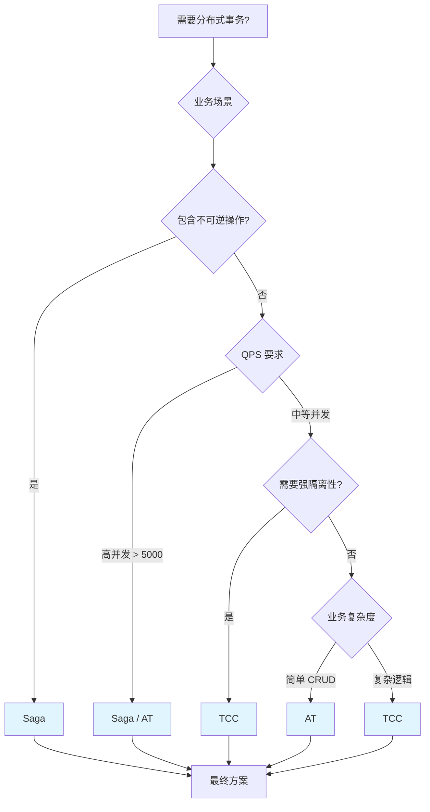

一个用户下单场景，涉及订单服务、库存服务、账户服务、物流服务。订单要创建、库存要扣减、余额要扣款、物流要下单——任何一个环节失败，都需要全部回滚。

这看起来是个简单的问题：「用分布式事务」。但当你真正去选型时，会发现分布式事务不是一个技术，而是一族技术：2PC、3PC、TCC、Saga、AT...每个方案都有自己的适用场景和局限性。

选错了，轻则性能下降 10 倍，重则数据不一致线上故障。本文系统梳理所有方案的权衡矩阵，帮助你在具体场景下做出正确的选择。

## 方案全景图

分布式事务方案可以按两个维度分类：

```
按一致性强度：
  强一致：2PC、3PC
  最终一致：TCC、Saga、AT

按协调方式：
  同步阻塞：2PC、3PC
  异步补偿：TCC、Saga、AT

按侵入性：
  低侵入：2PC（XA）、AT
  高侵入：TCC、Saga
```

## 五种方案深度对比

### 核心原理对比

| 方案 | 核心思想 | 协调者 | 回滚方式 |
| --- | --- | --- | --- |
| **2PC** | 先 Prepare 再 Commit | 中央协调者 | 协调者发出回滚命令 |
| **3PC** | 增加预提交阶段 + 超时机制 | 中央协调者 | 参与者可超时自决 |
| **TCC** | 业务层 Try/Confirm/Cancel | 业务编排者 | 业务补偿 |
| **Saga** | 正向执行 + 补偿回滚 | 编排器或事件 | 正向补偿 |
| **AT** | 自动解析 SQL + undo log | Seata TC | 自动生成反向 SQL |

### 一致性对比

| 方案 | 一致性类型 | 隔离性 | 数据安全 |
| --- | --- | --- | --- |
| **2PC** | 强一致（理论） | 最高（全局锁） | 高（但协调者宕机有风险） |
| **3PC** | 强一致（有条件） | 高 | 中（网络分区仍可能不一致） |
| **TCC** | 最终一致 | 中（资源预留） | 中（依赖业务补偿） |
| **Saga** | 最终一致 | 低（无预留） | 中（依赖补偿逻辑） |
| **AT** | 最终一致 | 中（全局锁） | 中（undo log 机制） |

### 性能对比

| 方案 | 阻塞时间 | 资源锁定 | 网络开销 | 适用 QPS |
| --- | --- | --- | --- | --- |
| **2PC** | 长（Prepare 到 Commit） | 数据库行锁 | 3 次往返 | < 1000 |
| **3PC** | 中（PreCommit 到 DoCommit） | 数据库行锁（延迟） | 5 次往返 | < 2000 |
| **TCC** | 短（Try 只预留） | 业务预留 | 3 次往返 | < 5000 |
| **Saga** | 极短（直接执行） | 无锁定 | 1-2 次往返 | < 10000 |
| **AT** | 极短（本地事务） | 无锁定 | 1-2 次往返 | < 10000 |

> 数据基于典型场景估算，实际性能取决于网络延迟、参与者数量等因素。

### 开发成本对比

| 方案 | 代码侵入 | 需要编写 | 运维复杂度 |
| --- | --- | --- | --- |
| **2PC** | 低（XA 驱动） | 数据库配置 | 低 |
| **3PC** | 中 | 协调者超时逻辑 | 中 |
| **TCC** | 高 | Try/Confirm/Cancel 三套逻辑 | 中 |
| **Saga** | 中 | 正向 + 补偿逻辑 | 中 |
| **AT** | 极低 | 注解即可 | 低（Seata 托管） |

## 场景化选型矩阵

### 按业务场景选型

| 场景 | 推荐方案 | 备选方案 | 说明 |
| --- | --- | --- | --- |
| **电商下单** | AT / TCC | Saga | 库存扣减、余额扣款，AT 最简单 |
| **转账汇款** | TCC / AT | 2PC | 需要强一致性，2PC 慎用 |
| **秒杀系统** | Saga | AT | 高并发，牺牲隔离性换取性能 |
| **订单履约** | Saga | TCC | 长链路，包含不可逆操作 |
| **数据同步** | Saga | AT | 异步补偿，允许短暂不一致 |
| **金融交易** | 2PC / TCC | AT | 强一致优先，性能其次 |

### 按一致性要求选型

| 一致性要求 | 推荐方案 | 理由 |
| --- | --- | --- |
| **强一致（不允许中间状态）** | 2PC / 3PC | 理论上的强一致，但有性能和可用性代价 |
| **最终一致（允许短暂不一致）** | TCC / Saga / AT | 性能更好，但业务需要接受补偿逻辑 |

### 按性能要求选型

| 性能要求 | 推荐方案 | 理由 |
| --- | --- | --- |
| **低延迟（< 50ms）** | Saga / AT | 无阻塞，无资源锁定 |
| **中延迟（50-200ms）** | TCC | Try 阶段快速释放 |
| **可接受高延迟（> 200ms）** | 2PC / 3PC | 强一致优先 |

### 按业务复杂度选型

| 业务复杂度 | 推荐方案 | 说明 |
| --- | --- | --- |
| **简单 CRUD** | AT | 无需编写补偿逻辑 |
| **标准业务逻辑** | TCC | 需要精细控制回滚 |
| **超长链路 + 不可逆操作** | Saga | 补偿代替回滚 |

## 详细方案对比

### 2PC：强一致性的代价

**优势**：
- 理论上的强一致性保证
- 数据库原生支持（XA 协议）
- 实现简单，无需业务改造

**劣势**：
- 协调者单点故障导致无限阻塞
- 长事务持有数据库行锁，并发度低
- 性能差，不适合高并发场景

**适用场景**：
- 金融核心系统（必须强一致）
- 低并发、强一致要求的内部系统
- 数据库原生支持的场景

**不适用场景**：
- 高并发系统（QPS > 1000）
- 跨数据中心部署
- 长事务场景

### 3PC：试图解决 2PC 的问题

**优势**：
- 超时机制缓解了协调者宕机的阻塞问题
- 资源锁定时间短于 2PC
- 比 2PC 更好的可用性

**劣势**：
- 仍然无法完全避免数据不一致（网络分区）
- 多了一个网络往返，性能略有下降
- 实现复杂度高于 2PC

**适用场景**：
- 对可用性有要求的强一致系统
- 参与者数量较少的场景（< 10）

**不适用场景**：
- 网络不稳定的跨地域部署
- 对数据一致性要求极高的场景

### TCC：灵活但侵入性高

**优势**：
- 资源预留机制提供一定的隔离性
- Try 阶段快速失败，性能好
- 业务自主控制提交和回滚

**劣势**：
- 需要为每个操作实现 Try/Confirm/Cancel
- 空回滚、幂等性、悬挂三大挑战
- 业务侵入性高

**适用场景**：
- 需要精细控制回滚逻辑
- 业务可逆性强（库存、余额等）
- 中等并发（QPS < 5000）

**不适用场景**：
- 包含不可逆操作（发短信、发邮件）
- 开发资源有限的团队
- 超长链路场景

### Saga：超长链路的最佳选择

**优势**：
- 无资源锁定，性能最好
- 支持不可逆操作
- 适合超长链路

**劣势**：
- 无隔离性保证
- 补偿逻辑可能复杂
- 事务失败时需要执行多次补偿

**适用场景**：
- 超长链路（10+ 步骤）
- 包含不可逆操作
- 高并发、对性能要求极高

**不适用场景**：
- 需要强隔离性的场景
- 补偿逻辑复杂的场景

### AT：开发成本最低

**优势**：
- 零侵入，只需加注解
- 自动生成回滚 SQL
- 与 Spring Boot 无缝集成

**劣势**：
- 对 SQL 有一定限制（需要主键）
- 隔离性弱于 TCC
- 依赖 Seata 生态

**适用场景**：
- 大多数 CRUD 业务
- 开发资源有限的团队
- 快速迭代的项目

**不适用场景**：
- 包含复杂业务逻辑
- 无主键的表
- 特殊 SQL（存储过程、触发器）

## 架构图：选型决策流程



## 框架选型

### Seata vs Apache ShardingSphere-Proxy

| 维度 | Seata | ShardingSphere-Proxy |
| --- | --- | --- |
| **支持模式** | AT、TCC、Saga | XA |
| **侵入性** | 低（注解） | 中（配置） |
| **生态** | 阿里生态 | Apache 生态 |
| **活跃度** | 高 | 高 |
| **适用场景** | 微服务架构 | 分库分表场景 |

### 选择建议

- **微服务架构**：优先选择 Seata
- **分库分表**：可考虑 ShardingSphere + XA
- **混合场景**：Seata 作为主方案

## 真实案例

> **案例 1**：某电商平台秒杀系统改造
>
> 原有系统使用 2PC 实现下单事务，在秒杀场景下数据库锁等待严重，最高并发只有 500 QPS。
>
> **改造方案**：迁移到 Saga 模式
> - 去除所有资源锁定
> - 下单失败通过补偿释放预留
> - 牺牲部分隔离性换取性能
>
> **效果**：
> - QPS 从 500 提升到 10000
> - 平均响应时间从 500ms 降低到 50ms
> - 数据最终一致性通过补偿保证
>
> **案例 2**：某金融系统强一致改造
>
> 某银行核心系统需要从 Saga 迁移到 2PC，因为监管要求「账务操作必须强一致」。
>
> **改造方案**：
> - 账务核心操作使用 2PC
> - 非核心操作使用 Saga
> - 通过异步消息解耦
>
> **效果**：
> - 满足监管要求
> - 核心链路一致性保证
> - 非核心链路性能不降

## 常见误区

### 误区 1：分布式事务 = 强一致

很多人以为用了分布式事务就能保证强一致。实际上，TCC、Saga、AT 都是「最终一致」方案。只有 2PC/3PC 在理论上提供强一致，但它们也有自己的问题。

### 误区 2：有了分布式事务就万事大吉

分布式事务只是保证了「要么全成功，要么全回滚」。但它不能解决：
- 业务逻辑本身的 bug
- 下游系统的超时
- 网络抖动的短暂不一致

### 误区 3：分布式事务可以替代 CAP

分布式事务解决的是「多个数据源之间的一致性」。CAP 定理描述的是「分布式系统的可用性和一致性权衡」。两者解决的问题域不同，不能互相替代。

### 误区 4：Saga 不需要处理幂等性

Saga 虽然没有 TCC 的空回滚和悬挂问题，但幂等性仍然需要处理。补偿操作可能被执行多次，必须保证幂等。

## 总结

| 方案 | 一致性 | 性能 | 开发成本 | 推荐场景 |
| --- | --- | --- | --- | --- |
| **2PC** | ★★★★★ | ★★☆☆☆ | ★★★★★ | 金融核心、低并发 |
| **3PC** | ★★★★☆ | ★★★☆☆ | ★★★☆☆ | 小规模强一致 |
| **TCC** | ★★★☆☆ | ★★★★☆ | ★★☆☆☆ | 精细控制回滚 |
| **Saga** | ★★☆☆☆ | ★★★★★ | ★★★☆☆ | 超长链路、不可逆操作 |
| **AT** | ★★★☆☆ | ★★★★★ | ★★★★★ | CRUD 为主、快速开发 |

**最终建议**：

- **新手起步**：从 AT 开始，学习成本最低
- **业务复杂**：TCC 提供最精细的控制
- **超长链路**：Saga 是唯一选择
- **金融核心**：2PC（慎用），或 TCC + 多方验证

记住：**没有银弹，只有权衡**。根据你的业务场景，选择最合适的方案。

## 术语表

|| 术语 | 英文 | 解释 |
|| --- | --- | --- |
|| 2PC | Two-Phase Commit | 两阶段提交，强一致事务协议 |
|| 3PC | Three-Phase Commit | 三阶段提交，增加超时机制 |
|| TCC | Try-Confirm-Cancel | 三阶段业务补偿模式 |
|| AT 模式 | Automatic Transaction | Seata 的自动事务模式 |
|| Saga | Saga Pattern | 长活事务的正向补偿模式 |
|| 全局事务 | Global Transaction | 跨越多个服务的统一事务 |
|| 分支事务 | Branch Transaction | 全局事务的子事务 |
|| 协调者 | Coordinator | 管理事务提交的中央节点 |
|| 参与者 | Participant | 实际执行业务操作的服务 |
|| XID | Transaction ID | 全局事务的唯一标识 |
